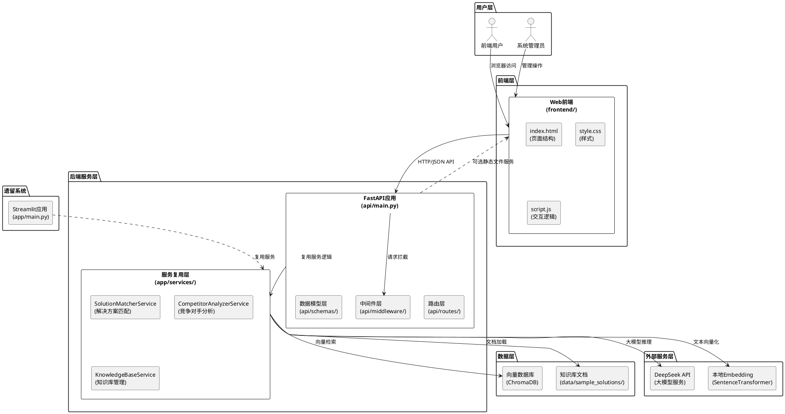

# 华为云解决方案匹配系统后端开发技术设计文档

## 文档信息
- **创建日期**: 2026-05-24
- **版本**: v1.0
- **关联需求文档**: `.codeartsdoer/specs/backend-deployment/spec.md`

---

# **1. 实现模型**

## **1.1 上下文视图**

### 1.1.1 系统上下文架构图



### 1.1.2 技术栈选型

| 技术分类 | 选型方案 | 选型理由 |
|---------|---------|---------|
| **Web框架** | FastAPI 0.100+ | 高性能异步框架、自动API文档、强类型支持、与Python生态兼容好 |
| **ASGI服务器** | Uvicorn + Gunicorn | Uvicorn高性能异步、Gunicorn多进程管理 |
| **反向代理** | Nginx 1.24+ | 高性能反向代理、静态文件服务、HTTPS终止、负载均衡 |
| **进程管理** | Supervisor | 进程守护、自动重启、日志管理 |
| **大模型服务** | DeepSeek API | 成本低、响应快、中文效果好（已集成） |
| **向量数据库** | ChromaDB 0.4.24 | 轻量级、易部署、已集成在现有代码中 |
| **本地Embedding** | SentenceTransformer (BAAI/bge-small-zh-v1.5) | 免费、离线、中文效果好、维度384 |
| **部署平台** | 华为云ECS / 阿里云ECS | 主流云平台、成本可控、易运维 |

---

## **1.2 服务/组件总体架构**

### 1.2.1 后端应用架构设计

```plantuml
@startuml
package "FastAPI应用" {
    rectangle "应用入口\n(api/main.py)" as Main {
        - app: FastAPI
        - cors配置
        - 路由注册
        - 启动事件
    }
    
    rectangle "路由层\n(api/routes/)" as Routes {
        rectangle "solution_router\n(solution.py)" as SolutionRoute
        rectangle "competitor_router\n(competitor.py)" as CompetitorRoute
        rectangle "knowledge_router\n(knowledge.py)" as KnowledgeRoute
        rectangle "health_router\n(health.py)" as HealthRoute
    }
    
    rectangle "中间件层\n(api/middleware/)" as Middleware {
        rectangle "CORS中间件" as CORS
        rectangle "日志中间件" as Logging
        rectangle "错误处理中间件" as ErrorHandler
        rectangle "请求限流中间件" as RateLimit
    }
    
    rectangle "数据模型层\n(api/schemas/)" as Schemas {
        rectangle "请求模型\n(request.py)" as RequestSchemas
        rectangle "响应模型\n(response.py)" as ResponseSchemas
        rectangle "错误模型\n(error.py)" as ErrorSchemas
    }
    
    rectangle "依赖注入\n(api/dependencies.py)" as Dependencies {
        - get_solution_matcher()
        - get_competitor_analyzer()
        - get_knowledge_base()
    }
}

package "服务复用层\n(app/services/)" as Services {
    rectangle "SolutionMatcherService" as Matcher
    rectangle "CompetitorAnalyzerService" as Analyzer
    rectangle "KnowledgeBaseService" as KBService
}

Main --> Routes : 注册路由
Main --> Middleware : 加载中间件
Routes --> Schemas : 数据校验
Routes --> Dependencies : 注入服务
Dependencies --> Services : 获取实例

@enduml
```

### 1.2.2 文件组织结构

```
huawei-cloud-solution-matcher/
├── api/                          # FastAPI应用目录（新增）
│   ├── __init__.py
│   ├── main.py                   # FastAPI应用入口
│   ├── config.py                 # FastAPI配置（端口、CORS等）
│   ├── routes/                   # 路由模块
│   │   ├── __init__.py
│   │   ├── solution.py           # 解决方案匹配路由
│   │   ├── competitor.py         # 竞争对手分析路由
│   │   ├── knowledge.py          # 知识库管理路由
│   │   └── health.py             # 健康检查路由
│   ├── schemas/                  # Pydantic数据模型
│   │   ├── __init__.py
│   │   ├── request.py            # 请求模型
│   │   ├── response.py           # 响应模型
│   │   └── error.py              # 错误模型
│   ├── middleware/               # 中间件
│   │   ├── __init__.py
│   │   ├── logging.py            # 日志中间件
│   │   ├── error_handler.py      # 错误处理中间件
│   │   └── rate_limit.py         # 请求限流中间件
│   ├── dependencies.py           # 依赖注入
│   └── utils/                    # 工具函数
│       ├── __init__.py
│       └── response.py           # 响应工具函数
│
├── app/                          # 现有应用目录（保留）
│   ├── main.py                   # Streamlit应用（保留）
│   ├── config.py                 # 全局配置
│   ├── services/                 # 服务层（复用）
│   ├── models/                   # 模型层（复用）
│   └── utils/                    # 工具层（复用）
│
├── frontend/                     # 前端文件（保留）
│   ├── index.html
│   ├── style.css
│   └── script.js
│
├── data/                         # 数据目录
│   ├── sample_solutions/         # 知识库文档
│   └── vector_db/                # 向量数据库持久化
│
├── logs/                         # 日志目录（新增）
│   ├── app.log                   # 应用日志
│   └── access.log                # 访问日志
│
├── deploy/                       # 部署配置（新增）
│   ├── nginx.conf                # Nginx配置
│   ├── supervisord.conf          # Supervisor配置
│   ├── start.sh                  # 启动脚本
│   └── stop.sh                   # 停止脚本
│
├── .env                          # 环境变量（新增敏感配置）
├── .env.example                  # 环境变量示例
├── requirements.txt              # Python依赖
└── README.md                     # 项目文档
```

### 1.2.3 服务依赖关系

```plantuml
@startuml
rectangle "API路由层" as APIRoutes {
    rectangle "/api/match" as MatchAPI
    rectangle "/api/analyze" as AnalyzeAPI
    rectangle "/api/knowledge/*" as KnowledgeAPI
}

rectangle "服务层" as Services {
    rectangle "SolutionMatcherService" as Matcher {
        - kb_service: KnowledgeBaseService
        - prompt_template
        + match(demand)
    }
    
    rectangle "CompetitorAnalyzerService" as Analyzer {
        - kb_service: KnowledgeBaseService
        - prompt_template
        + analyze(competitor, industry)
    }
    
    rectangle "KnowledgeBaseService" as KBService {
        - embeddings: LocalEmbeddings
        - vector_db: ChromaDB
        - retriever
        + build_from_directory()
        + search(query)
        + get_stats()
    }
}

rectangle "模型层" as Models {
    rectangle "get_llm_response()" as LLM
    rectangle "LocalEmbeddings" as Embedding
    rectangle "get_vector_db()" as VectorDB
}

rectangle "外部服务" as External {
    rectangle "DeepSeek API" as DeepSeek
    rectangle "ChromaDB存储" as ChromaStorage
    rectangle "本地模型文件" as LocalModel
}

MatchAPI --> Matcher : 调用
AnalyzeAPI --> Analyzer : 调用
KnowledgeAPI --> KBService : 调用

Matcher --> KBService : 依赖
Analyzer --> KBService : 依赖

Matcher --> LLM : 大模型推理
Analyzer --> LLM : 大模型推理

KBService --> Embedding : 向量化
KBService --> VectorDB : 向量存储

LLM --> DeepSeek : HTTP请求
Embedding --> LocalModel : 本地加载
VectorDB --> ChromaStorage : 本地持久化

@enduml
```

---

## **1.3 实现设计文档**

### 1.3.1 FastAPI应用入口设计

**文件路径**: `api/main.py`

**核心职责**:
- 创建FastAPI应用实例
- 配置CORS中间件
- 注册所有路由
- 配置生命周期事件（启动/关闭）
- 提供静态文件服务（可选）

**实现要点**:

```python
# 伪代码示意，非完整实现
from fastapi import FastAPI
from fastapi.middleware.cors import CORSMiddleware
from fastapi.staticfiles import StaticFiles
from api.config import APIConfig
from api.routes import solution, competitor, knowledge, health
from api.middleware.logging import LoggingMiddleware
from api.middleware.error_handler import ErrorHandlerMiddleware

def create_app() -> FastAPI:
    app = FastAPI(
        title="华为云解决方案匹配系统API",
        version="1.0.0",
        docs_url="/docs",
        redoc_url="/redoc"
    )
    
    # 1. CORS中间件配置
    app.add_middleware(
        CORSMiddleware,
        allow_origins=APIConfig.CORS_ORIGINS,
        allow_credentials=True,
        allow_methods=["*"],
        allow_headers=["*"],
    )
    
    # 2. 自定义中间件
    app.add_middleware(LoggingMiddleware)
    app.add_middleware(ErrorHandlerMiddleware)
    
    # 3. 路由注册
    app.include_router(solution.router, prefix="/api", tags=["解决方案匹配"])
    app.include_router(competitor.router, prefix="/api", tags=["竞争对手分析"])
    app.include_router(knowledge.router, prefix="/api/knowledge", tags=["知识库管理"])
    app.include_router(health.router, tags=["系统监控"])
    
    # 4. 静态文件服务（可选，也可由Nginx提供）
    if APIConfig.SERVE_STATIC:
        app.mount("/", StaticFiles(directory="frontend", html=True), name="static")
    
    return app

app = create_app()
```

### 1.3.2 中间件设计

#### 1.3.2.1 日志中间件

**文件路径**: `api/middleware/logging.py`

**功能**:
- 记录所有HTTP请求的路径、方法、状态码、响应时间
- 记录错误请求的详细信息
- 支持日志脱敏（去除敏感信息）

**日志格式**:
```
[2026-05-24 10:30:45] INFO | POST /api/match | 200 | 2.34s | IP: 192.168.1.100
[2026-05-24 10:31:20] ERROR | POST /api/analyze | 500 | 0.02s | Error: Connection timeout
```

#### 1.3.2.2 错误处理中间件

**文件路径**: `api/middleware/error_handler.py`

**功能**:
- 统一捕获所有异常
- 返回标准化的错误响应格式
- 区分业务错误和系统错误
- 记录完整错误堆栈

**错误响应格式**:
```json
{
    "success": false,
    "error": {
        "code": "MATCH_FAILED",
        "message": "匹配失败，请检查知识库是否已初始化",
        "detail": "ChromaDB connection failed"
    }
}
```

#### 1.3.2.3 请求限流中间件

**文件路径**: `api/middleware/rate_limit.py`

**功能**:
- 基于IP地址的请求限流
- 防止单个IP频繁请求
- 可配置限流阈值（如：100次/分钟）

**实现方式**: 使用令牌桶算法或滑动窗口算法

### 1.3.3 服务依赖注入设计

**文件路径**: `api/dependencies.py`

**设计目标**:
- 避免每次请求都创建服务实例
- 使用单例模式管理服务实例
- 支持服务的延迟初始化

**实现方式**:
```python
# 伪代码示意
from functools import lru_cache
from app.services.solution_matcher import SolutionMatcherService
from app.services.competitor_analyzer import CompetitorAnalyzerService
from app.services.knowledge_base import KnowledgeBaseService

@lru_cache()
def get_solution_matcher() -> SolutionMatcherService:
    return SolutionMatcherService()

@lru_cache()
def get_competitor_analyzer() -> CompetitorAnalyzerService:
    return CompetitorAnalyzerService()

@lru_cache()
def get_knowledge_base() -> KnowledgeBaseService:
    return KnowledgeBaseService()
```

---

# **2. 接口设计**

## **2.1 总体设计**

### 2.1.1 API设计原则

1. **RESTful风格**: 遵循REST设计规范，使用HTTP动词表达操作语义
2. **统一响应格式**: 所有接口返回统一的JSON格式
3. **强类型校验**: 使用Pydantic模型进行请求/响应校验
4. **错误码规范**: 定义清晰的错误码体系
5. **向后兼容**: 接口路径和响应格式保持稳定

### 2.1.2 统一响应格式

**成功响应**:
```json
{
    "success": true,
    "data": {
        // 业务数据
    }
}
```

**错误响应**:
```json
{
    "success": false,
    "error": {
        "code": "ERROR_CODE",
        "message": "用户友好的错误提示",
        "detail": "详细错误信息（可选）"
    }
}
```

### 2.1.3 错误码体系

| 错误码 | HTTP状态码 | 说明 |
|-------|-----------|------|
| VALIDATION_ERROR | 400 | 请求参数校验失败 |
| INVALID_DEMAND | 400 | 需求描述无效（为空或超长） |
| INVALID_COMPETITOR | 400 | 竞争对手参数无效 |
| INVALID_INDUSTRY | 400 | 行业参数无效 |
| MATCH_FAILED | 500 | 解决方案匹配失败 |
| ANALYZE_FAILED | 500 | 竞争对手分析失败 |
| KB_NOT_FOUND | 500 | 知识库目录不存在 |
| KB_OPERATION_FAILED | 500 | 知识库操作失败 |
| LLM_TIMEOUT | 504 | 大模型调用超时 |
| LLM_UNAVAILABLE | 503 | AI服务不可用 |

---

## **2.2 接口清单**

### 2.2.1 解决方案匹配接口

**接口路径**: `POST /api/match`

**接口描述**: 基于客户需求描述，智能匹配华为云解决方案

#### 请求参数

**请求头**:
```
Content-Type: application/json
```

**请求体**:
```json
{
    "demand": "我们是一家中型制造企业，有50台生产设备，经常因为设备突发故障导致生产线停工..."
}
```

**参数说明**:

| 参数名 | 类型 | 必填 | 说明 | 校验规则 |
|-------|------|------|------|---------|
| demand | string | 是 | 客户需求描述 | 长度1-2000字符 |

#### 响应数据

**成功响应 (200 OK)**:
```json
{
    "answer": "## 1. 需求分析\n客户是一家制造企业，面临设备突发故障导致生产线停工的问题...\n\n## 2. 推荐解决方案\n华为云工业互联网解决方案...",
    "source_documents": [
        {
            "page_content": "华为云工业互联网解决方案核心价值...",
            "metadata": {
                "source": "工业互联网/华为云工业互联网方案.txt",
                "industry": "工业互联网"
            }
        },
        {
            "page_content": "设备预测性维护方案...",
            "metadata": {
                "source": "工业互联网/预测性维护.txt",
                "industry": "工业互联网"
            }
        }
    ]
}
```

**失败响应 (400 Bad Request)**:
```json
{
    "success": false,
    "error": {
        "code": "INVALID_DEMAND",
        "message": "请输入客户需求描述"
    }
}
```

**失败响应 (500 Internal Server Error)**:
```json
{
    "success": false,
    "error": {
        "code": "MATCH_FAILED",
        "message": "匹配失败，请检查知识库是否已初始化"
    }
}
```

#### 实现逻辑

```
1. 参数校验
   ├─ 检查demand字段是否存在
   ├─ 检查demand长度是否在1-2000范围内
   └─ 校验失败 → 返回400错误

2. 服务调用
   ├─ 获取SolutionMatcherService实例
   └─ 调用match(demand)方法
       ├─ 知识库检索（ChromaDB相似度搜索）
       ├─ 拼接提示词
       └─ 调用DeepSeek API生成答案

3. 异常处理
   ├─ ChromaDB连接失败 → 返回KB_OPERATION_FAILED
   ├─ DeepSeek API超时 → 返回LLM_TIMEOUT
   └─ 其他异常 → 记录日志，返回MATCH_FAILED

4. 返回响应
   └─ 返回包含answer和source_documents的JSON
```

---

### 2.2.2 竞争对手分析接口

**接口路径**: `POST /api/analyze`

**接口描述**: 分析华为云与竞争对手在特定行业的方案差异

#### 请求参数

**请求体**:
```json
{
    "competitor": "阿里云",
    "industry": "智慧农业"
}
```

**参数说明**:

| 参数名 | 类型 | 必填 | 说明 | 校验规则 |
|-------|------|------|------|---------|
| competitor | string | 是 | 竞争对手名称 | 枚举值：阿里云、腾讯云、AWS、Azure、百度云 |
| industry | string | 是 | 行业名称 | 枚举值：智慧农业、工业互联网、智慧园区... |

#### 响应数据

**成功响应 (200 OK)**:
```json
{
    "answer": "## 1. 阿里云方案核心卖点\n1. 云原生技术领先...\n\n## 2. 华为云差异化优势\n1. 端云协同优势...",
    "source_documents": [
        {
            "page_content": "华为云智慧农业解决方案...",
            "metadata": {
                "source": "智慧农业/华为云智慧农业.txt",
                "industry": "智慧农业"
            }
        }
    ]
}
```

**失败响应 (400 Bad Request)**:
```json
{
    "success": false,
    "error": {
        "code": "INVALID_COMPETITOR",
        "message": "请选择有效的竞争对手"
    }
}
```

#### 实现逻辑

```
1. 参数校验
   ├─ 检查competitor和industry字段是否存在
   ├─ 检查competitor是否在支持列表中
   └─ 检查industry是否在支持列表中

2. 服务调用
   ├─ 获取CompetitorAnalyzerService实例
   └─ 调用analyze(competitor, industry)方法

3. 异常处理
   └─ 同/api/match接口

4. 返回响应
```

---

### 2.2.3 知识库统计接口

**接口路径**: `GET /api/knowledge/stats`

**接口描述**: 获取知识库的统计信息

#### 响应数据

**成功响应 (200 OK)**:
```json
{
    "total_documents": 150,
    "supported_industries": [
        "智慧农业",
        "工业互联网",
        "智慧园区",
        "智慧城市"
    ],
    "industry_counts": {
        "智慧农业": 25,
        "工业互联网": 30,
        "智慧园区": 20,
        "智慧城市": 15,
        "智慧交通": 10,
        "智慧教育": 12,
        "智慧医疗": 8,
        "智慧金融": 18,
        "智慧能源": 7,
        "智慧文旅": 5
    }
}
```

#### 实现逻辑

```
1. 获取KnowledgeBaseService实例
2. 调用get_stats()方法
   ├─ 查询ChromaDB中的总文档数
   ├─ 统计各行业文件夹下的文档数量
   └─ 返回统计结果
3. 返回响应
```

---

### 2.2.4 知识库重建接口

**接口路径**: `POST /api/knowledge/rebuild`

**接口描述**: 从文档目录重建知识库

#### 响应数据

**成功响应 (200 OK)**:
```json
{
    "count": 150
}
```

**失败响应 (500 Internal Server Error)**:
```json
{
    "success": false,
    "error": {
        "code": "KB_NOT_FOUND",
        "message": "知识库目录不存在或为空"
    }
}
```

#### 实现逻辑

```
1. 检查data/sample_solutions/目录是否存在
2. 获取KnowledgeBaseService实例
3. 调用build_from_directory()方法
   ├─ 清空现有向量库
   ├─ 扫描所有子目录下的文档文件
   ├─ 文档分块（chunk_size=1000, overlap=200）
   ├─ 文本向量化（LocalEmbeddings）
   └─ 存入ChromaDB
4. 返回添加的文档片段数量
```

---

### 2.2.5 知识库清空接口

**接口路径**: `POST /api/knowledge/clear`

**接口描述**: 清空知识库数据

#### 响应数据

**成功响应 (200 OK)**:
```json
{
    "success": true
}
```

#### 实现逻辑

```
1. 获取KnowledgeBaseService实例
2. 调用vector_db.delete_collection()清空数据
3. 返回成功响应
```

---

### 2.2.6 健康检查接口

**接口路径**: `GET /health`

**接口描述**: 检查系统运行状态

#### 响应数据

**成功响应 (200 OK)**:
```json
{
    "status": "healthy",
    "version": "1.0.0",
    "services": {
        "deepseek": "available",
        "chromadb": "available",
        "embedding": "available"
    }
}
```

#### 实现逻辑

```
1. 检查DeepSeek API密钥是否配置
2. 检查ChromaDB是否可访问
3. 检查Embedding模型是否加载
4. 返回各服务状态
```

---

# **3. 数据模型**

## **3.1 设计目标**

1. **强类型约束**: 使用Pydantic模型进行数据校验，确保类型安全
2. **字段校验**: 定义明确的字段约束规则，自动校验输入
3. **文档生成**: 利用Pydantic自动生成OpenAPI文档
4. **前后端一致**: 数据模型与前端API调用保持一致

---

## **3.2 模型实现**

### 3.2.1 请求模型

**文件路径**: `api/schemas/request.py`

```python
from pydantic import BaseModel, Field, field_validator
from typing import Literal

# 支持的竞争对手列表
COMPETITOR_LIST = Literal["阿里云", "腾讯云", "AWS", "Azure", "百度云"]

# 支持的行业列表
INDUSTRY_LIST = Literal[
    "智慧农业", "工业互联网", "智慧园区", "智慧城市",
    "智慧交通", "智慧教育", "智慧医疗", "智慧金融",
    "智慧能源", "智慧文旅"
]

class MatchRequest(BaseModel):
    """解决方案匹配请求模型"""
    demand: str = Field(
        ...,
        min_length=1,
        max_length=2000,
        description="客户需求描述",
        examples=["我们是一家中型制造企业，希望实现设备的预测性维护..."]
    )
    
    @field_validator('demand')
    @classmethod
    def validate_demand(cls, v):
        if not v or not v.strip():
            raise ValueError('请输入客户需求描述')
        return v.strip()

class AnalyzeRequest(BaseModel):
    """竞争对手分析请求模型"""
    competitor: COMPETITOR_LIST = Field(
        ...,
        description="竞争对手名称"
    )
    industry: INDUSTRY_LIST = Field(
        ...,
        description="行业名称"
    )
```

---

### 3.2.2 响应模型

**文件路径**: `api/schemas/response.py`

```python
from pydantic import BaseModel, Field
from typing import List, Dict, Any, Optional

class SourceDocument(BaseModel):
    """参考文档模型"""
    page_content: str = Field(..., description="文档内容片段")
    metadata: Dict[str, Any] = Field(..., description="文档元数据")

class MatchResponse(BaseModel):
    """解决方案匹配响应模型"""
    answer: str = Field(..., description="解决方案建议文本（Markdown格式）")
    source_documents: List[SourceDocument] = Field(
        default_factory=list,
        description="参考文档列表"
    )

class AnalyzeResponse(BaseModel):
    """竞争对手分析响应模型"""
    answer: str = Field(..., description="竞争分析报告（Markdown格式）")
    source_documents: List[SourceDocument] = Field(
        default_factory=list,
        description="参考文档列表"
    )

class KnowledgeStatsResponse(BaseModel):
    """知识库统计响应模型"""
    total_documents: int = Field(..., ge=0, description="总文档片段数")
    supported_industries: List[str] = Field(
        default_factory=list,
        description="支持的行业列表"
    )
    industry_counts: Dict[str, int] = Field(
        default_factory=dict,
        description="各行业文档数量统计"
    )

class RebuildResponse(BaseModel):
    """知识库重建响应模型"""
    count: int = Field(..., ge=0, description="添加的文档片段数量")

class ClearResponse(BaseModel):
    """知识库清空响应模型"""
    success: bool = Field(..., description="操作是否成功")

class HealthResponse(BaseModel):
    """健康检查响应模型"""
    status: str = Field(..., description="系统状态")
    version: str = Field(..., description="版本号")
    services: Dict[str, str] = Field(..., description="各服务状态")
```

---

### 3.2.3 错误模型

**文件路径**: `api/schemas/error.py`

```python
from pydantic import BaseModel, Field
from typing import Optional

class ErrorDetail(BaseModel):
    """错误详情模型"""
    code: str = Field(..., description="错误码")
    message: str = Field(..., description="用户友好的错误提示")
    detail: Optional[str] = Field(None, description="详细错误信息")

class ErrorResponse(BaseModel):
    """错误响应模型"""
    success: bool = Field(False, description="请求是否成功")
    error: ErrorDetail = Field(..., description="错误详情")
```

---

# **4. 部署方案设计**

## **4.1 部署架构**

### 4.1.1 部署拓扑图

```plantuml
@startuml
!define RECTANGLE class

cloud "互联网" as Internet

node "云服务器\n(华为云ECS / 阿里云ECS)" as Server {
    rectangle "Nginx\n(反向代理)" as Nginx {
        - 监听80/443端口
        - HTTPS终止
        - 静态文件服务
        - 负载均衡
    }
    
    rectangle "Supervisor\n(进程管理)" as Supervisor {
        - fastapi进程
        - 自动重启
        - 日志管理
    }
    
    rectangle "FastAPI应用\n(Uvicorn + Gunicorn)" as FastAPI {
        - 多worker进程
        - 监听8000端口
        - 异步处理
    }
    
    rectangle "ChromaDB\n(向量数据库)" as ChromaDB {
        - 本地持久化
        - ./data/vector_db/
    }
    
    rectangle "知识库文档" as Documents {
        - ./data/sample_solutions/
    }
}

cloud "DeepSeek API\n(大模型服务)" as DeepSeek
cloud "本地Embedding模型\n(SentenceTransformer)" as Embedding

Internet --> Nginx : HTTPS请求
Nginx --> FastAPI : 转发HTTP请求
Supervisor --> FastAPI : 进程守护
FastAPI --> ChromaDB : 向量检索
FastAPI --> Documents : 文档加载
FastAPI --> DeepSeek : 大模型推理
FastAPI --> Embedding : 文本向量化

@enduml
```

---

## **4.2 服务器配置方案**

### 4.2.1 推荐配置

| 配置项 | 开发环境 | 生产环境 | 说明 |
|-------|---------|---------|------|
| **CPU** | 2核 | 4核+ | 大模型推理和向量计算需要较强CPU |
| **内存** | 4GB | 8GB+ | ChromaDB和Embedding模型占用内存 |
| **硬盘** | 20GB | 50GB+ SSD | 向量数据库和知识库文档存储 |
| **带宽** | 1Mbps | 5Mbps+ | 支持并发API请求 |
| **操作系统** | Ubuntu 20.04/22.04 | Ubuntu 20.04/22.04 | 长期支持版本 |

### 4.2.2 云平台选择

**华为云方案**:
- ECS规格：c6.xlarge.2（4vCPU, 8GB内存）
- 区域：根据用户群体选择就近区域
- 带宽：按需购买或使用共享带宽
- 优势：与华为云品牌契合，可后续集成华为云其他服务

**阿里云方案**:
- ECS规格：ecs.c6.xlarge（4vCPU, 8GB内存）
- 区域：根据用户群体选择就近区域
- 带宽：按固定带宽或按流量计费
- 优势：成本较低，生态完善

---

## **4.3 Nginx反向代理配置**

### 4.3.1 配置文件

**文件路径**: `deploy/nginx.conf`

```nginx
# Nginx配置示例

# 上游服务器配置（FastAPI应用）
upstream fastapi_backend {
    server 127.0.0.1:8000;
    # 如需多实例负载均衡
    # server 127.0.0.1:8001;
    # server 127.0.0.1:8002;
}

# HTTP服务器（重定向到HTTPS）
server {
    listen 80;
    server_name your-domain.com;
    
    # ACME挑战（Let's Encrypt证书验证）
    location /.well-known/acme-challenge/ {
        root /var/www/certbot;
    }
    
    # 其他请求重定向到HTTPS
    location / {
        return 301 https://$server_name$request_uri;
    }
}

# HTTPS服务器
server {
    listen 443 ssl http2;
    server_name your-domain.com;
    
    # SSL证书配置
    ssl_certificate /etc/letsencrypt/live/your-domain.com/fullchain.pem;
    ssl_certificate_key /etc/letsencrypt/live/your-domain.com/privkey.pem;
    
    # SSL安全配置
    ssl_protocols TLSv1.2 TLSv1.3;
    ssl_ciphers ECDHE-ECDSA-AES128-GCM-SHA256:ECDHE-RSA-AES128-GCM-SHA256;
    ssl_prefer_server_ciphers off;
    ssl_session_cache shared:SSL:10m;
    ssl_session_timeout 1d;
    
    # 安全响应头
    add_header X-Content-Type-Options nosniff;
    add_header X-Frame-Options DENY;
    add_header X-XSS-Protection "1; mode=block";
    add_header Strict-Transport-Security "max-age=31536000; includeSubDomains";
    
    # Gzip压缩
    gzip on;
    gzip_types text/plain text/css application/json application/javascript text/xml application/xml;
    gzip_min_length 1000;
    
    # 前端静态文件服务
    location / {
        root /path/to/huawei-cloud-solution-matcher/frontend;
        try_files $uri $uri/ /index.html;
        
        # 静态文件缓存
        location ~* \.(html|css|js|png|jpg|jpeg|gif|ico|svg)$ {
            expires 7d;
            add_header Cache-Control "public, immutable";
        }
    }
    
    # API请求转发到FastAPI
    location /api/ {
        proxy_pass http://fastapi_backend;
        proxy_set_header Host $host;
        proxy_set_header X-Real-IP $remote_addr;
        proxy_set_header X-Forwarded-For $proxy_add_x_forwarded_for;
        proxy_set_header X-Forwarded-Proto $scheme;
        
        # 超时配置（大模型推理可能需要较长时间）
        proxy_connect_timeout 60s;
        proxy_send_timeout 60s;
        proxy_read_timeout 60s;
    }
    
    # 健康检查接口
    location /health {
        proxy_pass http://fastapi_backend;
        proxy_set_header Host $host;
        access_log off;
    }
    
    # API文档（可选，生产环境可关闭）
    location /docs {
        proxy_pass http://fastapi_backend;
    }
    
    location /redoc {
        proxy_pass http://fastapi_backend;
    }
}
```

### 4.3.2 HTTPS证书配置

**方案一：Let's Encrypt免费证书**（推荐）

```bash
# 安装Certbot
sudo apt update
sudo apt install certbot python3-certbot-nginx

# 申请证书
sudo certbot --nginx -d your-domain.com

# 自动续期
sudo certbot renew --dry-run
```

**方案二：购买商业证书**

1. 从证书厂商购买SSL证书
2. 下载证书文件（fullchain.pem, privkey.pem）
3. 放置到`/etc/nginx/ssl/`目录
4. 修改Nginx配置中的证书路径

---

## **4.4 Supervisor进程管理配置**

### 4.4.1 配置文件

**文件路径**: `deploy/supervisord.conf`

```ini
[unix_http_server]
file=/var/run/supervisor.sock
chmod=0700

[supervisord]
logfile=/var/log/supervisor/supervisord.log
pidfile=/var/run/supervisord.pid
childlogdir=/var/log/supervisor

[rpcinterface:supervisor]
supervisor.rpcinterface_factory = supervisor.rpcinterface:make_main_rpcinterface

[supervisorctl]
serverurl=unix:///var/run/supervisor.sock

[program:fastapi]
command=/path/to/venv/bin/gunicorn api.main:app -w 4 -k uvicorn.workers.UvicornWorker -b 0.0.0.0:8000
directory=/path/to/huawei-cloud-solution-matcher
user=www-data
autostart=true
autorestart=true
startsecs=10
stopwaitsecs=60
redirect_stderr=true
stdout_logfile=/var/log/fastapi/app.log
stdout_logfile_maxbytes=50MB
stdout_logfile_backups=10
environment=PYTHONPATH="/path/to/huawei-cloud-solution-matcher"
```

### 4.4.2 Gunicorn配置说明

| 参数 | 值 | 说明 |
|-----|-----|------|
| -w | 4 | worker进程数，建议设置为CPU核心数 |
| -k | uvicorn.workers.UvicornWorker | 使用Uvicorn的异步worker |
| -b | 0.0.0.0:8000 | 监听地址和端口 |
| --timeout | 60 | worker超时时间（秒） |
| --keep-alive | 5 | HTTP Keep-Alive时间（秒） |

---

## **4.5 启动脚本**

### 4.5.1 启动脚本

**文件路径**: `deploy/start.sh`

```bash
#!/bin/bash
set -e

# 项目根目录
PROJECT_DIR="/path/to/huawei-cloud-solution-matcher"
cd $PROJECT_DIR

# 激活虚拟环境
source venv/bin/activate

# 启动Supervisor
sudo supervisorctl start fastapi

echo "FastAPI服务启动成功"
```

### 4.5.2 停止脚本

**文件路径**: `deploy/stop.sh`

```bash
#!/bin/bash
set -e

# 停止FastAPI服务
sudo supervisorctl stop fastapi

echo "FastAPI服务已停止"
```

### 4.5.3 重启脚本

**文件路径**: `deploy/restart.sh`

```bash
#!/bin/bash
set -e

# 重启FastAPI服务
sudo supervisorctl restart fastapi

echo "FastAPI服务已重启"
```

---

# **5. 前后端集成方案**

## **5.1 API地址配置**

### 5.1.1 开发环境配置

**前端配置**: `frontend/script.js`

```javascript
const Config = {
    API_BASE_URL: 'http://localhost:8000/api',
    // 其他配置...
};
```

### 5.1.2 生产环境配置

**前端配置**: `frontend/script.js`

```javascript
const Config = {
    API_BASE_URL: 'https://your-domain.com/api',
    // 其他配置...
};
```

**环境自适应配置**:

```javascript
const Config = {
    API_BASE_URL: window.location.hostname === 'localhost' 
        ? 'http://localhost:8000/api'
        : `${window.location.protocol}//${window.location.host}/api`,
    // 其他配置...
};
```

---

## **5.2 CORS配置**

### 5.2.1 开发环境CORS

**后端配置**: `api/config.py`

```python
class APIConfig:
    CORS_ORIGINS = [
        "http://localhost:5500",  # Live Server
        "http://127.0.0.1:5500",
        "http://localhost:3000",  # 其他开发服务器
    ]
```

### 5.2.2 生产环境CORS

```python
class APIConfig:
    CORS_ORIGINS = [
        "https://your-domain.com",
        "https://www.your-domain.com",
    ]
```

### 5.2.3 FastAPI CORS中间件配置

```python
from fastapi.middleware.cors import CORSMiddleware

app.add_middleware(
    CORSMiddleware,
    allow_origins=APIConfig.CORS_ORIGINS,
    allow_credentials=True,
    allow_methods=["GET", "POST", "PUT", "DELETE", "OPTIONS"],
    allow_headers=["*"],
    expose_headers=["*"],
)
```

---

## **5.3 前端构建部署方案**

### 5.3.1 方案一：Nginx直接服务静态文件

**优点**: 性能最优，配置简单

**部署步骤**:
1. 将`frontend/`目录内容复制到服务器
2. Nginx配置静态文件服务（见4.3.1节）
3. 修改前端API地址为生产环境地址

### 5.3.2 方案二：FastAPI服务静态文件

**优点**: 部署简单，适合小型应用

**实现方式**:

```python
from fastapi.staticfiles import StaticFiles

app = FastAPI()

# 注册API路由
app.include_router(solution.router, prefix="/api")
# ...

# 静态文件服务（放在最后）
app.mount("/", StaticFiles(directory="frontend", html=True), name="static")
```

**注意**: 此方案性能不如Nginx，生产环境推荐使用方案一

---

# **6. 安全性方案**

## **6.1 API密钥管理**

### 6.1.1 环境变量配置

**文件路径**: `.env`

```bash
# DeepSeek API密钥
DEEPSEEK_API_KEY=sk-your-api-key-here

# OpenAI API密钥（备用）
OPENAI_API_KEY=sk-your-openai-key

# LLM提供商选择
LLM_PROVIDER=deepseek

# 向量数据库配置
VECTOR_DB_PROVIDER=chroma
VECTOR_DB_PERSIST_DIRECTORY=./data/vector_db

# FastAPI配置
API_HOST=0.0.0.0
API_PORT=8000
API_DEBUG=false

# CORS配置（多个域名用逗号分隔）
CORS_ORIGINS=https://your-domain.com,https://www.your-domain.com
```

### 6.1.2 环境变量示例文件

**文件路径**: `.env.example`

```bash
# 复制此文件为.env并填入真实值

# DeepSeek API密钥（必填）
DEEPSEEK_API_KEY=

# LLM提供商
LLM_PROVIDER=deepseek

# FastAPI配置
API_HOST=0.0.0.0
API_PORT=8000
API_DEBUG=false

# CORS配置
CORS_ORIGINS=http://localhost:5500
```

### 6.1.3 加载环境变量

**文件路径**: `api/config.py`

```python
from dotenv import load_dotenv
import os

load_dotenv()

class APIConfig:
    HOST = os.getenv("API_HOST", "0.0.0.0")
    PORT = int(os.getenv("API_PORT", "8000"))
    DEBUG = os.getenv("API_DEBUG", "false").lower() == "true"
    
    CORS_ORIGINS = [
        origin.strip() 
        for origin in os.getenv("CORS_ORIGINS", "http://localhost:5500").split(",")
    ]
```

### 6.1.4 安全检查

**禁止事项**:
- ❌ 将`.env`文件提交到Git仓库
- ❌ 在代码中硬编码API密钥
- ❌ 在日志中输出API密钥
- ❌ 在API响应中返回API密钥

**必须事项**:
- ✅ 将`.env`添加到`.gitignore`
- ✅ 提供`.env.example`示例文件
- ✅ 生产环境使用密钥管理服务（如华为云DEW）

---

## **6.2 日志脱敏**

### 6.2.1 敏感信息识别

需要脱敏的信息：
- API密钥（DEEPSEEK_API_KEY、OPENAI_API_KEY）
- 用户密码
- 身份证号
- 手机号

### 6.2.2 脱敏实现

**文件路径**: `api/utils/log_utils.py`

```python
import re

def mask_api_key(key: str) -> str:
    """API密钥脱敏"""
    if not key or len(key) < 8:
        return "***"
    return f"{key[:4]}***{key[-4:]}"

def mask_phone(phone: str) -> str:
    """手机号脱敏"""
    if not phone or len(phone) != 11:
        return phone
    return f"{phone[:3]}****{phone[7:]}"

def sanitize_log_message(message: str) -> str:
    """日志消息脱敏"""
    # 脱敏API密钥模式
    message = re.sub(
        r'(api[_-]?key["\s:=]+)([a-zA-Z0-9-_]+)',
        lambda m: f'{m.group(1)}{mask_api_key(m.group(2))}',
        message,
        flags=re.IGNORECASE
    )
    
    # 脱敏手机号
    message = re.sub(
        r'1[3-9]\d{9}',
        lambda m: mask_phone(m.group(0)),
        message
    )
    
    return message
```

---

## **6.3 请求限流**

### 6.3.1 限流策略

| 接口 | 限流策略 | 说明 |
|-----|---------|------|
| `/api/match` | 10次/分钟/IP | 大模型推理消耗资源大 |
| `/api/analyze` | 10次/分钟/IP | 大模型推理消耗资源大 |
| `/api/knowledge/*` | 5次/分钟/IP | 管理操作频率低 |
| `/health` | 无限制 | 健康检查需要高频访问 |
| 其他 | 100次/分钟/IP | 一般接口 |

### 6.3.2 实现方案

**使用slowapi库**:

```python
from slowapi import Limiter, _rate_limit_exceeded_handler
from slowapi.util import get_remote_address

limiter = Limiter(key_func=get_remote_address)
app.state.limiter = limiter
app.add_exception_handler(429, _rate_limit_exceeded_handler)

# 在路由中应用限流
@router.post("/api/match")
@limiter.limit("10/minute")
async def match_solution(request: Request, req: MatchRequest):
    # ...
```

---

## **6.4 输入校验**

### 6.4.1 Pydantic自动校验

所有请求参数通过Pydantic模型进行校验：
- 字段类型校验
- 字段长度校验
- 枚举值校验
- 自定义校验规则

### 6.4.2 SQL注入防护

本系统不使用关系型数据库，不存在SQL注入风险。

### 6.4.3 XSS防护

- 前端渲染Markdown时使用`marked`库，自动转义HTML
- 后端返回的`answer`字段为Markdown格式，不含可执行脚本
- Nginx添加`X-XSS-Protection`响应头

---

# **7. 监控与运维**

## **7.1 日志管理**

### 7.1.1 日志级别

| 环境 | 日志级别 | 说明 |
|-----|---------|------|
| 开发 | DEBUG | 详细调试信息 |
| 测试 | INFO | 关键操作信息 |
| 生产 | WARNING | 仅记录警告和错误 |

### 7.1.2 日志文件

| 日志文件 | 路径 | 内容 |
|---------|------|------|
| 应用日志 | `/var/log/fastapi/app.log` | 应用运行日志 |
| 访问日志 | `/var/log/nginx/access.log` | Nginx访问日志 |
| 错误日志 | `/var/log/nginx/error.log` | Nginx错误日志 |

### 7.1.3 日志轮转

使用`logrotate`自动轮转日志：

```bash
# /etc/logrotate.d/fastapi
/var/log/fastapi/*.log {
    daily
    rotate 30
    compress
    delaycompress
    missingok
    notifempty
    create 0640 www-data www-data
    sharedscripts
    postrotate
        supervisorctl restart fastapi
    endscript
}
```

---

## **7.2 健康检查**

### 7.2.1 应用健康检查

**接口**: `GET /health`

**检查项**:
- DeepSeek API可用性
- ChromaDB连接状态
- Embedding模型加载状态

### 7.2.2 系统健康检查

**脚本**: `deploy/health_check.sh`

```bash
#!/bin/bash

# 检查FastAPI进程
if ! pgrep -f "gunicorn" > /dev/null; then
    echo "FastAPI进程不存在"
    exit 1
fi

# 检查Nginx进程
if ! pgrep -f "nginx" > /dev/null; then
    echo "Nginx进程不存在"
    exit 1
fi

# 检查API响应
if ! curl -f http://localhost:8000/health > /dev/null 2>&1; then
    echo "健康检查接口无响应"
    exit 1
fi

echo "系统健康检查通过"
exit 0
```

---

## **7.3 备份策略**

### 7.3.1 需要备份的内容

| 内容 | 路径 | 频率 |
|-----|------|------|
| 向量数据库 | `data/vector_db/` | 每日 |
| 知识库文档 | `data/sample_solutions/` | 每周 |
| 配置文件 | `.env` | 每次修改后 |
| 日志文件 | `/var/log/fastapi/` | 每周 |

### 7.3.2 备份脚本

**文件路径**: `deploy/backup.sh`

```bash
#!/bin/bash
set -e

BACKUP_DIR="/backup/$(date +%Y%m%d)"
mkdir -p $BACKUP_DIR

# 备份向量数据库
cp -r data/vector_db $BACKUP_DIR/

# 备份知识库文档
cp -r data/sample_solutions $BACKUP_DIR/

# 备份配置文件
cp .env $BACKUP_DIR/

echo "备份完成: $BACKUP_DIR"
```

---

# **8. 性能优化**

## **8.1 应用层优化**

### 8.1.1 异步处理

- FastAPI原生支持异步，充分利用async/await
- 大模型调用使用异步HTTP客户端（aiohttp）
- 向量检索使用异步接口

### 8.1.2 连接池

- ChromaDB连接复用
- HTTP连接池复用

### 8.1.3 缓存策略

- 知识库统计信息缓存（5分钟更新一次）
- 相似检索结果缓存（可选）

---

## **8.2 数据库优化**

### 8.2.1 ChromaDB优化

- 使用HNSW索引，检索速度快
- 适当的chunk大小（1000字符）
- 适当的overlap（200字符）

### 8.2.2 向量维度优化

- 使用`bge-small-zh-v1.5`模型，维度384
- 维度越小，检索速度越快

---

## **8.3 网络优化**

### 8.3.1 Nginx优化

```nginx
# worker进程数
worker_processes auto;

# 连接数
events {
    worker_connections 1024;
}

# 启用sendfile
sendfile on;
tcp_nopush on;
tcp_nodelay on;

# Keep-Alive
keepalive_timeout 65;
```

### 8.3.2 Gzip压缩

- 启用Gzip压缩，减少传输数据量
- 压缩JSON、HTML、CSS、JS等文本内容

---

# **9. 扩展性设计**

## **9.1 水平扩展**

### 9.1.1 多实例部署

- 启动多个FastAPI worker进程
- Nginx负载均衡到多个实例

### 9.1.2 分布式部署

- 将ChromaDB替换为分布式向量数据库（如Milvus）
- 将文件存储替换为对象存储（如华为云OBS）

---

## **9.2 功能扩展**

### 9.2.1 用户认证

- 集成JWT认证
- 支持华为云IAM认证

### 9.2.2 多租户

- 支持多组织数据隔离
- 每个组织独立的知识库

### 9.2.3 审计日志

- 记录所有API调用
- 支持审计日志查询

---

# **10. 验收标准**

## **10.1 功能验收**

- [ ] FastAPI应用成功启动，监听8000端口
- [ ] 所有API接口可通过`/docs`文档访问
- [ ] POST `/api/match` 接口正常工作，返回解决方案建议
- [ ] POST `/api/analyze` 接口正常工作，返回竞争分析报告
- [ ] GET `/api/knowledge/stats` 接口返回正确的统计信息
- [ ] POST `/api/knowledge/rebuild` 接口成功重建知识库
- [ ] POST `/api/knowledge/clear` 接口成功清空知识库
- [ ] GET `/health` 接口返回系统健康状态

## **10.2 性能验收**

- [ ] `/api/match` 接口响应时间 < 30秒
- [ ] `/api/analyze` 接口响应时间 < 30秒
- [ ] `/api/knowledge/stats` 接口响应时间 < 2秒
- [ ] 系统支持至少10个并发请求

## **10.3 安全验收**

- [ ] CORS配置正确，仅允许配置的域名访问
- [ ] API密钥存储在环境变量中，不在代码中暴露
- [ ] 日志中不包含敏感信息
- [ ] 所有输入参数经过严格校验

## **10.4 部署验收**

- [ ] 服务可通过公网IP或域名访问
- [ ] HTTPS证书配置正确，支持HTTPS访问
- [ ] Supervisor成功管理FastAPI进程
- [ ] Nginx正确转发请求到FastAPI
- [ ] 前端界面可正常访问并调用后端API

---

# **11. 附录**

## **11.1 相关文档**

- 需求规格文档: `.codeartsdoer/specs/backend-deployment/spec.md`
- 项目README: `README.md`
- FastAPI官方文档: https://fastapi.tiangolo.com/
- ChromaDB文档: https://docs.trychroma.com/

## **11.2 术语表**

| 术语 | 说明 |
|-----|------|
| FastAPI | 现代高性能Python Web框架 |
| ASGI | 异步服务器网关接口 |
| Uvicorn | ASGI服务器实现 |
| Gunicorn | WSGI HTTP服务器 |
| Supervisor | 进程管理工具 |
| CORS | 跨源资源共享 |
| Pydantic | Python数据校验库 |
| ChromaDB | 向量数据库 |
| Embedding | 文本向量化 |
| DeepSeek | 深度求索公司的大语言模型服务 |
