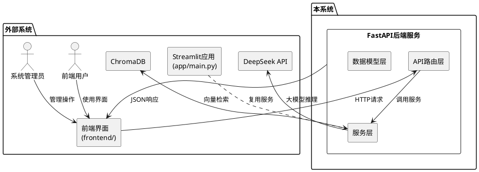
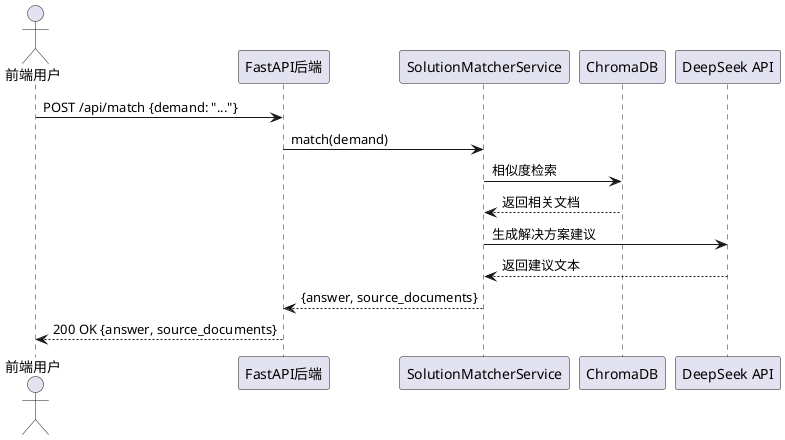
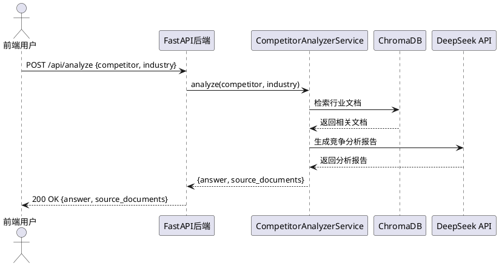
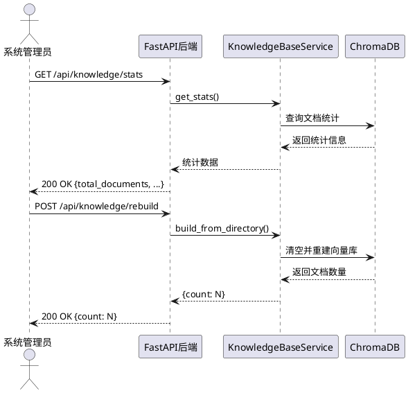
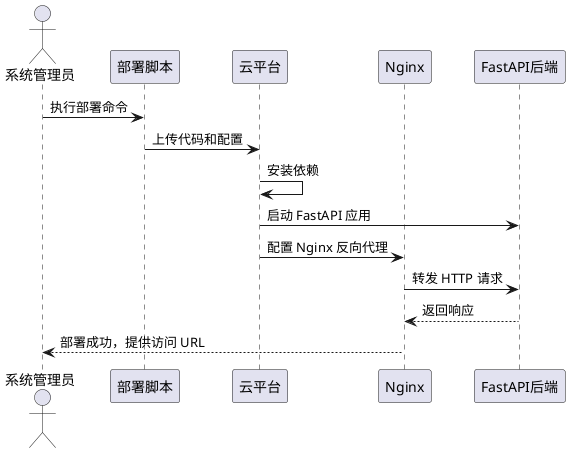

# 华为云解决方案匹配系统后端开发需求规格

## 1. 组件定位

### 1.1 核心职责

本组件负责提供 RESTful API 服务，实现华为云解决方案智能匹配、竞争对手分析和知识库管理功能，并与前端界面对接，支持公网访问。

### 1.2 核心输入

1. **前端 HTTP 请求**：来自 `frontend/` 目录的用户界面请求，包括解决方案匹配、竞争对手分析、知识库管理等 API 调用
2. **用户需求描述**：通过 `/api/match` 接口提交的客户业务需求文本
3. **竞争对手分析请求**：通过 `/api/analyze` 接口提交的竞争对手名称和行业信息
4. **知识库操作指令**：通过 `/api/knowledge/*` 接口提交的知识库管理请求

### 1.3 核心输出

1. **API 响应数据**：JSON 格式的解决方案建议、竞争分析报告、知识库统计信息
2. **参考文档列表**：匹配到的源文档内容和元数据
3. **系统状态信息**：知识库统计、API 健康状态
4. **错误响应**：标准化的错误码和错误提示信息

### 1.4 职责边界

本组件**不负责**以下事项：

1. 前端界面渲染和用户交互逻辑（由 `frontend/` 目录的静态文件负责）
2. 大模型 API 的内部实现（由 DeepSeek/OpenAI API 服务负责）
3. 向量数据库的底层存储（由 ChromaDB 库负责）
4. 用户认证和权限管理（本版本不包含）
5. 原有 Streamlit 应用的维护（保留 `app/main.py` 但不作为主要服务）

---

## 2. 领域术语

**解决方案匹配**
: 基于客户需求描述，通过向量检索和大模型推理，推荐最适合的华为云行业解决方案的过程。

**竞争对手分析**
: 对比华为云与竞争对手在特定行业的方案差异，生成竞争优势和销售话术的过程。

**知识库**
: 存储华为云行业解决方案文档的向量数据库，支持语义检索和相似度匹配。

**API 接口**
: 基于 FastAPI 框架实现的 RESTful 接口，提供 HTTP 请求处理和 JSON 响应能力。

**CORS**
: 跨源资源共享机制，允许前端界面从不同域访问后端 API。

**DeepSeek AI**
: 深度求索公司的大语言模型服务，用于智能分析和文本生成。

---

## 3. 角色与边界

### 3.1 核心角色

1. **前端用户**：通过 Web 界面使用解决方案匹配和竞争分析功能的业务人员
2. **系统管理员**：执行知识库重建、清空等管理操作的技术人员

### 3.2 外部系统

1. **前端界面**：发送 HTTP 请求并接收 JSON 响应
2. **DeepSeek/OpenAI API**：提供大模型推理能力
3. **ChromaDB**：提供向量存储和检索能力
4. **现有 Streamlit 应用**：保留兼容，不作为主要服务入口

### 3.3 交互上下文

---

## 4. DFX约束

### 4.1 性能

1. **API 响应时间**
   - When 前端发送 `/api/match` 请求，the FastAPI 后端 shall 在 30 秒内返回匹配结果
   - When 前端发送 `/api/analyze` 请求，the FastAPI 后端 shall 在 30 秒内返回分析结果
   - When 前端发送 `/api/knowledge/stats` 请求，the FastAPI 后端 shall 在 2 秒内返回统计信息

2. **并发处理能力**
   - While 系统运行中，the FastAPI 后端 shall 支持至少 10 个并发请求

3. **资源占用**
   - While 系统运行中，单个 API 进程 shall 占用内存不超过 2GB

### 4.2 可靠性

1. **服务可用性**
   - While 系统部署到公网后，the FastAPI 后端 shall 保持 99% 以上的可用性

2. **故障恢复**
   - If API 请求处理失败，the FastAPI 后端 shall 返回标准错误响应并记录日志
   - If DeepSeek API 调用超时，the FastAPI 后端 shall 返回超时错误提示并建议重试

3. **数据一致性**
   - While 知识库重建过程中，the FastAPI 后端 shall 确保旧数据不被删除直到新数据构建完成

### 4.3 安全性

1. **接口安全**
   - Where API 部署到公网，the FastAPI 后端 shall 仅允许跨域请求来自配置的白名单域名
   - Where API 部署到公网，the FastAPI 后端 shall 在响应头中添加安全相关 HTTP 头（如 X-Content-Type-Options）

2. **敏感数据保护**
   - Where 配置文件包含 API 密钥，the 系统 shall 将敏感配置存储在环境变量中而非代码中

3. **操作审计**
   - When 知识库执行重建或清空操作，the FastAPI 后端 shall 记录操作日志

### 4.4 可维护性

1. **日志规范**
   - When API 接收任何请求，the FastAPI 后端 shall 记录请求路径、方法和响应状态码
   - If API 处理过程中发生错误，the FastAPI 后端 shall 记录完整错误堆栈信息

2. **监控指标**
   - While 系统运行中，the FastAPI 后端 shall 提供 `/health` 健康检查接口

3. **配置管理**
   - Where 系统需要切换开发/生产环境，the 配置文件 shall 支持通过环境变量加载不同配置

### 4.5 兼容性

1. **接口稳定性**
   - Where API 接口定义后，the 接口路径和响应格式 shall 保持向后兼容

2. **前端对接**
   - Where 前端已定义 API 接口规范（在 script.js 中），the FastAPI 后端 shall 严格按照前端定义的接口规范实现

---

## 5. 核心能力

### 5.1 解决方案智能匹配 API

#### 5.1.1 业务规则

1. **需求描述校验**
   - When 前端提交 `/api/match` 请求，the FastAPI 后端 shall 校验 `demand` 字段是否存在
   - If `demand` 字段为空或缺失，the FastAPI 后端 shall 返回 400 错误并提示"请输入客户需求描述"
   - If `demand` 字段长度超过 2000 字符，the FastAPI 后端 shall 返回 400 错误并提示"需求描述不能超过2000字符"
   - 验收条件：[提交空需求] → [返回 400 错误，提示"请输入客户需求描述"]

2. **匹配逻辑执行**
   - When 接收到有效需求描述，the FastAPI 后端 shall 调用 `SolutionMatcherService.match()` 方法
   - While 执行匹配过程中，the FastAPI 后端 shall 先通过向量检索获取相关文档，再调用大模型生成建议
   - 验收条件：[提交有效需求] → [返回包含 answer 和 source_documents 的 JSON 响应]

3. **响应格式规范**
   - When 匹配成功完成，the FastAPI 后端 shall 返回包含 `answer`（解决方案建议文本）和 `source_documents`（参考文档数组）的 JSON 对象
   - 验收条件：[匹配成功] → [响应包含 answer 和 source_documents 字段]

#### 5.1.2 交互流程

#### 5.1.3 异常场景

1. **需求描述校验失败**
   - 触发条件：`demand` 字段为空或长度超过 2000 字符
   - 系统行为：返回 400 状态码，不执行匹配逻辑
   - 用户感知：前端收到错误提示"请输入客户需求描述"或"需求描述不能超过2000字符"

2. **向量检索失败**
   - 触发条件：ChromaDB 连接失败或数据为空
   - 系统行为：记录错误日志，返回 500 状态码
   - 用户感知：前端收到错误提示"匹配失败，请检查知识库是否已初始化"

3. **大模型调用失败**
   - 触发条件：DeepSeek API 密钥无效或网络超时
   - 系统行为：记录错误日志，返回 500 状态码
   - 用户感知：前端收到错误提示"AI 服务暂时不可用，请稍后重试"

### 5.2 竞争对手分析 API

#### 5.2.1 业务规则

1. **参数校验**
   - When 前端提交 `/api/analyze` 请求，the FastAPI 后端 shall 校验 `competitor` 和 `industry` 字段是否存在
   - If `competitor` 或 `industry` 字段缺失，the FastAPI 后端 shall 返回 400 错误并提示"请选择竞争对手和行业"
   - If `competitor` 不在支持的竞争对手列表中，the FastAPI 后端 shall 返回 400 错误
   - If `industry` 不在支持的行业列表中，the FastAPI 后端 shall 返回 400 错误
   - 验收条件：[提交无效参数] → [返回 400 错误]

2. **分析逻辑执行**
   - When 接收到有效参数，the FastAPI 后端 shall 调用 `CompetitorAnalyzerService.analyze()` 方法
   - While 执行分析过程中，the FastAPI 后端 shall 检索该行业的解决方案文档，调用大模型生成竞争分析报告
   - 验收条件：[提交有效参数] → [返回包含竞争分析报告的 JSON 响应]

3. **响应格式规范**
   - When 分析成功完成，the FastAPI 后端 shall 返回包含 `answer`（竞争分析报告）和 `source_documents`（参考文档数组）的 JSON 对象
   - 验收条件：[分析成功] → [响应包含 answer 和 source_documents 字段]

#### 5.2.2 交互流程

#### 5.2.3 异常场景

1. **参数校验失败**
   - 触发条件：`competitor` 或 `industry` 字段缺失或不在支持列表中
   - 系统行为：返回 400 状态码，不执行分析逻辑
   - 用户感知：前端收到错误提示"请选择有效的竞争对手和行业"

2. **行业文档不足**
   - 触发条件：该行业在知识库中无文档或文档数量少于 3 篇
   - 系统行为：记录警告日志，但继续执行分析（使用有限文档）
   - 用户感知：前端收到分析结果，但参考文档列表较短

### 5.3 知识库管理 API

#### 5.3.1 业务规则

1. **统计信息查询**
   - When 前端发送 `/api/knowledge/stats` 请求，the FastAPI 后端 shall 调用 `KnowledgeBaseService.get_stats()` 方法
   - When 返回统计信息，the FastAPI 后端 shall 包含 `total_documents`（总文档数）、`supported_industries`（支持的行业列表）和 `industry_counts`（各行业文档数量统计）
   - 验收条件：[发送统计请求] → [返回包含完整统计信息的 JSON 响应]

2. **知识库重建**
   - When 前端发送 `/api/knowledge/rebuild` 请求，the FastAPI 后端 shall 调用 `KnowledgeBaseService.build_from_directory()` 方法
   - While 重建过程中，the FastAPI 后端 shall 扫描 `data/sample_solutions/` 目录下的所有文档并添加到向量数据库
   - When 重建完成，the FastAPI 后端 shall 返回添加的文档片段数量
   - 验收条件：[发送重建请求] → [返回包含 count 字段的 JSON 响应]

3. **知识库清空**
   - When 前端发送 `/api/knowledge/clear` 请求，the FastAPI 后端 shall 调用向量数据库的清空方法
   - When 清空完成，the FastAPI 后端 shall 返回 `{success: true}` 响应
   - 验收条件：[发送清空请求] → [返回 {success: true} 响应]

#### 5.3.2 交互流程

#### 5.3.3 异常场景

1. **知识库目录不存在**
   - 触发条件：`data/sample_solutions/` 目录不存在或为空
   - 系统行为：返回 500 状态码，记录错误日志
   - 用户感知：前端收到错误提示"知识库目录不存在或为空"

2. **向量数据库操作失败**
   - 触发条件：ChromaDB 连接失败或权限不足
   - 系统行为：返回 500 状态码，记录错误堆栈
   - 用户感知：前端收到错误提示"知识库操作失败，请检查系统配置"

### 5.4 FastAPI 应用搭建

#### 5.4.1 业务规则

1. **应用初始化**
   - When FastAPI 应用启动，the 系统 shall 创建 FastAPI 实例并配置 CORS 中间件
   - When FastAPI 应用启动，the 系统 shall 初始化所有服务实例（SolutionMatcherService、CompetitorAnalyzerService、KnowledgeBaseService）
   - 验收条件：[启动应用] → [应用运行在配置的端口上]

2. **路由注册**
   - When FastAPI 应用初始化，the 系统 shall 注册以下路由：
     - POST `/api/match`
     - POST `/api/analyze`
     - GET `/api/knowledge/stats`
     - POST `/api/knowledge/rebuild`
     - POST `/api/knowledge/clear`
     - GET `/health`（健康检查）
   - 验收条件：[应用启动后访问任意路由] → [返回相应响应或 404]

3. **CORS 配置**
   - Where 前端和后端部署在不同域，the FastAPI 后端 shall 配置 CORS 允许前端域名跨域访问
   - When CORS 配置生效，the FastAPI 后端 shall 在响应头中添加 `Access-Control-Allow-Origin` 等相关头
   - 验收条件：[前端跨域请求] → [请求成功，响应包含 CORS 头]

#### 5.4.2 异常场景

1. **服务初始化失败**
   - 触发条件：配置文件缺失或环境变量未设置
   - 系统行为：应用启动失败，输出错误日志
   - 用户感知：应用无法启动，控制台显示配置错误信息

2. **端口被占用**
   - 触发条件：配置的端口已被其他进程占用
   - 系统行为：应用启动失败，输出端口占用错误
   - 用户感知：应用无法启动，控制台显示端口占用信息

### 5.5 部署到公网

#### 5.5.1 业务规则

1. **部署环境配置**
   - Where 系统需要部署到公网，the 部署方案 shall 支持主流云平台（如华为云、阿里云、腾讯云）
   - Where 系统部署到公网，the 部署方案 shall 使用生产级 WSGI 服务器（如 Uvicorn、Gunicorn）
   - 验收条件：[执行部署] → [系统可通过公网 IP 访问]

2. **域名和端口配置**
   - Where 系统部署到公网，the 配置文件 shall 支持自定义域名和端口
   - Where 使用反向代理（如 Nginx），the 系统 shall 配置反向代理将外部请求转发到 FastAPI 应用
   - 验收条件：[配置域名和端口] → [系统可通过域名访问]

3. **生产环境配置**
   - Where 系统运行在生产环境，the FastAPI 应用 shall 关闭调试模式（debug=False）
   - Where 系统运行在生产环境，the 日志级别 shall 设置为 INFO 或 WARNING
   - 验收条件：[切换到生产环境] → [系统以生产配置运行]

4. **安全性配置**
   - Where 系统部署到公网，the 反向代理 shall 配置 HTTPS 证书
   - Where 系统部署到公网，the API 密钥 shall 通过环境变量或密钥管理服务注入
   - 验收条件：[公网访问] → [支持 HTTPS，密钥不在代码中暴露]

#### 5.5.2 交互流程

#### 5.5.3 异常场景

1. **云平台认证失败**
   - 触发条件：云平台 API 密钥无效或权限不足
   - 系统行为：部署脚本中止，输出认证错误
   - 用户感知：部署失败，控制台显示认证错误

2. **HTTPS 证书配置失败**
   - 触发条件：SSL 证书文件不存在或格式错误
   - 系统行为：Nginx 启动失败，输出证书错误
   - 用户感知：部署失败，控制台显示证书配置错误

3. **端口映射错误**
   - 触发条件：防火墙规则未开放配置的端口
   - 系统行为：应用启动成功但外部无法访问
   - 用户感知：部署后无法通过公网 IP 访问，需检查防火墙配置

---

## 6. 数据约束

### 6.1 解决方案匹配请求（MatchRequest）

1. **demand**：客户需求描述，字符串类型，必填，长度 1-2000 字符

### 6.2 竞争对手分析请求（AnalyzeRequest）

1. **competitor**：竞争对手名称，字符串类型，必填，枚举值：["阿里云", "腾讯云", "AWS", "Azure", "百度云"]
2. **industry**：行业名称，字符串类型，必填，枚举值：["智慧农业", "工业互联网", "智慧园区", "智慧城市", "智慧交通", "智慧教育", "智慧医疗", "智慧金融", "智慧能源", "智慧文旅"]

### 6.3 解决方案匹配响应（MatchResponse）

1. **answer**：解决方案建议文本，字符串类型，Markdown 格式
2. **source_documents**：参考文档数组，数组类型，每个元素包含：
   - **page_content**：文档内容片段，字符串类型
   - **metadata**：文档元数据，对象类型，包含 `source`（文档来源）和 `industry`（所属行业）

### 6.4 知识库统计响应（KnowledgeStatsResponse）

1. **total_documents**：总文档片段数，整数类型，≥ 0
2. **supported_industries**：支持的行业列表，字符串数组类型
3. **industry_counts**：各行业文档数量统计，对象类型，键为行业名称，值为文档数量

### 6.5 知识库重建响应（RebuildResponse）

1. **count**：添加的文档片段数量，整数类型，≥ 0

### 6.6 知识库清空响应（ClearResponse）

1. **success**：操作是否成功，布尔类型

---

## 7. 技术约束

### 7.1 技术栈约束

1. **后端框架**：必须使用 FastAPI 作为 Web 框架
2. **编程语言**：必须使用 Python 3.8 或更高版本
3. **向量数据库**：必须使用 ChromaDB（与现有 `app/` 目录中的实现一致）
4. **大模型服务**：必须支持 DeepSeek API（可配置切换到 OpenAI）

### 7.2 兼容性约束

1. **现有代码复用**：必须复用 `app/services/` 目录下的服务类（SolutionMatcherService、CompetitorAnalyzerService、KnowledgeBaseService）
2. **配置兼容**：必须兼容 `app/config.py` 中的配置结构
3. **前端 API 对接**：必须严格按照 `frontend/script.js` 中定义的 API 接口规范实现

### 7.3 部署约束

1. **独立部署**：FastAPI 后端必须能够独立部署，不依赖 Streamlit 应用
2. **静态文件服务**：FastAPI 后端应能够提供 `frontend/` 目录的静态文件服务（可选，也可使用 Nginx）
3. **环境变量支持**：敏感配置（API 密钥、端口等）必须通过环境变量配置

---

## 8. 验收条件汇总

### 8.1 功能验收

1. When 前端发送 POST `/api/match` 请求包含有效需求描述，the FastAPI 后端 shall 返回 200 状态码和包含解决方案建议的 JSON 响应
2. When 前端发送 POST `/api/analyze` 请求包含有效参数，the FastAPI 后端 shall 返回 200 状态码和包含竞争分析报告的 JSON 响应
3. When 前端发送 GET `/api/knowledge/stats` 请求，the FastAPI 后端 shall 返回 200 状态码和包含完整统计信息的 JSON 响应
4. When 前端发送 POST `/api/knowledge/rebuild` 请求，the FastAPI 后端 shall 返回 200 状态码和包含文档数量的 JSON 响应
5. When 前端发送 POST `/api/knowledge/clear` 请求，the FastAPI 后端 shall 返回 200 状态码和 `{success: true}` 响应

### 8.2 性能验收

1. When 前端发送任意 API 请求，the FastAPI 后端 shall 在 30 秒内返回响应（大模型调用场景）或在 2 秒内返回响应（查询场景）
2. While 系统运行中，the FastAPI 后端 shall 支持至少 10 个并发请求

### 8.3 安全验收

1. Where 系统部署到公网，the FastAPI 后端 shall 配置 CORS 仅允许前端域名访问
2. Where 系统部署到公网，the API 密钥 shall 不在代码仓库中暴露

### 8.4 部署验收

1. When 执行部署脚本，the 系统 shall 在 10 分钟内完成部署并可通过公网 IP 访问
2. When 访问 `/health` 接口，the FastAPI 后端 shall 返回 200 状态码
3. Where 系统部署到公网，the 系统 shall 支持通过 HTTPS 访问（如果配置了 SSL 证书）
