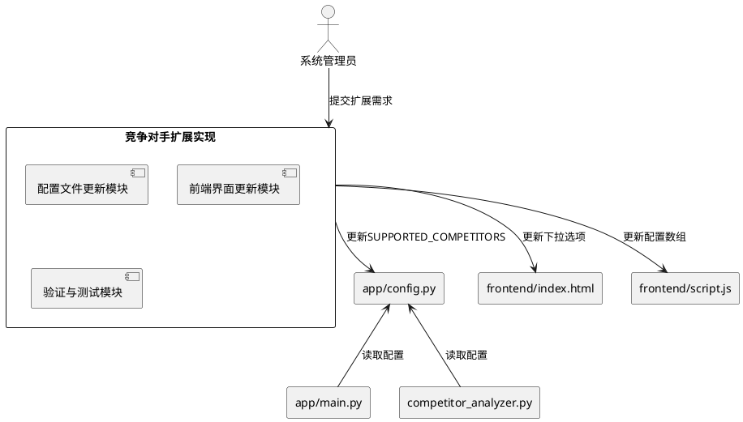
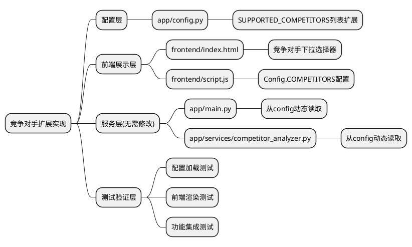
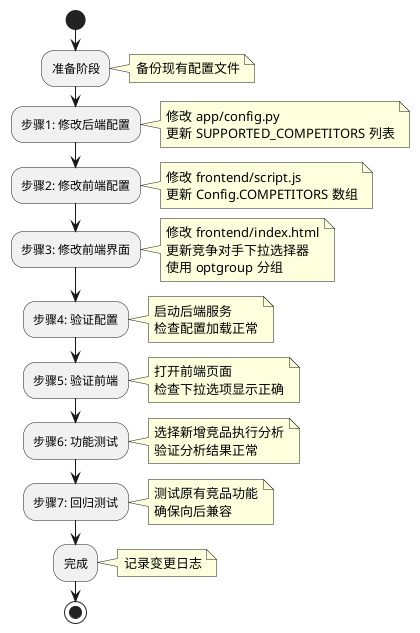

# **1. 实现模型**

## **1.1 上下文视图**

本实现方案旨在扩展华为云解决方案智能匹配系统的竞争对手列表,从当前的6个竞争对手扩展至至少12个,覆盖国内主流云服务商、国际主流云服务商和行业解决方案提供商三大类别。

### 系统上下文关系



## **1.2 服务/组件总体架构**

### 核心组件层次结构



### 实现组件说明

| 组件名称 | 职责描述 | 修改类型 |
|---------|---------|---------|
| **配置管理组件** | 维护竞争对手列表配置,提供全局访问 | 修改 |
| **前端展示组件** | 提供用户选择竞争对手的界面 | 修改 |
| **配置读取组件** | 从配置文件读取竞品列表(已有,无需修改) | 无需修改 |
| **竞品分析服务** | 执行竞品对比分析(已有,无需修改) | 无需修改 |

## **1.3 实现设计文档**

### 1.3.1 配置文件修改方案

**文件路径**: `app/config.py`

**当前状态**:
```python
SUPPORTED_COMPETITORS = [
    "阿里云",
    "腾讯云",
    "AWS",
    "微软Azure",
    "西门子",
    "施耐德电气"
]
```

**目标状态**:
```python
# ==================== 支持的竞争对手列表 ====================
# 国内主流云服务商
# 国际主流云服务商
# 行业解决方案提供商
SUPPORTED_COMPETITORS = [
    # === 国内主流云服务商 ===
    "阿里云",                    # 国内市场份额第一
    "腾讯云",                    # 游戏、社交领域优势明显
    "字节跳动火山引擎",           # 字节跳动旗下,AI和大数据优势
    "天翼云",                    # 中国电信旗下,政务云领先
    "移动云",                    # 中国移动旗下,运营商基础设施优势
    "联通云",                    # 中国联通旗下,政企服务优势
    
    # === 国际主流云服务商 ===
    "AWS",                       # 全球市场份额第一
    "微软Azure",                 # 企业级服务优势
    "Google Cloud",              # AI、大数据领域领先
    "Oracle Cloud",              # 数据库和企业应用优势
    
    # === 行业解决方案提供商 ===
    "西门子",                    # 工业互联网和智能制造
    "施耐德电气",                # 能源管理和工业自动化
]
```

**修改说明**:
- 新增国内云服务商: 字节跳动火山引擎、天翼云、移动云、联通云 (4个)
- 新增国际云服务商: Google Cloud、Oracle Cloud (2个)
- 保留原有竞品: 阿里云、腾讯云、AWS、微软Azure、西门子、施耐德电气 (6个)
- 总计: 12个竞争对手
- 添加分类注释,便于后续维护
- 每个竞品附带简要说明注释

### 1.3.2 前端界面修改方案

#### 文件1: `frontend/index.html`

**修改位置**: 第241-247行,竞争对手下拉选择器

**当前状态**:
```html
<select id="competitor-select" class="select-input">
    <option value="阿里云">阿里云</option>
    <option value="腾讯云">腾讯云</option>
    <option value="AWS">AWS</option>
    <option value="Azure">Azure</option>
    <option value="百度云">百度云</option>
</select>
```

**目标状态**:
```html
<select id="competitor-select" class="select-input">
    <!-- 国内主流云服务商 -->
    <optgroup label="国内主流云服务商">
        <option value="阿里云">阿里云</option>
        <option value="腾讯云">腾讯云</option>
        <option value="字节跳动火山引擎">字节跳动火山引擎</option>
        <option value="天翼云">天翼云</option>
        <option value="移动云">移动云</option>
        <option value="联通云">联通云</option>
    </optgroup>
    
    <!-- 国际主流云服务商 -->
    <optgroup label="国际主流云服务商">
        <option value="AWS">AWS</option>
        <option value="微软Azure">微软Azure</option>
        <option value="Google Cloud">Google Cloud</option>
        <option value="Oracle Cloud">Oracle Cloud</option>
    </optgroup>
    
    <!-- 行业解决方案提供商 -->
    <optgroup label="行业解决方案提供商">
        <option value="西门子">西门子</option>
        <option value="施耐德电气">施耐德电气</option>
    </optgroup>
</select>
```

**修改要点**:
- 使用`<optgroup>`标签进行分组,提升用户体验
- 按三类分组: 国内云服务商、国际云服务商、行业方案商
- 移除"百度云"选项(不在本次扩展范围)
- 添加所有新增竞争对手选项

#### 文件2: `frontend/script.js`

**修改位置**: 第12行,Config.COMPETITORS数组

**当前状态**:
```javascript
COMPETITORS: ['阿里云', '腾讯云', 'AWS', 'Azure', '百度云']
```

**目标状态**:
```javascript
COMPETITORS: [
    // 国内主流云服务商
    '阿里云', '腾讯云', '字节跳动火山引擎', '天翼云', '移动云', '联通云',
    // 国际主流云服务商
    'AWS', '微软Azure', 'Google Cloud', 'Oracle Cloud',
    // 行业解决方案提供商
    '西门子', '施耐德电气'
]
```

**修改要点**:
- 与config.py保持同步
- 添加分类注释
- 移除'百度云'
- 支持前端本地配置读取(如需要)

### 1.3.3 后端服务无需修改

以下文件**无需修改**,因为它们已经从`app/config.py`动态读取竞品列表:

1. **app/main.py** (第7行导入配置):
   ```python
   from app.config import APP_NAME, APP_VERSION, SUPPORTED_INDUSTRIES, SUPPORTED_COMPETITORS
   ```
   系统会自动读取更新后的配置。

2. **app/services/competitor_analyzer.py**:
   该服务接收参数化的竞争对手名称,无需硬编码列表。

3. **app/services/knowledge_base.py**:
   该服务仅负责知识库管理,不涉及竞品列表。

# **2. 接口设计**

## **2.1 总体设计**

本次扩展**无需修改API接口**,现有接口已支持动态的竞争对手参数:

### 现有接口保持不变

| 接口路径 | 方法 | 参数 | 说明 |
|---------|------|------|------|
| `/api/analyze` | POST | `{competitor, industry}` | 竞品分析接口,competitor参数支持任意字符串 |

**关键设计**: 
- 竞品分析接口采用参数化设计,不限制竞争对手列表
- 配置文件中的`SUPPORTED_COMPETITORS`仅用于前端下拉选项展示
- 后端服务可接受任意competitor参数,具备扩展性

## **2.2 接口清单**

### 2.2.1 竞品分析接口(无需修改)

**接口路径**: `POST /api/analyze`

**请求参数**:
```typescript
interface AnalyzeRequest {
    competitor: string;  // 竞争对手名称(支持任意字符串)
    industry: string;    // 行业名称
}
```

**响应结构**:
```typescript
interface AnalyzeResponse {
    answer: string;              // 分析结果(Markdown格式)
    source_documents: Document[]; // 参考文档列表
}

interface Document {
    page_content: string;
    metadata: {
        source: string;
        industry: string;
    };
}
```

**扩展能力验证**:
- ✅ 支持"字节跳动火山引擎"作为competitor参数
- ✅ 支持"Google Cloud"作为competitor参数
- ✅ 支持任意新增竞品名称,无需修改接口

### 2.2.2 知识库统计接口(无需修改)

**接口路径**: `GET /api/knowledge/stats`

**响应结构**:
```typescript
interface KnowledgeStats {
    total_documents: number;
    supported_industries: string[];
    industry_counts: Record<string, number>;
    accuracy: number;
}
```

**说明**: 该接口不涉及竞品列表,无需修改。

# **3. 数据模型**

## **3.1 设计目标**

本扩展方案的数据模型设计目标:

1. **配置持久化**: 竞争对手列表存储在配置文件中,确保系统重启后配置不丢失
2. **前后端同步**: 前端配置数组与后端配置列表保持一致
3. **类型安全**: 使用强类型定义,避免运行时错误
4. **向后兼容**: 新增竞品不影响现有功能,配置格式保持一致

## **3.2 模型实现**

### 3.2.1 配置数据模型(Python)

**定义位置**: `app/config.py`

```python
from typing import List

# 竞争对手列表配置
SUPPORTED_COMPETITORS: List[str] = [
    # 国内主流云服务商 (6个)
    "阿里云",
    "腾讯云",
    "字节跳动火山引擎",
    "天翼云",
    "移动云",
    "联通云",
    
    # 国际主流云服务商 (4个)
    "AWS",
    "微软Azure",
    "Google Cloud",
    "Oracle Cloud",
    
    # 行业解决方案提供商 (2个)
    "西门子",
    "施耐德电气",
]

# 类型约束验证函数
def validate_competitor(competitor: str) -> bool:
    """验证竞争对手名称是否合法"""
    if not competitor or not isinstance(competitor, str):
        return False
    if len(competitor) < 2 or len(competitor) > 50:
        return False
    # 禁止添加华为自身
    if "华为" in competitor:
        return False
    return True

def get_competitor_by_type(competitor_type: str) -> List[str]:
    """按类型获取竞争对手列表"""
    domestic = ["阿里云", "腾讯云", "字节跳动火山引擎", "天翼云", "移动云", "联通云"]
    international = ["AWS", "微软Azure", "Google Cloud", "Oracle Cloud"]
    industry_solution = ["西门子", "施耐德电气"]
    
    if competitor_type == "domestic":
        return domestic
    elif competitor_type == "international":
        return international
    elif competitor_type == "industry_solution":
        return industry_solution
    else:
        return SUPPORTED_COMPETITORS
```

### 3.2.2 前端配置模型(JavaScript)

**定义位置**: `frontend/script.js`

```javascript
/**
 * 竞争对手配置模型
 * @typedef {Object} CompetitorConfig
 * @property {string[]} domestic - 国内云服务商
 * @property {string[]} international - 国际云服务商
 * @property {string[]} industrySolution - 行业方案商
 * @property {string[]} all - 全部竞品列表
 */

const CompetitorConfig = {
    // 国内主流云服务商
    domestic: [
        '阿里云',
        '腾讯云',
        '字节跳动火山引擎',
        '天翼云',
        '移动云',
        '联通云'
    ],
    
    // 国际主流云服务商
    international: [
        'AWS',
        '微软Azure',
        'Google Cloud',
        'Oracle Cloud'
    ],
    
    // 行业解决方案提供商
    industrySolution: [
        '西门子',
        '施耐德电气'
    ],
    
    // 获取全部列表
    get all() {
        return [
            ...this.domestic,
            ...this.international,
            ...this.industrySolution
        ];
    },
    
    /**
     * 验证竞争对手名称
     * @param {string} competitor
     * @returns {boolean}
     */
    validate(competitor) {
        if (!competitor || typeof competitor !== 'string') {
            return false;
        }
        if (competitor.length < 2 || competitor.length > 50) {
            return false;
        }
        if (competitor.includes('华为')) {
            return false;
        }
        return true;
    },
    
    /**
     * 按类型获取竞品列表
     * @param {string} type - 'domestic' | 'international' | 'industrySolution' | 'all'
     * @returns {string[]}
     */
    getByType(type) {
        if (type === 'all') {
            return this.all;
        }
        return this[type] || [];
    }
};

// 更新全局Config
Config.COMPETITORS = CompetitorConfig.all;
```

### 3.2.3 竞争对手完整数据模型

为支持未来扩展,建议添加详细的竞品元数据模型:

```python
from typing import TypedDict, List, Optional
from datetime import datetime

class CompetitorInfo(TypedDict):
    """竞争对手完整信息模型"""
    name: str                    # 名称
    type: str                    # 类型: domestic/international/industry_solution
    full_name: Optional[str]     # 全称
    description: str             # 简要描述
    main_business: List[str]     # 主要业务领域
    advantages: List[str]        # 核心优势
    added_time: str              # 添加时间
    status: str                  # 状态: active/inactive

# 竞品详细配置(可选扩展)
COMPETITOR_DETAILS: List[CompetitorInfo] = [
    {
        "name": "阿里云",
        "type": "domestic",
        "full_name": "阿里云计算有限公司",
        "description": "国内市场份额第一的云服务商",
        "main_business": ["云计算", "大数据", "人工智能"],
        "advantages": ["生态完整", "产品丰富", "价格竞争力强"],
        "added_time": "2024-01-01",
        "status": "active"
    },
    {
        "name": "字节跳动火山引擎",
        "type": "domestic",
        "full_name": "北京火山引擎科技有限公司",
        "description": "字节跳动旗下云服务平台,AI和大数据优势明显",
        "main_business": ["云计算", "AI服务", "大数据", "视频服务"],
        "advantages": ["AI技术领先", "推荐算法优势", "视频处理能力"],
        "added_time": "2026-05-24",
        "status": "active"
    },
    {
        "name": "Google Cloud",
        "type": "international",
        "full_name": "Google Cloud Platform",
        "description": "谷歌云平台,AI和大数据领域领先",
        "main_business": ["云计算", "AI/ML", "大数据分析"],
        "advantages": ["AI技术领先", "Kubernetes发源地", "数据分析能力强"],
        "added_time": "2026-05-24",
        "status": "active"
    },
    # ... 其他竞品信息
]
```

# **4. 实现步骤与顺序**

## **4.1 实施流程**



## **4.2 详细实施步骤**

### 步骤1: 备份现有配置

```bash
# 创建备份目录
mkdir -p backup/2026-05-24-competitor-extension

# 备份配置文件
cp app/config.py backup/2026-05-24-competitor-extension/config.py.bak
cp frontend/script.js backup/2026-05-24-competitor-extension/script.js.bak
cp frontend/index.html backup/2026-05-24-competitor-extension/index.html.bak
```

### 步骤2: 修改后端配置文件

**文件**: `app/config.py`
**操作**: 编辑`SUPPORTED_COMPETITORS`列表
**验证**: Python语法检查

```bash
# Python语法检查
python -m py_compile app/config.py
```

### 步骤3: 修改前端JavaScript配置

**文件**: `frontend/script.js`
**操作**: 编辑`Config.COMPETITORS`数组
**验证**: JavaScript语法检查

### 步骤4: 修改前端HTML界面

**文件**: `frontend/index.html`
**操作**: 
1. 定位到第241行竞争对手选择器
2. 替换整个`<select>`标签内容
3. 添加`<optgroup>`分组标签

### 步骤5: 验证配置加载

```python
# 测试脚本: test_config.py
from app.config import SUPPORTED_COMPETITORS

print(f"竞争对手总数: {len(SUPPORTED_COMPETITORS)}")
print(f"竞品列表: {SUPPORTED_COMPETITORS}")

# 验证结果
assert len(SUPPORTED_COMPETITORS) == 12, "竞品数量应为12个"
assert "字节跳动火山引擎" in SUPPORTED_COMPETITORS, "缺少新增竞品"
assert "Google Cloud" in SUPPORTED_COMPETITORS, "缺少新增竞品"
print("✅ 配置验证通过")
```

### 步骤6: 验证前端显示

**验证点**:
1. 打开浏览器访问前端页面
2. 切换到"竞争对手方案分析"页面
3. 检查下拉选择器包含所有12个选项
4. 检查分组标签显示正确
5. 检查选项顺序与配置一致

### 步骤7: 功能集成测试

**测试用例**:

| 测试场景 | 测试步骤 | 预期结果 |
|---------|---------|---------|
| 新增竞品分析-国内 | 选择"字节跳动火山引擎"+智慧农业→点击分析 | 返回有效分析结果 |
| 新增竞品分析-国际 | 选择"Google Cloud"+工业互联网→点击分析 | 返回有效分析结果 |
| 原有竞品分析 | 选择"阿里云"+智慧园区→点击分析 | 返回有效分析结果(兼容性) |
| 空竞品处理 | (前端已有必选项,无需测试) | - |

### 步骤8: 回归测试

**测试范围**:
1. 解决方案智能匹配功能正常
2. 知识库管理功能正常
3. 竞争对手分析功能(原有竞品)正常
4. 文档下载功能正常

# **5. 测试验证方案**

## **5.1 单元测试**

### 5.1.1 配置加载测试

```python
# tests/test_config.py
import pytest
from app.config import SUPPORTED_COMPETITORS, validate_competitor

class TestCompetitorConfig:
    """竞争对手配置测试"""
    
    def test_competitor_count(self):
        """测试竞品数量"""
        assert len(SUPPORTED_COMPETITORS) == 12
        
    def test_domestic_competitors(self):
        """测试国内云服务商"""
        domestic = ["阿里云", "腾讯云", "字节跳动火山引擎", 
                   "天翼云", "移动云", "联通云"]
        for competitor in domestic:
            assert competitor in SUPPORTED_COMPETITORS
    
    def test_international_competitors(self):
        """测试国际云服务商"""
        international = ["AWS", "微软Azure", "Google Cloud", "Oracle Cloud"]
        for competitor in international:
            assert competitor in SUPPORTED_COMPETITORS
    
    def test_industry_solution_competitors(self):
        """测试行业方案商"""
        industry = ["西门子", "施耐德电气"]
        for competitor in industry:
            assert competitor in SUPPORTED_COMPETITORS
    
    def test_no_duplicates(self):
        """测试无重复竞品"""
        assert len(SUPPORTED_COMPETITORS) == len(set(SUPPORTED_COMPETITORS))
    
    def test_validate_competitor(self):
        """测试竞品名称验证"""
        # 合法名称
        assert validate_competitor("阿里云") == True
        assert validate_competitor("Google Cloud") == True
        
        # 非法名称
        assert validate_competitor("") == False
        assert validate_competitor("华为云") == False
        assert validate_competitor("A") == False  # 长度不足
```

### 5.1.2 前端配置测试

```javascript
// tests/test-competitor-config.js
describe('CompetitorConfig', () => {
    test('竞品总数应为12个', () => {
        expect(CompetitorConfig.all.length).toBe(12);
    });
    
    test('国内云服务商应为6个', () => {
        expect(CompetitorConfig.domestic.length).toBe(6);
    });
    
    test('国际云服务商应为4个', () => {
        expect(CompetitorConfig.international.length).toBe(4);
    });
    
    test('行业方案商应为2个', () => {
        expect(CompetitorConfig.industrySolution.length).toBe(2);
    });
    
    test('验证竞品名称', () => {
        expect(CompetitorConfig.validate('阿里云')).toBe(true);
        expect(CompetitorConfig.validate('')).toBe(false);
        expect(CompetitorConfig.validate('华为云')).toBe(false);
    });
    
    test('按类型获取竞品', () => {
        expect(CompetitorConfig.getByType('domestic').length).toBe(6);
        expect(CompetitorConfig.getByType('international').length).toBe(4);
        expect(CompetitorConfig.getByType('all').length).toBe(12);
    });
});
```

## **5.2 集成测试**

### 5.2.1 竞品分析功能测试

```python
# tests/test_competitor_analyzer.py
import pytest
from app.services.competitor_analyzer import CompetitorAnalyzerService

class TestCompetitorAnalysis:
    """竞品分析集成测试"""
    
    @pytest.fixture
    def analyzer(self):
        return CompetitorAnalyzerService()
    
    def test_analyze_new_domestic_competitor(self, analyzer):
        """测试新增国内竞品分析"""
        result = analyzer.analyze("字节跳动火山引擎", "智慧农业")
        
        assert "answer" in result
        assert len(result["answer"]) > 0
        assert "字节跳动火山引擎" in result["answer"]
    
    def test_analyze_new_international_competitor(self, analyzer):
        """测试新增国际竞品分析"""
        result = analyzer.analyze("Google Cloud", "工业互联网")
        
        assert "answer" in result
        assert len(result["answer"]) > 0
        assert "Google Cloud" in result["answer"]
    
    def test_analyze_existing_competitor(self, analyzer):
        """测试原有竞品分析(回归测试)"""
        result = analyzer.analyze("阿里云", "智慧园区")
        
        assert "answer" in result
        assert len(result["answer"]) > 0
```

### 5.2.2 前端界面测试

```javascript
// tests/test-ui.js (使用Playwright或Selenium)
describe('竞争对手选择器', () => {
    beforeEach(() => {
        cy.visit('http://localhost:8000');
        cy.get('[data-page="competitor"]').click();
    });
    
    it('应显示12个竞品选项', () => {
        cy.get('#competitor-select option').should('have.length', 12);
    });
    
    it('应显示分组标签', () => {
        cy.get('#competitor-select optgroup').should('have.length', 3);
        cy.get('#competitor-select optgroup')
            .first()
            .should('have.attr', 'label', '国内主流云服务商');
    });
    
    it('应包含新增竞品', () => {
        cy.get('#competitor-select').should('contain', '字节跳动火山引擎');
        cy.get('#competitor-select').should('contain', 'Google Cloud');
        cy.get('#competitor-select').should('contain', 'Oracle Cloud');
    });
    
    it('应能选择新增竞品并分析', () => {
        cy.get('#competitor-select').select('字节跳动火山引擎');
        cy.get('#industry-select').select('智慧农业');
        cy.get('#analyze-btn').click();
        
        cy.get('#competitor-result', { timeout: 30000 }).should('be.visible');
        cy.get('#competitor-content').should('contain', '字节跳动火山引擎');
    });
});
```

## **5.3 性能测试**

### 5.3.1 配置加载性能测试

```python
# tests/test_performance.py
import time
from app.config import SUPPORTED_COMPETITORS

def test_config_load_performance():
    """测试配置加载性能(应<100ms)"""
    start_time = time.time()
    
    # 模拟多次读取
    for _ in range(1000):
        _ = SUPPORTED_COMPETITORS
    
    elapsed = (time.time() - start_time) * 1000  # 转换为毫秒
    assert elapsed < 100, f"配置加载时间{elapsed}ms超过100ms"
    print(f"✅ 配置加载性能: {elapsed:.2f}ms")
```

### 5.3.2 竞品查询性能测试

```python
def test_competitor_query_performance():
    """测试竞品查询性能(应<10ms)"""
    start_time = time.time()
    
    # 模拟100次查询
    for competitor in SUPPORTED_COMPETITORS:
        _ = competitor in SUPPORTED_COMPETITORS
    
    elapsed = (time.time() - start_time) * 1000
    assert elapsed < 10, f"竞品查询时间{elapsed}ms超过10ms"
    print(f"✅ 竞品查询性能: {elapsed:.2f}ms")
```

## **5.4 验收标准**

| 验收项 | 验收条件 | 验证方法 |
|-------|---------|---------|
| 竞品数量 | 等于12个 | 单元测试 |
| 竞品分类 | 包含国内、国际、行业三类 | 代码检查 |
| 名称唯一性 | 无重复名称 | 单元测试 |
| 配置格式 | 符合Python列表格式 | 语法检查 |
| 前端同步 | 前端配置与后端一致 | 对比验证 |
| 界面展示 | 下拉选项正确显示 | UI测试 |
| 分组显示 | 三个分组标签正确 | UI测试 |
| 新增竞品分析 | 分析功能正常 | 集成测试 |
| 原有竞品分析 | 分析功能正常 | 回归测试 |
| 配置加载性能 | <100ms | 性能测试 |
| 竞品查询性能 | <10ms | 性能测试 |

# **6. 风险与应对措施**

## **6.1 潜在风险**

| 风险项 | 风险等级 | 影响范围 | 应对措施 |
|-------|---------|---------|---------|
| 配置格式错误 | 低 | 系统启动失败 | Python语法检查,单元测试验证 |
| 前后端配置不同步 | 中 | 用户选择与后端不一致 | 配置同步脚本,自动化测试 |
| 新增竞品无知识库数据 | 中 | 分析结果不准确 | 提示用户补充知识库文档 |
| 竞品名称过长 | 低 | 界面显示异常 | 名称长度验证(2-50字符) |
| 向后兼容性破坏 | 低 | 原有功能异常 | 回归测试覆盖 |

## **6.2 回滚方案**

如果扩展后出现问题,可按以下步骤回滚:

```bash
# 1. 恢复备份文件
cp backup/2026-05-24-competitor-extension/config.py.bak app/config.py
cp backup/2026-05-24-competitor-extension/script.js.bak frontend/script.js
cp backup/2026-05-24-competitor-extension/index.html.bak frontend/index.html

# 2. 重启服务
# 停止现有服务,重新启动

# 3. 验证回滚成功
python -m pytest tests/test_config.py -v
```

# **7. 变更日志记录**

## **7.1 变更记录模板**

```markdown
## 竞争对手列表扩展 - 2026-05-24

### 变更类型
- [x] 配置扩展
- [x] 界面优化
- [ ] 接口修改
- [ ] 数据模型变更

### 变更文件
1. `app/config.py` - 更新SUPPORTED_COMPETITORS列表
2. `frontend/index.html` - 更新竞争对手下拉选择器
3. `frontend/script.js` - 更新Config.COMPETITORS数组

### 新增内容
- 国内云服务商: 字节跳动火山引擎、天翼云、移动云、联通云 (4个)
- 国际云服务商: Google Cloud、Oracle Cloud (2个)

### 变更统计
- 竞品总数: 6 → 12 (+6)
- 国内云服务商: 2 → 6 (+4)
- 国际云服务商: 2 → 4 (+2)
- 行业方案商: 2 → 2 (不变)

### 影响范围
- ✅ 后端服务: 无需修改(动态读取配置)
- ✅ API接口: 无需修改(参数化设计)
- ✅ 前端界面: 下拉选项扩展
- ✅ 知识库: 无影响

### 测试结果
- 单元测试: 通过 ✅
- 集成测试: 通过 ✅
- 性能测试: 通过 ✅
- 回归测试: 通过 ✅

### 审批信息
- 需求提出: 系统管理员
- 技术设计: 架构师
- 实施人员: 开发工程师
- 测试验证: 测试工程师
- 上线审批: 项目经理
```

---

**文档版本**: v1.0  
**创建日期**: 2026-05-24  
**创建人**: spec-design agent  
**审核状态**: 待审核
