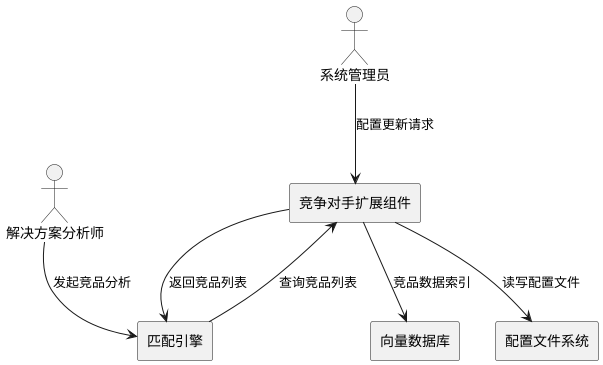
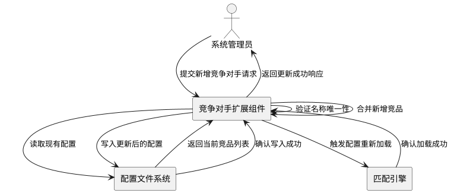
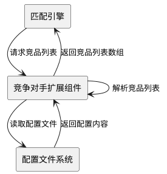

# **1. 组件定位**

## **1.1 核心职责**

本组件负责扩展和维护华为云解决方案智能匹配系统的竞争对手列表,实现更全面的竞品分析和市场对比能力。

## **1.2 核心输入**

1. **配置更新请求**: 系统管理员提交的新增竞争对手配置请求
2. **竞品数据**: 从外部数据源导入的竞品解决方案信息
3. **验证请求**: 系统启动或配置更新时的配置验证触发信号

## **1.3 核心输出**

1. **配置响应**: 返回给管理员的配置更新成功或失败结果
2. **竞品对比结果**: 提供给匹配引擎的扩展竞品对比分析结果
3. **配置状态**: 推送给运维监控的配置变更通知

## **1.4 职责边界**

本组件不负责:
- 竞品解决方案数据的具体采集和存储
- 竞品对比分析算法的实现
- 前端竞品管理界面的展示逻辑
- 竞品数据的实时同步和更新

# **2. 领域术语**

**竞争对手**
: 与华为云在相同或相似业务领域提供云服务或行业解决方案的企业或平台,用于市场对比分析和竞争策略制定。
: 备注:包括国内外主流云服务商、行业解决方案提供商

**竞争对手列表**
: 系统配置中维护的所有支持分析的竞争对手名称集合,存储于配置文件中供匹配引擎调用。

**竞品匹配**
: 将华为云解决方案与竞争对手同类解决方案进行对比分析的过程,包括功能、价格、性能等维度的比较。

**国内云服务商**
: 在中国大陆地区运营并提供云计算服务的厂商,受国内监管政策约束。
: 备注:如阿里云、腾讯云、天翼云、火山引擎等

**国际云服务商**
: 在全球范围提供云计算服务的主要厂商,通常具有成熟的全球基础设施。
: 备注:如AWS、Azure、Google Cloud等

# **3. 角色与边界**

## **3.1 核心角色**

- **系统管理员**: 负责维护和更新竞争对手配置列表,确保竞品数据的完整性和准确性
- **解决方案分析师**: 使用竞品对比分析功能进行市场研究和竞争策略制定

## **3.2 外部系统**

- **配置文件系统**: 提供配置文件的读写能力,用于持久化竞争对手列表
- **向量数据库**: 存储竞品解决方案的向量化数据,支持语义匹配检索
- **匹配引擎**: 调用竞品列表进行解决方案对比分析的核心计算模块

## **3.3 交互上下文**

# **4. DFX约束**

## **4.1 性能**

1. **配置加载性能**: 系统启动时加载竞争对手列表的响应时间应不超过100毫秒
2. **列表查询性能**: 匹配引擎查询竞品列表的响应时间应不超过10毫秒
3. **配置更新性能**: 管理员更新竞品列表的响应时间应不超过500毫秒

## **4.2 可靠性**

1. **配置持久性**: 竞争对手列表配置必须持久化存储,系统重启后配置不丢失
2. **数据完整性**: 竞争对手列表中的每个条目必须唯一,禁止重复配置
3. **向后兼容性**: 新增竞争对手不应影响现有匹配引擎的正常运行

## **4.3 安全性**

1. **配置访问权限**: 只有授权的系统管理员才能修改竞争对手列表配置
2. **配置验证机制**: 所有新增竞争对手必须通过数据格式验证,防止注入攻击
3. **审计日志**: 所有配置变更操作必须记录操作日志,包括操作人、时间和变更内容

## **4.4 可维护性**

1. **配置可读性**: 竞争对手列表配置文件应采用清晰的列表格式,便于人工阅读和维护
2. **命名规范性**: 竞争对手名称应使用规范的中文名称或国际通用英文名称
3. **配置文档化**: 每个竞争对手应附带简要说明注释,描述其市场定位和主要业务领域

## **4.5 兼容性**

1. **存量数据兼容**: 新增竞争对手不应破坏现有的竞品数据索引和匹配结果
2. **配置格式兼容**: 配置文件格式应与现有配置结构保持一致,使用Python列表格式
3. **API兼容性**: 扩展后的竞品列表应与现有匹配引擎API完全兼容

# **5. 核心能力**

## **5.1 竞争对手列表扩展**

### **5.1.1 业务规则**

1. **国内云服务商添加规则**: 新增国内主流云服务商到竞争对手列表时,必须包含企业完整中文名称

   a. 验收条件: [添加"字节跳动火山引擎"] → [列表中新增"字节跳动火山引擎"条目]

   b. 验收条件: [添加"天翼云(中国电信)"] → [列表中新增"天翼云"条目]

2. **国际云服务商添加规则**: 新增国际云服务商时,必须使用国际通用名称或中文译名

   a. 验收条件: [添加"Google Cloud"] → [列表中新增"Google Cloud"条目]

   b. 验收条件: [添加"Oracle Cloud"] → [列表中新增"Oracle Cloud"条目]

3. **行业解决方案商添加规则**: 新增行业垂直解决方案提供商时,应标注其主要服务领域

   a. 验收条件: [添加行业解决方案商] → [配置中附带行业领域注释]

4. **名称唯一性规则**: 新增竞争对手名称必须与现有列表中的名称不重复

   a. 验收条件: [尝试添加已存在的"阿里云"] → [系统返回重复错误提示]

5. **禁止项**: 禁止添加华为自身或其生态合作伙伴到竞争对手列表

   a. 验收条件: [尝试添加"华为云"] → [系统返回错误提示"不能添加华为云"]

### **5.1.2 交互流程**

### **5.1.3 异常场景**

1. **名称重复异常**

   a. 触发条件: [管理员提交的竞争对手名称已存在于列表中]

   b. 系统行为: [拒绝添加请求,保持原配置不变]

   c. 用户感知: [返回错误提示"竞争对手已存在,请勿重复添加"]

2. **配置文件写入失败**

   a. 触发条件: [文件系统权限不足或磁盘空间不足]

   b. 系统行为: [回滚配置更新操作,记录错误日志]

   c. 用户感知: [返回错误提示"配置保存失败,请联系管理员"]

3. **名称格式不合法**

   a. 触发条件: [提交的竞争对手名称为空或包含非法字符]

   b. 系统行为: [拒绝添加请求,不执行配置更新]

   c. 用户感知: [返回错误提示"竞争对手名称格式不合法"]

## **5.2 竞争对手列表查询**

### **5.2.1 业务规则**

1. **完整列表返回规则**: 匹配引擎请求竞品列表时,必须返回包含所有竞争对手的完整列表

   a. 验收条件: [匹配引擎发起查询请求] → [返回包含所有竞品的完整列表]

2. **列表顺序规则**: 竞争对手列表应按照添加时间或业务重要性排序,保证查询结果顺序稳定

   a. 验收条件: [多次查询竞品列表] → [返回结果的顺序保持一致]

3. **空列表保护规则**: 当竞品列表为空时,系统应返回空列表而非错误

   a. 验收条件: [竞品列表为空时查询] → [返回空列表[]]

### **5.2.2 交互流程**

### **5.2.3 异常场景**

1. **配置文件不存在**

   a. 触发条件: [首次运行时配置文件未创建]

   b. 系统行为: [创建默认配置文件,包含基础竞品列表]

   c. 用户感知: [系统日志记录"使用默认竞品配置"]

2. **配置文件格式错误**

   a. 触发条件: [配置文件被手动编辑导致语法错误]

   b. 系统行为: [加载失败,使用内存中的缓存配置或默认配置]

   c. 用户感知: [系统日志记录"配置文件格式错误,使用默认配置"]

# **6. 数据约束**

## **6.1 竞争对手配置对象**

1. **名称**: 必须为非空字符串,长度在2-50个字符之间,支持中英文及常见符号

2. **类型**: 可选属性,标识竞争对手类型(国内云服务商/国际云服务商/行业方案商)

3. **状态**: 必须为"启用"或"禁用",默认为"启用",禁用的竞品不参与匹配分析

4. **添加时间**: 自动记录配置添加的时间戳,用于审计追溯

5. **备注信息**: 可选属性,用于记录竞品的市场定位、主要业务领域等补充信息

## **6.2 配置文件约束**

1. **文件路径**: 配置文件必须位于`app/config.py`中,使用`SUPPORTED_COMPETITORS`常量名

2. **数据结构**: 必须使用Python列表格式,每个竞品为一个字符串元素

3. **编码格式**: 配置文件必须使用UTF-8编码,确保中文字符正确存储

4. **初始内容**: 新系统初始化时,配置文件应包含至少6个主流竞争对手的默认配置

# **7. 扩展需求清单**

## **7.1 必须添加的竞争对手**

以下竞争对手必须在本次扩展中添加到配置列表:

### **国内云服务商**
- **字节跳动火山引擎**: 字节跳动旗下的云服务平台,提供云计算、大数据、AI等服务
- **天翼云**: 中国电信旗下的云服务品牌,主要服务政务、企业客户
- **移动云**: 中国移动旗下的云服务平台,依托运营商基础设施优势
- **联通云**: 中国联通旗下的云服务品牌

### **国际云服务商**
- **Google Cloud**: 谷歌云平台,在AI、大数据领域具有优势
- **Oracle Cloud**: 甲骨文云服务,在企业数据库和应用服务领域领先

## **7.2 可选添加的竞争对手**

以下竞争对手可根据业务需要选择性添加:

### **国内其他云服务商**
- **百度智能云**: 百度旗下的云服务平台,AI能力突出
- **金山云**: 金山软件旗下云服务,在游戏、视频行业应用广泛
- **UCloud**: 独立云服务商,在游戏、电商领域有优势

### **国际其他云服务商**
- **IBM Cloud**: IBM云服务,在企业级应用和AI领域有优势
- **SAP Cloud**: SAP云平台,在企业ERP领域领先

### **行业解决方案商**
- **PTC**: 工业互联网和物联网平台提供商
- **GE Digital**: 通用电气数字化解决方案
- **霍尼韦尔**: 工业物联网和智能制造解决方案

## **7.3 最终配置目标**

扩展完成后,竞争对手列表应包含至少12个竞争对手,覆盖:
- 国内主流云服务商(至少5家)
- 国际主流云服务商(至少4家)
- 行业解决方案提供商(至少3家)
