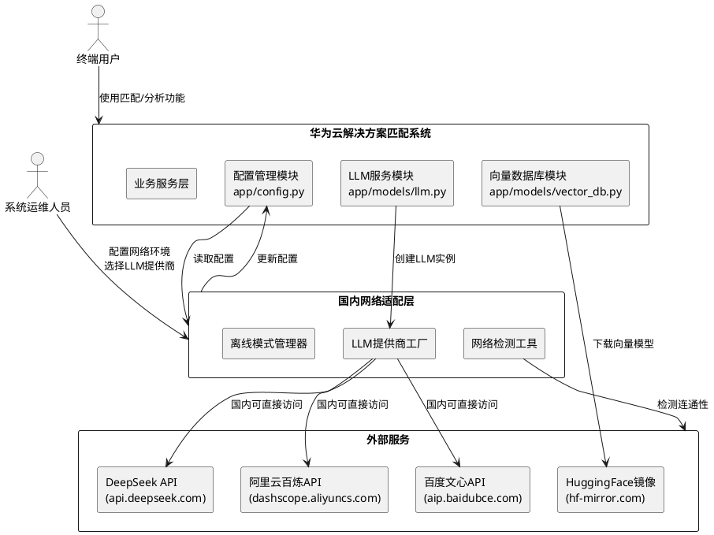
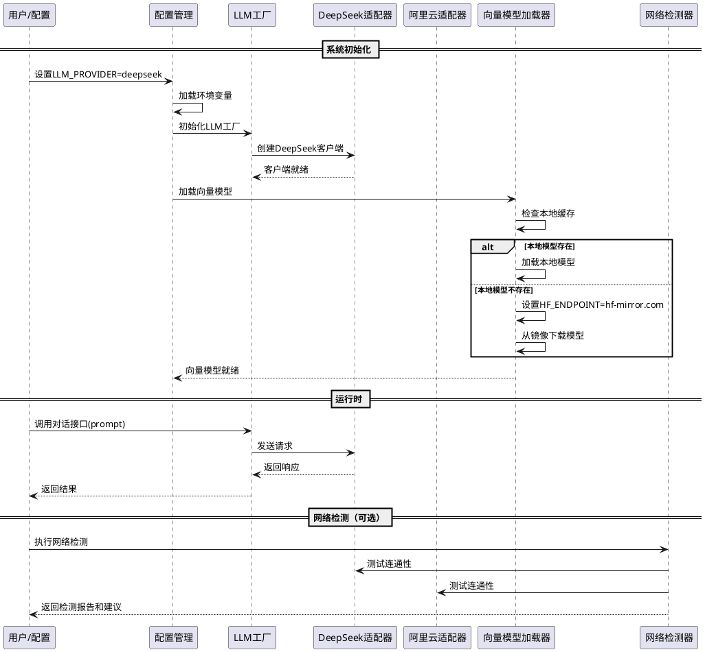

# 国内网络环境适配实现方案设计文档

## 1. 实现模型

### 1.1 上下文视图

本方案旨在适配华为云解决方案智能匹配系统在国内网络环境下的运行能力，通过以下核心机制实现无需VPN即可正常使用系统全部功能：

**核心适配机制**：
- **LLM提供商适配层**：统一封装多个国内可访问的LLM API（DeepSeek、阿里云百炼、百度文心一言），支持通过配置文件动态切换
- **向量模型镜像加速**：默认使用HuggingFace国内镜像源（hf-mirror.com）下载向量嵌入模型，支持本地缓存和离线加载
- **依赖包镜像配置**：提供PyPI国内镜像源配置方案，加速依赖包安装
- **网络环境检测工具**：提供一键检测功能，诊断当前网络环境并给出配置建议
- **离线运行支持**：支持完全离线运行模式，前提是预先下载好所有必需资源

**系统上下文关系图**：



### 1.2 服务/组件总体架构

**模块层次架构**：

```
国内网络适配模块
├── 配置层（Configuration Layer）
│   ├── LLM提供商配置管理
│   ├── 向量模型配置管理
│   ├── 网络配置管理
│   └── 离线模式配置管理
│
├── 服务层（Service Layer）
│   ├── LLM提供商工厂（LLM Provider Factory）
│   │   ├── DeepSeek适配器
│   │   ├── 阿里云百炼适配器
│   │   ├── 百度文心适配器
│   │   └── OpenAI适配器（VPN环境）
│   │
│   ├── 向量模型加载器（Embedding Model Loader）
│   │   ├── 本地模型加载
│   │   ├── 镜像源下载
│   │   └── 模型缓存管理
│   │
│   └── 网络环境检测器（Network Detector）
│       ├── API连通性检测
│       ├── 镜像源连通性检测
│       └── 配置建议生成
│
└── 工具层（Utility Layer）
    ├── 离线模式管理器
    ├── 重试机制包装器
    └── 日志诊断工具
```

**组件交互流程**：



### 1.3 实现设计文档

#### 1.3.1 文件修改清单

| 文件路径 | 修改类型 | 修改说明 | 优先级 |
|---------|---------|---------|--------|
| `app/config.py` | 扩展 | 添加阿里云百炼、百度文心配置项；添加离线模式、网络检测配置 | P0 |
| `app/models/llm.py` | 重构 | 重构为LLM工厂模式；添加阿里云、百度适配器；完善错误处理和重试机制 | P0 |
| `.env.example` | 扩展 | 添加所有新增配置项的示例和说明 | P1 |
| `requirements.txt` | 保持 | 无需修改（通过外部配置镜像源） | - |
| `app/utils/network_detector.py` | 新增 | 网络环境检测工具模块 | P1 |
| `app/utils/offline_manager.py` | 新增 | 离线模式管理工具模块 | P2 |
| `docs/installation_cn.md` | 新增 | 国内网络环境安装配置指南 | P1 |
| `README.md` | 扩展 | 添加国内网络适配说明章节 | P1 |

#### 1.3.2 核心实现逻辑设计

**1. LLM提供商工厂模式**

采用工厂设计模式，统一管理多个LLM提供商的实例创建和调用，实现配置驱动的提供商切换：

```python
# 抽象接口设计（伪代码示意）
class LLMProvider(ABC):
    """LLM提供商抽象接口"""
    @abstractmethod
    def chat(self, prompt: str, temperature: float) -> str:
        """对话接口"""
        pass
    
    @abstractmethod
    def test_connection(self) -> bool:
        """测试连接"""
        pass

# 工厂类设计
class LLMFactory:
    """LLM提供商工厂"""
    
    _providers = {
        "deepseek": DeepSeekProvider,
        "aliyun": AliyunProvider,
        "baidu": BaiduProvider,
        "openai": OpenAIProvider
    }
    
    @classmethod
    def create(cls, provider_name: str, config: dict) -> LLMProvider:
        """根据配置创建LLM提供商实例"""
        provider_class = cls._providers.get(provider_name)
        if not provider_class:
            raise ValueError(f"不支持的LLM提供商: {provider_name}")
        
        # 验证配置完整性
        cls._validate_config(provider_name, config)
        
        # 创建并返回实例
        return provider_class(config)
```

**2. 向量模型加载策略**

实现三级查找策略：本地缓存 > 国内镜像 > 官方源

```python
# 加载策略设计（伪代码示意）
class EmbeddingModelLoader:
    """向量模型加载器"""
    
    def load_model(self, model_name: str, local_path: str, mirror_url: str):
        """智能加载向量模型"""
        
        # 优先级1：本地缓存
        if self._check_local_model(local_path):
            return self._load_from_local(local_path)
        
        # 优先级2：国内镜像
        os.environ['HF_ENDPOINT'] = mirror_url
        try:
            model = self._download_from_mirror(model_name, mirror_url)
            self._cache_model(model, local_path)
            return model
        except Exception:
            # 优先级3：官方源（需要VPN）
            if not self._is_offline_mode():
                return self._download_from_official(model_name)
            else:
                raise OfflineModelError("离线模式下无法下载模型")
```

**3. 网络环境检测设计**

```python
# 检测工具设计（伪代码示意）
class NetworkDetector:
    """网络环境检测器"""
    
    # 检测目标配置
    TARGETS = {
        "deepseek": {
            "url": "https://api.deepseek.com/v1",
            "timeout": 5,
            "description": "DeepSeek API"
        },
        "aliyun": {
            "url": "https://dashscope.aliyuncs.com/api/v1",
            "timeout": 5,
            "description": "阿里云百炼API"
        },
        "huggingface_mirror": {
            "url": "https://hf-mirror.com",
            "timeout": 5,
            "description": "HuggingFace镜像"
        }
    }
    
    def detect_all(self) -> dict:
        """检测所有网络资源"""
        results = {}
        for name, config in self.TARGETS.items():
            results[name] = self._test_endpoint(config)
        
        # 生成配置建议
        suggestions = self._generate_suggestions(results)
        
        return {
            "results": results,
            "suggestions": suggestions,
            "timestamp": datetime.now()
        }
```

---

## 2. 接口设计

### 2.1 总体设计

本模块对外提供以下核心接口：

**配置接口**：通过环境变量和配置文件驱动，无需修改代码
**服务接口**：统一的LLM调用接口，屏蔽底层提供商差异
**工具接口**：网络检测、离线管理等辅助工具

**接口设计原则**：
- **配置驱动**：所有功能通过配置切换，无需代码修改
- **向后兼容**：保持现有接口不变，仅扩展新功能
- **类型安全**：使用类型注解，确保接口契约明确
- **异常友好**：提供清晰的错误信息和解决建议

### 2.2 接口清单

#### 2.2.1 LLM服务接口

| 接口名称 | 方法签名 | 功能说明 | 参数说明 | 返回值 |
|---------|---------|---------|---------|--------|
| 获取LLM实例 | `get_llm(provider: str, temperature: float) -> Callable` | 根据提供商名称获取LLM调用函数 | provider: 提供商名称（deepseek/aliyun/baidu/openai）<br>temperature: 温度参数 | 对话函数，签名为`(prompt: str) -> str` |
| 对话接口 | `chat(prompt: str, temperature: float = 0.1) -> str` | 发送对话请求并返回结果 | prompt: 用户输入文本<br>temperature: 生成温度 | LLM生成的回复文本 |
| 连接测试 | `test_llm_connection(provider: str) -> bool` | 测试指定LLM提供商的连接状态 | provider: 提供商名称 | 连接成功返回True，失败返回False |

**接口使用示例**：

```python
# 示例1：使用默认配置的LLM
from app.models.llm import get_llm_response
response = get_llm_response("请介绍一下华为云")

# 示例2：动态切换LLM提供商
from app.models.llm import get_llm
llm_func = get_llm(provider="aliyun", temperature=0.2)
response = llm_func("请介绍一下华为云")

# 示例3：测试连接
from app.models.llm import test_llm_connection
if test_llm_connection("deepseek"):
    print("DeepSeek API连接正常")
```

#### 2.2.2 向量模型接口

| 接口名称 | 方法签名 | 功能说明 | 参数说明 | 返回值 |
|---------|---------|---------|---------|--------|
| 获取向量 | `get_embedding_vector(text: str) -> List[float]` | 将文本转换为向量表示 | text: 待转换的文本 | 向量列表，维度为512 |
| 批量获取向量 | `embed_documents(texts: List[str]) -> List[List[float]]` | 批量转换文本为向量 | texts: 文本列表 | 向量列表的列表 |
| 获取嵌入对象 | `get_embeddings() -> LocalEmbeddings` | 获取兼容Chroma的嵌入对象 | 无 | LocalEmbeddings实例 |

**接口使用示例**：

```python
# 示例：生成文本向量
from app.models.llm import get_embedding_vector
vector = get_embedding_vector("华为云智慧农业解决方案")
print(f"向量维度: {len(vector)}")  # 输出: 向量维度: 512
```

#### 2.2.3 网络检测接口

| 接口名称 | 方法签名 | 功能说明 | 参数说明 | 返回值 |
|---------|---------|---------|---------|--------|
| 全面检测 | `detect_network_environment() -> NetworkReport` | 检测所有网络资源的连通性 | 无 | 网络检测报告对象 |
| 单项检测 | `test_endpoint(url: str, timeout: int = 5) -> bool` | 测试指定URL的连通性 | url: 目标URL<br>timeout: 超时时间（秒） | 连接成功返回True |
| 生成建议 | `generate_suggestions(results: dict) -> List[str]` | 根据检测结果生成配置建议 | results: 检测结果字典 | 建议列表 |

**检测报告数据结构**：

```python
@dataclass
class NetworkReport:
    """网络检测报告"""
    deepseek_api: bool          # DeepSeek API是否可达
    aliyun_api: bool            # 阿里云百炼API是否可达
    baidu_api: bool             # 百度文心API是否可达
    huggingface_mirror: bool    # HuggingFace镜像是否可达
    pypi_mirror: bool           # PyPI镜像是否可达
    suggestions: List[str]      # 配置建议列表
    timestamp: datetime         # 检测时间戳
```

**接口使用示例**：

```python
# 示例：执行网络检测
from app.utils.network_detector import detect_network_environment

report = detect_network_environment()
print(f"DeepSeek API: {'✅' if report.deepseek_api else '❌'}")
print(f"阿里云百炼: {'✅' if report.aliyun_api else '❌'}")
print("\n配置建议:")
for suggestion in report.suggestions:
    print(f"  - {suggestion}")
```

#### 2.2.4 离线模式接口

| 接口名称 | 方法签名 | 功能说明 | 参数说明 | 返回值 |
|---------|---------|---------|---------|--------|
| 检查完整性 | `check_offline_readiness() -> Tuple[bool, List[str]]` | 检查离线模式所需文件的完整性 | 无 | (是否完整, 缺失文件列表) |
| 验证模型文件 | `validate_model_files(model_path: str) -> bool` | 验证向量模型文件的完整性 | model_path: 模型路径 | 文件完整返回True |

---

## 3. 数据模型

### 3.1 设计目标

数据模型设计遵循以下原则：
- **类型安全**：使用Python类型注解和dataclass确保类型安全
- **配置驱动**：所有配置项从环境变量或配置文件读取，不硬编码
- **验证完善**：配置加载时进行完整性验证，提供清晰的错误提示
- **向后兼容**：新增配置项有默认值，不影响现有配置

### 3.2 模型实现

#### 3.2.1 LLM配置模型

```python
from dataclasses import dataclass
from typing import Literal

@dataclass
class LLMConfig:
    """LLM提供商配置"""
    
    # 通用配置
    provider: Literal["deepseek", "aliyun", "baidu", "openai"]
    api_key: str
    base_url: str
    model_name: str
    temperature: float = 0.1
    
    # 网络配置
    timeout: int = 30          # 请求超时（秒）
    max_retries: int = 3       # 最大重试次数
    retry_interval: int = 2    # 重试间隔（秒）
    
    def validate(self) -> None:
        """验证配置完整性"""
        if not self.api_key:
            raise ValueError(f"未配置{self.provider.upper()}_API_KEY，请在.env文件中设置")
        
        if not self.base_url:
            raise ValueError(f"未配置{self.provider.upper()}_BASE_URL")
        
        if self.temperature < 0 or self.temperature > 2.0:
            raise ValueError("temperature必须在[0.0, 2.0]范围内")


# 各提供商的默认配置
DEFAULT_CONFIGS = {
    "deepseek": {
        "base_url": "https://api.deepseek.com/v1",
        "model_name": "deepseek-chat"
    },
    "aliyun": {
        "base_url": "https://dashscope.aliyuncs.com/api/v1",
        "model_name": "qwen-turbo"
    },
    "baidu": {
        "base_url": "https://aip.baidubce.com/rpc/2.0/ai_custom/v1",
        "model_name": "ernie-bot"
    },
    "openai": {
        "base_url": "https://api.openai.com/v1",
        "model_name": "gpt-3.5-turbo"
    }
}
```

#### 3.2.2 向量模型配置模型

```python
@dataclass
class EmbeddingConfig:
    """向量模型配置"""
    
    # 模型配置
    model_name: str = "BAAI/bge-small-zh-v1.5"
    local_path: str = "./data/embedding_model"
    embedding_dimension: int = 512  # bge-small-zh-v1.5的向量维度
    
    # 镜像配置
    mirror_url: str = "https://hf-mirror.com"
    
    # 缓存配置
    cache_enabled: bool = True
    
    def validate(self) -> None:
        """验证配置"""
        if not self.model_name:
            raise ValueError("向量模型名称不能为空")
```

#### 3.2.3 网络配置模型

```python
@dataclass
class NetworkConfig:
    """网络环境配置"""
    
    # 离线模式
    offline_mode: bool = False
    
    # 请求配置
    request_timeout: int = 30
    max_retries: int = 3
    retry_interval: int = 2
    
    # 检测配置
    detection_timeout: int = 5
    health_check_enabled: bool = False
    health_check_interval: int = 300  # 健康检查间隔（秒）
    
    def validate(self) -> None:
        """验证配置"""
        if self.request_timeout < 5 or self.request_timeout > 120:
            raise ValueError("request_timeout必须在[5, 120]范围内")
        
        if self.max_retries < 0 or self.max_retries > 10:
            raise ValueError("max_retries必须在[0, 10]范围内")
```

#### 3.2.4 网络检测报告模型

```python
from datetime import datetime
from typing import List, Dict

@dataclass
class EndpointStatus:
    """端点状态"""
    name: str              # 端点名称
    url: str               # 端点URL
    accessible: bool       # 是否可达
    response_time: float   # 响应时间（毫秒）
    error_message: str = None  # 错误信息

@dataclass
class NetworkReport:
    """网络检测报告"""
    
    # API端点状态
    deepseek_api: EndpointStatus
    aliyun_api: EndpointStatus
    baidu_api: EndpointStatus
    
    # 镜像源状态
    huggingface_mirror: EndpointStatus
    pypi_mirror: EndpointStatus
    
    # 综合建议
    suggestions: List[str]
    
    # 检测元数据
    timestamp: datetime
    total_time: float  # 总检测时间（秒）
    
    def is_usable(self) -> bool:
        """判断当前网络环境是否可用"""
        # 至少有一个LLM API可达，且HuggingFace镜像可达
        has_llm = (self.deepseek_api.accessible or 
                   self.aliyun_api.accessible or 
                   self.baidu_api.accessible)
        has_mirror = self.huggingface_mirror.accessible
        return has_llm and has_mirror
    
    def get_available_providers(self) -> List[str]:
        """获取可用的LLM提供商列表"""
        providers = []
        if self.deepseek_api.accessible:
            providers.append("deepseek")
        if self.aliyun_api.accessible:
            providers.append("aliyun")
        if self.baidu_api.accessible:
            providers.append("baidu")
        return providers
```

---

## 4. 配置文件设计

### 4.1 环境变量配置清单

在`.env`文件中添加以下配置项：

```env
# ==================== LLM大模型配置 ====================
# LLM提供商选择：deepseek / aliyun / baidu / openai
LLM_PROVIDER=deepseek

# DeepSeek配置
DEEPSEEK_API_KEY=your_deepseek_api_key_here
DEEPSEEK_MODEL_NAME=deepseek-chat
DEEPSEEK_BASE_URL=https://api.deepseek.com/v1
DEEPSEEK_TEMPERATURE=0.1

# 阿里云百炼配置
ALIYUN_API_KEY=your_aliyun_api_key_here
ALIYUN_MODEL_NAME=qwen-turbo
ALIYUN_BASE_URL=https://dashscope.aliyuncs.com/api/v1
ALIYUN_TEMPERATURE=0.1

# 百度文心配置
BAIDU_API_KEY=your_baidu_api_key_here
BAIDU_SECRET_KEY=your_baidu_secret_key_here
BAIDU_MODEL_NAME=ernie-bot
BAIDU_BASE_URL=https://aip.baidubce.com/rpc/2.0/ai_custom/v1
BAIDU_TEMPERATURE=0.1

# OpenAI配置（VPN环境）
OPENAI_API_KEY=your_openai_api_key_here
OPENAI_MODEL_NAME=gpt-3.5-turbo-16k
OPENAI_TEMPERATURE=0.1

# ==================== 向量模型配置 ====================
# 向量模型名称
EMBEDDING_MODEL_NAME=BAAI/bge-small-zh-v1.5
# 本地模型存储路径
EMBEDDING_MODEL_LOCAL_PATH=./data/embedding_model
# HuggingFace镜像源
HF_ENDPOINT=https://hf-mirror.com

# ==================== 网络配置 ====================
# 离线模式开关
OFFLINE_MODE=false
# API请求超时时间（秒）
REQUEST_TIMEOUT=30
# 最大重试次数
MAX_RETRIES=3
# 重试间隔（秒）
RETRY_INTERVAL=2

# ==================== 向量数据库配置 ====================
VECTOR_DB_PROVIDER=chroma
VECTOR_DB_PERSIST_DIRECTORY=./data/vector_db
VECTOR_SEARCH_TOP_K=5
CHUNK_SIZE=1000
CHUNK_OVERLAP=200

# ==================== 知识库配置 ====================
KNOWLEDGE_BASE_DIRECTORY=./data/sample_solutions
```

### 4.2 配置验证逻辑

在`app/config.py`中添加配置验证：

```python
def validate_config():
    """验证配置完整性"""
    errors = []
    
    # 验证LLM配置
    provider = LLM_PROVIDER
    if provider == "deepseek" and not DEEPSEEK_API_KEY:
        errors.append("DEEPSEEK_API_KEY未配置")
    elif provider == "aliyun" and not ALIYUN_API_KEY:
        errors.append("ALIYUN_API_KEY未配置")
    elif provider == "baidu" and not BAIDU_API_KEY:
        errors.append("BAIDU_API_KEY未配置")
    elif provider == "openai" and not OPENAI_API_KEY:
        errors.append("OPENAI_API_KEY未配置")
    
    if errors:
        raise ValueError("配置验证失败:\n" + "\n".join(errors))
```

---

## 5. 实现步骤

### 5.1 实现顺序

按以下顺序实施，确保每个步骤完成后进行验证：

| 步骤 | 任务 | 涉及文件 | 预计工时 | 依赖步骤 |
|-----|------|---------|---------|---------|
| 1 | 扩展配置模块 | `app/config.py`, `.env.example` | 0.5h | - |
| 2 | 实现LLM工厂模式 | `app/models/llm.py` | 2h | 步骤1 |
| 3 | 实现DeepSeek适配器 | `app/models/llm.py` | 1h | 步骤2 |
| 4 | 实现阿里云百炼适配器 | `app/models/llm.py` | 1.5h | 步骤2 |
| 5 | 实现百度文心适配器 | `app/models/llm.py` | 1.5h | 步骤2 |
| 6 | 优化向量模型加载 | `app/models/llm.py` | 1h | 步骤1 |
| 7 | 实现网络检测工具 | `app/utils/network_detector.py` | 1.5h | 步骤1 |
| 8 | 实现离线模式管理 | `app/utils/offline_manager.py` | 1h | 步骤1, 步骤6 |
| 9 | 编写安装文档 | `docs/installation_cn.md`, `README.md` | 1h | - |
| 10 | 集成测试 | 所有修改文件 | 1h | 步骤1-9 |

**总预计工时**：12小时

### 5.2 详细实现计划

#### 步骤1：扩展配置模块

**目标**：在`app/config.py`中添加阿里云百炼、百度文心的配置项，以及离线模式、网络检测相关配置。

**修改内容**：

```python
# app/config.py 新增配置项

# ==================== 阿里云百炼配置 ====================
ALIYUN_API_KEY = os.getenv("ALIYUN_API_KEY", "")
ALIYUN_MODEL_NAME = os.getenv("ALIYUN_MODEL_NAME", "qwen-turbo")
ALIYUN_BASE_URL = os.getenv("ALIYUN_BASE_URL", "https://dashscope.aliyuncs.com/api/v1")
ALIYUN_TEMPERATURE = float(os.getenv("ALIYUN_TEMPERATURE", "0.1"))

# ==================== 百度文心配置 ====================
BAIDU_API_KEY = os.getenv("BAIDU_API_KEY", "")
BAIDU_SECRET_KEY = os.getenv("BAIDU_SECRET_KEY", "")
BAIDU_MODEL_NAME = os.getenv("BAIDU_MODEL_NAME", "ernie-bot")
BAIDU_BASE_URL = os.getenv("BAIDU_BASE_URL", "https://aip.baidubce.com/rpc/2.0/ai_custom/v1")
BAIDU_TEMPERATURE = float(os.getenv("BAIDU_TEMPERATURE", "0.1"))

# ==================== 向量模型配置 ====================
EMBEDDING_MODEL_NAME = os.getenv("EMBEDDING_MODEL_NAME", "BAAI/bge-small-zh-v1.5")
EMBEDDING_MODEL_LOCAL_PATH = os.getenv("EMBEDDING_MODEL_LOCAL_PATH", "./data/embedding_model")
HF_ENDPOINT = os.getenv("HF_ENDPOINT", "https://hf-mirror.com")

# ==================== 网络配置 ====================
OFFLINE_MODE = os.getenv("OFFLINE_MODE", "false").lower() == "true"
REQUEST_TIMEOUT = int(os.getenv("REQUEST_TIMEOUT", "30"))
MAX_RETRIES = int(os.getenv("MAX_RETRIES", "3"))
RETRY_INTERVAL = int(os.getenv("RETRY_INTERVAL", "2"))
```

#### 步骤2：实现LLM工厂模式

**目标**：重构`app/models/llm.py`，采用工厂设计模式管理多个LLM提供商。

**核心设计**：

```python
# app/models/llm.py 重构

from abc import ABC, abstractmethod
from typing import Callable
import requests
from app.config import *

class LLMProvider(ABC):
    """LLM提供商抽象基类"""
    
    @abstractmethod
    def chat(self, prompt: str, temperature: float = 0.1) -> str:
        """对话接口"""
        pass
    
    @abstractmethod
    def test_connection(self) -> bool:
        """测试连接"""
        pass

class DeepSeekProvider(LLMProvider):
    """DeepSeek适配器"""
    
    def __init__(self):
        if not DEEPSEEK_API_KEY:
            raise ValueError("请配置DEEPSEEK_API_KEY")
        self.base_url = DEEPSEEK_BASE_URL
        self.model_name = DEEPSEEK_MODEL_NAME
        self.api_key = DEEPSEEK_API_KEY
    
    def chat(self, prompt: str, temperature: float = 0.1) -> str:
        url = f"{self.base_url}/chat/completions"
        headers = {
            "Authorization": f"Bearer {self.api_key}",
            "Content-Type": "application/json"
        }
        data = {
            "model": self.model_name,
            "messages": [{"role": "user", "content": prompt}],
            "temperature": temperature
        }
        
        response = requests.post(url, headers=headers, json=data, timeout=REQUEST_TIMEOUT)
        response.raise_for_status()
        return response.json()["choices"][0]["message"]["content"]
    
    def test_connection(self) -> bool:
        try:
            self.chat("test", temperature=0.1)
            return True
        except:
            return False

# 类似地实现 AliyunProvider, BaiduProvider, OpenAIProvider

class LLMFactory:
    """LLM提供商工厂"""
    
    _providers = {
        "deepseek": DeepSeekProvider,
        "aliyun": AliyunProvider,
        "baidu": BaiduProvider,
        "openai": OpenAIProvider
    }
    
    _instances = {}  # 单例缓存
    
    @classmethod
    def get_provider(cls, provider_name: str = None) -> LLMProvider:
        """获取LLM提供商实例（单例）"""
        if provider_name is None:
            provider_name = LLM_PROVIDER
        
        if provider_name not in cls._instances:
            provider_class = cls._providers.get(provider_name)
            if not provider_class:
                raise ValueError(f"不支持的LLM提供商: {provider_name}")
            cls._instances[provider_name] = provider_class()
        
        return cls._instances[provider_name]

# 向后兼容的接口
def get_llm_response(prompt: str = "你好") -> str:
    """兼容旧接口"""
    provider = LLMFactory.get_provider()
    return provider.chat(prompt)

def get_llm(provider: str = LLM_PROVIDER, temperature: float = 0.1) -> Callable:
    """返回对话函数"""
    llm_instance = LLMFactory.get_provider(provider)
    return lambda prompt: llm_instance.chat(prompt, temperature)
```

#### 步骤6：优化向量模型加载

**目标**：完善向量模型的三级加载策略和错误处理。

**优化点**：
- 添加模型完整性验证
- 优化下载进度提示
- 完善离线模式支持

```python
# app/models/llm.py 向量模型加载优化

def load_embedding_model():
    """智能加载向量模型"""
    
    # 离线模式检查
    if OFFLINE_MODE:
        if not os.path.exists(EMBEDDING_MODEL_LOCAL_PATH):
            raise ValueError(f"离线模式启动失败，缺失模型文件: {EMBEDDING_MODEL_LOCAL_PATH}")
        print(f"✅ 离线模式：使用本地向量模型")
        return SentenceTransformer(EMBEDDING_MODEL_LOCAL_PATH)
    
    # 优先级1：本地缓存
    if os.path.exists(EMBEDDING_MODEL_LOCAL_PATH):
        try:
            print(f"✅ 使用本地向量模型: {EMBEDDING_MODEL_LOCAL_PATH}")
            model = SentenceTransformer(EMBEDDING_MODEL_LOCAL_PATH)
            # 验证模型有效性
            test_embedding = model.encode("test")
            if len(test_embedding) == 512:
                return model
        except Exception as e:
            print(f"⚠️ 本地模型文件损坏，将重新下载: {e}")
    
    # 优先级2：国内镜像
    os.environ['HF_ENDPOINT'] = HF_ENDPOINT
    try:
        print(f"⏳ 首次运行，正在下载向量模型...")
        print(f"💡 使用镜像源: {HF_ENDPOINT}")
        model = SentenceTransformer(EMBEDDING_MODEL_NAME)
        print("✅ 向量模型下载完成！")
        
        # 缓存模型
        model.save(EMBEDDING_MODEL_LOCAL_PATH)
        print(f"✅ 模型已缓存到: {EMBEDDING_MODEL_LOCAL_PATH}")
        
        return model
    except Exception as e:
        print(f"❌ 从镜像下载失败: {e}")
        print("💡 请手动下载模型或检查网络连接")
        raise
```

#### 步骤7：实现网络检测工具

**目标**：创建`app/utils/network_detector.py`，实现网络环境检测功能。

**核心实现**：

```python
# app/utils/network_detector.py

import requests
import time
from datetime import datetime
from typing import Dict, List
from dataclasses import dataclass

@dataclass
class EndpointStatus:
    name: str
    url: str
    accessible: bool
    response_time: float
    error_message: str = None

@dataclass
class NetworkReport:
    deepseek_api: EndpointStatus
    aliyun_api: EndpointStatus
    baidu_api: EndpointStatus
    huggingface_mirror: EndpointStatus
    pypi_mirror: EndpointStatus
    suggestions: List[str]
    timestamp: datetime
    total_time: float

def test_endpoint(name: str, url: str, timeout: int = 5) -> EndpointStatus:
    """测试端点连通性"""
    start_time = time.time()
    try:
        response = requests.head(url, timeout=timeout, allow_redirects=True)
        response_time = (time.time() - start_time) * 1000  # 毫秒
        accessible = response.status_code < 500
        return EndpointStatus(
            name=name,
            url=url,
            accessible=accessible,
            response_time=response_time
        )
    except Exception as e:
        response_time = (time.time() - start_time) * 1000
        return EndpointStatus(
            name=name,
            url=url,
            accessible=False,
            response_time=response_time,
            error_message=str(e)
        )

def detect_network_environment() -> NetworkReport:
    """执行网络环境检测"""
    start_time = time.time()
    
    # 检测各端点
    deepseek = test_endpoint("DeepSeek API", "https://api.deepseek.com/v1")
    aliyun = test_endpoint("阿里云百炼", "https://dashscope.aliyuncs.com/api/v1")
    baidu = test_endpoint("百度文心", "https://aip.baidubce.com")
    hf_mirror = test_endpoint("HuggingFace镜像", "https://hf-mirror.com")
    pypi_mirror = test_endpoint("清华PyPI镜像", "https://pypi.tuna.tsinghua.edu.cn/simple")
    
    # 生成建议
    suggestions = []
    
    if deepseek.accessible:
        suggestions.append("✅ DeepSeek API可访问，推荐使用 DeepSeek（配置: LLM_PROVIDER=deepseek）")
    elif aliyun.accessible:
        suggestions.append("✅ 阿里云百炼可访问，推荐使用阿里云（配置: LLM_PROVIDER=aliyun）")
    elif baidu.accessible:
        suggestions.append("✅ 百度文心可访问，推荐使用百度（配置: LLM_PROVIDER=baidu）")
    else:
        suggestions.append("❌ 所有LLM API均不可访问，请检查网络连接或使用VPN")
    
    if not hf_mirror.accessible:
        suggestions.append("⚠️ HuggingFace镜像不可访问，向量模型下载可能失败")
    
    total_time = time.time() - start_time
    
    return NetworkReport(
        deepseek_api=deepseek,
        aliyun_api=aliyun,
        baidu_api=baidu,
        huggingface_mirror=hf_mirror,
        pypi_mirror=pypi_mirror,
        suggestions=suggestions,
        timestamp=datetime.now(),
        total_time=total_time
    )
```

---

## 6. 测试验证方案

### 6.1 单元测试

为新增模块编写单元测试：

| 测试模块 | 测试文件 | 测试内容 |
|---------|---------|---------|
| LLM工厂 | `tests/test_llm_factory.py` | 工厂创建、提供商切换、配置验证 |
| DeepSeek适配器 | `tests/test_deepseek.py` | 连接测试、对话功能、错误处理 |
| 阿里云适配器 | `tests/test_aliyun.py` | 连接测试、对话功能、错误处理 |
| 百度适配器 | `tests/test_baidu.py` | 连接测试、对话功能、错误处理 |
| 向量模型加载 | `tests/test_embedding.py` | 本地加载、镜像下载、缓存机制 |
| 网络检测 | `tests/test_network_detector.py` | 端点检测、建议生成 |

### 6.2 集成测试

**测试场景清单**：

1. **场景1：DeepSeek端到端测试**
   - 配置：LLM_PROVIDER=deepseek
   - 操作：启动系统 → 执行解决方案匹配 → 验证结果
   - 预期：系统正常启动，返回正确的匹配结果

2. **场景2：阿里云百炼端到端测试**
   - 配置：LLM_PROVIDER=aliyun
   - 操作：启动系统 → 执行竞争对手分析 → 验证结果
   - 预期：系统正常启动，返回正确的分析结果

3. **场景3：向量模型镜像下载测试**
   - 操作：删除本地模型 → 启动系统
   - 预期：从hf-mirror.com下载模型，下载完成后正常启动

4. **场景4：离线模式测试**
   - 配置：OFFLINE_MODE=true，本地模型存在
   - 操作：断开网络 → 启动系统
   - 预期：系统正常启动，不访问网络

5. **场景5：网络检测测试**
   - 操作：执行网络检测
   - 预期：返回各端点连通状态和配置建议

### 6.3 验收测试清单

按照需求规格文档第7章的验收标准执行：

| 验收项 | 测试方法 | 预期结果 | 通过标准 |
|-------|---------|---------|---------|
| 国内网络环境运行 | 无VPN环境启动系统 | 60秒内完成初始化 | ✅ |
| 解决方案匹配功能 | 输入客户需求，执行匹配 | 返回匹配的解决方案 | ✅ |
| 竞争对手分析功能 | 选择竞争对手和行业，执行分析 | 返回差异化分析报告 | ✅ |
| LLM提供商切换 | 修改.env中的LLM_PROVIDER，重启 | 无需修改代码即可切换 | ✅ |
| 向量模型镜像下载 | 删除本地模型，首次运行 | 从hf-mirror.com下载 | ✅ |
| 本地模型缓存 | 再次运行系统 | 直接加载本地模型 | ✅ |
| 离线模式启动 | OFFLINE_MODE=true，断网启动 | 系统正常启动 | ✅ |
| 离线模式文件缺失 | 删除本地模型，离线启动 | 提示缺失文件清单 | ✅ |
| 网络检测 | 执行网络检测命令 | 30秒内返回结果 | ✅ |
| 配置建议生成 | 模拟网络故障 | 提供明确的解决方案 | ✅ |

---

## 7. 风险与注意事项

### 7.1 技术风险

| 风险项 | 风险等级 | 影响范围 | 缓解措施 |
|-------|---------|---------|---------|
| API密钥泄露 | 高 | 安全性 | 使用环境变量存储，禁止明文提交到代码库 |
| 国内镜像源失效 | 中 | 向量模型下载 | 支持多镜像源切换，提供手动下载方案 |
| LLM API配额限制 | 中 | 系统可用性 | 提供多提供商切换，支持离线模式 |
| 网络检测误报 | 低 | 用户体验 | 设置合理超时时间，提供重试机制 |

### 7.2 注意事项

1. **向后兼容**：所有修改必须保持与现有代码的兼容性，`get_llm_response`等旧接口继续可用
2. **配置验证**：系统启动时必须验证配置完整性，提供清晰的错误提示
3. **日志记录**：关键操作（模型下载、API调用、网络检测）必须记录详细日志
4. **错误友好**：所有异常必须包含清晰的错误信息和解决建议
5. **性能监控**：建议添加API响应时间监控，及时发现性能问题

---

## 8. 附录：安装配置指南

### 8.1 国内网络环境快速开始

**步骤1：配置PyPI镜像源**

```bash
# 使用清华镜像源
pip config set global.index-url https://pypi.tuna.tsinghua.edu.cn/simple

# 或使用阿里云镜像源
pip config set global.index-url https://mirrors.aliyun.com/pypi/simple
```

**步骤2：安装依赖**

```bash
pip install -r requirements.txt
```

**步骤3：配置环境变量**

复制`.env.example`为`.env`，并配置LLM API密钥：

```bash
cp .env.example .env
```

编辑`.env`文件：

```env
LLM_PROVIDER=deepseek
DEEPSEEK_API_KEY=your_api_key_here
```

**步骤4：启动系统**

```bash
streamlit run app/main.py
```

首次运行时，系统会自动从HuggingFace国内镜像下载向量模型（约100MB）。

### 8.2 离线模式配置

**步骤1：在联网环境下下载资源**

```bash
# 启动系统，自动下载向量模型
streamlit run app/main.py

# 模型会缓存到 data/embedding_model/ 目录
```

**步骤2：配置离线模式**

编辑`.env`文件：

```env
OFFLINE_MODE=true
```

**步骤3：断网启动**

```bash
streamlit run app/main.py
```

系统将完全离线运行，不访问任何网络资源。

### 8.3 网络环境检测

执行网络检测脚本：

```bash
python -c "from app.utils.network_detector import detect_network_environment; report = detect_network_environment(); print(report)"
```

系统将检测所有网络资源的连通性，并给出配置建议。
