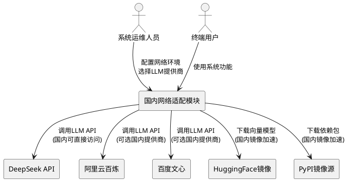
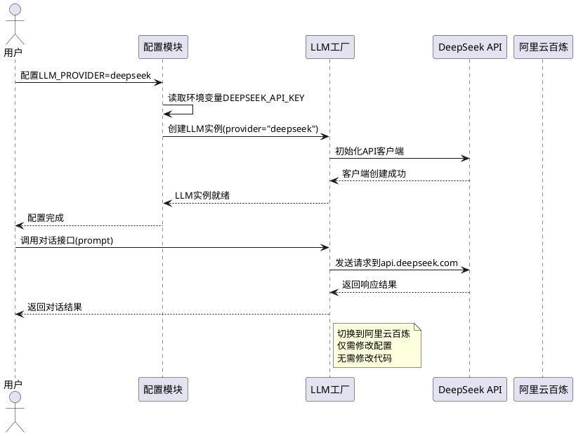
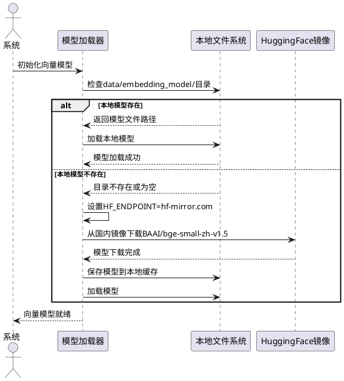
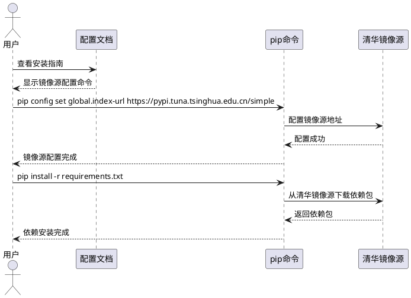
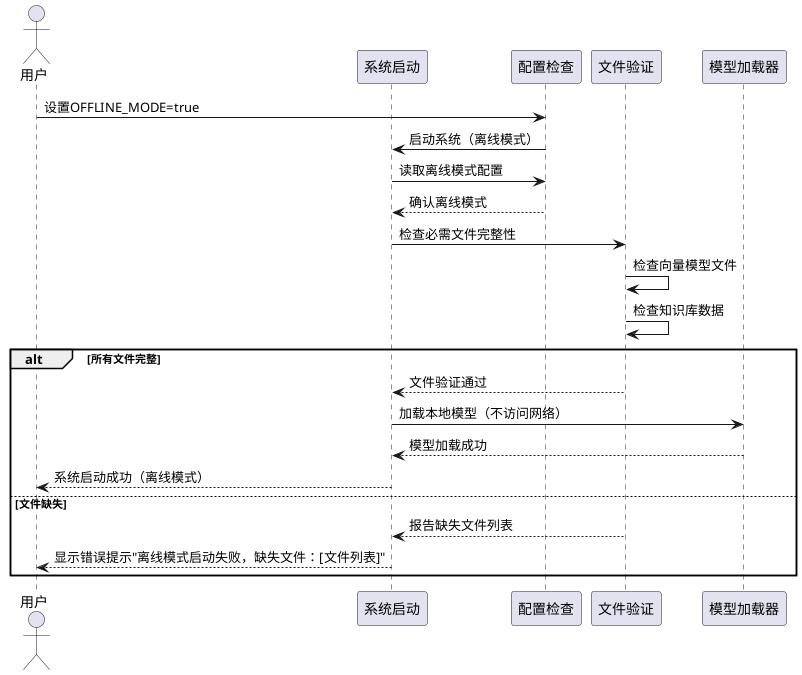
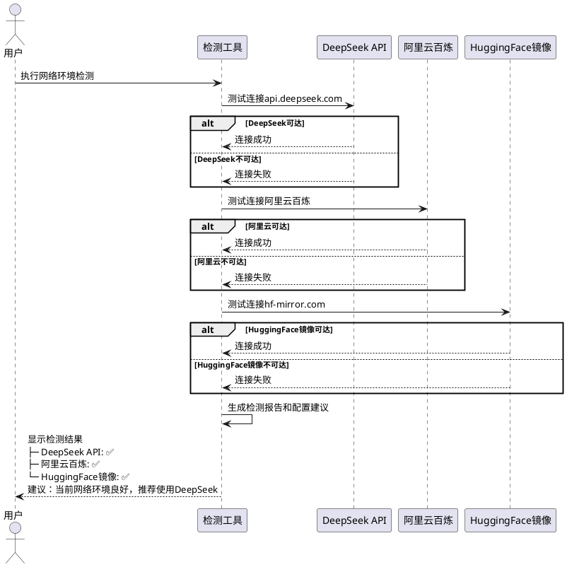

# 国内网络环境适配需求规格

## 1. 组件定位

### 1.1 核心职责

本组件负责适配华为云解决方案智能匹配系统在国内网络环境下的运行能力，实现无需VPN即可正常使用系统全部功能。

### 1.2 核心输入

1. 用户对网络环境的配置指令（国内环境或VPN环境切换）
2. 国内LLM API的认证信息（API Key、访问端点等）
3. 离线模式下的模型文件路径配置
4. 依赖包镜像源配置指令

### 1.3 核心输出

1. 系统在国内网络环境下的正常运行状态
2. 网络连接状态检测结果和诊断信息
3. 模型加载成功的确认信息
4. 配置切换成功或失败的反馈信息

### 1.4 职责边界

本组件不负责以下事项：

1. 不负责具体LLM API的业务逻辑实现（由现有LLM模块负责）
2. 不负责向量数据库的存储和管理（由现有向量数据库模块负责）
3. 不负责解决方案匹配的业务逻辑（由现有匹配服务负责）
4. 不负责用户界面展示（由现有前端模块负责）
5. 不改变系统现有的核心功能逻辑

---

## 2. 领域术语

**国内网络环境**
: 指中国大陆境内的网络环境，无需VPN即可访问国内服务器和网络资源。
: 备注：包括阿里云、腾讯云、百度、华为云等国内服务提供商的网络环境。

**LLM提供商**
: 提供大语言模型API服务的厂商，如OpenAI、DeepSeek、阿里云百炼、百度文心等。

**向量嵌入模型**
: 用于将文本转换为向量表示的机器学习模型，本系统使用sentence-transformers的BAAI/bge-small-zh-v1.5模型。

**离线模式**
: 系统在无网络连接情况下运行的模式，需要预先下载所有必需的模型文件和依赖包。

**镜像源**
: 用于加速依赖包或模型下载的国内服务器地址，如清华镜像、阿里云镜像、HuggingFace镜像等。

**API端点**
: LLM服务的访问地址URL，不同提供商有不同的端点地址。

---

## 3. 角色与边界

### 3.1 核心角色

**系统运维人员**：负责配置系统运行环境、切换网络模式、管理API密钥和镜像源配置。

**系统开发人员**：负责实现国内LLM API的适配代码、配置文件的修改和维护。

**终端用户**：使用系统进行解决方案匹配和竞争分析，期望系统在国内网络环境下稳定运行。

### 3.2 外部系统

**DeepSeek API服务**：国内大语言模型服务提供商，提供对话生成能力，可通过国内网络直接访问。

**阿里云百炼平台**：国内大语言模型服务，提供通义千问等模型API。

**百度文心一言**：国内大语言模型服务，提供ERNIE系列模型API。

**HuggingFace镜像站点**：如hf-mirror.com，提供国内访问的模型下载服务。

**PyPI镜像源**：如清华源、阿里源，提供Python依赖包的国内下载服务。

### 3.3 交互上下文



---

## 4. DFX约束

### 4.1 性能

1. When 用户切换到国内网络环境配置，the 国内网络适配模块 shall 在5秒内完成配置加载和验证。
2. While 使用国内LLM API服务，the 国内网络适配模块 shall 保持API响应时间不超过10秒（单个请求）。
3. When 首次下载向量嵌入模型，the 国内网络适配模块 shall 通过国内镜像源在5分钟内完成模型下载（模型大小约100MB）。

### 4.2 可靠性

1. If 国内LLM API调用失败，the 国内网络适配模块 shall 自动重试最多3次，每次重试间隔2秒。
2. If 所有重试均失败，the 国内网络适配模块 shall 返回明确的错误信息，包括错误原因和建议解决方案。
3. While 系统运行过程中，the 国内网络适配模块 shall 保持与LLM API的连接稳定性不低于99%。

### 4.3 安全性

1. When 用户配置API密钥，the 国内网络适配模块 shall 将密钥存储在环境变量或加密配置文件中，不得明文记录在代码中。
2. The 国内网络适配模块 shall 禁止将API密钥输出到日志文件或控制台输出中。
3. Where 使用离线模式，the 国内网络适配模块 shall 验证本地模型文件的完整性和来源可信性。

### 4.4 可维护性

1. When 网络连接出现异常，the 国内网络适配模块 shall 记录详细的诊断日志，包括网络状态、API端点、响应时间等信息。
2. The 国内网络适配模块 shall 提供网络环境检测功能，可一键检测当前网络环境是否支持系统运行。
3. Where 支持多个LLM提供商，the 国内网络适配模块 shall 通过统一配置文件管理不同提供商的参数，无需修改代码即可切换。

### 4.5 兼容性

1. When 系统适配国内网络环境，the 国内网络适配模块 shall 保持与现有所有功能的完全兼容，不改变业务逻辑和用户界面。
2. Where 用户从VPN环境切换到国内网络环境，the 国内网络适配模块 shall 保持向量数据库和知识库数据的完整性，无需重建。
3. The 国内网络适配模块 shall 支持Python 3.8及以上版本。

---

## 5. 核心能力

### 5.1 LLM服务国内适配

#### 5.1.1 业务规则

1. **多LLM提供商支持规则**：系统必须支持多个国内可访问的LLM提供商，包括DeepSeek、阿里云百炼、百度文心一言等。
   - 验收条件：[用户配置LLM_PROVIDER为deepseek/aliyun/baidu] → [系统使用对应的国内LLM API]

2. **API端点自动配置规则**：系统必须为每个LLM提供商配置正确的国内API端点地址。
   - 验收条件：[用户选择DeepSeek] → [系统自动使用https://api.deepseek.com/v1端点]
   - 验收条件：[用户选择阿里云百炼] → [系统自动使用阿里云百炼API端点]
   - 验收条件：[用户选择百度文心] → [系统自动使用百度文心API端点]

3. **API密钥配置规则**：系统必须支持通过环境变量或配置文件设置各LLM提供商的API密钥。
   - 验收条件：[用户在.env文件中设置DEEPSEEK_API_KEY] → [系统读取并使用该密钥调用DeepSeek API]
   - 验收条件：[用户未配置API密钥] → [系统提示用户配置密钥，并提供配置示例]

4. **统一接口封装规则**：所有LLM提供商必须通过统一的接口调用，屏蔽底层差异。
   - 验收条件：[切换不同LLM提供商] → [业务代码无需修改，仅需修改配置]

5. **禁止项**：系统不得硬编码任何特定LLM提供商的API端点或密钥。
   - 验收条件：[检查代码] → [所有API端点和密钥均从配置文件或环境变量读取]

#### 5.1.2 交互流程



#### 5.1.3 异常场景

1. **API密钥缺失或无效**
   - 触发条件：[用户未配置API密钥或密钥无效]
   - 系统行为：[检测到密钥为空或API返回401错误，记录错误日志]
   - 用户感知：[显示错误提示"API密钥无效，请检查.env文件中的[PROVIDER]_API_KEY配置"]

2. **网络连接超时**
   - 触发条件：[国内网络无法访问API端点，响应超时]
   - 系统行为：[捕获超时异常，自动重试最多3次，记录每次重试的日志]
   - 用户感知：[显示错误提示"网络连接超时，请检查网络设置或切换到其他LLM提供商"]

3. **API配额不足**
   - 触发条件：[LLM API返回配额超限错误]
   - 系统行为：[捕获配额错误，记录详细错误信息]
   - 用户感知：[显示错误提示"API配额已用尽，请充值或切换到其他LLM提供商"]

### 5.2 向量模型国内镜像适配

#### 5.2.1 业务规则

1. **镜像源自动配置规则**：系统必须默认使用国内HuggingFace镜像源下载向量嵌入模型。
   - 验收条件：[首次运行系统] → [自动设置HF_ENDPOINT=https://hf-mirror.com]

2. **本地模型缓存规则**：系统必须支持将下载的向量模型缓存到本地，避免重复下载。
   - 验收条件：[首次下载模型] → [模型保存到data/embedding_model/目录]
   - 验收条件：[再次运行系统且本地模型存在] → [直接加载本地模型，不重新下载]

3. **模型来源优先级规则**：系统必须按优先级顺序查找模型：本地路径 > 国内镜像 > 官方源。
   - 验收条件：[本地存在模型文件] → [优先使用本地模型]
   - 验收条件：[本地不存在模型文件] → [从国内镜像下载]
   - 验收条件：[国内镜像下载失败] → [尝试从官方HuggingFace源下载]

4. **模型下载进度提示规则**：When 下载向量模型时，the 国内网络适配模块 shall 显示下载进度和预计时间。
   - 验收条件：[下载模型] → [控制台输出下载进度信息]

5. **禁止项**：系统不得在每次运行时都重新下载已缓存的模型。
   - 验收条件：[本地模型文件完整] → [跳过下载步骤]

#### 5.2.2 交互流程



#### 5.2.3 异常场景

1. **镜像源访问失败**
   - 触发条件：[国内镜像源hf-mirror.com无法访问]
   - 系统行为：[记录错误日志，提示用户手动下载模型或检查网络]
   - 用户感知：[显示错误提示"模型下载失败，请手动下载模型到data/embedding_model/目录，或检查网络连接"]

2. **本地模型文件损坏**
   - 触发条件：[本地缓存的模型文件不完整或损坏]
   - 系统行为：[检测到加载失败，删除损坏文件，重新从镜像源下载]
   - 用户感知：[显示提示"检测到本地模型文件损坏，正在重新下载..."]

3. **磁盘空间不足**
   - 触发条件：[下载模型时磁盘空间不足（模型约100MB）]
   - 系统行为：[捕获磁盘空间错误，记录日志]
   - 用户感知：[显示错误提示"磁盘空间不足，请释放至少200MB空间后重试"]

### 5.3 依赖包镜像源配置

#### 5.3.1 业务规则

1. **PyPI镜像源配置规则**：系统必须提供国内PyPI镜像源的配置方案，支持清华源、阿里源等。
   - 验收条件：[用户提供镜像源配置文档] → [文档包含清华源、阿里源等配置命令]

2. **依赖安装指导规则**：系统必须提供国内网络环境下的依赖包安装指南。
   - 验收条件：[用户阅读README或安装文档] → [文档包含使用国内镜像源安装依赖的完整步骤]

3. **requirements.txt兼容性规则**：系统的requirements.txt文件必须保持不变，通过外部配置镜像源加速下载。
   - 验收条件：[检查requirements.txt] → [文件内容不包含镜像源地址，仅列出依赖包名称和版本]

4. **禁止项**：系统不得将特定的镜像源地址硬编码到requirements.txt文件中。
   - 验收条件：[检查requirements.txt] → [不包含--index-url或--extra-index-url参数]

#### 5.3.2 交互流程



#### 5.3.3 异常场景

1. **镜像源配置失败**
   - 触发条件：[pip配置命令执行失败]
   - 系统行为：[提供详细的故障排查文档，包括常见错误和解决方案]
   - 用户感知：[显示错误提示和排查文档链接]

2. **依赖包版本冲突**
   - 触发条件：[镜像源中的依赖包版本与requirements.txt不匹配]
   - 系统行为：[记录版本冲突详细信息，建议用户使用官方源或更新requirements.txt]
   - 用户感知：[显示错误提示"依赖包版本冲突，请尝试使用官方源或联系维护者"]

### 5.4 离线模式支持

#### 5.4.1 业务规则

1. **离线模型准备规则**：系统必须支持离线运行模式，前提是预先下载好所有必需的模型文件。
   - 验收条件：[本地存在向量模型文件且配置了离线模式] → [系统启动时不访问网络]

2. **离线模式配置规则**：系统必须提供明确的离线模式配置参数。
   - 验收条件：[用户设置OFFLINE_MODE=true] → [系统跳过所有网络检查和下载]

3. **离线完整性检查规则**：When 启用离线模式时，the 国内网络适配模块 shall 验证所有必需文件的完整性。
   - 验收条件：[离线模式启动] → [检查向量模型文件、知识库数据、配置文件是否完整]
   - 验收条件：[检查发现文件缺失] → [提示用户缺失的文件列表]

4. **LLM API离线替代规则**：Where 启用离线模式，the 国内网络适配模块 shall 支持使用本地LLM模型或缓存响应。
   - 验收条件：[离线模式且无网络] → [系统提供离线LLM方案或拒绝服务并提示]

5. **禁止项**：离线模式下，系统不得尝试访问任何网络资源。
   - 验收条件：[OFFLINE_MODE=true] → [系统不发送任何HTTP请求]

#### 5.4.2 交互流程



#### 5.4.3 异常场景

1. **离线模式下文件缺失**
   - 触发条件：[启用离线模式但本地缺少向量模型文件]
   - 系统行为：[检测到文件缺失，记录错误日志，列出缺失文件清单]
   - 用户感知：[显示错误提示"离线模式启动失败，缺失必需文件：[文件名]。请先在联网环境下下载这些文件。"]

2. **离线模式下尝试调用网络API**
   - 触发条件：[离线模式下代码尝试调用LLM API]
   - 系统行为：[拦截网络请求，返回错误]
   - 用户感知：[显示错误提示"离线模式下无法调用网络API，请禁用离线模式或使用本地LLM模型"]

### 5.5 网络环境检测与诊断

#### 5.5.1 业务规则

1. **网络连通性检测规则**：系统必须提供一键检测当前网络环境的功能。
   - 验收条件：[用户执行网络检测] → [系统测试各API端点、镜像源的连通性]

2. **检测结果输出规则**：网络检测结果必须清晰展示各项网络资源的可访问状态。
   - 验收条件：[执行网络检测] → [输出DeepSeek API、HuggingFace镜像、PyPI镜像的连接状态]

3. **配置建议生成规则**：If 检测到网络问题，the 国内网络适配模块 shall 自动生成配置建议。
   - 验收条件：[检测到DeepSeek API不可达但阿里云百炼可达] → [建议切换到阿里云百炼]
   - 验收条件：[检测到所有国内服务不可达] → [建议检查网络连接或使用VPN]

4. **定期健康检查规则**：While 系统运行过程中，the 国内网络适配模块 shall 定期检查API连接健康状态（可选功能）。
   - 验收条件：[启用健康检查且检测到API异常] → [记录警告日志并提示用户]

5. **禁止项**：网络检测功能不得影响系统的正常业务运行。
   - 验收条件：[网络检测失败] → [不影响已有的模型和数据，仅记录日志和提示]

#### 5.5.2 交互流程



#### 5.5.3 异常场景

1. **所有网络资源不可达**
   - 触发条件：[检测到所有API端点和镜像源均无法访问]
   - 系统行为：[记录详细的网络诊断信息，包括DNS解析、连接超时等]
   - 用户感知：[显示错误提示"当前网络环境无法访问必需资源，请检查网络连接或使用VPN，或启用离线模式"]

2. **检测超时**
   - 触发条件：[网络检测过程耗时超过30秒]
   - 系统行为：[终止检测，返回已获取的结果]
   - 用户感知：[显示警告"网络检测超时，部分资源可能不可达，已获取的结果：[部分结果]"]

---

## 6. 数据约束

### 6.1 LLM提供商配置

1. **provider**：LLM提供商名称，取值范围为["deepseek", "aliyun", "baidu", "openai"]，必填。
2. **api_key**：API密钥，字符串类型，长度大于0，必填。
3. **base_url**：API端点URL，字符串类型，必须为有效的URL格式，必填。
4. **model_name**：模型名称，字符串类型，长度大于0，必填。
5. **temperature**：温度参数，浮点数类型，取值范围为[0.0, 2.0]，可选，默认0.1。

### 6.2 向量模型配置

1. **model_name**：向量模型名称，字符串类型，默认值为"BAAI/bge-small-zh-v1.5"，必填。
2. **local_path**：本地模型存储路径，字符串类型，默认值为"./data/embedding_model"，必填。
3. **mirror_url**：HuggingFace镜像源URL，字符串类型，默认值为"https://hf-mirror.com"，必填。
4. **embedding_dimension**：向量维度，整数类型，默认值为512（bge-small-zh-v1.5的维度），只读。

### 6.3 网络配置

1. **offline_mode**：离线模式开关，布尔类型，默认值为false，必填。
2. **request_timeout**：API请求超时时间（秒），整数类型，取值范围为[5, 120]，默认值为30，可选。
3. **max_retries**：API请求最大重试次数，整数类型，取值范围为[0, 10]，默认值为3，可选。
4. **retry_interval**：重试间隔时间（秒），整数类型，取值范围为[1, 10]，默认值为2，可选。

### 6.4 镜像源配置

1. **pypi_mirror**：PyPI镜像源URL，字符串类型，可选值包括["https://pypi.tuna.tsinghua.edu.cn/simple", "https://mirrors.aliyun.com/pypi/simple"]，可选。
2. **huggingface_mirror**：HuggingFace镜像源URL，字符串类型，默认值为"https://hf-mirror.com"，必填。

---

## 7. 验收标准

### 7.1 国内网络环境运行验收

1. When 用户在国内网络环境下启动系统（不使用VPN），the 国内网络适配模块 shall 在60秒内完成系统初始化（包括LLM API连接、向量模型加载）。
   - 测试方法：在无VPN的国内网络环境下运行系统，记录启动时间。

2. When 用户在国内网络环境下执行解决方案匹配功能，the 国内网络适配模块 shall 返回正确的匹配结果。
   - 测试方法：输入客户需求描述，验证返回结果包含匹配的华为云解决方案。

3. When 用户在国内网络环境下执行竞争对手分析功能，the 国内网络适配模块 shall 返回正确的分析报告。
   - 测试方法：选择竞争对手和行业，验证返回结果包含差异化和销售话术。

### 7.2 LLM提供商切换验收

1. When 用户从DeepSeek切换到阿里云百炼（修改配置），the 国内网络适配模块 shall 无需修改代码即可使用阿里云百炼API。
   - 测试方法：修改.env文件中的LLM_PROVIDER，重启系统，验证使用阿里云百炼API。

2. When 用户切换LLM提供商，the 国内网络适配模块 shall 保持向量数据库和知识库数据不变。
   - 测试方法：切换前后查询向量数据库，验证数据完整性。

### 7.3 向量模型国内镜像验收

1. When 用户首次运行系统且本地无向量模型，the 国内网络适配模块 shall 从HuggingFace国内镜像下载模型。
   - 测试方法：删除本地模型目录，运行系统，验证模型从hf-mirror.com下载。

2. When 用户再次运行系统且本地已存在向量模型，the 国内网络适配模块 shall 直接加载本地模型，不重新下载。
   - 测试方法：运行系统，检查控制台输出，验证未重新下载模型。

### 7.4 离线模式验收

1. When 用户启用离线模式且本地文件完整，the 国内网络适配模块 shall 在无网络连接的情况下成功启动系统。
   - 测试方法：断开网络连接，设置OFFLINE_MODE=true，验证系统启动成功。

2. If 启用离线模式但本地文件缺失，the 国内网络适配模块 shall 提示用户缺失的文件清单，不尝试访问网络。
   - 测试方法：删除部分本地文件，启用离线模式，验证错误提示包含缺失文件列表。

### 7.5 网络检测验收

1. When 用户执行网络环境检测，the 国内网络适配模块 shall 在30秒内返回所有检测项的结果。
   - 测试方法：运行网络检测命令，记录检测时间。

2. When 检测到网络问题，the 国内网络适配模块 shall 提供明确的配置建议。
   - 测试方法：模拟网络故障，验证系统提供的建议包含具体的解决方案。

### 7.6 兼容性验收

1. When 系统适配国内网络环境后，the 国内网络适配模块 shall 保持所有现有功能正常运行，无功能缺失。
   - 测试方法：执行所有功能测试用例，验证功能完整性。

2. Where 系统从VPN环境切换到国内网络环境，the 国内网络适配模块 shall 保持用户数据、知识库数据、向量数据库数据的完整性。
   - 测试方法：切换前后对比数据，验证数据一致性。

---

## 8. 附录：配置示例

### 8.1 DeepSeek配置示例

```env
# .env文件
LLM_PROVIDER=deepseek
DEEPSEEK_API_KEY=your_deepseek_api_key_here
DEEPSEEK_MODEL_NAME=deepseek-chat
DEEPSEEK_BASE_URL=https://api.deepseek.com/v1
DEEPSEEK_TEMPERATURE=0.1
```

### 8.2 阿里云百炼配置示例

```env
# .env文件
LLM_PROVIDER=aliyun
ALIYUN_API_KEY=your_aliyun_api_key_here
ALIYUN_MODEL_NAME=qwen-turbo
ALIYUN_BASE_URL=https://dashscope.aliyuncs.com/api/v1
ALIYUN_TEMPERATURE=0.1
```

### 8.3 向量模型国内镜像配置

```python
# 在app/models/llm.py中已自动配置
import os
os.environ['HF_ENDPOINT'] = 'https://hf-mirror.com'
```

### 8.4 PyPI镜像源配置

```bash
# 清华镜像源
pip config set global.index-url https://pypi.tuna.tsinghua.edu.cn/simple

# 阿里云镜像源
pip config set global.index-url https://mirrors.aliyun.com/pypi/simple

# 安装依赖
pip install -r requirements.txt
```

### 8.5 离线模式配置

```env
# .env文件
OFFLINE_MODE=true
VECTOR_MODEL_LOCAL_PATH=./data/embedding_model
```
