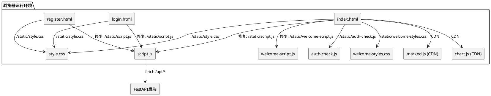
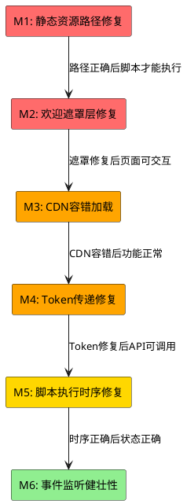

# **1. 实现模型**

## **1.1 上下文视图**

本设计文档针对"登录后前端页面所有交互失效"问题，覆盖7个核心bug的修复方案。修复范围仅涉及前端静态文件（HTML/CSS/JS），不涉及后端API业务逻辑变更。



## **1.2 服务/组件总体架构**

修复涉及以下6个修复模块，按优先级从高到低排列：

| 修复模块 | 优先级 | 涉及文件 | 影响范围 |
|---------|--------|---------|---------|
| M1: 静态资源路径修复 | P0-阻断 | index.html, login.html, register.html | 脚本无法加载导致全部功能失效 |
| M2: 欢迎遮罩层z-index修复 | P0-阻断 | welcome-styles.css, welcome-script.js | 遮罩覆盖导致所有交互失效 |
| M3: CDN资源容错加载 | P1-严重 | index.html, script.js | CDN失败阻塞后续脚本执行 |
| M4: API请求Token传递修复 | P1-严重 | script.js | 已登录用户API调用401 |
| M5: 脚本执行时序修复 | P2-重要 | auth-check.js, index.html | 登录后用户状态不正确 |
| M6: 事件监听健壮性加固 | P3-一般 | script.js, welcome-script.js | 极端场景下事件丢失 |



## **1.3 实现设计文档**

### **M1: 静态资源路径修复**

#### **Bug根因分析**

当前 `index.html` 中 script.js 和 welcome-script.js 的引用路径为**相对路径**：

```html
<!-- 当前代码（第387-388行）-->
<script src="script.js"></script>
<script src="welcome-script.js"></script>
```

而 CSS 和 auth-check.js 使用了正确的 `/static/` 绝对路径：

```html
<link rel="stylesheet" href="/static/style.css">
<link rel="stylesheet" href="/static/welcome-styles.css">
<script src="/static/auth-check.js"></script>
```

FastAPI后端将 `frontend/` 目录挂载为静态文件服务，CSS通过 `/static/style.css` 可访问，但JS使用相对路径 `script.js` 在浏览器中解析为 `http://localhost:8000/script.js`，而后端只有 `/static/script.js` 路由，导致404。

同理，`login.html`（第324行）和 `register.html`（第317行）中的 `script.js` 也使用了 `/static/script.js`，看似正确，但在这些页面中 script.js 的 `init()` 函数会尝试初始化 `particle-canvas` 等仅 index.html 存在的元素，可能导致非预期行为。

#### **修复方案**

**修改文件：** `frontend/index.html`

将第387-388行的相对路径修改为 `/static/` 绝对路径：

```html
<!-- 修复后 -->
<script src="/static/script.js"></script>
<script src="/static/welcome-script.js"></script>
```

**修改文件：** `frontend/login.html`、`frontend/register.html`

login.html 第324行和 register.html 第317行路径 `/static/script.js` 本身正确，但 script.js 中的 `init()` 函数会在 DOMContentLoaded 时执行，尝试获取 `#particle-canvas`、`#match-btn` 等仅存在于 index.html 的元素。需确保 login/register 页面加载 script.js 不会因找不到元素而报错。

当前 script.js 中 `init()` 已使用 `if (canvas)` 可选链保护，`initEventListeners` 中使用 `?.addEventListener` 保护，因此 login/register 页面加载 script.js 不会报错，但会**无意义地初始化粒子系统和事件监听**。

**决策：** login.html 和 register.html 中**移除** `<script src="/static/script.js"></script>` 的引用。这两个页面不需要主页面的交互逻辑，粒子背景已通过内联CSS实现。login/register 的登录和注册逻辑已由各自页面的内联script处理。

---

### **M2: 欢迎遮罩层z-index修复**

#### **Bug根因分析**

`welcome-styles.css` 中定义欢迎页的 z-index 为 9999：

```css
.welcome-page {
    position: fixed;
    z-index: 9999;
    /* ... */
}
```

当欢迎页隐藏时，CSS规则 `.welcome-page.hidden { display: none; }` 可正确隐藏。但 `welcome-script.js` 中 `hide()` 方法同时设置了 `classList.add('hidden')` 和 `style.display = 'none'`，这部分逻辑正确。

**核心问题在于：** 即使欢迎页设为 `display: none`，若 `welcome-script.js` 加载失败（因M1路径问题），则 `bindEvents()` 永远不执行，"立即体验"和"跳过引导"按钮的事件监听器未绑定，用户**无法关闭欢迎页**，z-index:9999 的遮罩层永远覆盖整个页面。

同时，`WelcomeManager.init()` 在 `DOMContentLoaded` 中调用，若脚本路径错误导致 welcome-script.js 未加载，则 `WelcomeManager` 对象不存在，欢迎页DOM虽然渲染但按钮无响应。

#### **修复方案**

**修改文件：** `frontend/welcome-styles.css`

为 `.welcome-page.hidden` 添加 `pointer-events: none` 和 `z-index: -1` 作为双重保护，确保即使JS执行异常，隐藏的欢迎页也不会拦截底层交互：

```css
.welcome-page.hidden {
    display: none;
    pointer-events: none;
    z-index: -1;
}
```

**修改文件：** `frontend/welcome-script.js`

在 `WelcomeManager.hide()` 方法中增加 `pointer-events` 重置，确保底层事件传播恢复：

```javascript
hide() {
    if (this.welcomePage) {
        this.welcomePage.classList.add('hidden');
        this.welcomePage.style.display = 'none';
        this.welcomePage.style.pointerEvents = 'none';
        this.welcomePage.style.zIndex = '-1';
    }
}
```

在 `WelcomeManager.show()` 方法中恢复 pointer-events：

```javascript
show() {
    if (this.welcomePage) {
        this.welcomePage.classList.remove('hidden');
        this.welcomePage.style.display = 'flex';
        this.welcomePage.style.pointerEvents = 'auto';
        this.welcomePage.style.zIndex = '9999';
        this.startAnimations();
        this.initParticleCanvas();
    }
}
```

**修改文件：** `frontend/welcome-script.js`

增加**容错机制**：若 `bindEvents()` 中按钮元素不存在，记录错误但不阻塞：

```javascript
bindEvents() {
    const startBtn = document.getElementById('start-experience-btn');
    const skipBtn = document.getElementById('skip-welcome-btn');
    const skipCheckbox = document.getElementById('skip-permanently-checkbox');
    
    if (!startBtn || !skipBtn) {
        console.error('[WelcomeManager] 欢迎页按钮未找到，跳过事件绑定');
        // 自动隐藏欢迎页，避免永久遮挡
        this.hide();
        return;
    }
    
    startBtn.addEventListener('click', () => {
        if (skipCheckbox?.checked) {
            WelcomeState.setSeen();
        }
        this.hide();
        DemoManager.showSelector();
    });
    
    skipBtn.addEventListener('click', () => {
        if (skipCheckbox?.checked) {
            WelcomeState.setSeen();
        }
        this.hide();
    });
}
```

---

### **M3: CDN资源容错加载**

#### **Bug根因分析**

`index.html` 第385-386行通过CDN加载 marked.js 和 chart.js：

```html
<script src="https://cdn.jsdelivr.net/npm/marked/marked.min.js"></script>
<script src="https://cdn.jsdelivr.net/npm/chart.js@4.4.0/dist/chart.umd.min.js"></script>
```

问题：
1. CDN资源在**内网或网络受限环境**下无法加载，浏览器会等待超时（通常30-120秒），**阻塞后续 script.js 和 welcome-script.js 的加载**
2. 即使CDN加载失败，`<script>` 标签不会触发 `onerror` 后继续加载后续脚本——浏览器会等待响应或超时
3. `script.js` 中 `UI.renderMarkdown()` 已有降级方案（检查 `typeof marked !== 'undefined'`），但 `KnowledgeUI.renderChart()` 中直接使用 `new Chart()` 无降级保护

#### **修复方案**

**修改文件：** `frontend/index.html`

为CDN脚本添加 `onerror` 回调和 `async` 属性，使用**非阻塞加载策略**：

```html
<!-- CDN资源：添加onerror降级和async -->
<script src="https://cdn.jsdelivr.net/npm/marked/marked.min.js" 
        onerror="console.warn('[CDN] marked.js加载失败，将使用纯文本降级')"></script>
<script src="https://cdn.jsdelivr.net/npm/chart.js@4.4.0/dist/chart.umd.min.js" 
        onerror="console.warn('[CDN] chart.js加载失败，图表功能不可用');window.__chartLoadFailed=true"></script>
<script src="/static/script.js"></script>
<script src="/static/welcome-script.js"></script>
```

**修改文件：** `frontend/script.js`

在 `KnowledgeUI.renderChart()` 中增加 Chart.js 可用性检查和降级：

```javascript
renderChart(industryCounts) {
    const canvas = document.getElementById('industry-chart');
    if (!canvas) return;
    
    // Chart.js 降级检查
    if (typeof Chart === 'undefined' || window.__chartLoadFailed) {
        console.warn('[KnowledgeUI] Chart.js不可用，使用纯文本展示行业分布');
        this.renderChartFallback(canvas, industryCounts);
        return;
    }
    
    // ... 原有 Chart 渲染逻辑
}

renderChartFallback(canvas, industryCounts) {
    // 将canvas替换为纯文本列表
    const container = canvas.parentElement;
    const labels = Object.keys(industryCounts);
    const data = Object.values(industryCounts);
    
    container.innerHTML = labels.map((label, i) => 
        `<div style="display:flex;justify-content:space-between;padding:8px 0;border-bottom:1px solid #eee;">
            <span>${label}</span>
            <strong>${data[i]}</strong>
        </div>`
    ).join('');
}
```

---

### **M4: API请求Token传递修复**

#### **Bug根因分析**

`script.js` 中 `API` 对象的所有 fetch 请求均**未携带 Authorization 头**：

```javascript
async match(demand) {
    const response = await fetch(`${Config.API_BASE_URL}/match`, {
        method: 'POST',
        headers: { 'Content-Type': 'application/json' },  // 缺少Authorization
        body: JSON.stringify({ demand })
    });
    // ...
}
```

登录成功后 Token 存储在 `localStorage.getItem('access_token')`，但 API 请求从未读取和使用该 Token。后端对需要认证的接口返回 401，前端未处理 401 跳转登录页的逻辑。

#### **修复方案**

**修改文件：** `frontend/script.js`

1. 在 `API` 对象中增加统一的请求头构建方法：

```javascript
const API = {
    _getHeaders() {
        const headers = { 'Content-Type': 'application/json' };
        const token = localStorage.getItem('access_token');
        if (token) {
            headers['Authorization'] = `Bearer ${token}`;
        }
        return headers;
    },
    
    _handleResponse(response) {
        if (response.status === 401) {
            // Token过期或无效，清除登录状态并跳转
            localStorage.removeItem('access_token');
            localStorage.removeItem('user_info');
            UI.showToast('登录已过期，请重新登录', 'warning');
            setTimeout(() => {
                window.location.href = window.location.origin + '/login.html';
            }, 1500);
            throw new Error('未授权，请重新登录');
        }
        if (!response.ok) {
            throw new Error(`请求失败: ${response.statusText}`);
        }
        return response.json();
    },
    
    async match(demand) {
        const response = await fetch(`${Config.API_BASE_URL}/match`, {
            method: 'POST',
            headers: this._getHeaders(),
            body: JSON.stringify({ demand })
        });
        return this._handleResponse(response);
    },
    
    async analyze(competitor, industry) {
        const response = await fetch(`${Config.API_BASE_URL}/analyze`, {
            method: 'POST',
            headers: this._getHeaders(),
            body: JSON.stringify({ competitor, industry })
        });
        return this._handleResponse(response);
    },
    
    async getKnowledgeStats() {
        const response = await fetch(`${Config.API_BASE_URL}/knowledge/stats`, {
            headers: this._getHeaders()
        });
        return this._handleResponse(response);
    },
    
    async rebuildKnowledge() {
        const response = await fetch(`${Config.API_BASE_URL}/knowledge/rebuild`, {
            method: 'POST',
            headers: this._getHeaders()
        });
        return this._handleResponse(response);
    },
    
    async clearKnowledge() {
        const response = await fetch(`${Config.API_BASE_URL}/knowledge/clear`, {
            method: 'POST',
            headers: this._getHeaders()
        });
        return this._handleResponse(response);
    },
    
    async exportReport(reportType, content, format = 'word', metadata = {}) {
        const response = await fetch(`${Config.API_BASE_URL}/export/report`, {
            method: 'POST',
            headers: this._getHeaders(),
            body: JSON.stringify({
                report_type: reportType,
                format: format,
                content: content,
                metadata: metadata
            })
        });
        return this._handleResponse(response);
    },
    
    async downloadExportFile(taskId) {
        const token = localStorage.getItem('access_token');
        const url = `${Config.API_BASE_URL}/export/download/${taskId}`;
        // 对于文件下载，需要通过隐藏链接+token方式
        const link = document.createElement('a');
        link.href = url + (token ? `?token=${token}` : '');
        link.target = '_blank';
        document.body.appendChild(link);
        link.click();
        document.body.removeChild(link);
    }
};
```

2. 在 `API._handleResponse` 中统一处理 401 状态码，自动跳转登录页。

---

### **M5: 脚本执行时序修复**

#### **Bug根因分析**

`index.html` 中 `auth-check.js` 在 `<body>` 顶部加载（第12行），早于DOM元素渲染：

```html
<body>
    <script src="/static/auth-check.js"></script>  <!-- 此时#user-info等DOM元素尚未渲染 -->
    <canvas id="particle-canvas"></canvas>
    <!-- ... -->
</body>
```

`auth-check.js` 内部使用 `document.addEventListener('DOMContentLoaded', ...)` 来延迟初始化，这本身是正确的。但问题在于：

1. auth-check.js 在 `<head>` 后紧接 `<body>` 位置加载，早于 `</body>` 前的 script.js 和 welcome-script.js
2. 三个脚本都监听 `DOMContentLoaded`，浏览器按**注册顺序**触发回调
3. 当前顺序：auth-check.js DOMContentLoaded → script.js DOMContentLoaded → welcome-script.js DOMContentLoaded

这个顺序是合理的（先检查认证状态，再初始化主功能，最后初始化欢迎页）。但存在一个**竞态问题**：若 auth-check.js 的 DOMContentLoaded 回调中 `AuthUI.init()` 执行时间过长，会延迟后续脚本的事件绑定。

#### **修复方案**

**修改文件：** `frontend/auth-check.js`

将 `auth-check.js` 的加载位置从 `<body>` 顶部移到 `</body>` 前其他脚本之前，确保DOM完全就绪后执行：

**修改文件：** `frontend/index.html`

```html
<body>
    <canvas id="particle-canvas"></canvas>
    <!-- ... 所有DOM内容 ... -->
    
    <!-- 脚本统一在</body>前加载，确保DOM完全就绪 -->
    <script src="https://cdn.jsdelivr.net/npm/marked/marked.min.js" 
            onerror="console.warn('[CDN] marked.js加载失败')"></script>
    <script src="https://cdn.jsdelivr.net/npm/chart.js@4.4.0/dist/chart.umd.min.js" 
            onerror="console.warn('[CDN] chart.js加载失败');window.__chartLoadFailed=true"></script>
    <script src="/static/auth-check.js"></script>
    <script src="/static/script.js"></script>
    <script src="/static/welcome-script.js"></script>
</body>
```

脚本加载顺序变为：CDN资源 → auth-check.js → script.js → welcome-script.js，所有 DOMContentLoaded 回调按此顺序触发。

---

### **M6: 事件监听健壮性加固**

#### **Bug根因分析**

`script.js` 中 `initEventListeners()` 虽然使用了可选链 `?.addEventListener`，但以下场景仍有风险：

1. `document.getElementById('demand-input')` 返回 null 时，后续的 `demandInput.value.trim()` 会抛出 TypeError
2. `clearKbBtn` 等元素的确认对话框操作未做空值保护
3. `KnowledgeUI.loadStats()` 在 `init()` 中无条件调用，若后端不可用，console.error 虽已打印但页面可能显示异常

#### **修复方案**

**修改文件：** `frontend/script.js`

1. 为 `match-btn` 的点击回调增加 demandInput 空值检查：

```javascript
matchBtn?.addEventListener('click', async () => {
    if (!demandInput) {
        UI.showToast('页面元素加载异常，请刷新重试', 'error');
        return;
    }
    const demand = demandInput.value.trim();
    // ... 后续逻辑
});
```

2. 为 `clear-solution-btn` 的点击回调增加元素存在性检查：

```javascript
document.getElementById('clear-solution-btn')?.addEventListener('click', () => {
    if (demandInput) demandInput.value = '';
    if (charCount) charCount.textContent = '0';
    const resultEl = document.getElementById('solution-result');
    if (resultEl) resultEl.style.display = 'none';
    State.resultCache.solution = null;
});
```

3. 为 `KnowledgeUI.loadStats()` 增加超时和友好提示：

```javascript
async loadStats() {
    try {
        const stats = await API.getKnowledgeStats();
        State.knowledgeStats = stats;
        // ... 渲染逻辑
    } catch (error) {
        console.error('加载统计失败:', error);
        // 设置默认值而非让页面显示"--"
        document.getElementById('nav-doc-count').textContent = '0';
        document.getElementById('nav-industry-count').textContent = '0';
        document.getElementById('nav-accuracy').textContent = '--%';
        document.getElementById('kb-total-docs').textContent = '0';
        document.getElementById('kb-total-industries').textContent = '0';
        document.getElementById('kb-accuracy').textContent = '--%';
        UI.showToast('加载统计数据失败，请检查后端服务', 'warning');
    }
}
```

---

# **2. 接口设计**

## **2.1 总体设计**

本次修复不新增API接口，仅修改前端内部模块间的调用关系和数据流。

## **2.2 接口清单**

### **2.2.1 内部接口：API._getHeaders()**

| 属性 | 值 |
|------|-----|
| 功能 | 构建统一请求头，自动附加Authorization |
| 输入 | 无（从localStorage读取token） |
| 输出 | `Record<string, string>` 类型请求头对象 |
| 副作用 | 无 |

```
_getHeaders() → {
    'Content-Type': 'application/json',
    'Authorization': 'Bearer {token}'  // 仅当token存在时
}
```

### **2.2.2 内部接口：API._handleResponse(response)**

| 属性 | 值 |
|------|-----|
| 功能 | 统一处理API响应，处理401跳转 |
| 输入 | `Response` 对象 |
| 输出 | 解析后的JSON数据 |
| 副作用 | 401时清除localStorage并跳转login.html |

```
_handleResponse(response) →
    if 401: 清除token → toast提示 → 1.5s后跳转login.html → throw Error
    if !ok: throw Error(response.statusText)
    else: return response.json()
```

### **2.2.3 内部接口：KnowledgeUI.renderChartFallback(canvas, industryCounts)**

| 属性 | 值 |
|------|-----|
| 功能 | Chart.js不可用时的图表降级渲染 |
| 输入 | canvas父容器元素, 行业计数对象 |
| 输出 | 无（直接操作DOM） |
| 副作用 | 替换canvas元素为纯文本列表 |

### **2.2.4 内部接口：WelcomeManager.hide()（增强）**

| 属性 | 值 |
|------|-----|
| 功能 | 隐藏欢迎页并确保底层交互恢复 |
| 输入 | 无 |
| 输出 | 无 |
| 副作用 | 设置display:none、pointer-events:none、z-index:-1 |

### **2.2.5 内部接口：WelcomeManager.show()（增强）**

| 属性 | 值 |
|------|-----|
| 功能 | 显示欢迎页并恢复遮罩层交互属性 |
| 输入 | 无 |
| 输出 | 无 |
| 副作用 | 设置display:flex、pointer-events:auto、z-index:9999 |

---

# **4. 数据模型**

## **4.1 设计目标**

本次修复不新增持久化数据模型，仅涉及以下前端运行时数据的规范和修复：

1. **API请求头数据**：确保每次请求正确携带Authorization头
2. **欢迎页状态数据**：确保hide/show操作完整重置所有遮挡属性
3. **CDN降级标记**：新增 `window.__chartLoadFailed` 全局标记

## **4.2 模型实现**

### **4.2.1 API请求头数据模型**

```typescript
interface APIHeaders {
    'Content-Type': 'application/json';
    'Authorization'?: `Bearer ${string}`;  // 可选，仅当localStorage中存在access_token时
}
```

构建逻辑：
1. 初始化基础头 `{'Content-Type': 'application/json'}`
2. 读取 `localStorage.getItem('access_token')`
3. 若token非空且非null，追加 `Authorization: Bearer {token}`

### **4.2.2 欢迎页状态数据模型**

```typescript
interface WelcomePageState {
    display: 'flex' | 'none';       // CSS display属性
    pointerEvents: 'auto' | 'none'; // CSS pointer-events属性
    zIndex: '9999' | '-1';          // CSS z-index属性
    hiddenClass: boolean;           // .hidden类是否存在
}
```

状态转换规则：

| 操作 | display | pointerEvents | zIndex | hiddenClass |
|------|---------|---------------|--------|-------------|
| show() | 'flex' | 'auto' | '9999' | false |
| hide() | 'none' | 'none' | '-1' | true |

### **4.2.3 CDN降级标记模型**

```typescript
// 全局标记：Chart.js CDN加载是否失败
declare global {
    interface Window {
        __chartLoadFailed?: boolean;
    }
}
```

使用逻辑：
- CDN script标签 `onerror` 回调设置 `window.__chartLoadFailed = true`
- `KnowledgeUI.renderChart()` 检查 `typeof Chart === 'undefined' || window.__chartLoadFailed`
- 若为true，调用 `renderChartFallback()` 降级渲染

---

# **5. 修复实施顺序与验证**

## **5.1 实施顺序**

严格按照依赖关系从P0到P3依次修复：

| 步骤 | 修复模块 | 修改文件 | 验证方法 |
|------|---------|---------|---------|
| 1 | M1: 静态资源路径 | index.html, login.html, register.html | 浏览器F12 Network面板确认所有JS/CSS返回200 |
| 2 | M2: 欢迎遮罩层 | welcome-styles.css, welcome-script.js | 登录后点击"跳过引导"，确认底层按钮可点击 |
| 3 | M3: CDN容错加载 | index.html, script.js | 断网/屏蔽CDN后刷新，确认页面可交互、Markdown纯文本显示 |
| 4 | M4: Token传递 | script.js | 登录后点"开始匹配"，F12 Network确认请求携带Authorization头 |
| 5 | M5: 脚本执行时序 | index.html, auth-check.js | 登录后刷新，确认导航栏显示用户名而非"登录"按钮 |
| 6 | M6: 事件监听健壮性 | script.js | 后端停止后刷新页面，确认不报JS错误、显示友好提示 |

## **5.2 验收测试用例**

### **TC-01: 静态资源加载验证**
1. 打开 `http://localhost:8000`
2. F12 → Network面板
3. 确认 `/static/style.css`、`/static/welcome-styles.css`、`/static/auth-check.js`、`/static/script.js`、`/static/welcome-script.js` 均返回200
4. 确认无404请求

### **TC-02: 欢迎页关闭后交互恢复**
1. 打开 `http://localhost:8000`
2. 等待欢迎引导页显示
3. 点击"跳过引导"
4. 确认欢迎页消失
5. 点击导航栏"竞争分析"菜单项
6. 确认页面切换到竞争分析页面
7. 点击"开始分析"按钮
8. 确认按钮显示loading状态

### **TC-03: CDN不可用时降级**
1. 使用浏览器DevTools屏蔽CDN域名 `cdn.jsdelivr.net`
2. 刷新页面
3. 确认页面正常加载（无长时间白屏）
4. 输入需求点击"开始匹配"
5. 确认匹配结果以纯文本/换行方式显示（非Markdown渲染）
6. 切换到知识库页面
7. 确认行业分布以纯文本列表展示（非图表）

### **TC-04: 已登录用户API携带Token**
1. 登录成功后跳转到首页
2. F12 → Network面板
3. 点击"开始匹配"
4. 查看匹配请求的Request Headers
5. 确认包含 `Authorization: Bearer {jwt_token}`

### **TC-05: 401自动跳转登录页**
1. 登录后手动修改localStorage中的access_token为无效值
2. 点击"开始匹配"
3. 确认显示Toast"登录已过期，请重新登录"
4. 确认1.5秒后自动跳转到login.html

### **TC-06: 登录后用户状态正确**
1. 完成登录操作
2. 确认导航栏右侧显示用户名和"退出"按钮
3. 确认"登录"链接不可见
4. 点击"退出"
5. 确认导航栏切换为显示"登录"按钮

### **TC-07: login/register页面不受主页脚本影响**
1. 打开 `http://localhost:8000/login.html`
2. 确认F12 Console无script.js相关错误
3. 确认验证码图片正常加载
4. 确认输入框可聚焦、登录按钮可点击
