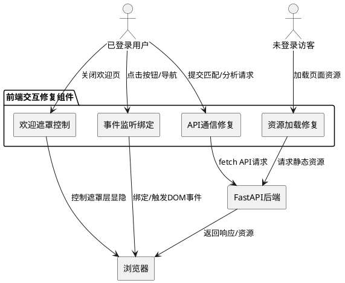
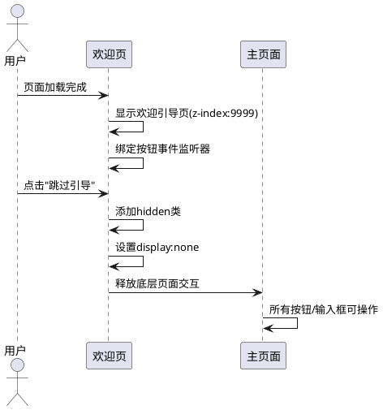
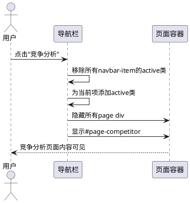
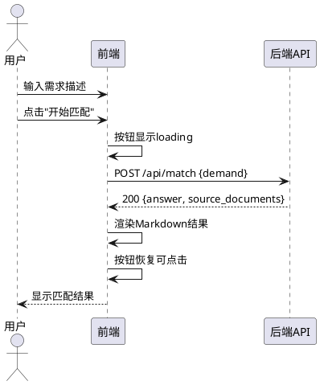
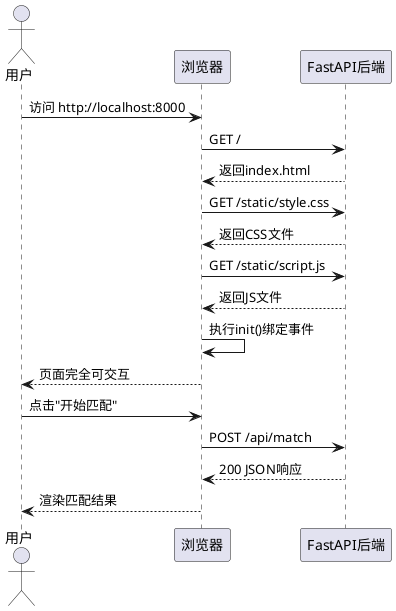
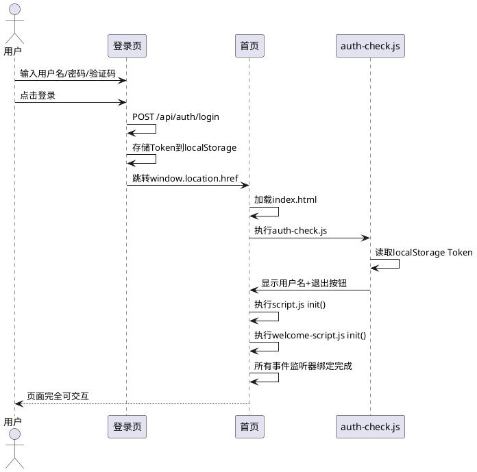
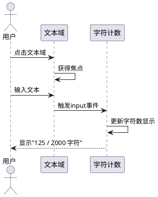

# **1. 组件定位**

## **1.1 核心职责**

本组件负责修复登录后前端页面所有交互失效的bug，确保登录成功后页面所有按钮、链接、导航、输入框等可正常操作，前端与后端API通信正常。

## **1.2 核心输入**

1. **登录成功事件**：来自认证组件的登录成功信号，携带JWT Token和用户信息
2. **页面导航操作**：用户点击导航栏菜单项（解决方案匹配、竞争分析、知识库）的点击事件
3. **按钮点击操作**：用户对"开始匹配""开始分析""重建知识库""清空""下载"等所有功能按钮的点击事件
4. **表单输入操作**：用户在文本域、选择框、输入框中的输入事件
5. **API请求与响应**：前端向后端 `/api/match`、`/api/analyze`、`/api/knowledge/stats` 等端点发送的请求及响应

## **1.3 核心输出**

1. **页面正常交互响应**：所有可点击元素被点击后产生对应的页面切换、数据提交、结果展示等行为
2. **API调用结果**：前端成功调用后端API并正确渲染返回数据
3. **用户状态正确展示**：登录后导航栏正确显示用户名和退出按钮，隐藏登录链接
4. **页面内容可操作**：欢迎引导页关闭后，主内容区域完全可交互，无遮挡或冻结

## **1.4 职责边界**

1. 本组件不负责登录认证逻辑本身（由login-system组件负责）
2. 本组件不负责后端API业务逻辑的正确性（如匹配算法、分析算法）
3. 本组件不负责新增功能开发，仅修复已有功能的交互bug
4. 本组件不负责样式美化或视觉改进

# **2. 领域术语**

**交互冻结**
: 登录后页面所有可操作元素无法响应点击、输入等用户操作的异常状态。表现为按钮点击无反应、导航无法切换、输入框无法聚焦等。

**欢迎遮罩层**
: 首次访问时显示的全屏欢迎引导页（`#welcome-page`），z-index为9999，覆盖在主内容之上。当该层未正确关闭时，会阻挡所有底层交互。

**事件监听器绑定**
: JavaScript中通过`addEventListener`将用户交互事件（click、input、submit等）与处理函数关联的过程。若绑定时机或目标元素不正确，则交互无效。

**DOMContentLoaded时机**
: 浏览器HTML文档完全加载和解析完成时触发的事件，是前端初始化事件监听器的标准时机。若脚本加载顺序或执行时机错误，可能导致事件监听器未绑定。

**页面路由切换**
: 通过显示/隐藏不同的页面div（`#page-solution`、`#page-competitor`、`#page-knowledge`）实现的单页应用内导航。

**API通信**
: 前端通过fetch API向后端FastAPI服务发送HTTP请求并处理响应的过程。请求需正确携带Content-Type和可选的Authorization头。

**Token持久化**
: 登录成功后将JWT Token存储到localStorage的过程，用于后续API请求的身份验证。

**静态资源路径**
: 前端HTML中引用CSS、JS等静态资源的URL路径（如`/static/style.css`、`/static/script.js`）。路径错误将导致资源加载失败。

# **3. 角色与边界**

## **3.1 核心角色**

**已登录用户**：完成登录操作后进入主界面的用户，期望所有页面元素可正常交互。

**未登录访客**：未执行登录操作直接访问首页的用户，期望基础功能可用。

## **3.2 外部系统**

**FastAPI后端服务**：运行在8000端口，提供REST API接口（`/api/match`、`/api/analyze`、`/api/knowledge/*`、`/api/auth/*`等），同时托管前端静态文件。

**浏览器运行环境**：执行前端HTML/CSS/JavaScript的客户端环境，需正确加载所有静态资源并渲染页面。

## **3.3 交互上下文**

# **4. DFX约束**

## **4.1 性能**

1. **页面可交互时间**：登录成功跳转后，页面所有交互元素应在1秒内可操作
2. **事件响应时间**：按钮点击到页面响应的延迟不得超过200毫秒
3. **API请求超时**：前端API请求超时时间应设置为30秒，超时后显示友好提示

## **4.2 可靠性**

1. **事件监听器健壮性**：所有事件监听器必须使用可选链操作符（`?.`）或空值检查，避免目标元素不存在时抛出异常
2. **资源加载容错**：静态资源（CSS、JS）加载失败时不得阻塞页面渲染，应记录错误并降级显示
3. **初始化幂等性**：页面初始化函数（`init`）多次调用不得产生副作用（如重复绑定事件、重复创建粒子系统）

## **4.3 安全性**

1. **XSS防护**：动态渲染的HTML内容（如Markdown解析结果）必须经过安全过滤，禁止直接插入未转义的用户输入
2. **Token安全传递**：API请求中Token必须通过Authorization头传递，不得通过URL参数传递

## **4.4 可维护性**

1. **代码可调试性**：所有事件绑定和API调用处应保留清晰的console.error日志，便于问题定位
2. **脚本加载顺序明确**：HTML中script标签的加载顺序必须明确且无循环依赖

## **4.5 兼容性**

1. **浏览器兼容**：支持Chrome 90+、Firefox 88+、Edge 90+、Safari 14+
2. **移动端适配**：修复后页面在移动端（768px以下）同样可正常交互

# **5. 核心能力**

## **5.1 欢迎引导页遮罩层修复**

### **5.1.1 业务规则**

1. **欢迎页必须可关闭**：欢迎引导页（`#welcome-page`）的"立即体验"按钮和"跳过引导"按钮必须可点击并正确关闭遮罩层
   a. 验收条件：When 用户点击"立即体验"按钮, the 前端应用 shall 关闭欢迎遮罩层并显示Demo选择器

2. **跳过引导必须生效**：点击"跳过引导"后，欢迎遮罩层必须完全关闭，底层页面所有元素可交互
   a. 验收条件：When 用户点击"跳过引导"按钮, the 前端应用 shall 隐藏欢迎遮罩层（display:none）并恢复底层页面交互

3. **遮罩层不得阻挡交互**：欢迎页关闭后，`#welcome-page`的z-index和display属性必须确保不阻挡底层元素的事件传播
   a. 验收条件：While 欢迎页已关闭（hidden类已添加）, the 前端应用 shall 确保所有底层按钮、输入框、导航均可正常交互

4. **欢迎页事件绑定时机**：欢迎页按钮的事件监听器必须在DOMContentLoaded时绑定，不得早于DOM元素存在
   a. 验收条件：When DOMContentLoaded事件触发, the 前端应用 shall 确保欢迎页所有按钮的事件监听器已绑定

5. **会话记忆功能**：勾选"下次不再显示"后，当前会话内不再显示欢迎页
   a. 验收条件：Where 用户勾选"下次不再显示"复选框并点击跳过, the 前端应用 shall 在sessionStorage中标记已查看，后续页面加载不再显示欢迎页

### **5.1.2 交互流程**

### **5.1.3 异常场景**

1. **欢迎页关闭后仍阻挡交互**
   a. 触发条件：欢迎页的display或z-index未正确重置，pointer-events仍为none
   b. 系统行为：检查并强制重置欢迎页的display为none、移除hidden类外的遮挡样式
   c. 用户感知：底层页面所有元素可正常点击和输入

2. **欢迎页按钮事件未绑定**
   a. 触发条件：welcome-script.js加载失败或执行时机早于DOM就绪
   b. 系统行为：欢迎页显示但按钮无响应，用户无法关闭
   c. 用户感知：页面看起来正常但点击任何按钮均无反应

## **5.2 导航栏交互修复**

### **5.2.1 业务规则**

1. **导航菜单项可点击切换页面**：顶部导航栏的"解决方案匹配""竞争分析""知识库"三个菜单项必须可点击并切换到对应页面
   a. 验收条件：When 用户点击导航栏"竞争分析"菜单项, the 前端应用 shall 切换到竞争分析页面（`#page-competitor`显示，其他页面隐藏）

2. **导航项高亮状态同步**：当前活动页面的导航项必须显示active高亮样式
   a. 验收条件：When 用户切换到"知识库"页面, the 导航栏 shall 将"知识库"菜单项标记为active，其他菜单项移除active

3. **移动端汉堡菜单可展开**：在768px以下屏幕，汉堡菜单按钮（`#navbar-toggle`）必须可点击展开/收起移动端导航
   a. 验收条件：When 用户在移动端点击汉堡菜单按钮, the 移动端导航 shall 切换展开/收起状态

4. **登录/退出按钮可操作**：导航栏中的"登录"链接和"退出"按钮必须可点击
   a. 验收条件：When 未登录用户点击"登录"链接, the 前端应用 shall 跳转到登录页面
   b. 验收条件：When 已登录用户点击"退出"按钮, the 前端应用 shall 清除Token并切换为未登录状态

5. **快速体验按钮可操作**：导航栏中的"快速体验"按钮必须可点击并打开Demo选择器
   a. 验收条件：When 用户点击"快速体验"按钮, the 前端应用 shall 显示Demo案例选择器弹窗

6. **导航栏事件监听器绑定**：导航栏所有交互元素的事件监听器必须在页面初始化时正确绑定
   a. 验收条件：When DOMContentLoaded触发, the 前端应用 shall 确保所有导航栏元素的事件监听器已绑定

### **5.2.2 交互流程**

### **5.2.3 异常场景**

1. **导航点击无响应**
   a. 触发条件：导航项的click事件监听器未绑定（script.js未加载或initEventListeners未执行）
   b. 系统行为：点击导航项无任何页面切换效果
   c. 用户感知：点击导航菜单无反应，页面停留在当前视图

2. **移动端菜单无法展开**
   a. 触发条件：`#navbar-toggle`的事件监听器未绑定
   b. 系统行为：汉堡菜单按钮点击无响应
   c. 用户感知：移动端无法切换功能页面

## **5.3 功能按钮交互修复**

### **5.3.1 业务规则**

1. **开始匹配按钮可操作**：点击"开始匹配"按钮必须触发匹配API调用并展示结果
   a. 验收条件：When 用户输入需求并点击"开始匹配", the 前端应用 shall 调用`/api/match`接口并渲染匹配结果

2. **开始分析按钮可操作**：点击"开始分析"按钮必须触发竞争分析API调用并展示结果
   a. 验收条件：When 用户选择竞争对手和行业后点击"开始分析", the 前端应用 shall 调用`/api/analyze`接口并渲染分析结果

3. **清空按钮可操作**：所有"清空"按钮必须可点击并清除对应区域的输入和结果
   a. 验收条件：When 用户在解决方案页点击"清空", the 前端应用 shall 清空需求输入框和匹配结果

4. **下载按钮可操作**：所有"下载"按钮必须可点击并触发文件下载
   a. 验收条件：When 匹配完成后用户点击"下载方案文档", the 前端应用 shall 调用导出API或执行Markdown文件下载

5. **重建知识库按钮可操作**：点击"重建知识库"按钮必须触发重建API调用
   a. 验收条件：When 用户点击"重建知识库", the 前端应用 shall 调用`/api/knowledge/rebuild`接口

6. **清空知识库按钮可操作**：点击"清空知识库"按钮必须显示确认对话框
   a. 验收条件：When 用户点击"清空知识库", the 前端应用 shall 显示确认对话框，需勾选确认后才可执行清空

7. **按钮加载状态**：异步操作期间按钮必须显示loading状态并禁止重复点击
   a. 验收条件：While API请求进行中, the 对应按钮 shall 显示loading动画且disabled为true

8. **Demo案例可操作**：Demo选择器中的三个案例卡片必须可点击并自动填充需求
   a. 验收条件：When 用户在Demo选择器中点击"制造业预测性维护", the 前端应用 shall 关闭选择器、切换到解决方案页、自动填充需求文本

### **5.3.2 交互流程**

### **5.3.3 异常场景**

1. **按钮点击完全无响应**
   a. 触发条件：按钮的click事件监听器未绑定（initEventListeners未执行或元素ID不匹配）
   b. 系统行为：点击按钮无任何请求发出、无loading状态、无提示消息
   c. 用户感知：按钮看起来正常但点击无效

2. **API请求失败**
   a. 触发条件：后端服务未启动或API路径错误（如前端请求`/api/match`但后端路由为`/match`）
   b. 系统行为：fetch抛出网络错误或返回404
   c. 用户感知：Toast提示"匹配失败"或"网络错误"

3. **按钮重复点击**
   a. 触发条件：用户在API请求未完成时再次点击按钮
   b. 系统行为：按钮已disabled，忽略重复点击
   c. 用户感知：按钮显示loading状态，无法重复触发

## **5.4 前端与后端API通信修复**

### **5.4.1 业务规则**

1. **API基础路径一致**：前端Config.API_BASE_URL必须与后端实际API路由前缀一致
   a. 验收条件：The 前端应用 shall 使用`window.location.origin + '/api'`作为API基础路径，与后端FastAPI的`/api`前缀路由匹配

2. **静态资源路径正确**：HTML中引用的CSS和JS文件路径必须与后端静态文件服务配置匹配
   a. 验收条件：The 前端应用 shall 通过`/static/`路径正确加载style.css、welcome-styles.css、script.js、welcome-script.js、auth-check.js

3. **CDN资源可加载**：外部CDN资源（marked.js、Chart.js）必须可成功加载或提供降级方案
   a. 验收条件：Where CDN资源加载成功, the 前端应用 shall 正常使用marked解析Markdown和Chart渲染图表
   b. 验收条件：If CDN资源加载失败, the 前端应用 shall 降级使用纯文本显示和隐藏图表区域

4. **登录后Token正确存储**：登录成功后access_token和user_info必须正确存储到localStorage
   a. 验收条件：When 登录成功, the 前端应用 shall 将access_token和user_info写入localStorage

5. **API请求正确携带Token**：需要认证的API请求必须在Authorization头中携带Bearer Token
   a. 验收条件：When 已登录用户发起API请求, the 前端应用 shall 在请求头中添加`Authorization: Bearer {token}`

6. **API响应错误正确处理**：API返回非200状态码时，前端必须显示友好的错误提示
   a. 验收条件：If API返回401状态码, the 前端应用 shall 提示"请先登录"并跳转登录页
   b. 验收条件：If API返回500状态码, the 前端应用 shall 显示Toast提示"服务器错误，请稍后重试"

7. **后端静态文件服务正确配置**：FastAPI后端必须正确挂载静态文件目录，使前端HTML/CSS/JS可通过HTTP访问
   a. 验收条件：The 后端服务 shall 将frontend目录挂载为静态文件服务，使得`/index.html`、`/login.html`、`/register.html`、`/static/*`可访问

8. **后端HTML页面路由**：FastAPI后端必须为前端HTML页面提供直接访问路由
   a. 验收条件：When 用户访问`http://localhost:8000/`, the 后端服务 shall 返回index.html
   b. 验收条件：When 用户访问`http://localhost:8000/login.html`, the 后端服务 shall 返回login.html
   b. 验收条件：When 用户访问`http://localhost:8000/register.html`, the 后端服务 shall 返回register.html

### **5.4.2 交互流程**

### **5.4.3 异常场景**

1. **静态资源404**
   a. 触发条件：后端未配置静态文件服务或路径不匹配（如前端用`/static/style.css`但后端挂载在`/frontend/`下）
   b. 系统行为：浏览器控制台报404错误，CSS/JS未加载
   c. 用户感知：页面无样式或无交互功能

2. **API路径不匹配**
   a. 触发条件：前端API_BASE_URL与后端路由前缀不一致
   b. 系统行为：所有API请求返回404
   c. 用户感知：点击功能按钮后Toast提示"网络错误"

3. **后端服务未启动**
   a. 触发条件：FastAPI服务未运行在8000端口
   b. 系统行为：fetch请求连接拒绝
   c. 用户感知：页面可显示但所有功能不可用，Toast提示"网络错误，请稍后重试"

4. **CORS跨域问题**
   a. 触发条件：前端与后端不同源且后端未配置CORS
   b. 系统行为：浏览器阻止跨域请求
   c. 用户感知：API请求被浏览器拦截，控制台报CORS错误

## **5.5 登录后页面状态正确性修复**

### **5.5.1 业务规则**

1. **登录后用户信息正确显示**：登录成功后导航栏必须显示用户名和退出按钮，隐藏登录链接
   a. 验收条件：When 用户登录成功并跳转到首页, the 导航栏 shall 显示用户名（从localStorage读取）和退出按钮，隐藏登录链接

2. **登录后欢迎页不重复显示**：登录后跳转到首页时，若当前会话已关闭欢迎页，不得再次显示
   a. 验收条件：While sessionStorage中已有欢迎页已查看标记, the 前端应用 shall 不显示欢迎引导页

3. **登录后页面完全可交互**：登录跳转完成后，页面所有交互元素必须在1秒内可操作
   a. 验收条件：When 登录成功跳转到index.html, the 前端应用 shall 在DOMContentLoaded后1秒内完成所有事件监听器绑定和欢迎页状态恢复

4. **退出登录后状态重置**：点击退出按钮后，必须清除localStorage中的Token并切换为未登录状态
   a. 验收条件：When 用户点击退出按钮, the 前端应用 shall 清除access_token和user_info，显示登录链接

5. **auth-check.js正确执行**：index.html中引用的auth-check.js必须正确执行，根据Token状态显示对应的用户信息或登录按钮
   a. 验收条件：When index.html加载完成, the auth-check.js shall 检查localStorage中的Token并更新导航栏用户状态显示

### **5.5.2 交互流程**

### **5.5.3 异常场景**

1. **登录跳转后事件未绑定**
   a. 触发条件：script.js或welcome-script.js加载失败或执行异常，导致init()未执行
   b. 系统行为：页面DOM存在但所有事件监听器缺失
   c. 用户感知：页面显示正常但任何操作都无响应

2. **登录后欢迎页遮挡底层**
   a. 触发条件：登录跳转后sessionStorage无标记，欢迎页自动显示且z-index:9999覆盖所有内容
   b. 系统行为：欢迎页覆盖主内容，用户必须先关闭欢迎页才能操作
   c. 用户感知：看到欢迎引导页，需点击"跳过引导"或"立即体验"才能进入主功能

3. **auth-check.js执行失败**
   a. 触发条件：auth-check.js文件路径错误或加载失败
   b. 系统行为：导航栏始终显示登录链接，不显示已登录用户信息
   c. 用户感知：虽然已登录但导航栏仍显示"登录"按钮而非用户名

## **5.6 输入框与表单交互修复**

### **5.6.1 业务规则**

1. **需求输入框可聚焦和输入**：解决方案匹配页面的需求文本域（`#demand-input`）必须可聚焦、可输入、可滚动
   a. 验收条件：When 用户点击需求文本域, the 文本域 shall 获得焦点并显示光标，接受键盘输入

2. **字符计数器实时更新**：输入框下方的字符计数器必须随输入实时更新
   a. 验收条件：When 用户在需求文本域输入文本, the 字符计数器 shall 实时显示当前字符数

3. **选择框可操作**：竞争分析页面的竞争对手选择框和行业选择框必须可点击展开和选择
   a. 验收条件：When 用户点击竞争对手选择框, the 选择框 shall 展开选项列表供用户选择

4. **验证码图片可刷新**：登录页面的验证码图片必须可点击刷新
   a. 验收条件：When 用户点击验证码图片, the 前端应用 shall 重新调用`/api/auth/captcha`获取新验证码

5. **注册页面表单可提交**：注册页面的所有输入框和提交按钮必须可操作
   a. 验收条件：When 用户填写注册表单并点击注册按钮, the 前端应用 shall 提交注册请求到`/api/auth/register`

### **5.6.2 交互流程**

### **5.6.3 异常场景**

1. **输入框无法聚焦**
   a. 触发条件：欢迎页遮罩层覆盖在输入框上方，拦截了所有pointer事件
   b. 系统行为：点击输入框无响应，无法输入文本
   c. 用户感知：点击输入框无光标、无焦点

2. **字符计数器未更新**
   a. 触发条件：input事件监听器未绑定到文本域
   b. 系统行为：输入文本但计数器始终显示"0"
   c. 用户感知：字符计数不随输入变化

# **6. 数据约束**

## **6.1 登录状态数据**

1. **access_token**：存储在localStorage中，值为JWT Token字符串，key为"access_token"
2. **user_info**：存储在localStorage中，值为JSON序列化的用户信息对象（包含id、username、email、role、status字段），key为"user_info"
3. **welcome-seen标记**：存储在sessionStorage中，key为"huawei-cloud-welcome-seen"，值为"true"或不存在

## **6.2 页面状态数据**

1. **currentPage**：当前活动页面标识，取值范围为"solution"、"competitor"、"knowledge"
2. **loadingStates**：各按钮的loading状态，包含match、analyze、rebuild、clear四个布尔值
3. **knowledgeStats**：知识库统计数据对象，包含total_documents、supported_industries、industry_counts、accuracy字段
4. **resultCache**：匹配和分析结果的缓存对象，包含solution和competitor两个结果

## **6.3 API请求数据**

1. **API_BASE_URL**：API基础路径，格式为`{window.location.origin}/api`
2. **match请求体**：包含demand字段（字符串，最大2000字符）
3. **analyze请求体**：包含competitor字段（字符串）和industry字段（字符串）
4. **login请求体**：包含username、password、captcha_key、captcha_value四个字段
