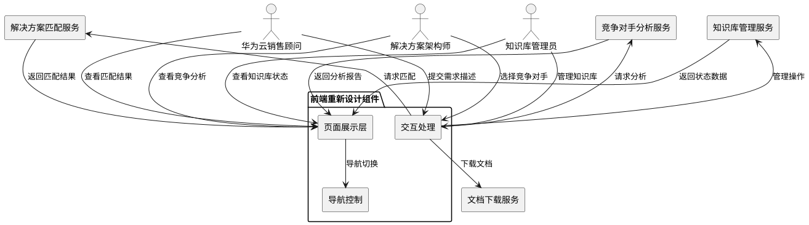
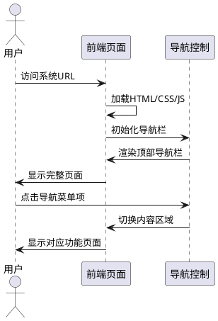
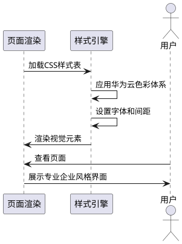
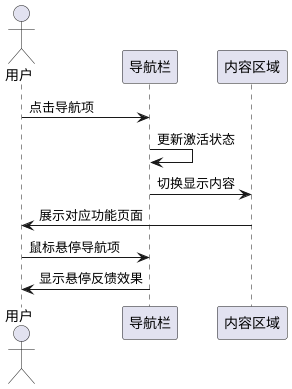
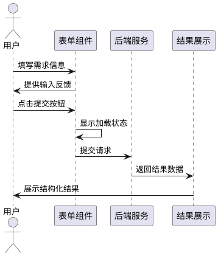
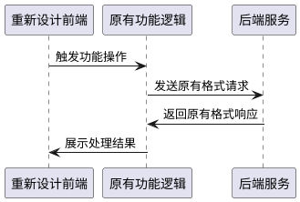

# **1. 组件定位**

## **1.1 核心职责**

本组件负责重新设计华为云解决方案智能匹配系统的前端用户界面,将现有AI应用风格转换为科技企业官网风格,实现专业、大气的企业产品展示效果。

## **1.2 核心输入**

1. **用户交互操作**:用户的页面导航、功能切换、表单输入等操作指令
2. **业务数据请求**:解决方案匹配请求、竞争对手分析请求、知识库管理请求
3. **系统状态数据**:知识库文档数、覆盖行业数、匹配准确率等统计信息
4. **匹配与分析结果**:后端返回的解决方案匹配结果和竞争对手分析报告

## **1.3 核心输出**

1. **视觉呈现输出**:面向用户的页面界面展示,包括导航、内容区、功能模块等
2. **业务请求提交**:向用户收集的需求描述、竞争对手选择、行业选择等数据
3. **文档下载服务**:提供方案文档和竞争分析报告的下载功能
4. **操作反馈提示**:Toast通知、加载状态、错误提示等用户反馈

## **1.4 职责边界**

本组件不负责:
- 后端匹配算法和业务逻辑处理
- 知识库数据存储和管理
- 用户身份认证和权限控制
- API接口开发和维护

# **2. 领域术语**

**科技企业官网风格**
: 指类似华为云、阿里云等云服务商官网的设计风格,强调专业性、可信度、大气感,采用清晰的层次结构、明确的视觉引导、品牌化的色彩体系。
: 备注:不同于AI聊天应用风格,减少对话式交互元素,强调产品展示和企业形象。

**顶部导航栏**
: 页面顶部的水平导航区域,包含品牌标识、主导航菜单、用户操作入口等元素,固定在页面顶部,随页面滚动保持可见。
: 备注:当前设计为左侧边栏导航,需要调整为顶部导航。

**左侧边栏导航**
: 位于页面左侧的垂直导航区域,包含导航菜单、系统状态、使用说明等内容,占据固定的侧边空间。
: 备注:现有设计方案,将被替换为顶部导航栏。

**粒子动画效果**
: 页面背景中飘动的粒子元素动画,营造科技感和动态氛围。
: 备注:当前页面使用的视觉效果,需要调整为更符合企业官网的科技感表现方式。

**玻璃拟态卡片**
: 使用毛玻璃效果(backdrop-filter)的卡片样式,具有半透明背景和模糊效果。
: 备注:当前使用的UI组件样式,在重新设计中需要调整为更专业的企业风格。

**响应式布局**
: 根据不同设备屏幕尺寸自动调整页面布局和元素尺寸的设计方式,确保在桌面、平板、手机等设备上都有良好的展示效果。

**视觉层次**
: 通过颜色、大小、间距、对比等视觉元素建立的页面信息重要级层次,引导用户关注重点内容。

# **3. 角色与边界**

## **3.1 核心角色**

**华为云销售顾问**:使用解决方案智能匹配系统快速找到客户需求对应的华为云解决方案,需要清晰的功能导航和高效的操作流程。

**解决方案架构师**:分析竞争对手方案并生成差异化话术,需要查看竞争分析结果和下载报告功能。

**知识库管理员**:管理系统中的解决方案知识库,需要便捷的知识库状态查看和操作功能。

## **3.2 外部系统**

**解决方案匹配服务**:接收客户需求描述,返回匹配的华为云解决方案列表和推荐内容。

**竞争对手分析服务**:接收竞争对手和行业参数,返回华为云的差异化优势和应对话术。

**知识库管理服务**:提供知识库状态查询、重建、清空等管理功能的API接口。

**文档下载服务**:提供解决方案文档和竞争分析报告的下载链接和文件生成功能。

## **3.3 交互上下文**

# **4. DFX约束**

## **4.1 性能**

1. **页面加载性能**:首屏加载时间不超过2秒(在正常网络环境下)
   a. 验收条件:[用户首次访问页面] → [首屏内容在2秒内完成渲染]

2. **页面渲染性能**:页面滚动和交互动画帧率不低于60fps
   a. 验收条件:[用户滚动页面] → [滚动流畅,无卡顿现象]

3. **资源加载优化**:CSS和JavaScript文件总大小不超过500KB(未压缩)
   a. 验收条件:[页面加载资源] → [总资源大小符合限制]

## **4.2 可靠性**

1. **浏览器兼容性**:支持Chrome 90+、Edge 90+、Firefox 88+、Safari 14+等主流浏览器
   a. 验收条件:[使用兼容浏览器访问] → [页面功能正常,样式正确]

2. **错误处理机制**:网络请求失败时显示友好的错误提示,不影响页面其他功能
   a. 验收条件:[后端服务不可用] → [显示错误提示,页面其他功能仍可操作]

3. **状态恢复能力**:页面刷新后能恢复用户的导航状态和页面位置
   a. 验收条件:[用户刷新页面] → [导航状态和滚动位置恢复到刷新前状态]

## **4.3 安全性**

1. **内容安全策略**:遵循内容安全策略(CSP),防止XSS攻击
   a. 验收条件:[恶意脚本注入尝试] → [脚本被拦截,不执行]

2. **敏感数据保护**:不在前端代码中硬编码API密钥和敏感配置
   a. 验收条件:[代码审查] → [无敏感信息泄露]

## **4.4 可维护性**

1. **代码结构清晰**:HTML、CSS、JavaScript三分离,代码结构清晰易维护
   a. 验收条件:[开发人员维护代码] → [能快速定位和修改相关功能]

2. **样式复用性**:建立统一的样式变量和组件库,减少重复代码
   a. 验收条件:[添加新功能模块] → [复用现有样式组件,减少代码冗余]

3. **文档完整性**:提供前端设计说明文档和组件使用指南
   a. 验收条件:[新开发人员加入] → [能根据文档快速上手开发]

## **4.5 兼容性**

1. **设备兼容性**:在桌面端(1920px+)、平板端(768px-1023px)、移动端(<768px)都有良好的展示效果
   a. 验收条件:[不同设备访问] → [布局自适应,内容可读性良好]

2. **分辨率适配**:支持从1366px到2560px的各种桌面分辨率
   a. 验收条件:[不同分辨率访问] → [布局合理,无横向滚动条]

3. **功能降级策略**:在JavaScript禁用情况下,至少能展示基本页面结构
   a. 验收条件:[JavaScript禁用] → [页面基本结构可展示,核心信息可读]

# **5. 核心能力**

## **5.1 页面布局重构**

### **5.1.1 业务规则**

1. **顶部导航栏设计**:必须将导航元素从左侧边栏移至页面顶部,形成水平导航布局
   a. 验收条件:[用户访问页面] → [导航栏位于页面顶部,横向排列]

2. **品牌标识位置**:品牌标识必须位于顶部导航栏左侧,包括华为云logo和系统名称
   a. 验收条件:[页面加载完成] → [左上角显示华为云品牌标识]

3. **导航菜单布局**:主导航菜单项必须在顶部导航栏中横向排列,包括"解决方案匹配"、"竞争分析"、"知识库管理"
   a. 验收条件:[用户查看导航] → [三个主要功能在顶部导航栏清晰可见]

4. **内容区域布局**:主内容区域必须占据页面主要空间,与顶部导航栏形成上下结构
   a. 验收条件:[页面布局完成] → [内容区域在导航栏下方,占据剩余空间]

5. **禁止项**:禁止保留左侧边栏导航设计,禁止内容区域过窄影响信息展示
   a. 验收条件:[布局验收] → [无左侧边栏,内容区域宽度合理]

### **5.1.2 交互流程**

### **5.1.3 异常场景**

1. **导航加载失败**
   a. 触发条件:[导航组件加载异常]
   b. 系统行为:[显示默认导航结构,记录错误日志]
   c. 用户感知:[页面仍可访问,导航功能简化]

2. **响应式布局异常**
   a. 触发条件:[设备屏幕尺寸不在支持范围内]
   b. 系统行为:[采用降级布局策略,确保基本可读性]
   c. 用户感知:[页面可正常浏览,布局可能不够优化]

## **5.2 视觉风格调整**

### **5.2.1 业务规则**

1. **科技企业风格应用**:必须采用类似华为云、阿里云官网的专业企业风格,包括清晰的层次结构、明确的视觉引导、大气的排版设计
   a. 验收条件:[用户查看页面] → [页面呈现专业企业官网风格,而非AI聊天应用风格]

2. **色彩体系规范**:必须使用华为云品牌红色(#C7000B)作为主色调,配合专业的中性色(深灰、浅灰)构建色彩体系
   a. 验收条件:[页面色彩检查] → [主色调为华为云红色,色彩搭配专业和谐]

3. **粒子动画调整**:必须调整或替换现有粒子动画效果,使其更符合企业官网的专业感,不过度突出AI科技感
   a. 验收条件:[页面视觉效果检查] → [动画效果适度,不喧宾夺主]

4. **玻璃拟态风格调整**:必须调整玻璃拟态卡片样式,采用更实体的卡片设计,强调内容清晰度和可读性
   a. 验收条件:[卡片组件检查] → [卡片背景清晰,内容易于阅读]

5. **字体规范应用**:必须使用系统默认无衬线字体栈,标题使用较大字号,正文使用舒适阅读字号
   a. 验收条件:[文本内容检查] → [字体清晰易读,层次分明]

6. **间距与留白**:必须建立合理的间距体系,页面元素之间保持适当留白,营造大气的视觉效果
   a. 验收条件:[页面布局检查] → [元素间距合理,整体感觉大气不拥挤]

7. **禁止项**:禁止使用过于花哨的动画效果,禁止过度使用渐变色和霓虹光效,禁止采用聊天对话式UI设计
   a. 验收条件:[设计验收] → [无过度装饰元素,风格专业内敛]

### **5.2.2 交互流程**

### **5.2.3 异常场景**

1. **样式加载失败**
   a. 触发条件:[CSS文件加载失败或延迟]
   b. 系统行为:[显示无样式内容,提示样式加载中]
   c. 用户感知:[页面内容可读,样式逐渐加载完成]

2. **品牌色彩显示异常**
   a. 触发条件:[显示器色彩配置不支持]
   b. 系统行为:[使用降级色彩方案]
   c. 用户感知:[色彩显示略有差异,不影响识别]

## **5.3 导航功能优化**

### **5.3.1 业务规则**

1. **导航项可见性**:所有主要功能导航项必须在首屏可见,无需滚动即可切换功能
   a. 验收条件:[用户进入页面] → [三个主要功能导航项全部可见]

2. **导航状态指示**:当前激活的导航项必须有明确的视觉标识,包括颜色变化、下划线或其他强调方式
   a. 验收条件:[用户切换功能] → [当前功能导航项高亮显示]

3. **导航交互反馈**:鼠标悬停导航项时必须有视觉反馈,包括颜色变化、背景变化等
   a. 验收条件:[鼠标悬停导航] → [导航项显示交互反馈效果]

4. **系统状态集成**:系统状态信息(知识库文档数、覆盖行业数、匹配准确率)必须在合理位置展示,可选择集成到顶部或独立区域
   a. 验收条件:[页面加载完成] → [系统状态信息清晰可见]

5. **移动端导航适配**:在小屏幕设备上,导航栏必须支持折叠或汉堡菜单形式
   a. 验收条件:[移动端访问] → [导航可折叠展开,不占用过多空间]

6. **禁止项**:禁止导航项隐藏过深导致用户难以发现,禁止导航切换导致页面重新加载
   a. 验收条件:[导航功能验收] → [导航清晰易用,切换流畅]

### **5.3.2 交互流程**

### **5.3.3 异常场景**

1. **导航切换异常**
   a. 触发条件:[内容切换时发生错误]
   b. 系统行为:[保持当前页面,显示错误提示]
   c. 用户感知:[提示"页面加载失败,请重试"]

2. **移动端导航展开失败**
   a. 触发条件:[点击汉堡菜单无响应]
   b. 系统行为:[记录错误,提供替代导航方式]
   c. 用户感知:[显示简化导航列表]

## **5.4 内容展示优化**

### **5.4.1 业务规则**

1. **页面标题层次**:每个功能页面必须有清晰的页面标题和副标题,说明当前功能的目的和作用
   a. 验收条件:[用户进入功能页面] → [页面标题清晰,功能说明明确]

2. **表单设计规范**:输入框、选择框等表单元素必须有清晰的标签和占位提示,符合企业表单设计规范
   a. 验收条件:[用户填写表单] → [表单标签清晰,操作指引明确]

3. **操作按钮设计**:主要操作按钮必须突出显示,次要按钮采用较弱的视觉样式,形成操作优先级
   a. 验收条件:[用户查看操作区] → [主要操作按钮醒目,操作层次清晰]

4. **结果展示清晰**:匹配结果、分析报告等内容必须采用清晰的排版,标题、正文、列表层次分明
   a. 验收条件:[用户查看结果] → [内容结构清晰,易于阅读理解]

5. **数据可视化优化**:图表等数据可视化组件必须清晰美观,配色与企业风格一致
   a. 验收条件:[查看数据图表] → [图表清晰美观,数据易于理解]

6. **加载状态设计**:加载过程必须显示清晰的加载指示器,告知用户系统正在处理
   a. 验收条件:[提交请求] → [显示加载动画,按钮状态变为处理中]

7. **禁止项**:禁止内容过于拥挤影响阅读,禁止关键操作按钮位置不明显,禁止结果展示缺乏结构
   a. 验收条件:[内容展示验收] → [内容布局合理,操作便捷]

### **5.4.2 交互流程**

### **5.4.3 异常场景**

1. **表单验证失败**
   a. 触发条件:[提交的数据不符合要求]
   b. 系统行为:[阻止提交,显示验证错误提示]
   c. 用户感知:[提示具体错误原因,指引修正]

2. **结果加载超时**
   a. 触发条件:[后端响应时间超过30秒]
   b. 系统行为:[取消请求,显示超时提示]
   c. 用户感知:[提示"请求超时,请稍后重试"]

## **5.5 功能保持与兼容**

### **5.5.1 业务规则**

1. **核心功能完整保留**:解决方案匹配、竞争对手分析、知识库管理三大核心功能必须完整保留,功能逻辑不变
   a. 验收条件:[用户使用任一功能] → [功能行为与重新设计前一致]

2. **交互流程不变**:各功能的操作流程必须保持不变,包括输入方式、提交操作、结果查看等
   a. 验收条件:[用户执行操作] → [操作流程与原版本一致]

3. **数据接口兼容**:前端与后端的数据交互接口必须保持兼容,不改变请求参数和响应格式
   a. 验收条件:[前后端交互] → [接口调用正常,数据格式正确]

4. **欢迎引导页保留**:首次访问的欢迎引导页功能必须保留,内容和交互保持不变
   a. 验收条件:[首次访问] → [显示欢迎引导页,体验与原版本一致]

5. **Demo案例功能保留**:快速体验和Demo案例选择功能必须保留,案例内容和演示流程不变
   a. 验收条件:[使用Demo功能] → [Demo体验与原版本一致]

6. **文档下载功能保留**:解决方案文档和竞争分析报告的下载功能必须保留
   a. 验收条件:[点击下载] → [正常下载对应文档]

7. **禁止项**:禁止功能缺失或功能行为改变,禁止删除用户已习惯的交互元素
   a. 验收条件:[功能验收] → [所有功能完整可用,行为一致]

### **5.5.2 交互流程**

### **5.5.3 异常场景**

1. **功能回归异常**
   a. 触发条件:[重新设计导致功能行为改变]
   b. 系统行为:[记录差异,进行功能修正]
   c. 用户感知:[功能恢复正常,与预期一致]

2. **兼容性异常**
   a. 触发条件:[前端与后端接口不兼容]
   b. 系统行为:[提示错误,记录日志]
   c. 用户感知:[提示"系统异常,请稍后重试"]

# **6. 数据约束**

## **6.1 页面导航状态**

1. **当前激活页面**:表示当前用户查看的功能页面,取值为"solution"|"competitor"|"knowledge"
2. **导航历史**:记录用户访问的页面路径,用于返回和恢复功能

## **6.2 视觉设计参数**

1. **主色调**:华为云品牌红色,值为#C7000B
2. **辅助色**:专业中性色系,包括深灰(#333333)、中灰(#666666)、浅灰(#F5F5F5)
3. **字体栈**:系统无衬线字体栈,值为"-apple-system, BlinkMacSystemFont, 'Segoe UI', 'PingFang SC', sans-serif"
4. **基础字号**:正文字号16px,标题字号24-32px,小字号14px
5. **间距单位**:基础间距8px,倍数间距16px、24px、32px、48px

## **6.3 系统状态数据**

1. **知识库文档数**:整数,表示当前知识库中的文档片段总数
2. **覆盖行业数**:整数,表示知识库覆盖的行业领域数量
3. **匹配准确率**:百分比数值,表示系统匹配的准确程度,格式为"XX%"

## **6.4 功能交互数据**

1. **需求描述文本**:字符串,最大长度2000字符,表示用户输入的客户需求描述
2. **竞争对手选择**:字符串,取值为预定义的竞争对手列表项之一
3. **行业选择**:字符串,取值为预定义的行业列表项之一
4. **匹配结果内容**:Markdown格式文本,包含解决方案标题、描述、推荐产品等结构化内容
5. **分析结果内容**:Markdown格式文本,包含差异化优势、应对话术等结构化内容

## **6.5 响应式断点**

1. **移动端断点**:屏幕宽度小于768px,采用移动端布局
2. **平板端断点**:屏幕宽度在768px到1023px之间,采用平板端布局
3. **桌面端断点**:屏幕宽度大于等于1024px,采用桌面端布局
4. **大屏断点**:屏幕宽度大于等于1440px,采用大屏优化布局
