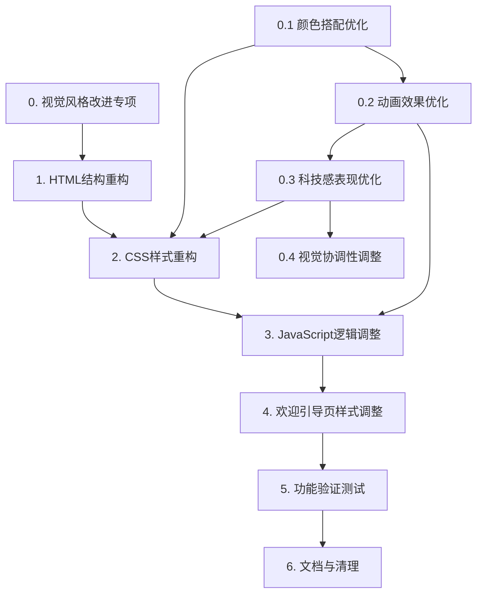

# 前端重新设计 - 编码任务规划

> **项目**: 华为云解决方案智能匹配系统前端界面重新设计  
> **目标**: 将AI应用风格转换为科技企业官网风格  
> **重点改进**: 颜色搭配、动画效果、科技感表现  
> **创建日期**: 2026-05-24

---

## 0. 视觉风格改进专项任务（优先级P0）

> **改进目标**: 基于用户反馈，重点优化颜色搭配、动画效果和科技感表现

### 0.1 颜色搭配优化
- [ ] 重新设计CSS色彩变量系统，增强色彩层次感
  - 优化华为云品牌红色(#C7000B)的应用方式和使用比例
  - 改进主色调与中性色(#333333, #666666, #F5F5F5)的搭配
  - 增加渐变色使用，提升科技感色彩表现
- [ ] 优化背景色彩方案
  - 使用多层渐变背景：linear-gradient(135deg, rgba(199, 0, 11, 0.02), rgba(74, 144, 226, 0.03))
  - 添加径向光晕效果：radial-gradient增强科技感
  - 确保背景与内容形成良好对比
- [ ] 改进功能色的视觉表现
  - 成功色(#52C41A)、警告色(#FAAD14)、错误色(#F5222D)、信息色(#1890FF)
  - 增强色彩饱和度和对比度
  - 确保功能色在不同背景下清晰可辨
- [ ] 验证色彩可访问性
  - 文字与背景对比度符合WCAG AA标准
  - 色彩搭配和谐专业，符合华为云品牌风格

### 0.2 动画效果优化
- [ ] 调整粒子动画参数（script.js中Config.ANIMATION）
  - 减少粒子数量：PARTICLE_COUNT从70降至40-50
  - 降低连接距离：CONNECTION_DISTANCE从140降至120
  - 减慢运动速度：PARTICLE_SPEED从0.4降至0.3
  - 调整粒子颜色：使用品牌色渐变(rgba(199, 0, 11, 0.5)和rgba(74, 144, 226, 0.2))
- [ ] 优化粒子画布透明度
  - 将#particle-canvas的opacity从0.35降至0.20-0.25
  - 减少视觉干扰，使粒子成为背景元素而非主角
- [ ] 改进粒子渲染效果
  - 使用渐变色绘制粒子，增强科技感
  - 优化连线效果，使用品牌色渐变
  - 确保动画流畅，帧率保持60fps以上
- [ ] 优化页面过渡动画
  - 调整fade-in动画的时长和效果
  - 改进slide-up动画的视觉表现
  - 确保动画流畅自然，无卡顿

### 0.3 科技感表现优化
- [ ] 增强导航栏科技感
  - 添加渐变下边框效果：linear-gradient(90deg, transparent, #C7000B, #4A90E2, #C7000B, transparent)
  - 优化品牌标识区域的视觉表现
  - 增强导航项hover和active状态的科技感反馈
- [ ] 改进卡片组件科技感
  - 添加渐变顶部边框动画（hover时显示）
  - 优化卡片阴影效果，增强层次感
  - 改进hover动画：translateY(-2px)配合阴影变化
- [ ] 优化按钮科技感样式
  - 主要按钮使用品牌色渐变背景
  - 增强按钮阴影和hover效果
  - 添加微妙的科技感细节（渐变、光效）
- [ ] 改进背景科技感表现
  - 使用多层渐变和径向光晕营造科技感氛围
  - 确保科技感适度，不喧宾夺主
  - 符合企业官网的专业性和可信度

### 0.4 视觉协调性调整
- [ ] 统一视觉语言
  - 确保颜色、动画、科技感风格一致
  - 建立统一的设计语言和视觉节奏
- [ ] 优化间距和留白体系
  - 增加页面留白，营造大气的专业感
  - 调整元素间距，改善视觉呼吸感
- [ ] 调整字体层次和大小
  - 优化标题、正文、辅助文字的层次关系
  - 确保字体清晰易读，信息传达有效

---

## 1. HTML结构重构

### 1.1 创建顶部导航栏结构
- [ ] 在 `frontend/index.html` 中 `<body>` 标签后插入顶部导航栏HTML结构
  - 添加 `<header class="navbar">` 容器
  - 添加品牌标识区域（华为云logo + 系统名称）
  - 添加导航菜单区域（解决方案匹配、竞争分析、知识库管理）
  - 添加系统状态区域（文档数、行业数、准确率）
  - 添加移动端菜单切换按钮
- [ ] 为导航项添加 `data-page` 属性（solution/competitor/knowledge）
- [ ] 为系统状态元素添加ID（nav-doc-count、nav-industry-count、nav-accuracy）
- [ ] 验证导航栏HTML结构完整，元素层级正确

### 1.2 移除左侧边栏导航
- [ ] 在 `frontend/index.html` 中定位并删除 `<aside class="sidebar">` 及其所有子元素
- [ ] 删除原有的移动端菜单切换按钮 `mobile-menu-toggle`
- [ ] 验证页面中无残留的侧边栏相关HTML代码

### 1.3 调整主内容区域结构
- [ ] 移除 `app-container` 的Grid布局包裹，直接使用 `main-content`
- [ ] 为 `main-content` 添加顶部内边距（padding-top: 80px），避免被固定导航栏遮挡
- [ ] 确认三个功能页面容器（page-solution、page-competitor、page-knowledge）保持不变
- [ ] 验证欢迎引导页（welcome-page）位置和结构不变
- [ ] 验证Demo选择器（demo-selector-modal）位置和结构不变

---

## 2. CSS样式重构

### 2.1 更新CSS基础变量
- [ ] 在 `frontend/style.css` 中替换原有的深色主题变量为浅色企业风格变量
  - 定义华为云品牌色：--primary-color: #C7000B（主色调）
  - 定义中性色系：从 --neutral-900 到 --neutral-50（标题文字到浅背景）
  - 定义功能色：success、warning、error、info
  - 定义字体栈：系统无衬线字体
  - 定义字体尺寸：从 --font-size-xs (12px) 到 --font-size-3xl (32px)
  - 定义间距体系：从 --spacing-xs (4px) 到 --spacing-2xl (48px)
  - 定义圆角：从 --radius-sm (4px) 到 --radius-xl (16px)
  - 定义阴影：从 --shadow-sm 到 --shadow-xl
- [ ] 验证所有变量定义完整，无遗漏

### 2.2 添加顶部导航栏样式
- [ ] 在 `frontend/style.css` 中添加 `.navbar` 容器样式
  - 固定定位（position: fixed），位于页面顶部
  - 白色背景，带阴影效果和backdrop-filter模糊
  - 高度64px，z-index: 1000
  - **添加渐变下边框增强科技感**
- [ ] 添加 `.navbar-container` 样式（内容容器）
  - 最大宽度1400px，居中对齐
  - Flex布局，align-items: center
  - 左右内边距32px
- [ ] 添加 `.navbar-brand` 品牌标识样式
  - Flex布局，图标和文字间距12px
  - 品牌图标字号28px
  - 品牌文字使用渐变色增强科技感
- [ ] 添加 `.navbar-menu` 导航菜单样式
  - Flex布局，菜单项间距8px
- [ ] 添加 `.navbar-item` 菜单项样式
  - Flex布局，图标和文字间距8px
  - 内边距10px 20px，圆角12px
  - 默认文字颜色 #666666
  - 悬停效果：背景 #F5F5F5，文字颜色 #333333
  - 激活状态：背景 #C7000B（品牌红），文字白色，增强阴影
- [ ] 添加 `.navbar-status` 系统状态区域样式
  - Flex布局，左侧边框分割
  - 间距24px，内边距左侧24px
- [ ] 添加 `.status-item`、`.status-label`、`.status-value` 样式
  - 标签字号12px，颜色 #808080
  - 数值字号16px，font-weight: 600，颜色 #C7000B
- [ ] 添加 `.navbar-toggle` 移动端切换按钮样式
  - 默认隐藏（display: none）
  - 移动端显示，字号24px
- [ ] 验证导航栏样式在桌面端显示正确

### 2.3 更新页面背景与粒子动画样式
- [ ] 修改 `body` 样式，使用多层渐变背景
  - 主背景：linear-gradient(180deg, #F8F9FB, #EEF1F5, #F5F7FA)
  - 添加渐变层：linear-gradient(135deg, rgba(199, 0, 11, 0.02), rgba(74, 144, 226, 0.03))
  - 文字颜色：--neutral-800 (#333333)
- [ ] 添加body::before伪元素增强科技感
  - 使用径向光晕效果营造科技感氛围
  - 设置为背景层，不影响内容交互
- [ ] 调整粒子画布 `#particle-canvas` 样式
  - 降低透明度至0.20-0.25，减少视觉干扰
  - 确保z-index为0，不遮挡内容
- [ ] 验证背景视觉效果符合企业官网风格

### 2.4 重构卡片样式
- [ ] 定位所有使用 `.glass-card` 或玻璃拟态效果的元素
- [ ] 将 `.glass-card` 改为 `.content-card`，应用实体卡片样式
  - 白色背景（rgba(255, 255, 255, 0.9)），边框1px solid #E5E5E5
  - 圆角12px，多层阴影效果
  - 添加内阴影增强质感
- [ ] 添加渐变顶部边框动画（科技感细节）
  - 使用::before伪元素
  - hover时opacity从0变为0.8
  - 渐变色：linear-gradient(90deg, #C7000B, #4A90E2, #C7000B)
- [ ] 添加卡片悬停效果
  - 阴影加深，transform: translateY(-2px)
  - 确保过渡动画流畅
- [ ] 更新统计卡片 `.stat-card` 样式
  - 白色背景，边框，圆角，阴影
  - 数值字号36px，font-weight: 700，品牌红色
  - 标签字号14px，中性色
- [ ] 更新所有引用卡片样式的HTML元素的class名称
- [ ] 验证卡片样式清晰易读，符合企业风格

### 2.5 更新表单和按钮样式
- [ ] 更新表单元素样式，使用中性色系
  - 输入框：白色背景，边框，圆角
  - 聚焦效果：品牌红色边框 + 外发光效果（box-shadow: 0 0 0 3px rgba(199, 0, 11, 0.1)）
- [ ] 更新按钮样式，增强科技感
  - 主要按钮：品牌红色背景，白色文字，增强阴影（box-shadow: 0 2px 8px rgba(199, 0, 11, 0.2)）
  - 次要按钮：白色背景，中性色边框和文字
  - 悬停效果：背景加深，transform: translateY(-1px)，阴影增强
- [ ] 验证表单和按钮样式符合企业设计规范

### 2.6 更新页面标题和内容排版样式
- [ ] 更新页面标题 `.page-header` 样式
  - 标题字号32px，font-weight: 700
  - 副标题字号16px，中性色，行高1.6
- [ ] 更新内容区块 `.content-section` 样式
  - 合理的间距和留白
  - 清晰的层次结构
- [ ] 验证内容排版大气、清晰、易于阅读

### 2.7 添加响应式样式
- [ ] 添加桌面端样式（@media min-width: 1024px）
  - 导航栏最大宽度1400px，居中
  - 主内容区最大宽度1400px，居中
  - 系统状态显示（.navbar-status: flex）
  - 移动端切换按钮隐藏（.navbar-toggle: none）
- [ ] 添加平板端样式（@media 768px - 1023px）
  - 导航栏内边距调整为24px
  - 系统状态隐藏（.navbar-status: none）
  - 主内容区内边距调整为24px
  - 统计卡片三列布局
- [ ] 添加移动端样式（@media max-width: 767px）
  - 导航栏高度调整为56px
  - 导航菜单变为下拉菜单
    - position: absolute，位于导航栏下方
    - flex-direction: column
    - 默认隐藏，添加 .open 类时显示
  - 系统状态隐藏
  - 移动端切换按钮显示（.navbar-toggle: block）
  - 主内容区内边距16px，顶部72px
  - 统计卡片单列布局
  - 表单选择框单列布局
  - 按钮组垂直排列
- [ ] 验证响应式样式在三种尺寸下布局正确

### 2.8 移除旧样式代码
- [ ] 在 `frontend/style.css` 中删除 `.sidebar` 及所有相关样式
- [ ] 删除 `.app-container` 的Grid布局样式
- [ ] 删除原有的 `.mobile-menu-toggle` 样式
- [ ] 删除所有深色主题相关的颜色变量和样式
- [ ] 验证无残留的旧样式代码

---

## 3. JavaScript逻辑调整

### 3.1 重构导航逻辑
- [ ] 在 `frontend/script.js` 中添加 `initNavbar()` 函数
  - 获取所有 `.navbar-item` 元素
  - 获取移动端切换按钮 `#navbar-toggle`
  - 获取导航菜单 `.navbar-menu`
  - 为每个导航项绑定点击事件，调用 `switchPage(pageId)`
  - 为移动端切换按钮绑定点击事件，切换菜单显示
- [ ] 重构 `switchPage(pageId)` 函数
  - 更新导航项激活状态（遍历 `.navbar-item`，设置 active 类）
  - 更新页面显示状态（遍历 `.page`，设置 active 类）
  - 更新 `State.currentPage` 状态
  - 关闭移动端菜单（移除 `.navbar-menu` 的 open 类）
- [ ] 在页面初始化时调用 `initNavbar()`
- [ ] 验证导航项点击能正确切换页面
- [ ] 验证页面切换时导航项激活状态正确

### 3.2 更新系统状态显示逻辑
- [ ] 定位 `updateSystemStats(stats)` 函数或类似函数
- [ ] 修改函数，添加导航栏状态更新逻辑
  - 更新 `#nav-doc-count` 文本内容
  - 更新 `#nav-industry-count` 文本内容
  - 更新 `#nav-accuracy` 文本内容
- [ ] 保持知识库页面状态更新逻辑不变
- [ ] 验证系统状态数据在导航栏正确显示

### 3.3 调整粒子动画参数（重点优化）
- [ ] 在 `frontend/script.js` 中定位 `Config.ANIMATION` 配置对象
- [ ] 修改动画参数，调整为更柔和的企业风格
  - PARTICLE_COUNT: 40（从70减少）
  - CONNECTION_DISTANCE: 120（从140减少）
  - PARTICLE_SPEED: 0.3（从0.4减少）
- [ ] 修改ParticleSystem类的draw方法
  - 使用渐变色绘制粒子连线：createLinearGradient从品牌红到蓝色
  - 粒子使用径向渐变填充：createRadialGradient
  - 调整透明度和颜色参数，增强科技感
- [ ] 验证粒子动画效果柔和，不喧宾夺主
- [ ] 验证动画帧率保持60fps以上

### 3.4 移除旧导航相关代码
- [ ] 删除原有的侧边栏导航项点击事件绑定代码
- [ ] 删除原有的 `mobile-menu-toggle` 相关事件绑定代码
- [ ] 删除侧边栏展开/收起逻辑代码
- [ ] 验证无残留的旧导航逻辑代码

### 3.5 保持功能模块不变
- [ ] 确认解决方案匹配功能逻辑保持不变
- [ ] 确认竞争对手分析功能逻辑保持不变
- [ ] 确认知识库管理功能逻辑保持不变
- [ ] 确认Demo案例功能逻辑保持不变
- [ ] 确认文档下载功能逻辑保持不变
- [ ] 确认Toast通知功能逻辑保持不变
- [ ] 验证所有功能模块正常工作

---

## 4. 欢迎引导页样式调整

### 4.1 更新欢迎页样式
- [ ] 在 `frontend/welcome-styles.css` 中调整配色方案
  - 将深色背景改为浅色/中性背景
  - 将品牌色调整为华为云红色（#C7000B）
  - 将文字颜色调整为中性色系
- [ ] 调整欢迎页卡片样式，移除玻璃拟态效果
- [ ] 验证欢迎引导页视觉风格与主页面一致

---

## 5. 功能验证测试

### 5.1 导航功能测试
- [ ] 测试桌面端：点击导航项能正确切换页面
- [ ] 测试桌面端：当前页面导航项高亮显示正确
- [ ] 测试桌面端：鼠标悬停导航项有视觉反馈
- [ ] 测试移动端：点击汉堡菜单能展开/收起导航
- [ ] 测试移动端：点击导航项后菜单自动收起
- [ ] 测试系统状态数据在导航栏正确显示

### 5.2 核心功能测试
- [ ] 测试解决方案匹配功能完整可用
  - 输入需求描述
  - 提交匹配请求
  - 查看匹配结果
  - 下载方案文档
- [ ] 测试竞争对手分析功能完整可用
  - 选择竞争对手和行业
  - 提交分析请求
  - 查看分析报告
  - 下载分析报告
- [ ] 测试知识库管理功能完整可用
  - 查看知识库统计信息
  - 执行知识库重建
  - 执行知识库清空
- [ ] 测试Demo案例功能正常
  - 选择Demo案例
  - 自动填充表单
  - 执行匹配或分析
- [ ] 测试欢迎引导页首次访问正常显示
- [ ] 验证所有功能行为与重新设计前一致

### 5.3 响应式布局测试
- [ ] 测试桌面端（≥1024px）布局正确
  - 导航栏横向排列，品牌、菜单、状态全部显示
  - 内容区域宽度合理，居中对齐
  - 系统状态在导航栏右侧显示
- [ ] 测试平板端（768px-1023px）布局正确
  - 导航栏横向排列，系统状态隐藏
  - 内容区域宽度自适应
  - 统计卡片三列布局
- [ ] 测试移动端（<768px）布局正确
  - 导航栏显示汉堡菜单按钮
  - 点击汉堡菜单展开垂直导航
  - 内容区域宽度全宽
  - 统计卡片单列布局
  - 表单和按钮垂直排列
- [ ] 验证各尺寸下内容可读性良好，无横向滚动条

### 5.4 视觉风格验证（重点测试）
- [ ] 验证整体视觉风格符合科技企业官网风格
  - 浅色/中性背景
  - 品牌红色作为主色调
  - 清晰的层次结构和视觉引导
  - 大气的排版和留白
- [ ] 验证色彩搭配专业和谐（用户重点需求）
  - 主色调为华为云红色（#C7000B）
  - 中性色系使用正确
  - 功能色（成功、警告、错误）显示正确
  - 色彩对比度符合可访问性标准
- [ ] 验证动画效果柔和适度（用户重点需求）
  - 粒子动画不喧宾夺主
  - 动画流畅，帧率≥60fps
  - 符合企业专业感
  - 页面过渡动画自然流畅
- [ ] 验证科技感表现恰当（用户重点需求）
  - 科技感元素适度，不过度装饰
  - 渐变、光效使用得当
  - 符合华为云官网风格
  - 专业性和可信度兼具
- [ ] 验证卡片样式清晰易读
  - 实体白色背景
  - 合适的边框和阴影
  - 悬停效果流畅
- [ ] 验证字体清晰易读，层次分明
- [ ] 验证间距合理，整体感觉大气不拥挤

### 5.5 性能测试
- [ ] 测试首屏加载时间 < 2秒（正常网络环境）
- [ ] 测试页面滚动流畅，帧率 ≥ 60fps
- [ ] 测试交互动画流畅，无卡顿
- [ ] 测试CSS和JavaScript文件总大小 < 500KB（未压缩）
- [ ] 使用Chrome DevTools Performance面板分析渲染性能
- [ ] 使用Lighthouse进行综合评估（目标分数 > 85）

### 5.6 浏览器兼容性测试
- [ ] 测试Chrome 90+浏览器：页面功能正常，样式正确
- [ ] 测试Edge 90+浏览器：页面功能正常，样式正确
- [ ] 测试Firefox 88+浏览器：页面功能正常，样式正确
- [ ] 测试Safari 14+浏览器：页面功能正常，样式正确
- [ ] 验证CSS前缀兼容性（如需要添加 -webkit- 前缀）

### 5.7 错误处理测试
- [ ] 测试网络请求失败时显示友好错误提示
- [ ] 测试后端服务不可用时页面其他功能仍可操作
- [ ] 测试表单验证失败时显示具体错误原因
- [ ] 测试JavaScript禁用时页面基本结构可展示

---

## 6. 文档与清理

### 6.1 代码审查与优化
- [ ] 审查HTML结构语义化，确保无冗余代码
- [ ] 审查CSS样式，合并重复定义，优化选择器
- [ ] 审查JavaScript代码，减少DOM操作，优化事件处理
- [ ] 确认无console.log调试代码残留
- [ ] 确认无注释掉的旧代码残留

### 6.2 文档更新
- [ ] 更新项目README文档，说明前端重新设计的变更
- [ ] 记录新的CSS变量和样式类命名规范
- [ ] 记录新的JavaScript函数接口说明
- [ ] 记录响应式断点和适配策略
- [ ] 记录视觉风格改进的设计决策

### 6.3 最终验证
- [ ] 执行完整的功能回归测试，确保所有功能正常
- [ ] 执行完整的视觉验证，确保风格符合预期
- [ ] 执行完整的性能验证，确保性能达标
- [ ] 执行完整的兼容性验证，确保跨浏览器兼容
- [ ] 确认无功能缺失或功能行为改变
- [ ] 确认前后端接口兼容，数据交互正常
- [ ] **确认颜色搭配、动画效果、科技感表现满足用户需求**

---

## 任务依赖关系

---

## 预估工作量

| 阶段 | 预估工时 | 优先级 |
|------|---------|--------|
| 0. 视觉风格改进专项 | 4小时 | P0 |
| 1. HTML结构重构 | 2小时 | P0 |
| 2. CSS样式重构 | 6小时 | P0 |
| 3. JavaScript逻辑调整 | 3小时 | P0 |
| 4. 欢迎引导页样式调整 | 1小时 | P1 |
| 5. 功能验证测试 | 4小时 | P0 |
| 6. 文档与清理 | 1小时 | P1 |
| **总计** | **21小时** | - |

---

## 注意事项

1. **功能完整性**：所有现有功能必须完整保留，包括解决方案匹配、竞争对手分析、知识库管理、欢迎引导页、Demo案例、文档下载功能。

2. **接口兼容性**：前后端API接口保持不变，不修改请求参数和响应格式。

3. **渐进增强**：确保在CSS或JavaScript加载失败时，页面基本结构仍然可用。

4. **性能优先**：CSS和JavaScript文件总大小不超过500KB，首屏加载时间不超过2秒。

5. **测试覆盖**：必须完成所有验证测试项，确保功能、性能、兼容性全面达标。

6. **代码质量**：保持代码结构清晰，HTML、CSS、JavaScript三分离，样式复用性强。

7. **视觉改进重点**：颜色搭配、动画效果、科技感表现是本次改进的核心目标，需要重点验证和优化。

---

**文档版本**: v2.0  
**创建日期**: 2026-05-24  
**最后更新**: 2026-05-24  
**改进重点**: 颜色搭配、动画效果、科技感表现
