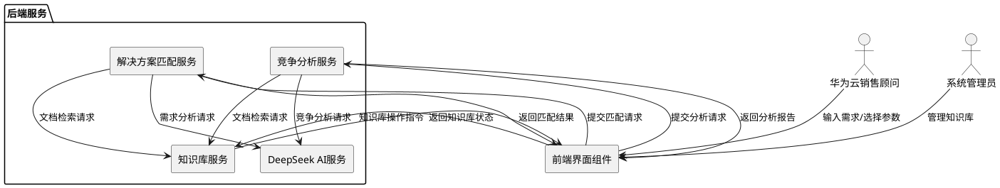
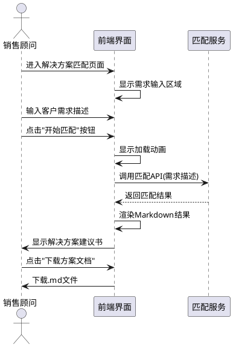
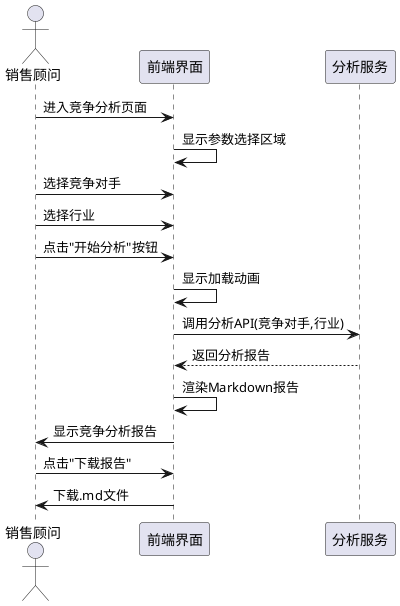
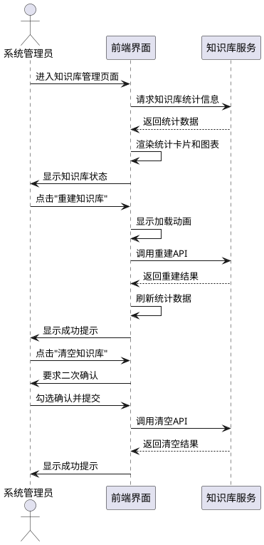
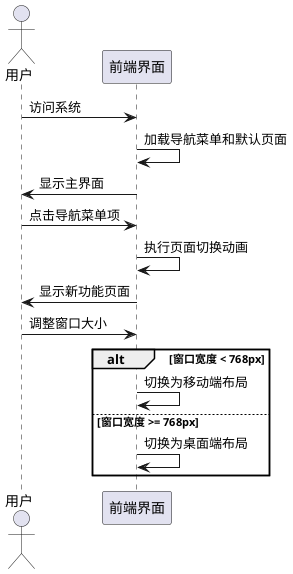
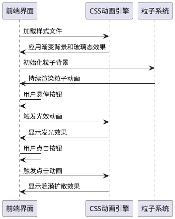
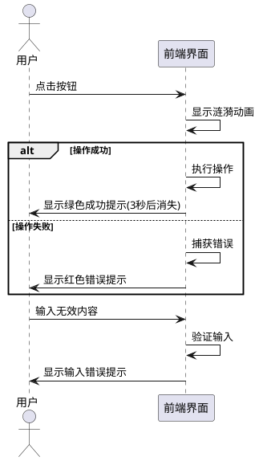

# 华为云解决方案匹配系统前端界面需求规格

## **1. 组件定位**

### **1.1 核心职责**

本组件负责展示华为云解决方案匹配系统的用户交互界面,实现客户需求输入、解决方案匹配、竞争分析和知识库管理的可视化操作。

### **1.2 核心输入**

1. **客户需求描述**：用户在解决方案匹配页面输入的客户业务需求和痛点描述文本
2. **竞争对手选择**：用户在竞争分析页面选择的竞争对手名称
3. **行业选择**：用户在竞争分析页面选择的行业类别
4. **知识库操作指令**：用户在知识库管理页面触发的重建或清空操作
5. **功能切换指令**：用户通过导航菜单切换功能模块的操作

### **1.3 核心输出**

1. **解决方案匹配结果展示**：将AI匹配的华为云解决方案建议书以Markdown格式呈现给用户
2. **竞争分析报告展示**：将生成的竞争分析报告和销售话术以Markdown格式呈现给用户
3. **知识库状态展示**：将知识库统计数据和行业分布图表呈现给用户
4. **文档下载响应**：用户下载解决方案文档或竞争分析报告
5. **交互反馈**：按钮点击动画、加载状态提示、错误提示等用户交互反馈

### **1.4 职责边界**

1. 本组件不负责AI需求分析和匹配逻辑,仅负责展示后端返回的结果
2. 本组件不负责知识库数据存储和检索,仅负责发送操作指令和展示状态
3. 本组件不负责用户认证和权限管理
4. 本组件不负责后端API接口设计和数据处理逻辑

---

## **2. 领域术语**

**解决方案建议书**
: 系统根据客户需求自动生成的华为云行业解决方案推荐文档,包含方案概述、技术架构、核心优势等内容。
: 备注：以Markdown格式输出,支持下载。

**竞争分析报告**
: 系统针对特定竞争对手和行业生成的差异化优势分析和销售应对话术文档。
: 备注：包含竞争对手对比、华为云优势、销售话术等内容。

**知识库**
: 存储华为云官方解决方案文档的向量数据库,支持智能检索和匹配。
: 备注：按行业分类存储,支持重建和清空操作。

**科技感界面**
: 采用现代化设计风格,包含渐变色彩、光效动画、透明玻璃态效果等视觉元素的用户界面。
: 备注：强调专业性和未来感。

**EARS格式**
: 一种需求规格编写语法,采用"条件+主体+响应"结构,确保需求可测试和可验证。
: 备注：本文档中所有验收条件均采用EARS格式。

---

## **3. 角色与边界**

### **3.1 核心角色**

- **华为云销售顾问**：使用系统进行客户需求分析、解决方案匹配和竞争分析的主要用户
- **系统管理员**：负责知识库管理和系统配置的运维人员

### **3.2 外部系统**

- **DeepSeek AI服务**：提供客户需求分析和解决方案匹配能力
- **知识库服务(KnowledgeBaseService)**：提供解决方案文档存储和检索能力
- **解决方案匹配服务(SolutionMatcherService)**：提供解决方案智能匹配能力
- **竞争分析服务(CompetitorAnalyzerService)**：提供竞争对手方案分析能力

### **3.3 交互上下文**

---

## **4. DFX约束**

### **4.1 性能**

1. **页面加载性能**
   - 首屏加载时间必须小于2秒
   - 静态资源加载时间必须小于1秒
   - 动画帧率必须保持在60fps以上

2. **交互响应性能**
   - 按钮点击响应延迟必须小于100毫秒
   - 页面切换动画持续时间必须小于300毫秒
   - 输入框输入响应延迟必须小于50毫秒

### **4.2 可靠性**

1. **界面稳定性**
   - 界面元素在窗口大小调整时必须保持布局稳定
   - 长时间运行不得出现内存泄漏或性能退化
   - 异步操作失败时必须显示明确的错误提示

2. **数据一致性**
   - 知识库状态数据必须与后端保持实时同步
   - 下载文档内容必须与界面展示内容完全一致

### **4.3 安全性**

1. **输入安全**
   - 所有用户输入必须进行XSS过滤
   - 文件下载必须使用安全的文件名处理
   - API请求必须包含必要的认证信息

2. **内容安全**
   - Markdown渲染必须禁用危险HTML标签
   - 外部链接必须添加安全属性(noreferrer noopener)

### **4.4 可维护性**

1. **代码规范**
   - HTML、CSS、JavaScript代码必须分离或模块化组织
   - 必须使用语义化的HTML标签
   - CSS必须使用BEM命名规范或类似规范

2. **可扩展性**
   - 新功能模块必须支持独立添加
   - 样式变量必须集中管理
   - 动画效果必须支持配置化调整

### **4.5 兼容性**

1. **浏览器兼容**
   - 必须支持Chrome 90+、Firefox 88+、Edge 90+、Safari 14+
   - 必须支持移动端浏览器(iOS Safari 14+、Android Chrome 90+)

2. **响应式设计**
   - 必须支持屏幕分辨率从320px到2560px自适应
   - 必须在移动端(宽度<768px)提供优化的布局

---

## **5. 核心能力**

## **5.1 解决方案智能匹配界面**

### **5.1.1 业务规则**

1. **需求输入区域**
   - When 用户进入解决方案匹配页面, the 前端界面 shall 显示一个文本域用于输入客户需求描述
   - a. 验收条件：[页面加载完成] → [显示带占位符提示的多行文本输入框]

2. **匹配按钮交互**
   - When 用户点击"开始匹配"按钮, the 前端界面 shall 触发加载动画并调用后端匹配API
   - a. 验收条件：[点击按钮] → [按钮显示加载状态,发起API请求]
   - If 用户未输入任何需求描述就点击匹配按钮, the 前端界面 shall 显示"请输入客户需求描述"警告提示
   - a. 验收条件：[空输入+点击匹配] → [显示警告提示,不发起API请求]

3. **匹配结果展示**
   - When 后端返回匹配结果, the 前端界面 shall 以Markdown格式渲染解决方案建议书
   - a. 验收条件：[收到匹配结果] → [显示格式化的解决方案内容]
   - While 匹配结果正在加载, the 前端界面 shall 显示带进度指示的加载动画
   - a. 验收条件：[API请求进行中] → [显示旋转加载图标和提示文本]

4. **文档下载功能**
   - Where 匹配结果成功显示, the 前端界面 shall 提供"下载方案文档"按钮
   - a. 验收条件：[匹配成功] → [显示下载按钮,点击可下载.md文件]

5. **来源文档查看**
   - Where 匹配结果包含参考文档, the 前端界面 shall 提供可展开的"查看参考文档"区域
   - a. 验收条件：[匹配结果包含来源] → [显示可展开区域,列出参考文档信息]

### **5.1.2 交互流程**

### **5.1.3 异常场景**

1. **API调用失败**
   - a. 触发条件：[网络错误或后端服务异常]
   - b. 系统行为：[停止加载动画,记录错误日志]
   - c. 用户感知：[显示"匹配失败,请稍后重试"错误提示]

2. **匹配结果为空**
   - a. 触发条件：[后端返回空结果或无匹配方案]
   - b. 系统行为：[隐藏结果展示区域]
   - c. 用户感知：[显示"未找到匹配的解决方案"提示]

3. **输入内容过长**
   - a. 触发条件：[输入文本超过5000字符]
   - b. 系统行为：[显示字符计数提示]
   - c. 用户感知：[显示"输入内容过长,建议精简描述"警告]

---

## **5.2 竞争对手方案分析界面**

### **5.2.1 业务规则**

1. **参数选择区域**
   - When 用户进入竞争分析页面, the 前端界面 shall 显示竞争对手和行业的下拉选择框
   - a. 验收条件：[页面加载完成] → [显示两个下拉选择框,填充预设选项]

2. **分析按钮交互**
   - When 用户选择竞争对手和行业后点击"开始分析"按钮, the 前端界面 shall 触发加载动画并调用分析API
   - a. 验收条件：[选择参数+点击分析] → [显示加载状态,发起API请求]

3. **分析结果展示**
   - When 后端返回分析报告, the 前端界面 shall 以Markdown格式渲染竞争分析报告
   - a. 验收条件：[收到分析结果] → [显示格式化的竞争分析内容]

4. **报告下载功能**
   - Where 分析结果成功显示, the 前端界面 shall 提供"下载竞争分析报告"按钮
   - a. 验收条件：[分析成功] → [显示下载按钮,文件名为"华为云vs{竞争对手}_{行业}竞争分析报告.md"]

5. **来源文档查看**
   - Where 分析结果包含参考文档, the 前端界面 shall 提供可展开的"查看参考文档"区域
   - a. 验收条件：[分析结果包含来源] → [显示可展开区域,列出参考文档信息]

### **5.2.2 交互流程**

### **5.2.3 异常场景**

1. **API调用失败**
   - a. 触发条件：[网络错误或后端服务异常]
   - b. 系统行为：[停止加载动画,记录错误日志]
   - c. 用户感知：[显示"分析失败,请稍后重试"错误提示]

2. **参数未选择**
   - a. 触发条件：[用户未选择参数即点击分析按钮]
   - b. 系统行为：[使用默认选项继续分析]
   - c. 用户感知：[显示使用默认参数的提示信息]

---

## **5.3 知识库管理界面**

### **5.3.1 业务规则**

1. **统计信息展示**
   - When 用户进入知识库管理页面, the 前端界面 shall 显示知识库统计信息(文档数、覆盖行业数、匹配准确率)
   - a. 验收条件：[页面加载完成] → [显示三个统计指标卡片]

2. **行业分布图表**
   - When 知识库统计数据加载完成, the 前端界面 shall 显示行业文档分布柱状图
   - a. 验收条件：[统计数据就绪] → [显示按行业分组的柱状图]

3. **重建知识库操作**
   - When 用户点击"重建知识库"按钮, the 前端界面 shall 显示确认提示并触发重建操作
   - a. 验收条件：[点击重建按钮] → [显示加载动画,调用重建API]
   - When 知识库重建成功, the 前端界面 shall 刷新统计信息和图表
   - a. 验收条件：[重建成功] → [显示成功提示,更新统计数据]

4. **清空知识库操作**
   - When 用户点击"清空知识库"按钮, the 前端界面 shall 要求用户二次确认
   - a. 验收条件：[点击清空按钮] → [显示确认复选框]
   - Where 用户勾选确认复选框, the 前端界面 shall 启用清空操作并执行
   - a. 验收条件：[勾选确认+点击清空] → [执行清空操作,显示成功提示]

### **5.3.2 交互流程**

### **5.3.3 异常场景**

1. **知识库操作失败**
   - a. 触发条件：[重建或清空操作发生错误]
   - b. 系统行为：[停止加载动画,记录错误日志]
   - c. 用户感知：[显示"操作失败: {错误信息}"提示]

2. **统计数据加载失败**
   - a. 触发条件：[获取统计信息API调用失败]
   - b. 系统行为：[显示占位数据或错误状态]
   - c. 用户感知：[显示"无法加载知识库状态"提示]

---

## **5.4 导航与布局**

### **5.4.1 业务规则**

1. **功能导航菜单**
   - When 用户访问系统, the 前端界面 shall 显示包含三个功能模块的导航菜单
   - a. 验收条件：[系统加载完成] → [显示"解决方案匹配"、"竞争分析"、"知识库管理"菜单项]

2. **页面切换动画**
   - When 用户点击导航菜单切换功能, the 前端界面 shall 执行平滑的页面切换动画
   - a. 验收条件：[点击导航项] → [当前页面淡出,新页面淡入,动画时长<300ms]

3. **侧边栏状态指示**
   - While 任意页面加载, the 前端界面 shall 在侧边栏显示系统状态指标
   - a. 验收条件：[页面加载中] → [侧边栏显示知识库文档数、覆盖行业数、匹配准确率]

4. **响应式布局**
   - Where 屏幕宽度小于768px, the 前端界面 shall 切换为移动端布局(侧边栏折叠为顶部导航)
   - a. 验收条件：[窗口宽度<768px] → [侧边栏隐藏,显示汉堡菜单按钮]

### **5.4.2 交互流程**

### **5.4.3 异常场景**

1. **导航路由错误**
   - a. 触发条件：[用户访问不存在的功能路径]
   - b. 系统行为：[重定向到默认页面]
   - c. 用户感知：[显示"页面不存在,已跳转到首页"提示]

---

## **5.5 科技感视觉设计**

### **5.5.1 业务规则**

1. **渐变背景效果**
   - The 前端界面 shall 使用深色渐变背景(深蓝到紫色渐变)营造科技感氛围
   - a. 验收条件：[页面加载] → [背景显示从#0a0e27到#1a1f3a的渐变效果]

2. **光效动画**
   - The 前端界面 shall 在关键交互元素上添加光效动画(按钮悬停发光、卡片边缘光晕)
   - a. 验收条件：[鼠标悬停按钮] → [按钮边缘显示发光效果]

3. **玻璃态效果**
   - The 前端界面 shall 使用毛玻璃效果(glassmorphism)呈现内容卡片和输入区域
   - a. 验收条件：[内容卡片渲染] → [卡片显示半透明背景和模糊效果]

4. **动态粒子背景**
   - While 页面处于空闲状态, the 前端界面 shall 显示动态粒子连线动画背景
   - a. 验收条件：[页面无用户操作] → [背景显示粒子漂浮和连线动画]

5. **平滑过渡动画**
   - When 任何界面元素状态变化, the 前端界面 shall 执行平滑的过渡动画
   - a. 验收条件：[元素状态改变] → [显示持续时间200-300ms的过渡动画]

6. **色彩体系**
   - The 前端界面 shall 使用华为云品牌红色(#FF0000)作为主色调,搭配科技蓝和紫色作为辅助色
   - a. 验收条件：[界面渲染] → [主按钮使用华为红,装饰元素使用科技蓝/紫色]

### **5.5.2 交互流程**

### **5.5.3 异常场景**

1. **动画性能降级**
   - a. 触发条件：[检测到设备性能不足或用户偏好减少动画]
   - b. 系统行为：[禁用粒子动画和复杂光效,保留基础过渡]
   - c. 用户感知：[界面显示简化版动画效果]

2. **CSS兼容性**
   - a. 触发条件：[浏览器不支持某些CSS特性(如backdrop-filter)]
   - b. 系统行为：[使用降级样式替代]
   - c. 用户感知：[界面显示简化版玻璃态效果]

---

## **5.6 交互反馈与提示**

### **5.6.1 业务规则**

1. **按钮点击反馈**
   - When 用户点击任何按钮, the 前端界面 shall 显示涟漪扩散动画效果
   - a. 验收条件：[按钮点击] → [从点击位置向外显示涟漪动画]

2. **加载状态提示**
   - While 任何异步操作进行中, the 前端界面 shall 显示加载动画和提示文本
   - a. 验收条件：[API请求中] → [显示旋转加载图标和操作描述文本]

3. **成功消息提示**
   - When 操作成功完成, the 前端界面 shall 显示绿色成功提示消息(自动消失)
   - a. 验收条件：[操作成功] → [显示绿色提示条,3秒后自动消失]

4. **错误消息提示**
   - If 操作失败或发生错误, the 前端界面 shall 显示红色错误提示消息
   - a. 验收条件：[操作失败] → [显示红色错误提示条,包含错误详情]

5. **输入验证反馈**
   - If 用户输入不符合要求, the 前端界面 shall 即时显示输入错误提示
   - a. 验收条件：[输入无效内容] → [输入框下方显示红色错误提示]

### **5.6.2 交互流程**

### **5.6.3 异常场景**

1. **提示消息堆叠**
   - a. 触发条件：[短时间内产生多个提示消息]
   - b. 系统行为：[只显示最新消息,自动清除旧消息]
   - c. 用户感知：[显示单条最新提示消息]

---

## **6. 数据约束**

## **6.1 客户需求描述**

1. **需求文本**：客户业务需求描述文本,长度必须大于0且小于5000字符
2. **占位提示**：必须显示示例文本引导用户输入

## **6.2 竞争对手选择**

1. **竞争对手名称**：必须从预设列表中选择,不支持自定义输入
2. **预设列表**：至少包含阿里云、腾讯云、AWS、Azure等主流云厂商

## **6.3 行业选择**

1. **行业名称**：必须从预设列表中选择,不支持自定义输入
2. **预设列表**：包含智慧农业、工业互联网、智慧园区等至少10个行业

## **6.4 解决方案建议书**

1. **文档格式**：必须为Markdown格式
2. **内容结构**：应包含方案概述、技术架构、核心优势等章节
3. **文件名**：下载文件名必须为"华为云解决方案建议书.md"

## **6.5 竞争分析报告**

1. **文档格式**：必须为Markdown格式
2. **内容结构**：应包含竞争对比、华为云优势、销售话术等章节
3. **文件名**：下载文件名格式必须为"华为云vs{竞争对手}_{行业}竞争分析报告.md"

## **6.6 知识库统计信息**

1. **文档总数**：必须为非负整数
2. **覆盖行业数**：必须为正整数且不大于预设行业列表长度
3. **匹配准确率**：必须为0-100之间的数值,显示时附加百分号

## **6.7 界面状态数据**

1. **加载状态**：必须为布尔值,用于控制加载动画显示
2. **当前功能页**：必须为"解决方案匹配"、"竞争分析"、"知识库管理"三者之一
3. **错误信息**：必须包含错误码和错误描述文本
