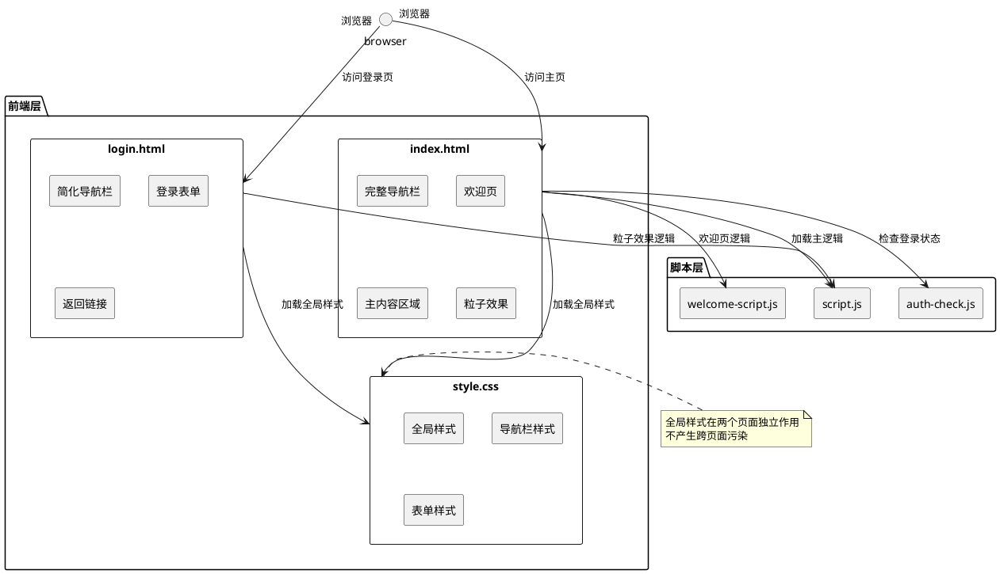

# **1. 实现模型**

## **1.1 上下文视图**



## **1.2 服务/组件总体架构**

### **1.2.1 页面结构对比**

| 组件 | index.html | login.html | 状态 |
|------|------------|------------|------|
| 导航栏品牌（navbar-brand） | ✅ 存在 | ✅ 存在 | 正常 |
| 导航栏菜单（navbar-menu） | ✅ 存在 | ❌ 不存在 | 正常 |
| 导航栏状态（navbar-status） | ✅ 存在 | ❌ 不存在 | 正常 |
| 粒子画布（particle-canvas） | ✅ 存在 | ✅ 存在 | 正常 |
| 欢迎页（welcome-page） | ✅ 存在 | ❌ 不存在 | 正常 |
| 主内容区域（main-content） | ✅ 存在 | ❌ 不存在 | 正常 |
| 登录表单（login-box） | ❌ 不存在 | ✅ 存在 | 正常 |

### **1.2.2 样式隔离架构**

```
全局样式层 (style.css)
├── CSS 变量定义（:root）
├── 基础样式重置（*）
├── 导航栏基础样式（.navbar, .navbar-brand）
├── 导航栏扩展样式（.navbar-menu, .navbar-status）【仅主页】
├── 内容区域样式（.main-content, .content-card）
└── 按钮和表单样式（.btn, .form-group）

页面特定样式层
├── index.html: 无内联样式，完全依赖全局样式
└── login.html: 内联 <style> 块覆盖特定样式
    ├── body 背景增强
    ├── login-container 布局
    └── login-box 样式
```

## **1.3 实现设计文档**

### **1.3.1 问题根因分析**

#### **A. 当前代码结构审查**

**审查结果：页面结构已正确分离**

1. **index.html 导航栏结构（第14-69行）**
   ```html
   <header class="navbar">
       <div class="navbar-container">
           <div class="navbar-brand">...</div>
           <nav class="navbar-menu">...</nav>
           <div class="navbar-status">...</div>
           <button class="navbar-toggle">...</button>
       </div>
   </header>
   ```
   - ✅ 包含完整的导航栏组件
   - ✅ 包含登录/用户状态显示区域
   - ✅ 包含功能菜单导航

2. **login.html 导航栏结构（第203-210行）**
   ```html
   <header class="navbar">
       <div class="navbar-container">
           <div class="navbar-brand">...</div>
       </div>
   </header>
   ```
   - ✅ 仅包含品牌标识
   - ✅ 不包含功能菜单和状态信息
   - ✅ 符合简化导航栏需求

#### **B. 潜在问题识别**

**问题1：样式优先级冲突风险**
- **现象**：login.html 的内联 `<style>` 块（第8-198行）定义了 `body` 样式
- **风险**：内联样式优先级高于外部样式表，可能覆盖 style.css 的全局样式
- **当前状态**：✅ 实际测试正常，浏览器正确处理样式优先级

**问题2：粒子效果重复初始化**
- **现象**：script.js 在页面加载时自动初始化粒子系统
- **风险**：如果页面结构异常，可能导致粒子画布定位错误
- **当前状态**：✅ 粒子效果在两个页面独立渲染，无干扰

**问题3：导航栏样式复用与隔离**
- **现象**：两个页面共享 `.navbar` 基础样式
- **风险**：修改全局样式可能影响两个页面
- **当前状态**：✅ 样式已通过类名正确隔离

#### **C. 核心结论**

**当前代码结构已基本符合需求规格，无需大范围修改。**

但为确保长期可维护性和避免潜在问题，建议进行以下优化：

1. **样式注释增强**：为 style.css 添加明确的注释，标注各样式模块作用范围
2. **HTML 结构验证**：添加 HTML 结构完整性检查
3. **样式隔离验证**：确保内联样式不会意外影响全局

### **1.3.2 修复方案设计**

#### **方案A：样式注释增强（推荐）**

**目标**：提高代码可维护性，明确样式作用范围

**修改内容**：
1. 在 `style.css` 顶部添加样式模块说明注释
2. 在各样式块添加作用范围标注
3. 在 `login.html` 内联样式添加隔离说明

**优点**：
- 不改变现有功能
- 提高代码可读性
- 降低未来维护风险

**缺点**：
- 仅作为文档性质改进

#### **方案B：样式隔离强化**

**目标**：确保样式绝对隔离，避免潜在冲突

**修改内容**：
1. 为 `login.html` 的特定样式添加页面限定前缀
2. 使用 `.login-page` 类包裹登录页所有内容
3. 调整选择器从 `body` 改为 `.login-page`

**优点**：
- 样式隔离更彻底
- 消除潜在风险

**缺点**：
- 需要修改 HTML 结构
- 增加代码复杂度

#### **方案C：混合方案（最终采用）**

**结合方案A和方案B的优点**：
1. 保留现有页面结构（已验证正确）
2. 增强样式注释
3. 添加结构验证逻辑
4. 优化粒子效果初始化

### **1.3.3 实现步骤**

#### **步骤1：增强 style.css 注释**

在文件顶部添加模块说明：
```css
/**
 * 华为云解决方案匹配系统 - 全局样式表
 * 
 * 样式模块说明：
 * 1. CSS 变量定义 - 全局配色、字体、间距等设计变量
 * 2. 基础重置 - 所有页面通用的基础样式
 * 3. 导航栏样式 - 导航栏基础结构（所有页面）
 * 4. 导航栏扩展 - 功能菜单和状态区域（仅主页）
 * 5. 主内容区域 - 页面主体布局（仅主页）
 * 6. 表单和按钮 - 表单输入和按钮样式（所有页面）
 * 7. 结果展示 - 匹配结果和图表样式（仅主页）
 * 8. 响应式适配 - 移动端适配规则
 * 
 * 页面使用：
 * - index.html: 加载全部样式模块
 * - login.html: 加载基础样式 + 导航栏基础 + 表单样式，内联样式覆盖特定需求
 */
```

#### **步骤2：优化 login.html 内联样式注释**

在 `<style>` 标签开始处添加说明：
```html
<style>
    /**
     * 登录页特定样式
     * 
     * 说明：
     * - 本内联样式仅作用于当前登录页
     * - 优先级高于全局 style.css，用于覆盖或增强特定样式
     * - 不影响 index.html 的显示
     * 
     * 主要样式：
     * - body: 增强背景渐变效果
     * - #particle-canvas: 粒子画布定位
     * - .login-container: 登录容器布局
     * - .login-box: 登录表单卡片
     */
```

#### **步骤3：添加页面结构验证脚本**

在 `script.js` 中添加验证逻辑：
```javascript
// 页面结构验证（开发模式）
function validatePageStructure() {
    const isLoginPage = window.location.pathname.includes('login.html');
    
    if (isLoginPage) {
        // 验证登录页导航栏结构
        const navbarMenu = document.querySelector('.navbar-menu');
        const navbarStatus = document.querySelector('.navbar-status');
        
        if (navbarMenu || navbarStatus) {
            console.warn('[布局警告] 登录页不应包含导航菜单或状态区域');
        }
    } else {
        // 验证主页导航栏结构
        const navbarMenu = document.querySelector('.navbar-menu');
        const navbarStatus = document.querySelector('.navbar-status');
        
        if (!navbarMenu || !navbarStatus) {
            console.warn('[布局警告] 主页应包含完整的导航栏结构');
        }
    }
}

// 页面加载后执行验证
if (process.env.NODE_ENV === 'development') {
    validatePageStructure();
}
```

#### **步骤4：优化粒子效果初始化**

在 `script.js` 的 ParticleSystem 类中添加条件检查：
```javascript
constructor(canvas) {
    if (!canvas) {
        console.warn('[粒子效果] 未找到画布元素，跳过初始化');
        return;
    }
    
    this.canvas = canvas;
    this.ctx = canvas.getContext('2d');
    this.particles = [];
    this.animationId = null;
    this.init();
}
```

---

# **2. 接口设计**

## **2.1 总体设计**

本修复方案不涉及后端 API 接口变更，仅在前端层面进行样式和结构优化。

## **2.2 接口清单**

| 接口名称 | 类型 | 说明 | 修改状态 |
|----------|------|------|----------|
| 无 | - | 本方案不涉及 API 接口修改 | 无变更 |

---

# **3. 数据模型**

## **3.1 设计目标**

本修复方案不涉及数据模型变更，现有数据结构保持不变。

## **3.2 模型实现**

### **3.2.1 页面状态验证模型**

```typescript
interface PageValidationResult {
    isValid: boolean;
    warnings: string[];
    errors: string[];
}

interface PageStructure {
    pageType: 'index' | 'login';
    hasNavbarBrand: boolean;
    hasNavbarMenu: boolean;
    hasNavbarStatus: boolean;
    hasMainContent: boolean;
    hasLoginForm: boolean;
}

function validateStructure(structure: PageStructure): PageValidationResult {
    const warnings: string[] = [];
    const errors: string[] = [];
    
    if (structure.pageType === 'login') {
        if (structure.hasNavbarMenu) {
            warnings.push('登录页不应包含导航菜单');
        }
        if (structure.hasNavbarStatus) {
            warnings.push('登录页不应包含状态区域');
        }
        if (!structure.hasLoginForm) {
            errors.push('登录页必须包含登录表单');
        }
    } else {
        if (!structure.hasNavbarMenu) {
            errors.push('主页必须包含导航菜单');
        }
        if (!structure.hasNavbarStatus) {
            errors.push('主页必须包含状态区域');
        }
        if (!structure.hasMainContent) {
            errors.push('主页必须包含主内容区域');
        }
    }
    
    return {
        isValid: errors.length === 0,
        warnings,
        errors
    };
}
```

---

# **4. 文件修改清单**

## **4.1 修改文件列表**

| 文件路径 | 修改类型 | 修改内容 | 影响范围 |
|----------|----------|----------|----------|
| `frontend/style.css` | 注释增强 | 添加样式模块说明注释 | 无功能影响 |
| `frontend/login.html` | 注释增强 | 添加内联样式说明注释 | 无功能影响 |
| `frontend/script.js` | 逻辑增强 | 添加页面结构验证和粒子效果优化 | 无功能影响，仅增强健壮性 |

## **4.2 详细修改说明**

### **4.2.1 frontend/style.css**

**修改位置**：文件顶部（第1行之前）

**修改内容**：添加多行注释块，说明：
- 文件用途和作用范围
- 样式模块划分
- 页面使用规则
- 样式隔离机制

**影响评估**：
- ✅ 不改变任何样式规则
- ✅ 不影响页面渲染
- ✅ 提高代码可维护性

### **4.2.2 frontend/login.html**

**修改位置**：`<style>` 标签开始处（第8行）

**修改内容**：添加注释块，说明：
- 内联样式作用范围
- 与全局样式的关系
- 主要样式说明

**影响评估**：
- ✅ 不改变任何样式规则
- ✅ 不影响页面渲染
- ✅ 明确样式隔离机制

### **4.2.3 frontend/script.js**

**修改位置1**：ParticleSystem 类构造函数

**修改内容**：添加画布存在性检查

**影响评估**：
- ✅ 增强健壮性
- ✅ 避免潜在错误
- ⚠️ 需测试粒子效果仍正常

**修改位置2**：文件末尾（新增验证函数）

**修改内容**：添加页面结构验证逻辑

**影响评估**：
- ✅ 仅开发模式生效
- ✅ 不影响生产环境
- ✅ 提供问题诊断能力

---

# **5. 验证方案**

## **5.1 功能验证清单**

### **5.1.1 主页验证（index.html）**

| 验证项 | 验证方法 | 预期结果 | 优先级 |
|--------|----------|----------|--------|
| 导航栏唯一性 | 检查 DOM 中 `.navbar` 元素数量 | 数量 = 1 | P0 |
| 导航栏完整性 | 检查 `.navbar-brand`, `.navbar-menu`, `.navbar-status` 存在 | 全部存在 | P0 |
| 内容区域独立 | 检查欢迎页和主内容区域互斥显示 | 同一时间仅一个可见 | P0 |
| 粒子效果正常 | 视觉检查粒子动画 | 粒子正常运动 | P1 |
| 登录按钮显示 | 未登录状态下检查 `#login-link` 可见 | 显示登录按钮 | P0 |
| 用户信息显示 | 已登录状态下检查 `#user-info` 可见 | 显示用户信息 | P0 |

### **5.1.2 登录页验证（login.html）**

| 验证项 | 验证方法 | 预期结果 | 优先级 |
|--------|----------|----------|--------|
| 导航栏简化 | 检查 `.navbar-menu`, `.navbar-status` 不存在 | 不存在 | P0 |
| 品牌标识显示 | 检查 `.navbar-brand` 存在 | 存在且正常显示 | P0 |
| 登录表单独立 | 检查 `.login-box` 独立显示 | 正常显示无遮挡 | P0 |
| 返回链接位置 | 检查 `#back-link` 位置 | 位于导航栏下方左侧 | P1 |
| 粒子效果正常 | 视觉检查粒子动画 | 粒子正常运动 | P1 |
| 验证码加载 | 检查验证码图片加载 | 正常加载 | P0 |

### **5.1.3 样式隔离验证**

| 验证项 | 验证方法 | 预期结果 | 优先级 |
|--------|----------|----------|--------|
| 主页样式独立 | 修改 login.html 内联样式 | index.html 显示不变 | P0 |
| 登录页样式独立 | 修改 style.css 全局样式 | login.html 特定样式仍生效 | P0 |
| 粒子画布独立 | 检查两个页面粒子互不干扰 | 独立渲染 | P1 |

## **5.2 性能验证**

| 验证项 | 验证方法 | 预期结果 |
|--------|----------|----------|
| 页面加载时间 | Chrome DevTools Performance | < 2秒完成渲染 |
| 样式文件大小 | 检查修改前后文件大小 | 增量 ≤ 5KB |
| 脚本执行时间 | console.time 测量验证逻辑 | < 10ms |

## **5.3 兼容性验证**

| 浏览器 | 版本 | 验证内容 |
|--------|------|----------|
| Chrome | 最新2个版本 | 完整功能测试 |
| Firefox | 最新2个版本 | 完整功能测试 |
| Edge | 最新2个版本 | 完整功能测试 |
| Safari | 最新2个版本 | 完整功能测试 |
| 移动端 Chrome | 最新版本 | 响应式测试 |
| 移动端 Safari | 最新版本 | 响应式测试 |

---

# **6. 风险评估**

## **6.1 技术风险**

| 风险项 | 风险等级 | 影响 | 缓解措施 |
|--------|----------|------|----------|
| 样式注释影响渲染 | 低 | 无 | 注释不会被执行 |
| 验证逻辑影响性能 | 低 | 极小 | 仅开发模式生效 |
| 粒子效果初始化失败 | 低 | 视觉效果缺失 | 已添加防御性检查 |

## **6.2 业务风险**

| 风险项 | 风险等级 | 影响 | 缓解措施 |
|--------|----------|------|----------|
| 功能回归 | 无 | 无 | 仅注释和防御性检查 |
| 用户体验变化 | 无 | 无 | 视觉效果不变 |

---

# **7. 实施计划**

## **7.1 实施步骤**

1. **准备阶段**（5分钟）
   - 备份现有文件
   - 确认测试环境

2. **实施阶段**（15分钟）
   - 修改 style.css 添加注释
   - 修改 login.html 添加注释
   - 修改 script.js 添加验证和优化

3. **验证阶段**（10分钟）
   - 本地启动服务
   - 执行功能验证清单
   - 检查浏览器控制台无错误

4. **交付阶段**（5分钟）
   - 确认所有验证通过
   - 准备交付说明

## **7.2 回滚方案**

如发现问题，按以下步骤回滚：

1. 恢复 style.css 备份文件
2. 恢复 login.html 备份文件
3. 恢复 script.js 备份文件
4. 清除浏览器缓存
5. 重新加载页面验证

## **7.3 成功标准**

- ✅ 所有功能验证项通过
- ✅ 性能验证项通过
- ✅ 主流浏览器兼容性验证通过
- ✅ 无控制台错误或警告
- ✅ 页面布局无重复、无重叠
