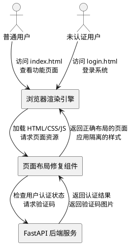
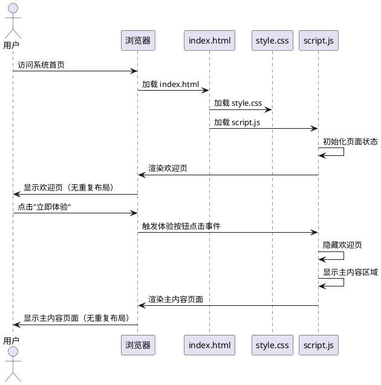
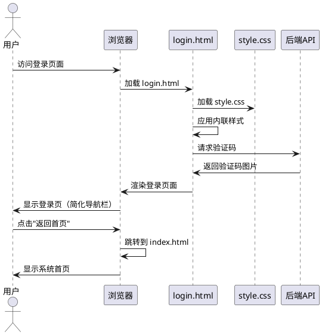
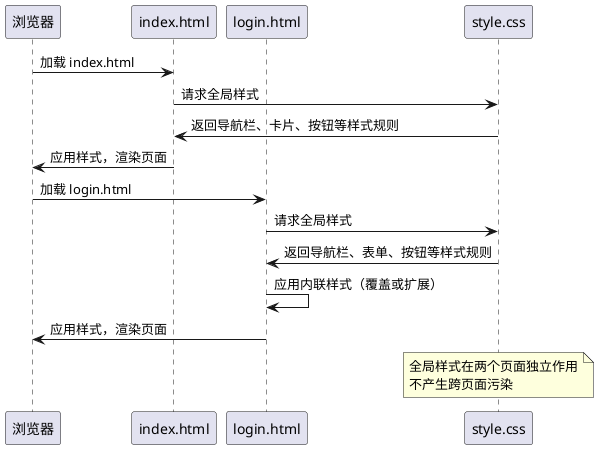
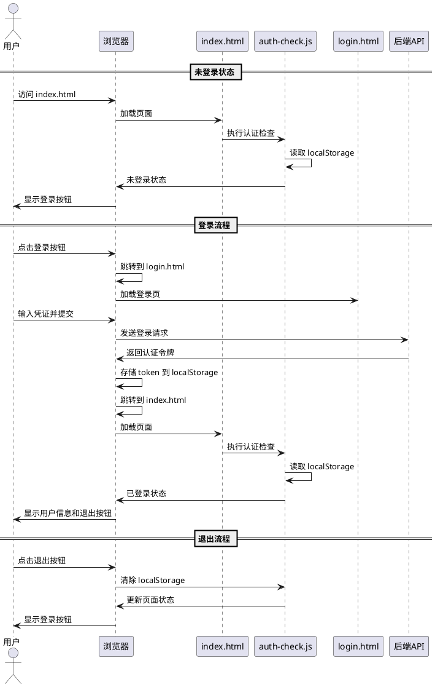

# **1. 组件定位**

## **1.1 核心职责**

本组件负责修复华为云解决方案匹配系统中登录界面引入导致的页面布局混乱问题，确保 index.html 和 login.html 页面独立、正常显示，互不干扰。

## **1.2 核心输入**

1. **用户访问请求**：用户通过浏览器访问 index.html 或 login.html 页面的 HTTP 请求
2. **页面资源加载**：浏览器加载 HTML、CSS、JavaScript 资源文件的请求
3. **登录状态检查**：auth-check.js 执行的用户认证状态检查结果
4. **导航操作**：用户在导航栏上的点击操作（页面切换、登录/退出）

## **1.3 核心输出**

1. **正常渲染的页面**：无重复、无重叠的页面布局结构
2. **独立的导航栏**：每个页面拥有符合其功能的导航栏组件
3. **正确的样式应用**：各页面元素按照设计规范正确显示
4. **功能正常的交互**：登录/退出、页面跳转等操作正常响应

## **1.4 职责边界**

本组件**不负责**以下事项：

1. 不负责修改后端 API 接口或认证逻辑
2. 不负责修改业务功能实现（解决方案匹配、竞争分析等核心功能）
3. 不负责添加新的页面或功能模块
4. 不负责优化系统性能（仅保证布局正确性）
5. 不负责修改知识库管理功能

# **2. 领域术语**

**页面布局**
: 指页面中各个 UI 元素（导航栏、内容区域、按钮等）的空间排列和层级关系。
: 备注：正常的布局应无重复、无重叠、符合设计规范。

**导航栏**
: 位于页面顶部的固定区域，包含系统标识、功能菜单、状态信息和操作按钮。
: 备注：主页导航栏功能完整，登录页导航栏应简化。

**样式隔离**
: 指 CSS 样式规则对不同页面或组件的独立作用，避免样式跨页面污染。
: 备注：通过类名前缀、作用域限定等方式实现。

**页面重复渲染**
: 指同一页面内容（如导航栏、按钮组）被错误地多次渲染，导致布局混乱的现象。

**元素重叠**
: 指不同的页面元素在视觉上占据相同的空间位置，导致内容互相遮挡的现象。

# **3. 角色与边界**

## **3.1 核心角色**

**系统管理员**：负责部署和维护系统，关注系统整体可用性和用户体验。

**普通用户**：使用系统进行解决方案匹配、竞争分析、知识库管理等操作，关注页面显示正确性和操作流畅性。

**未认证用户**：访问系统但未登录的用户，需要看到登录入口和基本功能介绍。

## **3.2 外部系统**

**浏览器渲染引擎**：接收 HTML/CSS/JavaScript 资源并渲染页面，是本组件的核心交互对象。

**FastAPI 后端服务**：提供用户认证 API、验证码生成、业务数据查询等接口。

## **3.3 交互上下文**

# **4. DFX约束**

## **4.1 性能**

1. **页面加载时间**：修复后的页面加载时间不应增加，应保持在 2 秒以内完成首次渲染。
   - 验收条件：用户访问 index.html 或 login.html → 页面在 2 秒内完成渲染

2. **资源大小**：修复过程中不应显著增加 CSS 或 JS 文件大小，单文件增量不超过 5KB。
   - 验收条件：修改 style.css → 文件大小增量 ≤ 5KB

## **4.2 可靠性**

1. **布局一致性**：修复后的页面布局应在不同浏览器（Chrome、Firefox、Edge、Safari）上保持一致。
   - 验收条件：用户在不同浏览器访问同一页面 → 布局表现一致

2. **响应式适配**：修复后的页面应在移动端（屏幕宽度 < 768px）正确显示，无横向滚动条。
   - 验收条件：移动端访问页面 → 布局自适应，无横向滚动

## **4.3 安全性**

1. **样式隔离**：修改不应引入新的安全风险，如允许通过 CSS 注入恶意代码。
   - 验收条件：审查 CSS 修改内容 → 无外部资源引用，无 expression() 等危险属性

2. **脚本执行**：修改不应影响现有的安全检查逻辑（auth-check.js）。
   - 验收条件：访问需要认证的页面 → 仍执行认证检查

## **4.4 可维护性**

1. **代码清晰性**：修改后的代码应保持清晰的结构和注释，便于后续维护。
   - 验收条件：审查修改后的 HTML/CSS → 包含清晰注释，结构分明

2. **向后兼容**：修改不应破坏现有的页面功能（解决方案匹配、竞争分析、知识库管理）。
   - 验收条件：测试现有功能模块 → 所有功能正常工作

## **4.5 兼容性**

1. **浏览器兼容**：支持主流浏览器的最新 2 个主版本。
   - 验收条件：在 Chrome、Firefox、Edge、Safari 最新版本测试 → 布局正常

2. **移动端兼容**：支持 iOS Safari 和 Android Chrome 的最新版本。
   - 验收条件：在移动设备浏览器测试 → 触摸操作正常，布局适配

# **5. 核心能力**

## **5.1 主页布局修复**

### **5.1.1 业务规则**

1. **单一导航栏**：index.html 页面必须只包含一个完整的导航栏实例，禁止重复渲染。
   - 验收条件：访问 index.html → 页面顶部只有一个导航栏

2. **内容区域分离**：欢迎页（welcome-page）、主内容区域（main-content）、Demo 选择器（demo-selector-modal）必须独立显示，不应同时可见。
   - 验收条件：首次访问 index.html → 显示欢迎页，主内容区域隐藏
   - 验收条件：点击"立即体验" → 隐藏欢迎页，显示主内容区域

3. **按钮组唯一性**：每个功能页面（解决方案匹配、竞争分析、知识库）的按钮组必须唯一，禁止重复渲染。
   - 验收条件：切换到任意功能页面 → 该页面的按钮组只显示一次

4. **元素无重叠**：页面中任意两个可见元素不应在视觉上重叠（除设计规范允许的层叠效果，如模态框遮罩）。
   - 验收条件：查看页面所有可见元素 → 无意外的视觉重叠

5. **禁止项**：禁止在 index.html 中直接嵌入 login.html 的完整内容。
   - 验收条件：审查 index.html 源码 → 无 login.html 内容的直接嵌入

### **5.1.2 交互流程**

### **5.1.3 异常场景**

1. **资源加载失败**
   - 触发条件：style.css 或 script.js 加载失败或超时
   - 系统行为：浏览器显示默认 HTML 结构，无样式应用
   - 用户感知：页面显示原始 HTML 内容，布局可能混乱，但不会出现重复元素

2. **脚本执行错误**
   - 触发条件：script.js 中存在 JavaScript 错误导致执行中断
   - 系统行为：已渲染的 DOM 结构保持不变，后续交互逻辑可能失效
   - 用户感知：页面显示异常，按钮点击无响应，但布局不会重复

3. **欢迎页状态异常**
   - 触发条件：localStorage 中保存的欢迎页状态数据损坏
   - 系统行为：script.js 捕获异常，使用默认配置（显示欢迎页）
   - 用户感知：页面正常显示欢迎页，无布局混乱

## **5.2 登录页布局修复**

### **5.2.1 业务规则**

1. **简化导航栏**：login.html 页面必须只包含简化的导航栏，仅显示系统标识（brand），不显示功能菜单和状态信息。
   - 验收条件：访问 login.html → 导航栏仅包含系统标识

2. **登录表单独立性**：登录表单（login-box）必须独立显示，不应与主页内容产生冲突或重叠。
   - 验收条件：访问 login.html → 登录表单位于页面中央，无遮挡

3. **返回链接位置**：返回首页链接（back-link）必须位于导航栏下方左侧，不遮挡登录表单。
   - 验收条件：访问 login.html → 返回链接位于左上角，与表单无重叠

4. **样式独立应用**：login.html 的自定义样式（内联 style）必须只作用于当前页面，不应影响其他页面。
   - 验收条件：在 login.html 修改内联样式 → index.html 显示不受影响

5. **禁止项**：禁止 login.html 包含主页导航栏的完整结构（navbar-menu、navbar-status）。
   - 验收条件：审查 login.html 源码 → 不包含 navbar-menu 和 navbar-status 元素

### **5.2.2 交互流程**

### **5.2.3 异常场景**

1. **验证码加载失败**
   - 触发条件：后端验证码 API 请求失败或超时
   - 系统行为：验证码图片显示占位符，登录按钮可用
   - 用户感知：验证码区域显示空白或错误提示，用户可点击刷新

2. **样式冲突**
   - 触发条件：login.html 的内联样式与 style.css 的规则冲突
   - 系统行为：浏览器根据 CSS 优先级规则应用样式（内联样式优先级更高）
   - 用户感知：页面按照 login.html 的设计显示，无异常

3. **跳转失败**
   - 触发条件：点击"返回首页"时，index.html 不存在或路径错误
   - 系统行为：浏览器显示 404 错误页面
   - 用户感知：显示"页面未找到"错误

## **5.3 样式隔离与冲突解决**

### **5.3.1 业务规则**

1. **全局样式统一**：style.css 作为全局样式文件，必须为 index.html 和 login.html 提供一致的视觉基础。
   - 验收条件：两个页面加载同一 style.css → 基础样式（字体、颜色、间距）一致

2. **页面特定样式隔离**：各页面的特定样式必须通过类名前缀或作用域限定，避免相互影响。
   - 验收条件：修改 login.html 样式 → index.html 显示不受影响

3. **导航栏样式复用**：导航栏基础样式（navbar、navbar-container、navbar-brand）应在两个页面复用，但功能组件样式应根据页面需求选择性应用。
   - 验收条件：两个页面的导航栏基础样式一致，但功能组件不同

4. **粒子效果独立**：粒子画布（particle-canvas）在两个页面独立渲染，不应互相干扰。
   - 验收条件：粒子效果在两个页面独立显示，无异常

5. **禁止项**：禁止使用全局 CSS 选择器（如 `body *`）强制覆盖样式，除非有明确的设计需求。
   - 验收条件：审查 style.css → 无过度使用的全局选择器

### **5.3.2 交互流程**

### **5.3.3 异常场景**

1. **CSS 加载顺序错误**
   - 触发条件：内联样式在 style.css 之前加载，导致优先级异常
   - 系统行为：浏览器根据加载顺序和优先级规则应用样式
   - 用户感知：页面显示可能短暂闪烁（FOUC），但最终样式正确

2. **样式规则冲突**
   - 触发条件：两个 CSS 规则对同一元素定义了不同样式，优先级相同
   - 系统行为：浏览器选择后加载的规则
   - 用户感知：页面样式可能不符合设计预期，需要调整规则优先级

3. **浏览器缓存污染**
   - 触发条件：浏览器缓存了旧版本的 style.css，导致样式不一致
   - 系统行为：浏览器应用缓存的旧样式
   - 用户感知：页面显示异常，需要强制刷新或清除缓存

## **5.4 登录状态管理修复**

### **5.4.1 业务规则**

1. **登录状态检查**：index.html 必须在页面加载时检查用户登录状态（通过 auth-check.js），并根据结果显示或隐藏登录/退出按钮。
   - 验收条件：用户已登录访问 index.html → 显示用户信息和退出按钮
   - 验收条件：用户未登录访问 index.html → 显示登录按钮

2. **登录入口可见性**：未登录用户必须能在 index.html 的导航栏中看到登录按钮，点击后跳转到 login.html。
   - 验收条件：未登录用户访问 index.html → 导航栏显示登录按钮
   - 验收条件：点击登录按钮 → 跳转到 login.html

3. **退出功能正常**：已登录用户点击退出按钮后，必须清除认证信息并更新页面显示。
   - 验收条件：点击退出按钮 → 清除 localStorage，显示登录按钮

4. **登录后跳转**：用户在 login.html 完成登录后，必须跳转到 index.html 并显示已登录状态。
   - 验收条件：登录成功 → 跳转到 index.html，显示用户信息

5. **禁止项**：禁止在 index.html 中重复渲染登录按钮或用户信息区域。
   - 验收条件：审查 index.html → login-link 和 user-info 元素唯一

### **5.4.2 交互流程**

### **5.4.3 异常场景**

1. **认证令牌过期**
   - 触发条件：localStorage 中的 access_token 已过期或无效
   - 系统行为：auth-check.js 检测到无效令牌，清除 localStorage，显示登录按钮
   - 用户感知：显示未登录状态，需要重新登录

2. **跨页面状态同步**
   - 触发条件：用户在 login.html 登录，但在新标签页打开 index.html 时状态未更新
   - 系统行为：页面加载时重新检查 localStorage
   - 用户感知：两个标签页显示一致的登录状态

3. **存储空间不足**
   - 触发条件：localStorage 已满，无法存储认证信息
   - 系统行为：登录失败，显示错误提示
   - 用户感知：显示"存储空间不足，请清除浏览器缓存后重试"

# **6. 数据约束**

## **6.1 页面状态对象**

1. **welcomePageVisible**：欢迎页是否可见，取值 true 或 false
2. **currentPage**：当前显示的功能页面，取值为 "solution"、"competitor" 或 "knowledge"
3. **skipWelcomePermanently**：是否永久跳过欢迎页，取值 true 或 false

## **6.2 用户认证对象**

1. **access_token**：JWT 认证令牌，必须为非空字符串，存储在 localStorage
2. **user_info**：用户信息对象，包含 username 字段，必须为 JSON 字符串，存储在 localStorage

## **6.3 导航栏状态对象**

1. **isLoggedIn**：用户是否已登录，取值 true 或 false
2. **userName**：用户显示名称，已登录时为非空字符串，未登录时为 null
3. **showLoginLink**：是否显示登录按钮，取值 true 或 false，未登录时为 true
4. **showUserInfo**：是否显示用户信息，取值 true 或 false，已登录时为 true

## **6.4 页面资源对象**

1. **htmlPath**：HTML 文件路径，index.html 为 "/index.html"，login.html 为 "/login.html"
2. **cssPath**：CSS 文件路径，两个页面共享 "/static/style.css"
3. **jsPath**：JavaScript 文件路径，index.html 为 ["/static/auth-check.js", "/static/script.js", "/static/welcome-script.js"]，login.html 为 ["/static/script.js"]
