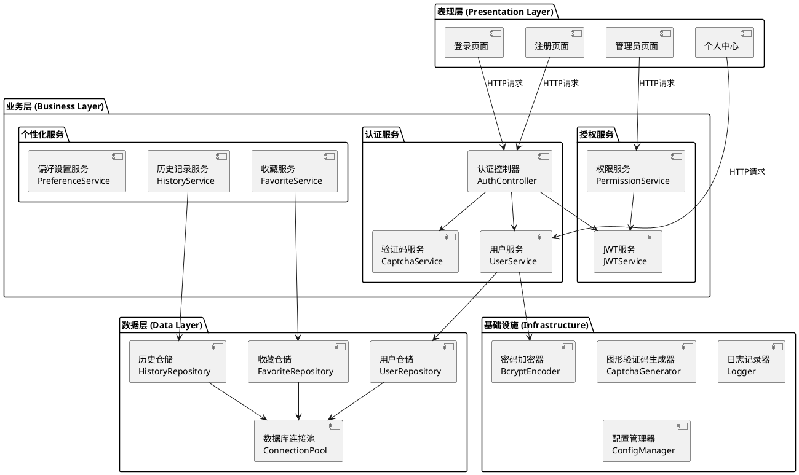

# **1. 实现模型**

## **1.1 上下文视图**

登录系统作为独立认证授权模块,与现有华为云解决方案匹配系统集成,提供统一的用户身份管理和权限控制能力。

```plantuml
@startuml
!include <archimate/Archimate>

title 登录系统上下文视图

' 业务层
rectangle "业务层" {
    actor "匿名访客" as Guest
    actor "普通用户" as User
    actor "管理员" as Admin
}

' 应用层
rectangle "应用层" {
    Archimate_ApplicationComponent "前端应用\n(HTML/CSS/JS)" as Frontend
    Archimate_ApplicationComponent "登录系统" as LoginSystem
    Archimate_ApplicationComponent "业务系统\n(匹配/分析/知识库)" as BusinessSystem
}

' 技术层
rectangle "技术层" {
    Archimate_TechnologyService "FastAPI框架" as FastAPI
    Archimate_TechnologyService "JWT认证中间件" as JWT
    Archimate_TechnologyService "SQLite数据库" as SQLite
    Archimate_TechnologyService "DeepSeek API" as DeepSeek
}

' 关系
Guest -- Frontend : 访问基础功能
User -- Frontend : 登录/个人中心
Admin -- Frontend : 用户管理

Frontend -down-> LoginSystem : 认证请求\n/api/auth/*
Frontend -down-> BusinessSystem : 业务请求\n/api/match/*\n/api/analyze/*

LoginSystem -down-> FastAPI : 运行框架
LoginSystem -down-> JWT : Token生成/验证
LoginSystem -down-> SQLite : 用户数据存取

BusinessSystem -down-> LoginSystem : Token验证\n权限校验
BusinessSystem -down-> DeepSeek : API调用
BusinessSystem -down-> SQLite : 业务数据存取

@enduml
```

## **1.2 服务/组件总体架构**

登录系统采用分层架构设计,分为表现层、业务层、数据层,各层职责清晰,通过接口解耦。

### **1.2.1 架构分层**



### **1.2.2 核心组件职责**

| 组件名称 | 职责描述 | 关键方法 |
|---------|---------|---------|
| **AuthController** | 处理认证相关HTTP请求,参数校验,响应封装 | login(), register(), logout(), refresh_token() |
| **UserService** | 用户业务逻辑,账户管理,状态控制 | create_user(), get_user(), update_user(), disable_user() |
| **CaptchaService** | 图形验证码生成,校验,过期管理 | generate_captcha(), validate_captcha() |
| **JWTService** | JWT Token生成,解析,验证,刷新 | generate_token(), verify_token(), decode_token() |
| **PermissionService** | 权限校验,角色管理,接口鉴权 | check_permission(), get_user_role(), is_admin() |
| **HistoryService** | 用户历史记录管理,查询,统计 | save_history(), get_history(), delete_history() |
| **FavoriteService** | 用户收藏管理,数量控制 | add_favorite(), remove_favorite(), get_favorites() |
| **UserRepository** | 用户数据持久化操作 | insert(), find_by_id(), find_by_username(), update() |

## **1.3 实现设计文档**

### **1.3.1 项目结构设计**

```
huawei-cloud-solution-matcher/
├── app/
│   ├── main.py                    # FastAPI应用入口,增加认证路由
│   ├── config.py                  # 配置文件,增加JWT/验证码配置
│   ├── models/                    # 数据模型层
│   │   ├── __init__.py
│   │   ├── user.py                # 用户模型定义
│   │   ├── history.py             # 历史记录模型
│   │   ├── favorite.py            # 收藏模型
│   │   └── auth.py                # 认证相关模型(Token/验证码)
│   ├── services/                  # 业务服务层
│   │   ├── __init__.py
│   │   ├── auth_service.py        # 认证服务(登录/注册/验证)
│   │   ├── user_service.py        # 用户管理服务
│   │   ├── captcha_service.py     # 验证码服务
│   │   ├── jwt_service.py         # JWT服务
│   │   ├── permission_service.py  # 权限服务
│   │   ├── history_service.py     # 历史记录服务
│   │   └── favorite_service.py    # 收藏服务
│   ├── repositories/              # 数据访问层
│   │   ├── __init__.py
│   │   ├── user_repository.py     # 用户数据访问
│   │   ├── history_repository.py  # 历史数据访问
│   │   └── favorite_repository.py # 收藏数据访问
│   ├── middlewares/               # 中间件
│   │   ├── __init__.py
│   │   ├── auth_middleware.py     # 认证中间件(Token验证)
│   │   └── rate_limit_middleware.py # 限流中间件
│   ├── utils/                     # 工具类
│   │   ├── __init__.py
│   │   ├── password_encoder.py    # 密码加密工具(bcrypt)
│   │   ├── captcha_generator.py   # 验证码生成器
│   │   └── logger.py              # 日志工具
│   └── dependencies/              # FastAPI依赖注入
│       ├── __init__.py
│       └── auth.py                # 认证依赖(get_current_user)
├── frontend/                      # 前端应用
│   ├── index.html                 # 主页(增加登录入口)
│   ├── login.html                 # 登录页面
│   ├── register.html              # 注册页面
│   ├── profile.html               # 个人中心
│   ├── admin.html                 # 管理员页面
│   ├── style.css                  # 样式文件(扩展)
│   ├── auth.js                    # 认证相关脚本
│   ├── profile.js                 # 个人中心脚本
│   └── script.js                  # 主脚本(集成认证)
├── data/
│   ├── users.db                   # SQLite数据库文件
│   └── vector_db/                 # 向量数据库(现有)
├── .env                           # 环境变量(增加JWT密钥等)
└── requirements.txt               # 依赖包(增加JWT/bcrypt等)
```

### **1.3.2 核心技术选型**

| 技术领域 | 选型方案 | 选型理由 |
|---------|---------|---------|
| **Web框架** | FastAPI | 现有系统已采用,高性能异步框架,原生支持OpenAPI文档 |
| **数据库** | SQLite | 轻量级文件数据库,无需独立服务,易于部署和迁移 |
| **ORM** | SQLAlchemy | 成熟的Python ORM,支持SQLite,提供对象化数据操作 |
| **认证方案** | JWT + OAuth2 | 无状态Token认证,支持分布式部署,符合FastAPI标准 |
| **密码加密** | Passlib[bcrypt] | 业界标准密码哈希算法,防止彩虹表攻击 |
| **验证码** | Pillow | Python图像处理库,生成图形验证码 |
| **依赖管理** | Pydantic | 数据验证和序列化,与FastAPI深度集成 |
| **日志** | Loguru | 现代日志库,异步支持,易于配置 |

### **1.3.3 配置扩展设计**

在现有`app/config.py`基础上增加以下配置项:

```python
# ==================== 认证授权配置 ====================
# JWT配置
JWT_SECRET_KEY = os.getenv("JWT_SECRET_KEY", "your-secret-key-change-in-production")
JWT_ALGORITHM = "HS256"
JWT_ACCESS_TOKEN_EXPIRE_MINUTES = int(os.getenv("JWT_ACCESS_TOKEN_EXPIRE_MINUTES", "1440"))  # 24小时

# 验证码配置
CAPTCHA_LENGTH = int(os.getenv("CAPTCHA_LENGTH", "4"))  # 验证码字符数
CAPTCHA_EXPIRE_MINUTES = int(os.getenv("CAPTCHA_EXPIRE_MINUTES", "5"))  # 验证码有效期

# 登录安全配置
MAX_LOGIN_ATTEMPTS = int(os.getenv("MAX_LOGIN_ATTEMPTS", "5"))  # 最大登录失败次数
LOCK_DURATION_MINUTES = int(os.getenv("LOCK_DURATION_MINUTES", "15"))  # 锁定时长

# 密码强度配置
MIN_PASSWORD_LENGTH = int(os.getenv("MIN_PASSWORD_LENGTH", "6"))
MAX_PASSWORD_LENGTH = int(os.getenv("MAX_PASSWORD_LENGTH", "50"))
BCRYPT_ROUNDS = int(os.getenv("BCRYPT_ROUNDS", "12"))  # bcrypt加密轮数

# 用户限制配置
MAX_FAVORITES_PER_USER = int(os.getenv("MAX_FAVORITES_PER_USER", "100"))  # 每用户最大收藏数

# 数据库配置
DATABASE_URL = os.getenv("DATABASE_URL", "sqlite:///./data/users.db")
```

# **2. 接口设计**

## **2.1 总体设计**

### **2.1.1 接口设计原则**

1. **RESTful风格**：遵循REST规范,使用标准HTTP方法(GET/POST/PUT/DELETE)
2. **统一响应格式**：所有接口返回统一的JSON响应结构
3. **版本控制**：通过URL前缀`/api/v1`管理接口版本
4. **认证标注**：在OpenAPI文档中明确标注接口认证要求
5. **错误码规范**：使用标准HTTP状态码+业务错误码

### **2.1.2 统一响应结构**

```typescript
// 成功响应
{
    "code": 200,
    "message": "success",
    "data": { ... }
}

// 错误响应
{
    "code": 40001,
    "message": "用户名已存在",
    "data": null
}

// 分页响应
{
    "code": 200,
    "message": "success",
    "data": {
        "items": [...],
        "total": 100,
        "page": 1,
        "page_size": 10
    }
}
```

### **2.1.3 认证方式说明**

| 认证级别 | 认证方式 | 适用接口 | 说明 |
|---------|---------|---------|------|
| **无认证** | 无需Token | `/api/auth/login`, `/api/auth/register` | 登录、注册、验证码等公开接口 |
| **用户认证** | Bearer Token | `/api/match/*`, `/api/history/*` | 普通用户可访问的业务接口 |
| **管理员认证** | Bearer Token + Admin Role | `/api/admin/*` | 仅管理员可访问的管理接口 |

## **2.2 接口清单**

### **2.2.1 认证接口 (/api/auth)**

#### **POST /api/auth/register** - 用户注册

**接口说明**：新用户注册账户

**认证要求**：无

**请求参数**：
```json
{
    "username": "string (3-20字符,字母数字下划线)",
    "password": "string (6-50字符)",
    "email": "string (可选,标准邮箱格式)"
}
```

**响应示例**：
```json
// 成功(201)
{
    "code": 201,
    "message": "注册成功",
    "data": {
        "user_id": "uuid-string",
        "username": "testuser",
        "role": "user",
        "created_at": "2026-05-24T16:00:00Z"
    }
}

// 失败(400) - 用户名已存在
{
    "code": 40001,
    "message": "用户名已存在",
    "data": null
}
```

#### **POST /api/auth/login** - 用户登录

**接口说明**：用户登录获取Token

**认证要求**：无

**请求参数**：
```json
{
    "username": "string",
    "password": "string",
    "captcha_id": "string (验证码ID)",
    "captcha_text": "string (用户输入的验证码)"
}
```

**响应示例**：
```json
// 成功(200)
{
    "code": 200,
    "message": "登录成功",
    "data": {
        "access_token": "eyJhbGciOiJIUzI1NiIs...",
        "token_type": "bearer",
        "expires_in": 86400,
        "user": {
            "user_id": "uuid-string",
            "username": "testuser",
            "role": "user",
            "email": "test@example.com"
        }
    }
}

// 失败(401) - 密码错误
{
    "code": 40101,
    "message": "用户名或密码错误",
    "data": {
        "remaining_attempts": 3
    }
}

// 失败(403) - 账户锁定
{
    "code": 40301,
    "message": "账户已锁定,请15分钟后再试",
    "data": {
        "locked_until": "2026-05-24T16:15:00Z"
    }
}
```

#### **GET /api/auth/captcha** - 获取验证码

**接口说明**：生成图形验证码

**认证要求**：无

**请求参数**：无

**响应示例**：
```json
{
    "code": 200,
    "message": "success",
    "data": {
        "captcha_id": "uuid-string",
        "captcha_image": "data:image/png;base64,iVBORw0KGgo..."
    }
}
```

#### **POST /api/auth/logout** - 用户登出

**接口说明**：用户登出,清除Token(客户端清除即可,服务端无状态)

**认证要求**：用户认证

**请求参数**：无

**响应示例**：
```json
{
    "code": 200,
    "message": "登出成功",
    "data": null
}
```

#### **POST /api/auth/refresh** - 刷新Token

**接口说明**：刷新Token延长有效期

**认证要求**：用户认证

**请求参数**：无

**响应示例**：
```json
{
    "code": 200,
    "message": "Token刷新成功",
    "data": {
        "access_token": "eyJhbGciOiJIUzI1NiIs...",
        "token_type": "bearer",
        "expires_in": 86400
    }
}
```

### **2.2.2 用户接口 (/api/users)**

#### **GET /api/users/me** - 获取当前用户信息

**接口说明**：获取当前登录用户的详细信息

**认证要求**：用户认证

**请求参数**：无

**响应示例**：
```json
{
    "code": 200,
    "message": "success",
    "data": {
        "user_id": "uuid-string",
        "username": "testuser",
        "email": "test@example.com",
        "role": "user",
        "status": "active",
        "created_at": "2026-05-24T16:00:00Z",
        "last_login_at": "2026-05-24T16:30:00Z"
    }
}
```

#### **PUT /api/users/me** - 更新当前用户信息

**接口说明**：更新当前用户的基本信息

**认证要求**：用户认证

**请求参数**：
```json
{
    "email": "string (可选)",
    "password": "string (可选,修改密码)"
}
```

**响应示例**：
```json
{
    "code": 200,
    "message": "更新成功",
    "data": {
        "user_id": "uuid-string",
        "username": "testuser",
        "email": "newemail@example.com"
    }
}
```

#### **POST /api/users/me/password/reset** - 重置密码

**接口说明**：通过邮箱重置密码(忘记密码功能)

**认证要求**：无(需验证邮箱)

**请求参数**：
```json
{
    "email": "string",
    "new_password": "string"
}
```

**响应示例**：
```json
{
    "code": 200,
    "message": "密码重置成功,请使用新密码登录",
    "data": null
}
```

### **2.2.3 历史记录接口 (/api/history)**

#### **GET /api/history** - 获取历史记录列表

**接口说明**：获取当前用户的历史记录,支持分页

**认证要求**：用户认证

**请求参数**：
```
?page=1&page_size=20&query_type=solution_match
```

**响应示例**：
```json
{
    "code": 200,
    "message": "success",
    "data": {
        "items": [
            {
                "history_id": "uuid-string",
                "query_type": "solution_match",
                "query_content": "制造业预测性维护需求...",
                "result_summary": "推荐方案:工业互联网解决方案...",
                "created_at": "2026-05-24T16:30:00Z"
            }
        ],
        "total": 50,
        "page": 1,
        "page_size": 20
    }
}
```

#### **DELETE /api/history/{history_id}** - 删除历史记录

**接口说明**：删除指定的历史记录

**认证要求**：用户认证

**响应示例**：
```json
{
    "code": 200,
    "message": "删除成功",
    "data": null
}
```

### **2.2.4 收藏接口 (/api/favorites)**

#### **GET /api/favorites** - 获取收藏列表

**接口说明**：获取当前用户的收藏方案列表

**认证要求**：用户认证

**请求参数**：
```
?page=1&page_size=20
```

**响应示例**：
```json
{
    "code": 200,
    "message": "success",
    "data": {
        "items": [
            {
                "favorite_id": "uuid-string",
                "solution_id": "solution-001",
                "solution_name": "工业互联网预测性维护方案",
                "solution_industry": "工业互联网",
                "created_at": "2026-05-24T16:30:00Z"
            }
        ],
        "total": 10,
        "page": 1,
        "page_size": 20
    }
}
```

#### **POST /api/favorites** - 添加收藏

**接口说明**：收藏一个方案

**认证要求**：用户认证

**请求参数**：
```json
{
    "solution_id": "string",
    "solution_name": "string",
    "solution_industry": "string"
}
```

**响应示例**：
```json
{
    "code": 201,
    "message": "收藏成功",
    "data": {
        "favorite_id": "uuid-string",
        "solution_id": "solution-001"
    }
}

// 失败(400) - 收藏已满
{
    "code": 40002,
    "message": "收藏已满,请删除部分收藏后再试",
    "data": {
        "max_favorites": 100,
        "current_count": 100
    }
}
```

#### **DELETE /api/favorites/{favorite_id}** - 删除收藏

**接口说明**：删除指定的收藏

**认证要求**：用户认证

**响应示例**：
```json
{
    "code": 200,
    "message": "删除成功",
    "data": null
}
```

### **2.2.5 管理员接口 (/api/admin)**

#### **GET /api/admin/users** - 获取用户列表

**接口说明**：管理员获取所有用户列表

**认证要求**：管理员认证

**请求参数**：
```
?page=1&page_size=20&status=active
```

**响应示例**：
```json
{
    "code": 200,
    "message": "success",
    "data": {
        "items": [
            {
                "user_id": "uuid-string",
                "username": "user001",
                "email": "user001@example.com",
                "role": "user",
                "status": "active",
                "created_at": "2026-05-24T16:00:00Z",
                "last_login_at": "2026-05-24T16:30:00Z"
            }
        ],
        "total": 150,
        "page": 1,
        "page_size": 20
    }
}
```

#### **PUT /api/admin/users/{user_id}/status** - 更新用户状态

**接口说明**：管理员启用/禁用用户账户

**认证要求**：管理员认证

**请求参数**：
```json
{
    "status": "disabled" // 或 "active"
}
```

**响应示例**：
```json
{
    "code": 200,
    "message": "用户状态更新成功",
    "data": {
        "user_id": "uuid-string",
        "status": "disabled"
    }
}
```

#### **PUT /api/admin/users/{user_id}/role** - 更新用户角色

**接口说明**：管理员修改用户角色

**认证要求**：管理员认证

**请求参数**：
```json
{
    "role": "admin" // 或 "user"
}
```

**响应示例**：
```json
{
    "code": 200,
    "message": "用户角色更新成功",
    "data": {
        "user_id": "uuid-string",
        "role": "admin"
    }
}
```

### **2.2.6 业务接口改造**

#### **POST /api/match** - 解决方案匹配(改造)

**接口说明**：匹配华为云解决方案(增加历史记录保存)

**认证要求**：可选(匿名用户可访问,登录用户自动保存历史)

**请求参数**：保持不变

**改造要点**：
1. 在请求处理前检查Token,提取用户ID
2. 执行原有匹配逻辑
3. 如果用户已登录,将匹配记录保存到历史记录表

#### **POST /api/analyze** - 竞争对手分析(改造)

**接口说明**：分析竞争对手方案(增加历史记录保存)

**认证要求**：可选

**改造要点**：同上

# **4. 数据模型**

## **4.1 设计目标**

1. **轻量级存储**：采用SQLite文件数据库,无需独立数据库服务,易于部署
2. **关系完整性**：通过外键约束保证数据一致性
3. **索引优化**：对高频查询字段建立索引,保证查询性能
4. **审计追溯**：记录创建时间和更新时间,支持数据追溯
5. **扩展性**：预留字段和表结构,支持未来功能扩展

## **4.2 模型实现**

### **4.2.1 用户表 (users)**

```sql
CREATE TABLE users (
    user_id VARCHAR(36) PRIMARY KEY,              -- UUID格式主键
    username VARCHAR(20) UNIQUE NOT NULL,         -- 用户名,唯一约束
    password_hash VARCHAR(60) NOT NULL,           -- bcrypt哈希密码
    email VARCHAR(100) UNIQUE,                    -- 邮箱,唯一约束(可选)
    role VARCHAR(10) NOT NULL DEFAULT 'user',     -- 角色:user/admin
    status VARCHAR(10) NOT NULL DEFAULT 'active', -- 状态:active/disabled/locked
    failed_login_count INTEGER DEFAULT 0,         -- 登录失败计数
    locked_until TIMESTAMP,                       -- 锁定截止时间
    created_at TIMESTAMP NOT NULL,                -- 注册时间
    updated_at TIMESTAMP NOT NULL,                -- 更新时间
    last_login_at TIMESTAMP,                      -- 最后登录时间
    
    -- 约束
    CONSTRAINT chk_role CHECK (role IN ('user', 'admin')),
    CONSTRAINT chk_status CHECK (status IN ('active', 'disabled', 'locked'))
);

-- 索引
CREATE INDEX idx_users_username ON users(username);
CREATE INDEX idx_users_email ON users(email);
CREATE INDEX idx_users_status ON users(status);
```

### **4.2.2 历史记录表 (history)**

```sql
CREATE TABLE history (
    history_id VARCHAR(36) PRIMARY KEY,           -- UUID格式主键
    user_id VARCHAR(36) NOT NULL,                 -- 所属用户ID
    query_type VARCHAR(20) NOT NULL,              -- 查询类型
    query_content TEXT NOT NULL,                  -- 查询内容
    result_summary TEXT NOT NULL,                 -- 结果摘要
    created_at TIMESTAMP NOT NULL,                -- 创建时间
    
    -- 外键约束
    FOREIGN KEY (user_id) REFERENCES users(user_id) ON DELETE CASCADE,
    
    -- 约束
    CONSTRAINT chk_query_type CHECK (query_type IN ('solution_match', 'competitor_analysis'))
);

-- 索引
CREATE INDEX idx_history_user_id ON history(user_id);
CREATE INDEX idx_history_created_at ON history(created_at);
CREATE INDEX idx_history_user_created ON history(user_id, created_at DESC);
```

### **4.2.3 收藏表 (favorites)**

```sql
CREATE TABLE favorites (
    favorite_id VARCHAR(36) PRIMARY KEY,          -- UUID格式主键
    user_id VARCHAR(36) NOT NULL,                 -- 所属用户ID
    solution_id VARCHAR(200) NOT NULL,            -- 方案标识
    solution_name VARCHAR(200) NOT NULL,          -- 方案名称
    solution_industry VARCHAR(50) NOT NULL,       -- 所属行业
    created_at TIMESTAMP NOT NULL,                -- 收藏时间
    
    -- 外键约束
    FOREIGN KEY (user_id) REFERENCES users(user_id) ON DELETE CASCADE,
    
    -- 唯一约束(防止重复收藏)
    CONSTRAINT uk_user_solution UNIQUE (user_id, solution_id)
);

-- 索引
CREATE INDEX idx_favorites_user_id ON favorites(user_id);
CREATE INDEX idx_favorites_created_at ON favorites(created_at);
```

### **4.2.4 用户偏好设置表 (user_preferences)**

```sql
CREATE TABLE user_preferences (
    preference_id VARCHAR(36) PRIMARY KEY,        -- UUID格式主键
    user_id VARCHAR(36) UNIQUE NOT NULL,          -- 所属用户ID,一对一
    default_industry VARCHAR(50),                 -- 默认行业
    display_mode VARCHAR(10) DEFAULT 'light',     -- 显示模式:light/dark
    language VARCHAR(10) DEFAULT 'zh-CN',         -- 界面语言
    updated_at TIMESTAMP NOT NULL,                -- 更新时间
    
    -- 外键约束
    FOREIGN KEY (user_id) REFERENCES users(user_id) ON DELETE CASCADE,
    
    -- 约束
    CONSTRAINT chk_display_mode CHECK (display_mode IN ('light', 'dark'))
);

-- 索引
CREATE INDEX idx_preferences_user_id ON user_preferences(user_id);
```

### **4.2.5 验证码表 (captchas)**

```sql
CREATE TABLE captchas (
    captcha_id VARCHAR(36) PRIMARY KEY,           -- UUID格式主键
    captcha_text VARCHAR(6) NOT NULL,             -- 验证码文本
    created_at TIMESTAMP NOT NULL,                -- 生成时间
    is_used BOOLEAN DEFAULT FALSE,                -- 是否已使用
    
    -- 索引(用于快速清理过期验证码)
    CREATE INDEX idx_captchas_created_at ON captchas(created_at);
);
```

### **4.2.6 登录日志表 (login_logs)**

```sql
CREATE TABLE login_logs (
    log_id VARCHAR(36) PRIMARY KEY,               -- UUID格式主键
    user_id VARCHAR(36),                          -- 用户ID(可能为空)
    username VARCHAR(20) NOT NULL,                -- 登录用户名
    login_result VARCHAR(20) NOT NULL,            -- 登录结果
    ip_address VARCHAR(50) NOT NULL,              -- 客户端IP
    user_agent TEXT,                              -- 浏览器信息
    created_at TIMESTAMP NOT NULL,                -- 登录时间
    
    -- 约束
    CONSTRAINT chk_login_result CHECK (login_result IN (
        'success', 
        'failed_captcha', 
        'failed_password', 
        'account_locked'
    ))
);

-- 索引
CREATE INDEX idx_login_logs_user_id ON login_logs(user_id);
CREATE INDEX idx_login_logs_created_at ON login_logs(created_at);
CREATE INDEX idx_login_logs_ip ON login_logs(ip_address);
```

### **4.2.7 数据库初始化脚本**

```python
# app/utils/db_init.py

from sqlalchemy import create_engine, text
from app.config import DATABASE_URL

def init_database():
    """初始化数据库表结构"""
    engine = create_engine(DATABASE_URL)
    
    # 创建所有表
    with engine.connect() as conn:
        # 用户表
        conn.execute(text("""
            CREATE TABLE IF NOT EXISTS users (
                user_id VARCHAR(36) PRIMARY KEY,
                username VARCHAR(20) UNIQUE NOT NULL,
                password_hash VARCHAR(60) NOT NULL,
                email VARCHAR(100) UNIQUE,
                role VARCHAR(10) NOT NULL DEFAULT 'user',
                status VARCHAR(10) NOT NULL DEFAULT 'active',
                failed_login_count INTEGER DEFAULT 0,
                locked_until TIMESTAMP,
                created_at TIMESTAMP NOT NULL,
                updated_at TIMESTAMP NOT NULL,
                last_login_at TIMESTAMP,
                CONSTRAINT chk_role CHECK (role IN ('user', 'admin')),
                CONSTRAINT chk_status CHECK (status IN ('active', 'disabled', 'locked'))
            )
        """))
        
        # 历史记录表
        conn.execute(text("""
            CREATE TABLE IF NOT EXISTS history (
                history_id VARCHAR(36) PRIMARY KEY,
                user_id VARCHAR(36) NOT NULL,
                query_type VARCHAR(20) NOT NULL,
                query_content TEXT NOT NULL,
                result_summary TEXT NOT NULL,
                created_at TIMESTAMP NOT NULL,
                FOREIGN KEY (user_id) REFERENCES users(user_id) ON DELETE CASCADE,
                CONSTRAINT chk_query_type CHECK (query_type IN ('solution_match', 'competitor_analysis'))
            )
        """))
        
        # 收藏表
        conn.execute(text("""
            CREATE TABLE IF NOT EXISTS favorites (
                favorite_id VARCHAR(36) PRIMARY KEY,
                user_id VARCHAR(36) NOT NULL,
                solution_id VARCHAR(200) NOT NULL,
                solution_name VARCHAR(200) NOT NULL,
                solution_industry VARCHAR(50) NOT NULL,
                created_at TIMESTAMP NOT NULL,
                FOREIGN KEY (user_id) REFERENCES users(user_id) ON DELETE CASCADE,
                CONSTRAINT uk_user_solution UNIQUE (user_id, solution_id)
            )
        """))
        
        # 用户偏好设置表
        conn.execute(text("""
            CREATE TABLE IF NOT EXISTS user_preferences (
                preference_id VARCHAR(36) PRIMARY KEY,
                user_id VARCHAR(36) UNIQUE NOT NULL,
                default_industry VARCHAR(50),
                display_mode VARCHAR(10) DEFAULT 'light',
                language VARCHAR(10) DEFAULT 'zh-CN',
                updated_at TIMESTAMP NOT NULL,
                FOREIGN KEY (user_id) REFERENCES users(user_id) ON DELETE CASCADE,
                CONSTRAINT chk_display_mode CHECK (display_mode IN ('light', 'dark'))
            )
        """))
        
        # 验证码表
        conn.execute(text("""
            CREATE TABLE IF NOT EXISTS captchas (
                captcha_id VARCHAR(36) PRIMARY KEY,
                captcha_text VARCHAR(6) NOT NULL,
                created_at TIMESTAMP NOT NULL,
                is_used BOOLEAN DEFAULT FALSE
            )
        """))
        
        # 登录日志表
        conn.execute(text("""
            CREATE TABLE IF NOT EXISTS login_logs (
                log_id VARCHAR(36) PRIMARY KEY,
                user_id VARCHAR(36),
                username VARCHAR(20) NOT NULL,
                login_result VARCHAR(20) NOT NULL,
                ip_address VARCHAR(50) NOT NULL,
                user_agent TEXT,
                created_at TIMESTAMP NOT NULL,
                CONSTRAINT chk_login_result CHECK (login_result IN (
                    'success', 'failed_captcha', 'failed_password', 'account_locked'
                ))
            )
        """))
        
        # 创建索引
        indexes = [
            "CREATE INDEX IF NOT EXISTS idx_users_username ON users(username)",
            "CREATE INDEX IF NOT EXISTS idx_users_email ON users(email)",
            "CREATE INDEX IF NOT EXISTS idx_users_status ON users(status)",
            "CREATE INDEX IF NOT EXISTS idx_history_user_id ON history(user_id)",
            "CREATE INDEX IF NOT EXISTS idx_history_created_at ON history(created_at)",
            "CREATE INDEX IF NOT EXISTS idx_history_user_created ON history(user_id, created_at DESC)",
            "CREATE INDEX IF NOT EXISTS idx_favorites_user_id ON favorites(user_id)",
            "CREATE INDEX IF NOT EXISTS idx_favorites_created_at ON favorites(created_at)",
            "CREATE INDEX IF NOT EXISTS idx_preferences_user_id ON user_preferences(user_id)",
            "CREATE INDEX IF NOT EXISTS idx_captchas_created_at ON captchas(created_at)",
            "CREATE INDEX IF NOT EXISTS idx_login_logs_user_id ON login_logs(user_id)",
            "CREATE INDEX IF NOT EXISTS idx_login_logs_created_at ON login_logs(created_at)",
            "CREATE INDEX IF NOT EXISTS idx_login_logs_ip ON login_logs(ip_address)"
        ]
        
        for index_sql in indexes:
            conn.execute(text(index_sql))
        
        conn.commit()
    
    print("✅ 数据库初始化完成")

if __name__ == "__main__":
    init_database()
```

### **4.2.8 默认管理员账户初始化**

```python
# app/utils/admin_init.py

import uuid
from datetime import datetime
from sqlalchemy import create_engine, text
from app.config import DATABASE_URL
from app.utils.password_encoder import PasswordEncoder

def init_admin_account():
    """初始化默认管理员账户"""
    encoder = PasswordEncoder()
    engine = create_engine(DATABASE_URL)
    
    # 检查是否已存在管理员
    with engine.connect() as conn:
        result = conn.execute(text("SELECT COUNT(*) FROM users WHERE role = 'admin'"))
        admin_count = result.scalar()
        
        if admin_count == 0:
            # 创建默认管理员
            admin_user = {
                "user_id": str(uuid.uuid4()),
                "username": "admin",
                "password_hash": encoder.encode("admin123"),  # 默认密码
                "role": "admin",
                "status": "active",
                "created_at": datetime.utcnow(),
                "updated_at": datetime.utcnow()
            }
            
            conn.execute(text("""
                INSERT INTO users (user_id, username, password_hash, role, status, created_at, updated_at)
                VALUES (:user_id, :username, :password_hash, :role, :status, :created_at, :updated_at)
            """), admin_user)
            
            conn.commit()
            print("✅ 默认管理员账户创建成功")
            print("   用户名: admin")
            print("   密码: admin123")
            print("   ⚠️  请在生产环境中修改默认密码!")
        else:
            print("ℹ️  已存在管理员账户,跳过初始化")

if __name__ == "__main__":
    init_admin_account()
```
