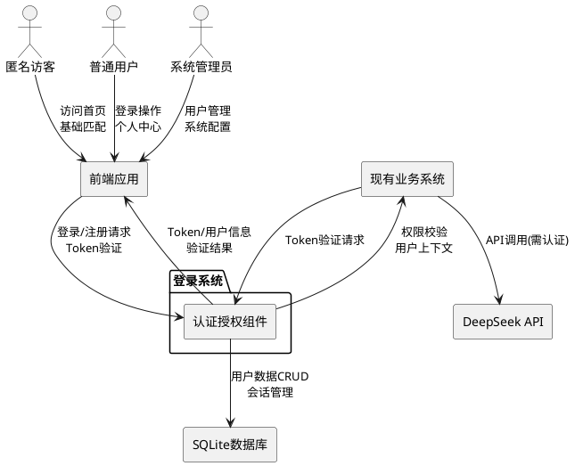
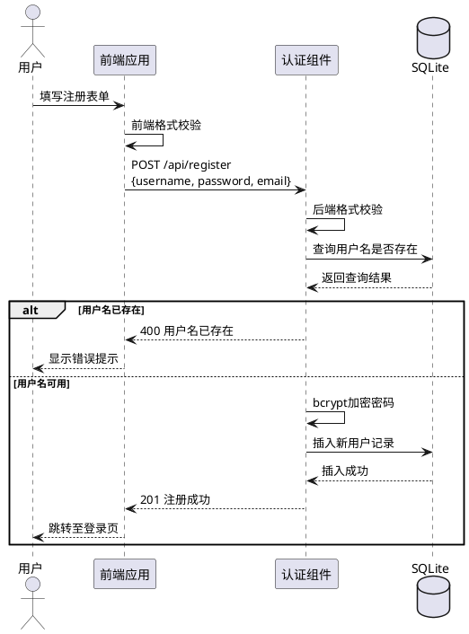
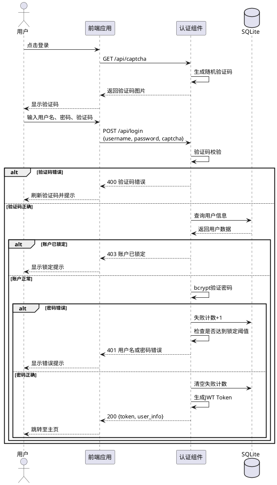
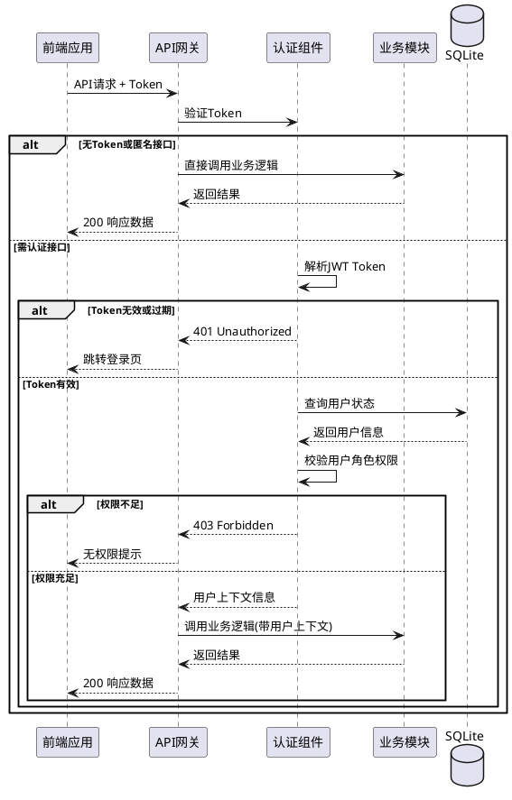
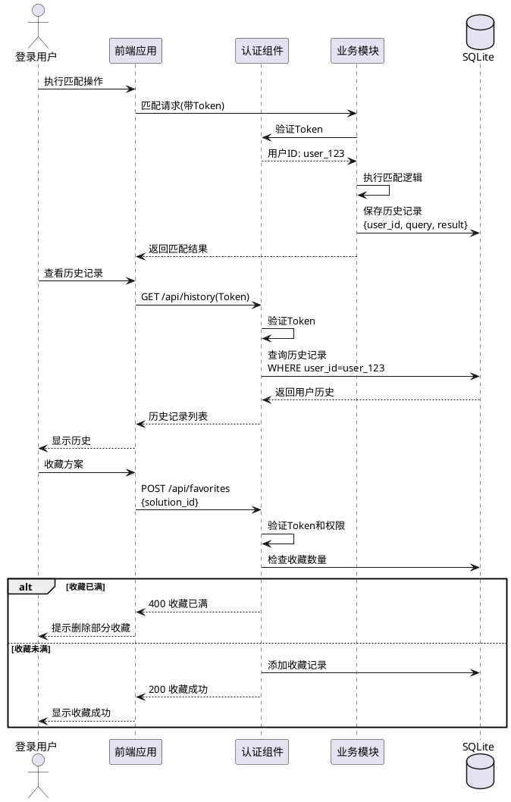
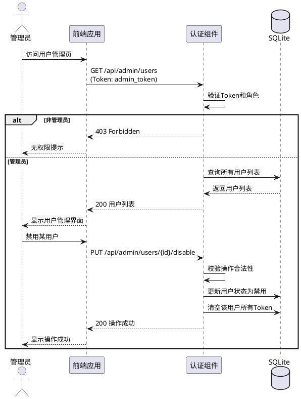

# **1. 组件定位**

## **1.1 核心职责**

本组件负责管理用户身份认证与授权，实现用户登录、注册、权限控制及个性化功能支撑，确保系统安全访问与用户数据隔离。

## **1.2 核心输入**

1. **用户注册请求**：来自前端的新用户注册表单，包含用户名、密码、邮箱等信息
2. **用户登录请求**：来自前端的用户登录表单，包含用户名、密码和图形验证码
3. **Token验证请求**：来自各业务模块的JWT Token验证请求
4. **权限校验请求**：来自API网关的用户权限查询请求
5. **密码重置请求**：来自前端的忘记密码功能请求
6. **用户信息更新请求**：来自个人中心的用户信息修改请求

## **1.3 核心输出**

1. **认证成功响应**：返回JWT Token、用户基本信息、权限列表
2. **认证失败响应**：返回错误码、失败原因、剩余尝试次数
3. **用户信息响应**：返回用户详细资料、历史记录、收藏方案列表
4. **权限验证结果**：返回权限校验通过/失败状态
5. **图形验证码图片**：返回验证码图片数据流
6. **操作结果通知**：返回注册/修改/重置等操作的成功或失败提示

## **1.4 职责边界**

1. 本组件不负责业务数据的增删改查（如解决方案匹配、竞争分析等）
2. 本组件不负责知识库管理、文档处理等核心业务逻辑
3. 本组件不负责支付、订单等财务相关功能
4. 本组件不负责系统监控、日志分析等运维功能

# **2. 领域术语**

**用户账户**
: 系统中注册用户的身份标识,包含用户名、密码(加密存储)、邮箱、角色等基本信息。

**JWT Token**
: 基于JSON Web Token标准的身份认证令牌,用于在无状态HTTP请求中传递用户身份信息。

**图形验证码**
: 用于防止暴力破解的图形化人机验证机制,包含随机生成的字符和干扰线。

**角色**
: 用户权限的分组标识,本系统包含管理员(Admin)和普通用户(User)两种角色。

**登录锁定**
: 为防止暴力破解,当用户连续登录失败达到阈值后临时禁止登录的安全机制。

**个性化功能**
: 登录用户可使用的高级功能,包括历史记录保存、方案收藏、个人偏好设置等。

**匿名用户**
: 未登录访客用户,仅可使用基础的解决方案匹配功能,无法保存数据。

**会话有效期**
: JWT Token的有效时间窗口,过期后需重新登录获取新Token。

# **3. 角色与边界**

## **3.1 核心角色**

**匿名访客**：未登录用户,可访问系统首页和基础匹配功能,无法使用个性化功能。

**普通用户**：已登录的标准用户,可使用所有匹配功能,保存历史记录和收藏方案。

**系统管理员**：具有管理权限的用户,可查看用户列表、管理知识库、配置系统参数。

## **3.2 外部系统**

**前端应用**：基于原生HTML/CSS/JavaScript的单页应用,通过HTTP API与本组件交互。

**DeepSeek API**：大语言模型服务,本组件需在用户认证后为其调用提供权限校验。

**SQLite数据库**：轻量级文件数据库,存储用户信息、角色、历史记录等持久化数据。

**现有业务系统**：已有的解决方案匹配、竞争分析、知识库管理等功能模块。

## **3.3 交互上下文**

# **4. DFX约束**

## **4.1 性能**

1. **登录响应时间**：正常情况下登录请求响应时间不得超过2秒
2. **Token验证时间**：Token验证接口响应时间不得超过100毫秒
3. **验证码生成时间**：图形验证码生成时间不得超过500毫秒
4. **并发支持**：系统需支持至少100个并发登录请求
5. **数据库查询优化**：用户查询需建立索引,单次查询时间不超过50毫秒

## **4.2 可靠性**

1. **系统可用性**：登录系统可用性不低于99.5%
2. **数据持久化**：用户数据需实时持久化,不得因系统重启丢失
3. **Token容错**：Token验证失败时需返回明确的错误信息,不得导致系统崩溃
4. **并发安全**：多个并发登录请求不得导致用户数据不一致
5. **故障恢复**：数据库连接失败时需返回友好错误提示,并记录日志

## **4.3 安全性**

1. **密码加密**：用户密码必须使用bcrypt算法加密存储,加密强度不低于12轮
2. **验证码防护**：登录必须输入正确的图形验证码,防止自动化攻击
3. **登录锁定**：连续5次登录失败后锁定账户15分钟
4. **Token有效期**：JWT Token有效期不超过24小时,过期后必须重新登录
5. **传输安全**：生产环境必须使用HTTPS协议传输敏感数据
6. **SQL注入防护**：所有数据库查询必须使用参数化查询,防止SQL注入
7. **XSS防护**：用户输入数据必须进行转义处理,防止XSS攻击
8. **权限隔离**：普通用户不得访问管理员功能,需进行接口级别的权限校验

## **4.4 可维护性**

1. **日志记录**：所有登录、注册、权限校验操作需记录详细日志
2. **错误追踪**：异常情况需记录堆栈信息和上下文数据
3. **配置管理**：Token有效期、锁定时间等参数需支持配置文件管理
4. **数据库迁移**：数据库结构变更需提供迁移脚本
5. **接口文档**：所有API接口需提供OpenAPI规范文档

## **4.5 兼容性**

1. **浏览器支持**：支持Chrome、Firefox、Edge、Safari等主流浏览器的最新3个版本
2. **移动端适配**：登录页面需适配移动端设备,响应式布局
3. **API版本控制**：接口变更需保持向后兼容,通过版本号管理
4. **数据迁移**：支持从旧版本用户数据迁移,不丢失历史记录

# **5. 核心能力**

## **5.1 用户注册**

### **5.1.1 业务规则**

1. **用户名唯一性校验**：用户注册时,用户名在系统中必须唯一,不得与已注册用户重复
   a. 验收条件：[提交已存在的用户名] → [返回错误提示"用户名已存在"]

2. **用户名格式校验**：用户名长度必须在3-20个字符之间,仅允许字母、数字、下划线
   a. 验收条件：[提交包含特殊字符的用户名] → [返回格式错误提示]
   b. 验收条件：[提交长度不符合要求的用户名] → [返回长度限制提示]

3. **密码强度校验**：密码长度必须在6-50个字符之间,建议包含字母和数字
   a. 验收条件：[提交长度不足的密码] → [返回密码强度不足提示]

4. **邮箱格式校验**：如填写邮箱,必须符合标准邮箱格式
   a. 验收条件：[提交格式错误的邮箱] → [返回邮箱格式错误提示]

5. **密码加密存储**：用户密码必须使用bcrypt算法加密后方可存储到数据库
   a. 验收条件：[查看数据库] → [密码字段为bcrypt哈希值,非明文]

6. **默认角色分配**：新注册用户自动分配"普通用户"角色,不得自动获得管理员权限
   a. 验收条件：[新用户注册成功] → [用户角色为User,非Admin]

7. **注册时间记录**：系统必须记录用户的注册时间,用于审计和统计
   a. 验收条件：[注册成功] → [数据库中记录创建时间戳]

### **5.1.2 交互流程**

### **5.1.3 异常场景**

1. **用户名重复**
   a. 触发条件：[提交的邮箱已被其他用户注册]
   b. 系统行为：[拒绝注册请求,不创建新用户]
   c. 用户感知：[错误提示"用户名已存在,请更换或直接登录"]

2. **数据库写入失败**
   a. 触发条件：[数据库连接异常或磁盘空间不足]
   b. 系统行为：[记录错误日志,回滚事务]
   c. 用户感知：[错误提示"注册失败,请稍后重试"]

3. **输入数据包含恶意代码**
   a. 触发条件：[用户输入包含SQL注入或XSS攻击代码]
   b. 系统行为：[过滤或拒绝恶意输入,记录安全日志]
   c. 用户感知：[错误提示"输入数据包含非法字符"]

## **5.2 用户登录**

### **5.2.1 业务规则**

1. **验证码必填校验**：登录时必须输入图形验证码,未输入或输入错误均拒绝登录
   a. 验收条件：[未输入验证码登录] → [返回错误提示"请输入验证码"]
   b. 验收条件：[输入错误验证码] → [返回错误提示"验证码错误"]

2. **验证码时效性**：图形验证码生成后5分钟内有效,过期需重新获取
   a. 验收条件：[使用过期验证码] → [返回错误提示"验证码已过期"]

3. **账户锁定检查**：登录前需检查账户是否被锁定,锁定期内拒绝登录尝试
   a. 验收条件：[锁定期内登录] → [返回错误提示"账户已锁定,请X分钟后再试"]

4. **用户名存在性校验**：输入的用户名必须在系统中存在
   a. 验收条件：[输入不存在的用户名] → [返回错误提示"用户名或密码错误"]

5. **密码正确性校验**：输入的密码必须与数据库中bcrypt加密后的密码匹配
   a. 验收条件：[输入错误密码] → [失败计数+1,返回错误提示]

6. **失败计数管理**：连续登录失败5次后锁定账户15分钟
   a. 验收条件：[第5次登录失败] → [锁定账户15分钟,清空失败计数]
   b. 验收条件：[登录成功] → [清空失败计数]

7. **JWT Token生成**：登录成功后必须生成包含用户ID、角色、过期时间的JWT Token
   a. 验收条件：[登录成功] → [返回JWT Token,有效期24小时]

8. **登录日志记录**：每次登录尝试(成功或失败)均需记录日志
   a. 验收条件：[登录操作] → [日志中记录时间、IP、结果]

### **5.2.2 交互流程**

### **5.2.3 异常场景**

1. **验证码过期**
   a. 触发条件：[验证码生成超过5分钟后使用]
   b. 系统行为：[拒绝登录,标记验证码失效]
   c. 用户感知：[错误提示"验证码已过期,请刷新"]

2. **账户被锁定**
   a. 触发条件：[用户连续5次登录失败]
   b. 系统行为：[拒绝登录,返回剩余锁定时间]
   c. 用户感知：[错误提示"账户已锁定,请15分钟后再试"]

3. **数据库查询失败**
   a. 触发条件：[数据库连接异常]
   b. 系统行为：[记录错误日志,返回通用错误]
   c. 用户感知：[错误提示"系统异常,请稍后重试"]

4. **并发登录冲突**
   a. 触发条件：[同一用户在多个设备同时登录]
   b. 系统行为：[允许并发登录,生成不同Token]
   c. 用户感知：[各设备均可正常使用,无冲突提示]

## **5.3 Token认证与权限控制**

### **5.3.1 业务规则**

1. **Token格式校验**：系统必须校验JWT Token的格式完整性(Header.Payload.Signature)
   a. 验收条件：[提交格式错误的Token] → [返回401 Unauthorized]

2. **Token签名验证**：必须使用系统密钥验证JWT签名,防止Token伪造
   a. 验收条件：[提交伪造签名的Token] → [返回401 Unauthorized]

3. **Token有效期验证**：Token过期时间必须在当前时间之后
   a. 验收条件：[提交过期Token] → [返回401 Token已过期]

4. **用户状态验证**：Token对应的用户必须处于正常状态(未被禁用)
   a. 验收条件：[用户已被禁用] → [返回403 用户已被禁用]

5. **角色权限映射**：根据用户角色授予对应的功能权限
   a. 验收条件：[普通用户访问管理接口] → [返回403 无权限]
   b. 验收条件：[管理员访问管理接口] → [允许访问]

6. **接口权限标注**：所有需要认证的接口必须标注所需权限级别
   a. 验收条件：[未登录访问需认证接口] → [返回401 未登录]

7. **匿名接口开放**：基础匹配功能接口必须对匿名用户开放
   a. 验收条件：[匿名用户访问基础匹配接口] → [允许访问,无需Token]

### **5.3.2 交互流程**

### **5.3.3 异常场景**

1. **Token缺失**
   a. 触发条件：[访问需认证接口但未携带Token]
   b. 系统行为：[拒绝请求,返回401状态码]
   c. 用户感知：[错误提示"请先登录"]

2. **Token过期**
   a. 触发条件：[Token超过24小时有效期]
   b. 系统行为：[拒绝请求,清除前端Token]
   c. 用户感知：[自动跳转登录页,提示"登录已过期"]

3. **Token被篡改**
   a. 触发条件：[Token签名验证失败]
   b. 系统行为：[拒绝请求,记录安全日志]
   c. 用户感知：[错误提示"认证信息无效"]

4. **用户被禁用**
   a. 触发条件：[Token对应账户被管理员禁用]
   b. 系统行为：[拒绝请求,拒绝生成新Token]
   c. 用户感知：[错误提示"账户已被禁用,请联系管理员"]

## **5.4 个性化功能管理**

### **5.4.1 业务规则**

1. **历史记录自动保存**：登录用户的匹配操作必须自动保存到历史记录
   a. 验收条件：[用户执行匹配操作] → [历史记录表中新增记录]

2. **历史记录归属校验**：用户只能查看自己的历史记录,不得查看其他用户数据
   a. 验收条件：[查询其他用户历史] → [返回403无权限]

3. **收藏方案数量限制**：每个用户最多可收藏100个方案,超出需删除部分收藏
   a. 验收条件：[收藏数达到100个] → [提示"收藏已满,请删除部分收藏"]

4. **匿名用户限制**：匿名用户不得使用历史记录和收藏功能
   a. 验收条件：[匿名用户访问个性化功能] → [提示"请登录后使用"]

5. **数据隔离规则**：不同用户的历史记录和收藏数据必须严格隔离
   a. 验收条件：[查询用户A数据] → [仅返回用户A的数据,不含用户B数据]

6. **个人偏好保存**：用户可保存界面偏好设置(如默认行业、显示模式等)
   a. 验收条件：[用户修改偏好设置] → [保存至用户配置表]

### **5.4.2 交互流程**

### **5.4.3 异常场景**

1. **历史记录查询失败**
   a. 触发条件：[数据库查询异常或超时]
   b. 系统行为：[返回空列表,记录错误日志]
   c. 用户感知：[提示"加载历史记录失败"]

2. **收藏方案已存在**
   a. 触发条件：[重复收藏同一方案]
   b. 系统行为：[拒绝重复添加,返回已收藏状态]
   c. 用户感知：[提示"该方案已在收藏列表中"]

3. **数据归属校验失败**
   a. 触发条件：[用户尝试访问其他用户的收藏]
   b. 系统行为：[拒绝访问,记录安全日志]
   c. 用户感知：[错误提示"无权访问此数据"]

## **5.5 用户管理(管理员功能)**

### **5.5.1 业务规则**

1. **管理员权限校验**：只有管理员角色可访问用户管理功能
   a. 验收条件：[普通用户访问用户管理] → [返回403无权限]

2. **用户列表查询**：管理员可查看所有用户的列表,包含用户名、角色、注册时间、状态
   a. 验收条件：[管理员请求用户列表] → [返回完整用户列表]

3. **用户状态管理**：管理员可启用或禁用用户账户
   a. 验收条件：[管理员禁用用户] → [用户无法登录,Token失效]

4. **角色分配权限**：仅管理员可修改用户角色
   a. 验收条件：[管理员修改用户角色] → [更新用户角色,记录操作日志]

5. **禁止删除管理员**：系统至少保留一个管理员账户,不得删除最后一个管理员
   a. 验收条件：[尝试删除唯一管理员] → [返回错误"系统至少需保留一个管理员"]

### **5.5.2 交互流程**

### **5.5.3 异常场景**

1. **非管理员访问**
   a. 触发条件：[普通用户尝试访问用户管理接口]
   b. 系统行为：[拒绝请求,记录安全日志]
   c. 用户感知：[错误提示"无管理员权限"]

2. **管理员自删除**
   a. 触发条件：[管理员尝试删除自己的账户]
   b. 系统行为：[拒绝删除]
   c. 用户感知：[错误提示"不能删除自己的账户"]

3. **用户数据篡改**
   a. 触发条件：[尝试修改其他管理员的权限]
   b. 系统行为：[记录安全日志,拒绝修改]
   c. 用户感知：[错误提示"无权修改其他管理员"]

# **6. 数据约束**

## **6.1 用户账户(User)**

1. **user_id**：用户唯一标识,UUID格式,系统自动生成,不可修改
2. **username**：用户名,长度3-20字符,仅允许字母数字下划线,全局唯一,必填
3. **password_hash**：密码哈希值,bcrypt加密存储,长度60字符,必填
4. **email**：邮箱地址,标准邮箱格式,可选,如填写需唯一
5. **role**：用户角色,枚举值["user", "admin"],默认"user",必填
6. **status**：账户状态,枚举值["active", "disabled", "locked"],默认"active",必填
7. **failed_login_count**：登录失败计数,整数,默认0,范围0-5
8. **locked_until**：锁定截止时间,时间戳格式,未锁定时为NULL
9. **created_at**：注册时间,时间戳格式,系统自动生成,必填
10. **updated_at**：最后更新时间,时间戳格式,每次更新自动刷新,必填
11. **last_login_at**：最后登录时间,时间戳格式,登录成功时更新

## **6.2 历史记录(History)**

1. **history_id**：历史记录唯一标识,UUID格式,系统自动生成
2. **user_id**：所属用户ID,外键关联User表,必填
3. **query_type**：查询类型,枚举值["solution_match", "competitor_analysis"],必填
4. **query_content**：查询内容,文本格式,最大长度2000字符,必填
5. **result_summary**：结果摘要,文本格式,最大长度5000字符,必填
6. **created_at**：创建时间,时间戳格式,系统自动生成,必填

## **6.3 收藏方案(Favorite)**

1. **favorite_id**：收藏记录唯一标识,UUID格式,系统自动生成
2. **user_id**：所属用户ID,外键关联User表,必填
3. **solution_id**：方案标识,字符串格式,最大长度200字符,必填
4. **solution_name**：方案名称,字符串格式,最大长度200字符,必填
5. **solution_industry**：所属行业,字符串格式,最大长度50字符,必填
6. **created_at**：收藏时间,时间戳格式,系统自动生成,必填

## **6.4 用户偏好设置(UserPreference)**

1. **preference_id**：偏好设置唯一标识,UUID格式,系统自动生成
2. **user_id**：所属用户ID,外键关联User表,一对一关系,必填
3. **default_industry**：默认行业,字符串格式,可选
4. **display_mode**：显示模式,枚举值["light", "dark"],默认"light"
5. **language**：界面语言,字符串格式,默认"zh-CN"
6. **updated_at**：最后更新时间,时间戳格式,每次更新自动刷新

## **6.5 验证码记录(Captcha)**

1. **captcha_id**：验证码唯一标识,UUID格式,系统自动生成
2. **captcha_text**：验证码文本,长度4-6字符,系统随机生成,必填
3. **created_at**：生成时间,时间戳格式,用于判断是否过期,必填
4. **is_used**：是否已使用,布尔值,默认false,使用后标记为true

## **6.6 登录日志(LoginLog)**

1. **log_id**：日志唯一标识,UUID格式,系统自动生成
2. **user_id**：用户ID,如用户不存在则为NULL,可选
3. **username**：登录用户名,字符串格式,记录实际输入值,必填
4. **login_result**：登录结果,枚举值["success", "failed_captcha", "failed_password", "account_locked"],必填
5. **ip_address**：客户端IP地址,字符串格式,必填
6. **user_agent**：客户端浏览器信息,字符串格式,可选
7. **created_at**：登录时间,时间戳格式,必填
