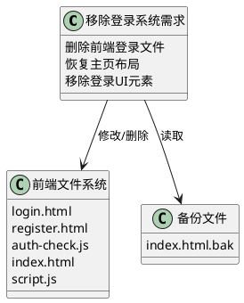
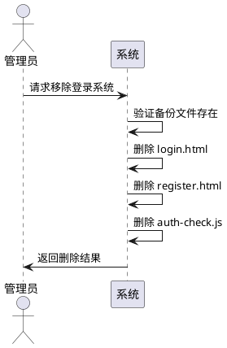
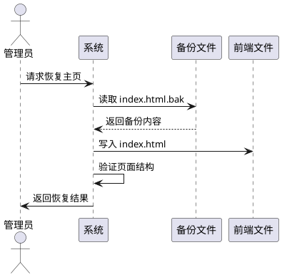
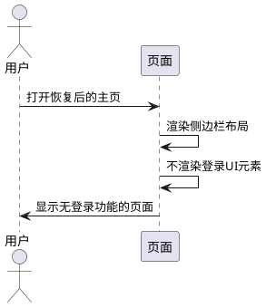
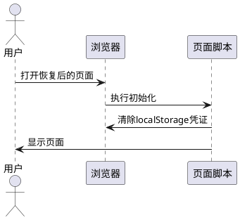
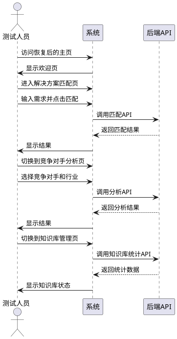

# 1. 组件定位

## 1.1 核心职责

本需求负责移除华为云解决方案匹配系统的登录认证功能，恢复主页到添加登录功能之前的布局和功能状态。

## 1.2 核心输入

1. 用户请求：移除登录系统并恢复之前的index页面
2. 备份文件：`backup/2026-05-24-frontend-redesign/index.html.bak`（最新备份版本）
3. 当前前端文件列表：
   - `frontend/index.html` - 主页（含登录UI）
   - `frontend/login.html` - 登录页面
   - `frontend/register.html` - 注册页面
   - `frontend/auth-check.js` - 登录状态检查脚本
4. 当前后端API文件：
   - `api/auth_routes.py` - 认证路由
   - `api/auth_dependencies.py` - 认证依赖
   - `app/services/auth_service.py` - 认证服务
   - `app/utils/auth_utils.py` - 认证工具

## 1.3 核心输出

1. 删除的前端文件：`login.html`、`register.html`、`auth-check.js`
2. 修改的前端文件：`index.html`（恢复为侧边栏布局，移除登录相关UI）
3. 修改的前端文件：`script.js`（移除登录状态检查逻辑）
4. 保留的后端文件：认证相关API文件（保留以便未来可能使用）

## 1.4 职责边界

本需求不负责：
1. 删除后端认证API（保留供未来扩展使用）
2. 删除数据库中的用户表（保留数据）
3. 修改其他功能模块（解决方案匹配、竞争对手分析、知识库管理保持不变）

# 2. 领域术语

**登录系统**
: 用户认证功能模块，包括登录页面、注册页面、验证码、用户信息显示等前端组件和后端认证API。

**侧边栏布局**
: 页面左侧固定显示导航菜单、系统状态统计和使用说明的页面布局方式，与当前的顶部导航栏布局不同。

**备份恢复**
: 将指定备份文件的内容还原到正式文件中，用于回退到之前的版本状态。

# 3. 角色与边界

## 3.1 核心角色

系统管理员：负责执行移除登录系统的操作，验证系统恢复后的功能正常。

## 3.2 外部系统

无外部系统交互。

## 3.3 交互上下文

# 4. DFX约束

## 4.1 性能

1. 恢复操作应在1分钟内完成
2. 恢复后的页面加载性能应与备份版本一致

## 4.2 可靠性

1. 恢复操作前应确认备份文件存在且完整
2. 恢复后系统应保持核心功能可用（解决方案匹配、竞争对手分析、知识库管理）

## 4.3 安全性

1. 保留后端认证API以备未来扩展，但前端不再调用
2. 清除前端存储的登录凭证（localStorage中的access_token和user_info）

## 4.4 可维护性

1. 删除的文件应在变更记录中明确说明
2. 恢复操作应可回滚（保留当前版本作为新备份）

## 4.5 兼容性

1. 恢复后的页面应兼容现有后端API（解决方案匹配、竞争对手分析、知识库管理）
2. 静态资源路径应适配（从 /static/ 改为相对路径或保持一致）

# 5. 核心能力

## 5.1 删除登录相关前端文件

### 5.1.1 业务规则

1. **删除登录页面文件**
   a. 验收条件：[执行删除操作] → [frontend/login.html文件不存在]

2. **删除注册页面文件**
   a. 验收条件：[执行删除操作] → [frontend/register.html文件不存在]

3. **删除登录状态检查脚本**
   a. 验收条件：[执行删除操作] → [frontend/auth-check.js文件不存在]

### 5.1.2 交互流程

### 5.1.3 异常场景

1. **文件不存在**
   a. 触发条件：[待删除的文件不存在]
   b. 系统行为：[跳过该文件，继续处理其他文件]
   c. 用户感知：[提示"文件已不存在或已删除"]

2. **文件删除失败**
   a. 触发条件：[文件权限不足或被占用]
   b. 系统行为：[记录错误日志，继续处理其他文件]
   c. 用户感知：[提示"文件删除失败：[文件名]"]

## 5.2 恢复主页布局

### 5.2.1 业务规则

1. **使用最新备份文件恢复主页**
   a. 验收条件：[执行恢复操作] → [frontend/index.html内容与backup/2026-05-24-frontend-redesign/index.html.bak一致]

2. **验证恢复后的页面结构**
   a. 验收条件：[打开恢复后的主页] → [页面显示侧边栏布局，无登录按钮，无用户信息显示]

3. **确保静态资源路径正确**
   a. 验收条件：[恢复后的页面加载] → [CSS和JS资源正确加载，无404错误]

### 5.2.2 交互流程

### 5.2.3 异常场景

1. **备份文件不存在**
   a. 触发条件：[backup/2026-05-24-frontend-redesign/index.html.bak不存在]
   b. 系统行为：[终止恢复操作，提示检查备份]
   c. 用户感知：[错误提示"备份文件不存在，无法恢复"]

2. **备份文件损坏**
   a. 触发条件：[备份文件内容不完整或格式错误]
   b. 系统行为：[验证备份文件完整性，拒绝恢复]
   c. 用户感知：[错误提示"备份文件损坏，请检查备份完整性"]

## 5.3 移除登录相关UI元素

### 5.3.1 业务规则

1. **移除导航栏中的登录按钮**
   a. 验收条件：[恢复后的页面加载] → [导航栏中不显示登录按钮]

2. **移除导航栏中的用户信息显示**
   a. 验收条件：[恢复后的页面加载] → [导航栏中不显示用户名和退出按钮]

3. **移除auth-check.js脚本引用**
   a. 验收条件：[恢复后的页面加载] → [页面不加载auth-check.js脚本]

4. **保留快速体验按钮**
   a. 验收条件：[恢复后的页面加载] → [右上角仍显示"快速体验"按钮]

### 5.3.2 交互流程

### 5.3.3 异常场景

无异常场景（此功能通过文件恢复实现）。

## 5.4 清除前端登录凭证

### 5.4.1 业务规则

1. **清除localStorage中的访问令牌**
   a. 验收条件：[用户打开恢复后的页面] → [localStorage中不存在access_token]

2. **清除localStorage中的用户信息**
   a. 验收条件：[用户打开恢复后的页面] → [localStorage中不存在user_info]

### 5.4.2 交互流程

### 5.4.3 异常场景

无异常场景（localStorage清除操作不会失败）。

## 5.5 保留后端认证API

### 5.5.1 业务规则

1. **保留认证路由文件**
   a. 验收条件：[移除操作完成后] → [api/auth_routes.py文件仍存在]

2. **保留认证服务文件**
   a. 验收条件：[移除操作完成后] → [app/services/auth_service.py文件仍存在]

3. **保留认证依赖文件**
   a. 验收条件：[移除操作完成后] → [api/auth_dependencies.py文件仍存在]

4. **禁止项：不删除后端认证相关代码**
   a. 验收条件：[执行移除操作] → [后端认证API文件保持不变]

### 5.5.2 交互流程

无交互流程（此功能为保留操作，无需执行）。

### 5.5.3 异常场景

无异常场景。

## 5.6 验证核心功能

### 5.6.1 业务规则

1. **验证解决方案匹配功能可用**
   a. 验收条件：[恢复后访问主页] → [解决方案智能匹配功能正常工作]

2. **验证竞争对手分析功能可用**
   a. 验收条件：[恢复后访问主页] → [竞争对手方案分析功能正常工作]

3. **验证知识库管理功能可用**
   a. 验收条件：[恢复后访问主页] → [知识库管理功能正常工作]

4. **验证欢迎引导页正常显示**
   a. 验收条件：[首次访问主页] → [欢迎引导页正常显示并可跳过]

### 5.6.2 交互流程

### 5.6.3 异常场景

1. **核心功能不可用**
   a. 触发条件：[恢复后API调用失败]
   b. 系统行为：[显示错误提示，记录错误日志]
   c. 用户感知：[错误提示"功能暂时不可用，请检查后端服务"]

2. **静态资源加载失败**
   a. 触发条件：[CSS或JS文件404]
   b. 系统行为：[浏览器控制台显示错误]
   c. 用户感知：[页面样式异常或功能不响应]

# 6. 数据约束

## 6.1 备份文件信息

1. **备份文件路径**：`backup/2026-05-24-frontend-redesign/index.html.bak`
2. **备份文件来源**：添加登录功能前的最后一次备份
3. **备份文件特征**：
   - 使用侧边栏布局（非顶部导航栏）
   - 无登录按钮和用户信息显示
   - 无auth-check.js脚本引用
   - 包含完整的三项功能模块（解决方案匹配、竞争对手分析、知识库管理）

## 6.2 待删除文件列表

1. **frontend/login.html**：登录页面，包含登录表单和验证码功能
2. **frontend/register.html**：注册页面，包含注册表单
3. **frontend/auth-check.js**：登录状态检查脚本，负责显示用户信息和退出按钮

## 6.3 保留后端文件列表

1. **api/auth_routes.py**：认证路由，包含登录、注册、验证码、用户信息、历史记录、收藏等API
2. **api/auth_dependencies.py**：认证依赖，包含JWT验证逻辑
3. **app/services/auth_service.py**：认证服务，包含用户管理逻辑
4. **app/utils/auth_utils.py**：认证工具，包含密码加密和JWT生成

# 7. 执行清单

## 7.1 文件删除操作

| 序号 | 文件路径 | 操作 | 说明 |
|------|---------|------|------|
| 1 | `frontend/login.html` | 删除 | 移除登录页面 |
| 2 | `frontend/register.html` | 删除 | 移除注册页面 |
| 3 | `frontend/auth-check.js` | 删除 | 移除登录状态检查脚本 |

## 7.2 文件恢复操作

| 序号 | 源文件 | 目标文件 | 说明 |
|------|--------|---------|------|
| 1 | `backup/2026-05-24-frontend-redesign/index.html.bak` | `frontend/index.html` | 恢复主页到登录功能添加前的状态 |

## 7.3 前端代码调整

| 序号 | 文件 | 修改内容 | 说明 |
|------|------|---------|------|
| 1 | `frontend/script.js` | 移除登录状态检查逻辑 | 删除AuthUI相关代码（如果存在） |

## 7.4 后端文件处理

| 序号 | 文件 | 操作 | 说明 |
|------|------|------|------|
| 1 | `api/auth_routes.py` | 保留 | 保留认证API以备未来扩展 |
| 2 | `api/auth_dependencies.py` | 保留 | 保留认证依赖 |
| 3 | `app/services/auth_service.py` | 保留 | 保留认证服务 |
| 4 | `app/utils/auth_utils.py` | 保留 | 保留认证工具 |

# 8. 验收标准

## 8.1 功能验收

1. When 用户访问恢复后的主页，the system shall 显示侧边栏布局而非顶部导航栏布局
2. When 用户查看导航区域，the system shall 不显示登录按钮和用户信息
3. When 用户尝试访问 login.html，the system shall 返回404错误
4. When 用户尝试访问 register.html，the system shall 返回404错误

## 8.2 核心功能验收

1. When 用户在解决方案匹配页面输入需求并点击匹配按钮，the system shall 正常返回匹配结果
2. When 用户在竞争对手分析页面选择参数并点击分析按钮，the system shall 正常返回分析结果
3. When 用户访问知识库管理页面，the system shall 正常显示知识库统计信息
4. When 用户首次访问主页，the system shall 显示欢迎引导页并可正常跳过

## 8.3 数据验收

1. When 用户打开浏览器开发者工具查看localStorage，the system shall 不包含access_token和user_info
2. When 检查后端文件系统，the system shall 保留所有认证相关API文件

## 8.4 UI验收

1. Where 主页已恢复，the system shall 使用侧边栏布局（左侧导航、系统状态、使用说明）
2. Where 主页已恢复，the system shall 显示"快速体验"按钮
3. Where 主页已恢复，the system shall 包含三个功能模块的导航按钮

# 9. 变更记录

| 版本 | 日期 | 变更内容 | 作者 |
|------|------|---------|------|
| 1.0 | 2026-05-24 | 初始版本，定义移除登录系统需求 | spec-requirement-agent |
