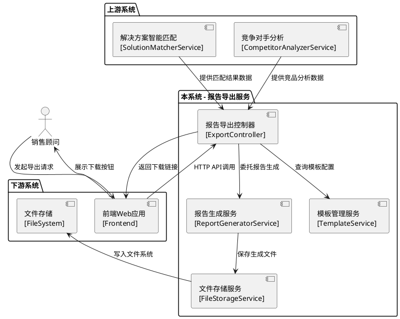
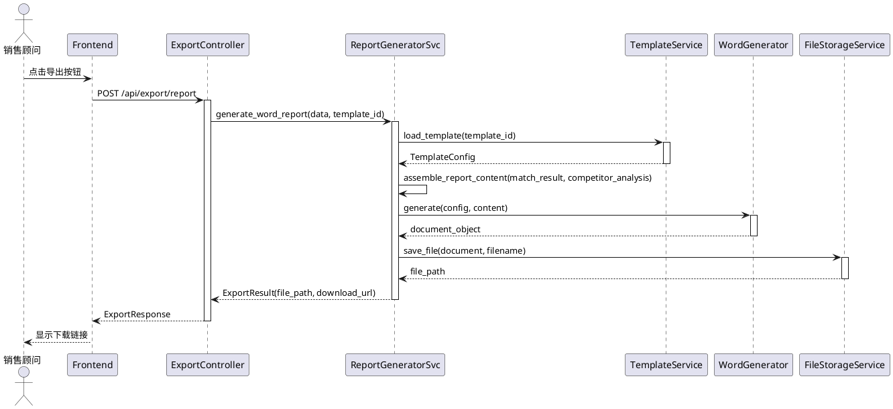

# **1. 实现模型**

## **1.1 上下文视图**

### **1.1.1 系统定位**

报告导出与生成组件作为华为云解决方案智能匹配系统的输出层服务，负责将解决方案匹配结果、竞争对手分析内容转化为专业化、可定制的Word和PDF格式报告文档。本组件位于业务流程末端，承接上游数据并对外提供文件输出能力。

### **1.1.2 上下文交互图**



### **1.1.3 核心职责边界**

| 职责类型 | 负责内容 | 不负责内容 |
|---------|---------|-----------|
| **核心职责** | • Word/PDF报告文件生成<br>• 报告模板管理与应用<br>• 批量导出与压缩<br>• 导出任务状态管理 | • 解决方案匹配算法<br>• 竞争对手分析逻辑<br>• 文件持久化存储策略<br>• 报告内容的业务准确性验证 |
| **输入职责** | • 接收解决方案匹配结果<br>• 接收竞品分析结果<br>• 接收用户导出参数<br>• 接收自定义模板文件 | • 数据源的数据质量保证<br>• 模板文件的业务合理性验证 |
| **输出职责** | • 生成.docx格式文件<br>• 生成.pdf格式文件<br>• 生成批量导出ZIP<br>• 返回导出任务状态 | • 文件的长期存储管理<br>• 文件的访问权限控制<br>• 文件的分发策略 |

## **1.2 服务/组件总体架构**

### **1.2.1 架构分层设计**

采用三层架构设计，清晰分离关注点：

```
┌─────────────────────────────────────────────────────────────┐
│                      表现层 (Presentation Layer)              │
│  ┌──────────────────┐  ┌──────────────────┐                 │
│  │ ExportController │  │ TemplateController│                 │
│  └──────────────────┘  └──────────────────┘                 │
└─────────────────────────────────────────────────────────────┘
                              ↓
┌─────────────────────────────────────────────────────────────┐
│                      业务层 (Business Layer)                  │
│  ┌──────────────────┐  ┌──────────────────┐                 │
│  │ReportGeneratorSvc│  │  TemplateService │                 │
│  └──────────────────┘  └──────────────────┘                 │
│  ┌──────────────────┐  ┌──────────────────┐                 │
│  │ ExportTaskService│  │FileStorageService│                 │
│  └──────────────────┘  └──────────────────┘                 │
└─────────────────────────────────────────────────────────────┘
                              ↓
┌─────────────────────────────────────────────────────────────┐
│                      基础层 (Infrastructure Layer)           │
│  ┌──────────────────┐  ┌──────────────────┐                 │
│  │  WordGenerator   │  │  PDFGenerator    │                 │
│  └──────────────────┘  └──────────────────┘                 │
│  ┌──────────────────┐  ┌──────────────────┐                 │
│  │ TemplateEngine   │  │   FileStorage    │                 │
│  └──────────────────┘  └──────────────────┘                 │
└─────────────────────────────────────────────────────────────┘
```

### **1.2.2 核心组件职责**

#### **表现层组件**

| 组件名称 | 核心职责 | 关键方法 |
|---------|---------|---------|
| **ExportController** | 处理报告导出相关的HTTP请求 | • `export_report()` - 单报告导出<br>• `batch_export()` - 批量导出<br>• `get_export_status()` - 查询导出状态 |
| **TemplateController** | 处理模板管理相关的HTTP请求 | • `upload_template()` - 上传自定义模板<br>• `get_templates()` - 获取模板列表<br>• `preview_template()` - 预览模板 |

#### **业务层组件**

| 组件名称 | 核心职责 | 关键方法 |
|---------|---------|---------|
| **ReportGeneratorService** | 报告生成核心业务逻辑 | • `generate_word_report()` - 生成Word报告<br>• `generate_pdf_report()` - 生成PDF报告<br>• `assemble_report_content()` - 组装报告内容<br>• `apply_template_style()` - 应用模板样式 |
| **TemplateService** | 模板管理业务逻辑 | • `save_template()` - 保存模板<br>• `validate_template()` - 校验模板安全<br>• `load_template()` - 加载模板配置 |
| **ExportTaskService** | 导出任务管理 | • `create_task()` - 创建导出任务<br>• `update_task_status()` - 更新任务状态<br>• `get_task()` - 查询任务信息 |
| **FileStorageService** | 文件存储管理 | • `save_file()` - 保存文件<br>• `get_download_url()` - 获取下载链接<br>• `cleanup_expired()` - 清理过期文件 |

#### **基础层组件**

| 组件名称 | 核心职责 | 技术选型 |
|---------|---------|---------|
| **WordGenerator** | Word文档生成 | python-docx库 |
| **PDFGenerator** | PDF文档生成 | reportlab库 |
| **TemplateEngine** | 模板解析与渲染 | jinja2 + python-docx |
| **FileStorage** | 文件系统操作 | Python标准库 |

### **1.2.3 组件交互序列图**



## **1.3 实现设计文档**

### **1.3.1 技术选型决策**

#### **1.3.1.1 Word生成技术选型**

**决策：采用 python-docx 库**

| 对比维度 | python-docx | docxtpl | 决策结果 |
|---------|------------|---------|---------|
| **功能完整性** | ✅ 完整支持文档创建、段落、表格、样式 | ✅ 基于python-docx扩展模板功能 | python-docx |
| **模板支持** | ⚠️ 需自行实现模板逻辑 | ✅ 天然支持jinja2模板语法 | 通过TemplateEngine封装 |
| **性能表现** | ✅ 轻量级，生成速度快 | ⚠️ 模板解析增加开销 | python-docx更优 |
| **学习曲线** | ✅ API简单直观 | ⚠️ 需掌握jinja2语法 | python-docx易上手 |
| **社区支持** | ✅ 成熟稳定，文档完善 | ✅ 活跃维护 | 两者均有良好支持 |

**选型理由**：
1. python-docx提供完整的Word文档操作能力，满足报告生成所有需求
2. 轻量级设计，性能符合"单报告生成不超过15秒"的DFX约束
3. API设计清晰，便于快速实现报告生成逻辑
4. 通过封装TemplateEngine层实现模板功能，保持架构灵活性

**核心用法示例**：
```python
from docx import Document
from docx.shared import Pt, RGBColor
from docx.enum.text import WD_ALIGN_PARAGRAPH

# 创建文档
doc = Document()

# 设置样式
style = doc.styles['Normal']
style.font.name = '宋体'
style.font.size = Pt(12)

# 添加标题
doc.add_heading('解决方案报告', level=1)

# 添加段落
p = doc.add_paragraph('报告正文内容')
p.alignment = WD_ALIGN_PARAGRAPH.LEFT

# 保存文档
doc.save('report.docx')
```

#### **1.3.1.2 PDF生成技术选型**

**决策：采用 reportlab 库**

| 对比维度 | reportlab | weasyprint | fpdf2 | 决策结果 |
|---------|-----------|------------|-------|---------|
| **中文支持** | ✅ 需配置中文字体 | ✅ CSS原生支持 | ✅ 需配置中文字体 | reportlab |
| **样式控制** | ✅ 精确的像素级控制 | ✅ CSS样式 | ⚠️ 样式能力有限 | reportlab更灵活 |
| **性能表现** | ✅ 直接渲染，速度快 | ⚠️ HTML解析开销 | ✅ 轻量快速 | reportlab最优 |
| **图表支持** | ✅ 内置图表库 | ✅ HTML图表 | ⚠️ 需外部库 | reportlab完整 |
| **PDF规范** | ✅ PDF 1.4+ | ✅ PDF 1.4+ | ✅ PDF 1.4+ | 均满足要求 |

**选型理由**：
1. reportlab提供精确的布局控制能力，便于实现专业报告排版
2. 性能优秀，符合"PDF生成不超过20秒"的DFX约束
3. 内置图表库，可直接生成报告中的统计图表
4. 通过注册中文字体解决中文显示问题

**中文字体配置**：
```python
from reportlab.pdfbase import pdfmetrics
from reportlab.pdfbase.ttfonts import TTFont

# 注册中文字体
pdfmetrics.registerFont(TTFont('SimSun', 'simsun.ttc'))
pdfmetrics.registerFont(TTFont('SimHei', 'simhei.ttf'))
```

#### **1.3.1.3 模板引擎技术选型**

**决策：采用 jinja2 + python-docx 组合方案**

**方案设计**：
1. **jinja2**：负责内容参数化渲染（文本、数据填充）
2. **python-docx**：负责样式模板化（字体、颜色、间距）
3. **TemplateEngine封装层**：统一模板管理接口

**模板存储结构**：
```
data/templates/
├── preset/                      # 系统预设模板
│   ├── standard_business.json    # 标准商务风格配置
│   ├── technical_report.json     # 技术报告风格配置
│   └── marketing_style.json      # 营销展示风格配置
└── custom/                      # 用户自定义模板
    ├── {user_id}/
    │   ├── template.docx         # Word模板文件
    │   └── config.json           # 样式配置参数
```

**模板配置JSON结构**：
```json
{
  "template_id": "uuid-v4",
  "template_name": "标准商务风格",
  "template_type": "PRESET",
  "style_config": {
    "cover": {
      "title_font": "SimHei",
      "title_size": 28,
      "title_color": "#1E3A8A",
      "subtitle_font": "SimSun",
      "subtitle_size": 16
    },
    "body": {
      "heading1_font": "SimHei",
      "heading1_size": 18,
      "heading2_font": "SimHei",
      "heading2_size": 14,
      "paragraph_font": "SimSun",
      "paragraph_size": 12,
      "line_spacing": 1.5
    },
    "header_footer": {
      "header_text": "华为云解决方案报告",
      "footer_format": "第 {page} 页 / 共 {total} 页"
    }
  },
  "chapter_order": [
    "solution_overview",
    "technical_architecture",
    "competitor_analysis",
    "implementation_plan",
    "appendix"
  ]
}
```

### **1.3.2 目录结构设计**

```
E:/newai/huawei-cloud-solution-matcher/
├── api/
│   ├── routes.py                    # 现有路由（需扩展）
│   ├── models.py                    # 现有模型（需扩展）
│   └── export_routes.py             # 【新增】导出相关路由
│
├── app/
│   ├── services/
│   │   ├── solution_matcher.py      # 现有服务
│   │   ├── competitor_analyzer.py   # 现有服务
│   │   ├── report_generator.py      # 【新增】报告生成服务
│   │   ├── template_manager.py      # 【新增】模板管理服务
│   │   └── export_task.py           # 【新增】导出任务服务
│   │
│   ├── utils/
│   │   └── exporter.py              # 【修改】扩展导出能力
│   │
│   ├── generators/                  # 【新增】文档生成器
│   │   ├── __init__.py
│   │   ├── word_generator.py        # Word生成器
│   │   ├── pdf_generator.py         # PDF生成器
│   │   └── base_generator.py        # 基础生成器抽象类
│   │
│   ├── templates/                   # 【新增】模板相关模块
│   │   ├── __init__.py
│   │   ├── template_engine.py       # 模板引擎
│   │   └── template_validator.py    # 模板校验器
│   │
│   └── models/                      # 【新增】数据模型
│       ├── export_task.py           # 导出任务模型
│       ├── report_template.py       # 报告模板模型
│       └── export_result.py         # 导出结果模型
│
├── data/
│   ├── templates/                   # 【新增】模板文件目录
│   │   ├── preset/                  # 系统预设模板
│   │   └── custom/                  # 用户自定义模板
│   │
│   └── exports/                     # 【新增】导出文件目录
│       └── temp/                    # 临时文件（定期清理）
│
├── frontend/
│   ├── index.html                   # 现有页面（需扩展）
│   ├── export.html                  # 【新增】导出管理页面
│   ├── style.css                    # 现有样式（需扩展）
│   └── export-script.js             # 【新增】导出相关脚本
│
└── requirements.txt                 # 需新增依赖
```

### **1.3.3 文件变更清单**

#### **新增文件（共14个）**

| 文件路径 | 文件说明 | 代码行数估算 |
|---------|---------|------------|
| `api/export_routes.py` | 导出相关API路由 | ~150行 |
| `app/services/report_generator.py` | 报告生成核心服务 | ~400行 |
| `app/services/template_manager.py` | 模板管理服务 | ~250行 |
| `app/services/export_task.py` | 导出任务管理服务 | ~200行 |
| `app/generators/__init__.py` | 生成器模块初始化 | ~20行 |
| `app/generators/word_generator.py` | Word文档生成器 | ~500行 |
| `app/generators/pdf_generator.py` | PDF文档生成器 | ~600行 |
| `app/generators/base_generator.py` | 生成器基类 | ~100行 |
| `app/templates/__init__.py` | 模板模块初始化 | ~20行 |
| `app/templates/template_engine.py` | 模板引擎实现 | ~300行 |
| `app/templates/template_validator.py` | 模板安全校验 | ~150行 |
| `app/models/export_task.py` | 导出任务数据模型 | ~80行 |
| `app/models/report_template.py` | 报告模板数据模型 | ~100行 |
| `app/models/export_result.py` | 导出结果数据模型 | ~80行 |
| `frontend/export.html` | 导出管理页面 | ~300行 |
| `frontend/export-script.js` | 导出功能脚本 | ~400行 |

**新增代码总计**：约 3650 行

#### **修改文件（共4个）**

| 文件路径 | 修改说明 | 新增代码量 |
|---------|---------|-----------|
| `api/routes.py` | 新增导出相关路由引用 | ~10行 |
| `api/models.py` | 新增导出相关Pydantic模型 | ~150行 |
| `app/utils/exporter.py` | 扩展现有导出功能 | ~200行 |
| `frontend/index.html` | 新增导出导航入口 | ~30行 |

**修改代码总计**：约 390 行

### **1.3.4 核心类设计**

#### **ReportGeneratorService 核心类**

```python
class ReportGeneratorService:
    """报告生成服务 - 核心业务逻辑"""
    
    def __init__(self):
        self.word_generator = WordGenerator()
        self.pdf_generator = PDFGenerator()
        self.template_engine = TemplateEngine()
        self.file_storage = FileStorageService()
    
    def generate_word_report(
        self,
        match_result: Dict,
        competitor_analysis: Optional[Dict],
        template_id: Optional[str],
        export_options: Dict
    ) -> ExportResult:
        """
        生成Word格式报告
        
        Args:
            match_result: 解决方案匹配结果
            competitor_analysis: 竞争对手分析结果（可选）
            template_id: 模板ID（可选，默认使用预设模板）
            export_options: 导出选项配置
        
        Returns:
            ExportResult: 包含文件路径、下载链接等信息
        
        Raises:
            TemplateLoadError: 模板加载失败
            ReportGenerationError: 报告生成失败
        """
        # 1. 加载模板配置
        template_config = self.template_engine.load_template(template_id)
        
        # 2. 组装报告内容结构
        report_structure = self._assemble_report_structure(
            match_result,
            competitor_analysis,
            export_options
        )
        
        # 3. 应用模板样式
        styled_content = self._apply_template_style(
            report_structure,
            template_config
        )
        
        # 4. 生成Word文档
        document = self.word_generator.generate(styled_content)
        
        # 5. 保存文件并生成下载链接
        file_path = self.file_storage.save_file(
            document,
            self._generate_filename("WORD", export_options)
        )
        download_url = self.file_storage.get_download_url(file_path)
        
        return ExportResult(
            file_path=file_path,
            download_url=download_url,
            file_format="WORD",
            file_size=os.path.getsize(file_path)
        )
    
    def _assemble_report_structure(
        self,
        match_result: Dict,
        competitor_analysis: Optional[Dict],
        export_options: Dict
    ) -> ReportStructure:
        """组装报告内容结构（封面、目录、正文、附录）"""
        structure = ReportStructure()
        
        # 组装封面
        structure.cover = self._build_cover(match_result, export_options)
        
        # 组装正文章节
        structure.chapters = []
        structure.chapters.append(
            self._build_solution_overview_chapter(match_result)
        )
        
        if competitor_analysis and export_options.get("include_competitor"):
            structure.chapters.append(
                self._build_competitor_analysis_chapter(competitor_analysis)
            )
        
        # 组装附录
        structure.appendix = self._build_appendix(match_result)
        
        # 生成目录索引
        structure.table_of_contents = self._build_toc(structure.chapters)
        
        return structure
    
    def _apply_template_style(
        self,
        report_structure: ReportStructure,
        template_config: TemplateConfig
    ) -> StyledContent:
        """应用模板样式配置"""
        styled = StyledContent()
        
        # 应用封面样式
        styled.cover = self._apply_cover_style(
            report_structure.cover,
            template_config.style_config.cover
        )
        
        # 应用正文样式
        styled.chapters = [
            self._apply_chapter_style(chapter, template_config.style_config.body)
            for chapter in report_structure.chapters
        ]
        
        return styled
```

#### **WordGenerator 核心类**

```python
class WordGenerator:
    """Word文档生成器"""
    
    def __init__(self):
        self.document = Document()
        self._setup_chinese_fonts()
    
    def generate(self, styled_content: StyledContent) -> Document:
        """生成完整的Word文档"""
        # 1. 生成封面页
        self._generate_cover(styled_content.cover)
        
        # 2. 添加分页符
        self.document.add_page_break()
        
        # 3. 生成目录页
        self._generate_table_of_contents(styled_content.table_of_contents)
        self.document.add_page_break()
        
        # 4. 生成正文章节
        for chapter in styled_content.chapters:
            self._generate_chapter(chapter)
            self.document.add_page_break()
        
        # 5. 生成附录
        self._generate_appendix(styled_content.appendix)
        
        # 6. 设置页眉页脚
        self._setup_header_footer(styled_content.header_footer)
        
        return self.document
    
    def _generate_cover(self, cover: CoverContent):
        """生成封面页"""
        # 添加标题
        title = self.document.add_paragraph()
        title_run = title.add_run(cover.title)
        title_run.font.name = cover.title_font
        title_run.font.size = Pt(cover.title_size)
        title_run.font.color.rgb = hex_to_rgb(cover.title_color)
        title.alignment = WD_ALIGN_PARAGRAPH.CENTER
        
        # 添加副标题
        subtitle = self.document.add_paragraph()
        subtitle_run = subtitle.add_run(cover.subtitle)
        subtitle_run.font.name = cover.subtitle_font
        subtitle_run.font.size = Pt(cover.subtitle_size)
        subtitle.alignment = WD_ALIGN_PARAGRAPH.CENTER
        
        # 添加日期
        date_para = self.document.add_paragraph()
        date_run = date_para.add_run(f"生成日期：{cover.date}")
        date_run.font.name = 'SimSun'
        date_run.font.size = Pt(12)
        date_para.alignment = WD_ALIGN_PARAGRAPH.CENTER
    
    def _generate_chapter(self, chapter: ChapterContent):
        """生成章节内容"""
        # 添加一级标题
        self.document.add_heading(chapter.title, level=1)
        
        # 添加二级标题和段落
        for section in chapter.sections:
            self.document.add_heading(section.title, level=2)
            
            for paragraph in section.paragraphs:
                p = self.document.add_paragraph(paragraph.text)
                p.style.font.name = paragraph.font_name
                p.style.font.size = Pt(paragraph.font_size)
                
                # 添加图表（如有）
                if paragraph.table:
                    self._add_table(paragraph.table)
    
    def _setup_chinese_fonts(self):
        """配置中文字体支持"""
        # 设置Normal样式的默认字体
        style = self.document.styles['Normal']
        style.font.name = 'SimSun'
        style._element.rPr.rFonts.set(qn('w:eastAsia'), 'SimSun')
```

---

# **2. 接口设计**

## **2.1 总体设计**

### **2.1.1 接口设计原则**

1. **RESTful规范**：遵循REST架构风格，使用HTTP语义化动词
2. **统一响应格式**：所有接口返回统一的JSON响应结构
3. **错误码体系**：定义清晰的错误码，便于问题定位
4. **接口版本化**：通过路由前缀支持接口版本管理（如 `/api/v1/export/`）
5. **异步处理**：长时间操作采用异步任务模式，返回任务ID供查询

### **2.1.2 统一响应结构**

#### **成功响应**

```json
{
  "success": true,
  "code": 200,
  "message": "操作成功",
  "data": {
    // 业务数据
  },
  "timestamp": "2026-05-24T14:30:00Z"
}
```

#### **错误响应**

```json
{
  "success": false,
  "code": 40001,
  "message": "导出任务不存在",
  "error": {
    "error_code": "EXPORT_TASK_NOT_FOUND",
    "details": "任务ID: xxx-xxx-xxx 不存在或已过期"
  },
  "timestamp": "2026-05-24T14:30:00Z"
}
```

### **2.1.3 错误码定义**

| 错误码 | 错误标识 | 错误描述 | HTTP状态码 |
|-------|---------|---------|-----------|
| 40001 | EXPORT_TASK_NOT_FOUND | 导出任务不存在 | 404 |
| 40002 | EXPORT_SOURCE_DATA_NOT_FOUND | 源数据不存在或已过期 | 400 |
| 40003 | EXPORT_TEMPLATE_LOAD_FAILED | 模板加载失败 | 400 |
| 40004 | EXPORT_TIMEOUT | 报告生成超时 | 408 |
| 40005 | EXPORT_STORAGE_FULL | 存储空间不足 | 507 |
| 40006 | EXPORT_CONCURRENT_LIMIT | 并发导出任务已达上限 | 429 |
| 40007 | TEMPLATE_FILE_CORRUPTED | 模板文件损坏 | 400 |
| 40008 | TEMPLATE_SIZE_EXCEEDED | 模板文件大小超限 | 400 |
| 40009 | TEMPLATE_SECURITY_RISK | 模板存在安全风险 | 400 |
| 40010 | BATCH_EXPORT_LIMIT_EXCEEDED | 批量导出数量超限 | 400 |

## **2.2 接口清单**

### **2.2.1 报告导出接口**

#### **(1) 单报告导出**

**接口路径**：`POST /api/export/report`

**接口说明**：生成单个解决方案报告（Word或PDF格式）

**请求参数**：

```json
{
  "match_result_id": "uuid-v4",           // 必填，解决方案匹配结果ID
  "competitor_analysis_id": "uuid-v4",    // 可选，竞品分析结果ID
  "export_format": "WORD",                // 必填，导出格式：WORD/PDF/BOTH
  "template_id": "uuid-v4",               // 可选，模板ID（默认使用预设模板）
  "content_scope": {                      // 必填，内容范围配置
    "include_solution_overview": true,
    "include_technical_architecture": true,
    "include_competitor_analysis": true,
    "include_implementation_plan": true,
    "include_success_cases": true
  },
  "export_options": {                     // 可选，导出选项
    "customer_name": "XX制造企业",
    "confidential_level": "内部公开",
    "author": "张三"
  }
}
```

**响应示例**：

```json
{
  "success": true,
  "code": 200,
  "message": "报告生成成功",
  "data": {
    "task_id": "uuid-v4",
    "status": "COMPLETED",
    "result": {
      "file_name": "解决方案报告_XX制造企业_20260524_143000.docx",
      "file_format": "WORD",
      "file_size": 2048576,
      "download_url": "/api/export/download/uuid-v4",
      "page_count": 25,
      "generation_time_ms": 8500,
      "checksum": "sha256:abc123..."
    }
  },
  "timestamp": "2026-05-24T14:30:00Z"
}
```

**业务逻辑**：
1. 校验匹配结果ID存在性
2. 校验模板ID有效性（如指定）
3. 创建导出任务记录
4. 查询匹配结果和竞品分析数据
5. 组装报告内容结构
6. 应用模板样式配置
7. 调用对应生成器生成文档
8. 保存文件并生成下载链接
9. 更新任务状态为"COMPLETED"
10. 返回导出结果

**异常处理**：
- 匹配结果ID不存在 → 返回40002错误
- 模板加载失败 → 自动降级到默认模板，记录警告日志
- 生成超时 → 返回40004错误，清理临时资源

---

#### **(2) 批量导出**

**接口路径**：`POST /api/export/batch`

**接口说明**：批量生成多个解决方案报告并打包为ZIP

**请求参数**：

```json
{
  "export_items": [                       // 必填，导出项列表（最多50个）
    {
      "match_result_id": "uuid-v4",
      "competitor_analysis_id": "uuid-v4",
      "export_options": {
        "customer_name": "客户A"
      }
    },
    {
      "match_result_id": "uuid-v4-2",
      "competitor_analysis_id": null,
      "export_options": {
        "customer_name": "客户B"
      }
    }
  ],
  "export_format": "WORD",                // 必填，统一导出格式
  "template_id": "uuid-v4"                // 可选，统一模板
}
```

**响应示例**：

```json
{
  "success": true,
  "code": 200,
  "message": "批量导出任务已创建",
  "data": {
    "task_id": "uuid-v4",
    "status": "PROCESSING",
    "total_count": 10,
    "completed_count": 0,
    "failed_count": 0
  },
  "timestamp": "2026-05-24T14:30:00Z"
}
```

**业务逻辑**：
1. 校验导出数量不超过50个
2. 创建批量导出任务记录
3. 启动异步任务队列
4. 遍历导出项，逐个生成报告
5. 实时推送进度更新（通过WebSocket或轮询）
6. 打包所有成功报告为ZIP文件
7. 记录失败项清单和错误原因
8. 返回最终统计结果

---

#### **(3) 查询导出任务状态**

**接口路径**：`GET /api/export/task/{task_id}`

**接口说明**：查询导出任务的执行状态和结果

**请求参数**：
- 路径参数：`task_id` - 导出任务ID

**响应示例**：

```json
{
  "success": true,
  "code": 200,
  "message": "查询成功",
  "data": {
    "task_id": "uuid-v4",
    "status": "COMPLETED",
    "create_time": "2026-05-24T14:25:00Z",
    "complete_time": "2026-05-24T14:25:15Z",
    "result": {
      "file_name": "批量导出_20260524_142500.zip",
      "file_format": "ZIP",
      "file_size": 15728640,
      "download_url": "/api/export/download/uuid-v4",
      "success_count": 8,
      "failed_count": 2,
      "failed_items": [
        {
          "item_index": 3,
          "customer_name": "客户C",
          "error_reason": "匹配结果数据缺失"
        },
        {
          "item_index": 7,
          "customer_name": "客户G",
          "error_reason": "报告生成超时"
        }
      ]
    }
  },
  "timestamp": "2026-05-24T14:30:00Z"
}
```

---

#### **(4) 下载报告文件**

**接口路径**：`GET /api/export/download/{task_id}`

**接口说明**：下载生成的报告文件

**请求参数**：
- 路径参数：`task_id` - 导出任务ID

**响应**：
- 成功：返回文件流（Content-Type: application/octet-stream）
- 失败：返回JSON错误响应

**响应头**：
```
Content-Type: application/octet-stream
Content-Disposition: attachment; filename="解决方案报告_XXX.docx"
Content-Length: 2048576
```

---

### **2.2.2 模板管理接口**

#### **(1) 获取模板列表**

**接口路径**：`GET /api/templates`

**接口说明**：获取可用的报告模板列表（系统预设+用户自定义）

**请求参数**：
- Query参数：`template_type` - 模板类型筛选（PRESET/CUSTOM/ALL，默认ALL）

**响应示例**：

```json
{
  "success": true,
  "code": 200,
  "message": "查询成功",
  "data": {
    "preset_templates": [
      {
        "template_id": "preset-standard",
        "template_name": "标准商务风格",
        "template_type": "PRESET",
        "description": "适用于正式商务场景，简洁专业",
        "preview_image_url": "/static/templates/preset-standard.png",
        "create_time": "2026-01-01T00:00:00Z"
      },
      {
        "template_id": "preset-technical",
        "template_name": "技术报告风格",
        "template_type": "PRESET",
        "description": "适用于技术方案汇报，强调技术细节",
        "preview_image_url": "/static/templates/preset-technical.png",
        "create_time": "2026-01-01T00:00:00Z"
      },
      {
        "template_id": "preset-marketing",
        "template_name": "营销展示风格",
        "template_type": "PRESET",
        "description": "适用于客户演示，视觉冲击力强",
        "preview_image_url": "/static/templates/preset-marketing.png",
        "create_time": "2026-01-01T00:00:00Z"
      }
    ],
    "custom_templates": [
      {
        "template_id": "custom-uuid-v4",
        "template_name": "我的自定义模板",
        "template_type": "CUSTOM",
        "description": "根据公司VI标准定制",
        "preview_image_url": "/api/templates/preview/custom-uuid-v4",
        "create_time": "2026-05-20T10:00:00Z",
        "update_time": "2026-05-24T14:00:00Z"
      }
    ]
  },
  "timestamp": "2026-05-24T14:30:00Z"
}
```

---

#### **(2) 上传自定义模板**

**接口路径**：`POST /api/templates/upload`

**接口说明**：上传自定义Word模板文件

**请求格式**：`multipart/form-data`

**请求参数**：
- `template_file` - 模板文件（.docx格式，最大10MB）
- `template_name` - 模板名称
- `description` - 模板描述（可选）

**响应示例**：

```json
{
  "success": true,
  "code": 200,
  "message": "模板上传成功",
  "data": {
    "template_id": "custom-uuid-v4",
    "template_name": "我的自定义模板",
    "file_size": 524288,
    "validation_result": {
      "is_valid": true,
      "checks": {
        "format_check": true,
        "security_check": true,
        "compatibility_check": true
      },
      "warnings": []
    }
  },
  "timestamp": "2026-05-24T14:30:00Z"
}
```

**业务逻辑**：
1. 校验文件格式为.docx
2. 校验文件大小不超过10MB
3. 执行安全扫描（检测宏脚本、外部链接等）
4. 校验模板兼容性（支持的Word功能）
5. 保存模板文件到用户模板目录
6. 生成模板预览图
7. 返回模板ID和校验结果

---

#### **(3) 更新模板配置**

**接口路径**：`PUT /api/templates/{template_id}/config`

**接口说明**：更新自定义模板的样式配置参数

**请求参数**：

```json
{
  "template_name": "更新后的模板名称",
  "style_config": {
    "cover": {
      "title_font": "SimHei",
      "title_size": 28,
      "title_color": "#1E3A8A"
    },
    "body": {
      "heading1_size": 18,
      "paragraph_size": 12,
      "line_spacing": 1.5
    }
  },
  "chapter_order": [
    "solution_overview",
    "competitor_analysis",
    "technical_architecture",
    "implementation_plan"
  ]
}
```

**响应示例**：

```json
{
  "success": true,
  "code": 200,
  "message": "模板配置更新成功",
  "data": {
    "template_id": "custom-uuid-v4",
    "update_time": "2026-05-24T14:30:00Z"
  },
  "timestamp": "2026-05-24T14:30:00Z"
}
```

---

#### **(4) 删除自定义模板**

**接口路径**：`DELETE /api/templates/{template_id}`

**接口说明**：删除用户自定义模板（预设模板不可删除）

**响应示例**：

```json
{
  "success": true,
  "code": 200,
  "message": "模板删除成功",
  "data": {
    "template_id": "custom-uuid-v4"
  },
  "timestamp": "2026-05-24T14:30:00Z"
}
```

---

# **3. 数据模型**

## **3.1 设计目标**

### **3.1.1 模型设计原则**

1. **单一职责**：每个模型类对应一个明确的业务实体
2. **类型安全**：使用Pydantic强类型定义，避免运行时类型错误
3. **数据完整性**：通过Field约束确保数据完整性和合法性
4. **可序列化**：所有模型支持JSON序列化和反序列化
5. **可扩展性**：预留扩展字段，便于未来功能增强

### **3.1.2 模型分类**

| 模型类别 | 模型名称 | 说明 |
|---------|---------|------|
| **请求模型** | ExportRequest, BatchExportRequest, TemplateUploadRequest | API请求参数模型 |
| **响应模型** | ExportResponse, TaskStatusResponse, TemplateListResponse | API响应数据模型 |
| **实体模型** | ExportTask, ReportTemplate, ExportResult | 业务实体模型 |
| **值对象** | ContentScope, StyleConfig, ChapterOrder | 复合值对象 |

## **3.2 模型实现**

### **3.2.1 请求模型定义**

```python
from pydantic import BaseModel, Field, field_validator
from typing import Optional, List, Dict, Literal
from datetime import datetime
from enum import Enum

# ==================== 枚举定义 ====================

class ExportFormat(str, Enum):
    """导出格式枚举"""
    WORD = "WORD"
    PDF = "PDF"
    BOTH = "BOTH"

class TaskStatus(str, Enum):
    """任务状态枚举"""
    PENDING = "PENDING"
    PROCESSING = "PROCESSING"
    COMPLETED = "COMPLETED"
    FAILED = "FAILED"

class TemplateType(str, Enum):
    """模板类型枚举"""
    PRESET = "PRESET"    # 系统预设
    CUSTOM = "CUSTOM"    # 用户自定义

# ==================== 值对象定义 ====================

class ContentScope(BaseModel):
    """内容范围配置"""
    include_solution_overview: bool = Field(default=True, description="包含解决方案概述")
    include_technical_architecture: bool = Field(default=True, description="包含技术架构")
    include_competitor_analysis: bool = Field(default=True, description="包含竞品分析")
    include_implementation_plan: bool = Field(default=True, description="包含实施方案")
    include_success_cases: bool = Field(default=True, description="包含成功案例")

class ExportOptions(BaseModel):
    """导出选项配置"""
    customer_name: Optional[str] = Field(None, max_length=100, description="客户名称")
    confidential_level: Optional[str] = Field(None, description="密级标识")
    author: Optional[str] = Field(None, max_length=50, description="编制人")

class StyleConfig(BaseModel):
    """样式配置值对象"""
    # 封面样式
    cover_title_font: str = Field(default="SimHei", description="封面标题字体")
    cover_title_size: int = Field(default=28, ge=10, le=50, description="封面标题字号")
    cover_title_color: str = Field(default="#1E3A8A", description="封面标题颜色")
    
    # 正文样式
    heading1_font: str = Field(default="SimHei", description="一级标题字体")
    heading1_size: int = Field(default=18, ge=12, le=30, description="一级标题字号")
    heading2_font: str = Field(default="SimHei", description="二级标题字体")
    heading2_size: int = Field(default=14, ge=12, le=24, description="二级标题字号")
    paragraph_font: str = Field(default="SimSun", description="正文字体")
    paragraph_size: int = Field(default=12, ge=9, le=18, description="正文字号")
    line_spacing: float = Field(default=1.5, ge=1.0, le=3.0, description="行间距倍数")
    
    @field_validator('cover_title_color')
    @classmethod
    def validate_color(cls, v: str) -> str:
        """校验颜色格式"""
        import re
        if not re.match(r'^#[0-9A-Fa-f]{6}$', v):
            raise ValueError('颜色格式必须为#RRGGBB')
        return v

# ==================== 请求模型定义 ====================

class ExportRequest(BaseModel):
    """单报告导出请求"""
    match_result_id: str = Field(..., description="解决方案匹配结果ID")
    competitor_analysis_id: Optional[str] = Field(None, description="竞品分析结果ID")
    export_format: ExportFormat = Field(default=ExportFormat.WORD, description="导出格式")
    template_id: Optional[str] = Field(None, description="模板ID")
    content_scope: ContentScope = Field(default_factory=ContentScope, description="内容范围")
    export_options: ExportOptions = Field(default_factory=ExportOptions, description="导出选项")
    
    @field_validator('match_result_id')
    @classmethod
    def validate_uuid(cls, v: str) -> str:
        """校验UUID格式"""
        import uuid
        try:
            uuid.UUID(v)
        except ValueError:
            raise ValueError('match_result_id必须是有效的UUID格式')
        return v

class BatchExportRequest(BaseModel):
    """批量导出请求"""
    export_items: List[ExportRequest] = Field(..., max_length=50, description="导出项列表")
    export_format: ExportFormat = Field(default=ExportFormat.WORD, description="统一导出格式")
    template_id: Optional[str] = Field(None, description="统一模板ID")
    
    @field_validator('export_items')
    @classmethod
    def validate_items_count(cls, v: List) -> List:
        """校验导出数量"""
        if len(v) == 0:
            raise ValueError('导出项列表不能为空')
        if len(v) > 50:
            raise ValueError('批量导出数量不能超过50个')
        return v

class TemplateUploadRequest(BaseModel):
    """模板上传请求"""
    template_name: str = Field(..., min_length=1, max_length=50, description="模板名称")
    description: Optional[str] = Field(None, max_length=200, description="模板描述")
```

### **3.2.2 实体模型定义**

```python
from datetime import datetime
from pydantic import BaseModel, Field
from typing import Optional, Dict, Any
import uuid

class ExportTask(BaseModel):
    """导出任务实体"""
    task_id: str = Field(default_factory=lambda: str(uuid.uuid4()), description="任务ID")
    user_id: str = Field(..., description="用户ID")
    export_format: ExportFormat = Field(..., description="导出格式")
    content_scope: ContentScope = Field(..., description="内容范围")
    template_id: Optional[str] = Field(None, description="模板ID")
    status: TaskStatus = Field(default=TaskStatus.PENDING, description="任务状态")
    create_time: datetime = Field(default_factory=datetime.now, description="创建时间")
    complete_time: Optional[datetime] = Field(None, description="完成时间")
    file_path: Optional[str] = Field(None, description="文件存储路径")
    error_info: Optional[Dict[str, Any]] = Field(None, description="错误信息")
    
    class Config:
        use_enum_values = True

class ReportTemplate(BaseModel):
    """报告模板实体"""
    template_id: str = Field(default_factory=lambda: str(uuid.uuid4()), description="模板ID")
    template_name: str = Field(..., min_length=1, max_length=50, description="模板名称")
    template_type: TemplateType = Field(..., description="模板类型")
    template_file_path: str = Field(..., description="模板文件路径")
    creator_id: str = Field(..., description="创建者ID")
    create_time: datetime = Field(default_factory=datetime.now, description="创建时间")
    update_time: datetime = Field(default_factory=datetime.now, description="更新时间")
    style_config: StyleConfig = Field(default_factory=StyleConfig, description="样式配置")
    chapter_order: List[str] = Field(
        default=["solution_overview", "technical_architecture", "competitor_analysis", "implementation_plan", "appendix"],
        description="章节顺序"
    )
    status: str = Field(default="ACTIVE", description="模板状态")
    
    class Config:
        use_enum_values = True

class ExportResult(BaseModel):
    """导出结果实体"""
    result_id: str = Field(default_factory=lambda: str(uuid.uuid4()), description="结果ID")
    task_id: str = Field(..., description="关联的任务ID")
    file_name: str = Field(..., description="文件名称")
    file_format: str = Field(..., description="文件格式")
    file_size: int = Field(..., gt=0, description="文件大小（字节）")
    file_path: str = Field(..., description="文件存储路径")
    download_url: str = Field(..., description="下载链接")
    generation_time_ms: int = Field(..., gt=0, description="生成耗时（毫秒）")
    page_count: int = Field(..., gt=0, description="页数")
    checksum: Optional[str] = Field(None, description="校验码")
    create_time: datetime = Field(default_factory=datetime.now, description="创建时间")

class FailedExportItem(BaseModel):
    """批量导出失败项"""
    item_index: int = Field(..., ge=0, description="项索引")
    customer_name: Optional[str] = Field(None, description="客户名称")
    error_reason: str = Field(..., description="失败原因")
    error_code: Optional[str] = Field(None, description="错误码")

class BatchExportResult(BaseModel):
    """批量导出结果"""
    task_id: str = Field(..., description="任务ID")
    file_name: str = Field(..., description="压缩包文件名")
    file_format: str = Field(default="ZIP", description="文件格式")
    file_size: int = Field(..., gt=0, description="文件大小")
    download_url: str = Field(..., description="下载链接")
    success_count: int = Field(..., ge=0, description="成功数量")
    failed_count: int = Field(..., ge=0, description="失败数量")
    failed_items: List[FailedExportItem] = Field(default_factory=list, description="失败项列表")
    generation_time_ms: int = Field(..., gt=0, description="总生成耗时")
```

### **3.2.3 响应模型定义**

```python
class ExportResponse(BaseModel):
    """导出响应"""
    task_id: str = Field(..., description="任务ID")
    status: TaskStatus = Field(..., description="任务状态")
    result: Optional[ExportResult] = Field(None, description="导出结果")

class BatchExportResponse(BaseModel):
    """批量导出响应"""
    task_id: str = Field(..., description="任务ID")
    status: TaskStatus = Field(..., description="任务状态")
    total_count: int = Field(..., ge=0, description="总数")
    completed_count: int = Field(..., ge=0, description="已完成数量")
    failed_count: int = Field(..., ge=0, description="失败数量")

class TaskStatusResponse(BaseModel):
    """任务状态查询响应"""
    task_id: str = Field(..., description="任务ID")
    status: TaskStatus = Field(..., description="任务状态")
    create_time: datetime = Field(..., description="创建时间")
    complete_time: Optional[datetime] = Field(None, description="完成时间")
    result: Optional[ExportResult] = Field(None, description="导出结果")

class TemplateListResponse(BaseModel):
    """模板列表响应"""
    preset_templates: List[ReportTemplate] = Field(default_factory=list, description="预设模板")
    custom_templates: List[ReportTemplate] = Field(default_factory=list, description="自定义模板")

class TemplateUploadResponse(BaseModel):
    """模板上传响应"""
    template_id: str = Field(..., description="模板ID")
    template_name: str = Field(..., description="模板名称")
    file_size: int = Field(..., description="文件大小")
    validation_result: Dict[str, Any] = Field(..., description="校验结果")
```

---

# **4. 实现步骤**

## **4.1 开发环境准备**

### **4.1.1 依赖安装**

在 `requirements.txt` 中新增以下依赖：

```txt
# 报告生成相关
python-docx==0.8.11         # Word文档生成
reportlab==4.0.7            # PDF文档生成
Pillow==10.1.0              # 图像处理（PDF生成所需）

# 模板与样式
jinja2==3.1.2               # 模板引擎

# 文件处理
python-multipart==0.0.6     # 文件上传支持
aiofiles==23.2.1            # 异步文件操作

# 校验与安全
python-magic==0.4.27        # 文件类型校验
```

安装命令：
```bash
pip install python-docx==0.8.11 reportlab==4.0.7 Pillow==10.1.0 jinja2==3.1.2 python-multipart==0.0.6 aiofiles==23.2.1 python-magic==0.4.27
```

### **4.1.2 目录结构初始化**

```bash
# 创建模板目录
mkdir -p data/templates/preset
mkdir -p data/templates/custom

# 创建导出文件目录
mkdir -p data/exports/temp

# 创建代码模块目录
mkdir -p app/generators
mkdir -p app/templates
```

## **4.2 开发顺序建议**

### **阶段一：基础层开发（预计2天）**

1. **实现基础生成器抽象类** (`app/generators/base_generator.py`)
   - 定义生成器接口规范
   - 实现公共方法（文件命名、路径生成等）

2. **实现Word生成器** (`app/generators/word_generator.py`)
   - 封装python-docx操作
   - 实现封面、目录、章节、附录生成方法
   - 实现样式应用逻辑

3. **实现PDF生成器** (`app/generators/pdf_generator.py`)
   - 封装reportlab操作
   - 实现中文支持配置
   - 实现文档布局控制

4. **实现模板引擎** (`app/templates/template_engine.py`)
   - 实现模板加载逻辑
   - 实现样式配置解析
   - 实现章节顺序控制

5. **实现模板校验器** (`app/templates/template_validator.py`)
   - 实现文件格式校验
   - 实现安全扫描逻辑
   - 实现兼容性检查

### **阶段二：业务层开发（预计3天）**

6. **实现报告生成服务** (`app/services/report_generator.py`)
   - 实现报告内容组装逻辑
   - 实现模板样式应用
   - 实现异常处理和重试机制

7. **实现模板管理服务** (`app/services/template_manager.py`)
   - 实现模板CRUD操作
   - 实现预设模板初始化
   - 实现模板预览生成

8. **实现导出任务服务** (`app/services/export_task.py`)
   - 实现任务创建和状态管理
   - 实现异步任务队列（可选Celery）
   - 实现任务过期清理

9. **扩展文件存储服务** (`app/utils/exporter.py`)
   - 实现文件保存逻辑
   - 实现下载链接生成
   - 实现临时文件清理

### **阶段三：表现层开发（预计2天）**

10. **实现导出相关路由** (`api/export_routes.py`)
    - 实现单报告导出接口
    - 实现批量导出接口
    - 实现任务状态查询接口
    - 实现文件下载接口

11. **实现模板管理路由** (`api/export_routes.py`)
    - 实现模板列表查询接口
    - 实现模板上传接口
    - 实现模板配置更新接口
    - 实现模板删除接口

12. **扩展现有路由** (`api/routes.py`)
    - 引入导出路由
    - 添加导出相关依赖注入

13. **扩展数据模型** (`api/models.py`)
    - 添加导出相关请求模型
    - 添加导出相关响应模型

### **阶段四：前端开发（预计2天）**

14. **实现导出管理页面** (`frontend/export.html`)
    - 实现导出配置表单
    - 实现进度展示组件
    - 实现模板选择器

15. **实现导出功能脚本** (`frontend/export-script.js`)
    - 实现导出请求发送
    - 实现进度轮询逻辑
    - 实现文件下载触发

16. **扩展主导航** (`frontend/index.html`)
    - 添加导出功能入口
    - 集成导出按钮到现有页面

### **阶段五：测试与优化（预计1天）**

17. **编写单元测试**
    - 测试Word生成器
    - 测试PDF生成器
    - 测试模板引擎

18. **编写集成测试**
    - 测试完整导出流程
    - 测试批量导出场景
    - 测试异常处理

19. **性能优化**
    - 优化大报告生成性能
    - 优化并发导出能力
    - 优化内存使用

## **4.3 关键技术实现要点**

### **4.3.1 Word报告结构实现**

```python
def _build_complete_report(self, data: Dict, template_config: TemplateConfig) -> Document:
    """构建完整的Word报告文档"""
    doc = Document()
    
    # 1. 生成封面页
    self._add_cover_page(doc, data, template_config)
    doc.add_page_break()
    
    # 2. 生成目录页（先占位，最后更新页码）
    toc_placeholder = doc.add_paragraph("目录（生成完成后更新）")
    doc.add_page_break()
    
    # 3. 按章节顺序生成正文
    chapter_start_pages = {}
    for chapter_key in template_config.chapter_order:
        chapter_start_pages[chapter_key] = len(doc.paragraphs)
        
        if chapter_key == "solution_overview":
            self._add_solution_overview_chapter(doc, data)
        elif chapter_key == "technical_architecture":
            self._add_technical_architecture_chapter(doc, data)
        elif chapter_key == "competitor_analysis":
            self._add_competitor_analysis_chapter(doc, data)
        elif chapter_key == "implementation_plan":
            self._add_implementation_plan_chapter(doc, data)
        
        doc.add_page_break()
    
    # 4. 生成附录
    self._add_appendix(doc, data)
    
    # 5. 更新目录页码
    self._update_table_of_contents(doc, toc_placeholder, chapter_start_pages)
    
    # 6. 设置页眉页脚
    self._setup_header_footer(doc, template_config)
    
    return doc
```

### **4.3.2 PDF中文支持实现**

```python
from reportlab.pdfbase import pdfmetrics
from reportlab.pdfbase.ttfonts import TTFont
from reportlab.lib.styles import getSampleStyleSheet, ParagraphStyle

class PDFGeneratorWithChinese:
    """支持中文的PDF生成器"""
    
    def __init__(self):
        # 注册中文字体
        self._register_chinese_fonts()
        
        # 创建支持中文的样式
        self.styles = self._create_chinese_styles()
    
    def _register_chinese_fonts(self):
        """注册中文字体"""
        # 宋体（正文）
        pdfmetrics.registerFont(TTFont('SimSun', 'C:/Windows/Fonts/simsun.ttc'))
        
        # 黑体（标题）
        pdfmetrics.registerFont(TTFont('SimHei', 'C:/Windows/Fonts/simhei.ttf'))
        
        # 注册字体族（支持粗体、斜体）
        pdfmetrics.registerFontFamily(
            'SimSun',
            normal='SimSun',
            bold='SimHei',
            italic='SimSun',
            boldItalic='SimHei'
        )
    
    def _create_chinese_styles(self):
        """创建中文样式"""
        styles = getSampleStyleSheet()
        
        # 标题样式
        styles.add(ParagraphStyle(
            name='ChineseTitle',
            fontName='SimHei',
            fontSize=24,
            leading=30,
            alignment=1,  # 居中
            spaceAfter=20
        ))
        
        # 一级标题样式
        styles.add(ParagraphStyle(
            name='ChineseHeading1',
            fontName='SimHei',
            fontSize=18,
            leading=24,
            spaceBefore=20,
            spaceAfter=10
        ))
        
        # 正文样式
        styles.add(ParagraphStyle(
            name='ChineseNormal',
            fontName='SimSun',
            fontSize=12,
            leading=18,
            firstLineIndent=24  # 首行缩进
        ))
        
        return styles
```

### **4.3.3 异步导出任务实现**

```python
import asyncio
from concurrent.futures import ThreadPoolExecutor

class ExportTaskService:
    """导出任务服务 - 支持异步执行"""
    
    def __init__(self):
        self.executor = ThreadPoolExecutor(max_workers=5)
        self.task_store = {}  # 任务存储（生产环境应使用Redis）
    
    async def create_batch_export_task(
        self,
        export_items: List[ExportRequest],
        export_format: ExportFormat,
        template_id: Optional[str]
    ) -> str:
        """创建批量导出任务"""
        # 生成任务ID
        task_id = str(uuid.uuid4())
        
        # 初始化任务记录
        task = ExportTask(
            task_id=task_id,
            user_id="current_user",  # 从上下文获取
            export_format=export_format,
            status=TaskStatus.PENDING,
            create_time=datetime.now()
        )
        self.task_store[task_id] = task
        
        # 启动异步任务
        asyncio.create_task(
            self._execute_batch_export(task_id, export_items, export_format, template_id)
        )
        
        return task_id
    
    async def _execute_batch_export(
        self,
        task_id: str,
        export_items: List[ExportRequest],
        export_format: ExportFormat,
        template_id: Optional[str]
    ):
        """执行批量导出（异步）"""
        task = self.task_store[task_id]
        task.status = TaskStatus.PROCESSING
        
        success_results = []
        failed_items = []
        
        for index, item in enumerate(export_items):
            try:
                # 生成单个报告
                result = await self._generate_single_report(
                    item, export_format, template_id
                )
                success_results.append(result)
            except Exception as e:
                failed_items.append(FailedExportItem(
                    item_index=index,
                    customer_name=item.export_options.customer_name,
                    error_reason=str(e)
                ))
        
        # 打包成功报告为ZIP
        zip_path = self._package_to_zip(success_results)
        
        # 更新任务状态
        task.status = TaskStatus.COMPLETED
        task.complete_time = datetime.now()
        task.file_path = zip_path
        task.result = BatchExportResult(
            task_id=task_id,
            download_url=self._generate_download_url(zip_path),
            success_count=len(success_results),
            failed_count=len(failed_items),
            failed_items=failed_items
        )
```

### **4.3.4 模板安全校验实现**

```python
import zipfile
import xml.etree.ElementTree as ET
from pathlib import Path

class TemplateValidator:
    """模板安全校验器"""
    
    def validate_template_security(self, template_path: str) -> Dict[str, Any]:
        """
        校验模板安全性
        
        Returns:
            {
                "is_valid": bool,
                "checks": {
                    "format_check": bool,
                    "macro_check": bool,
                    "external_link_check": bool,
                    "embedded_object_check": bool
                },
                "warnings": List[str]
            }
        """
        result = {
            "is_valid": True,
            "checks": {},
            "warnings": []
        }
        
        # 1. 格式校验
        result["checks"]["format_check"] = self._check_file_format(template_path)
        if not result["checks"]["format_check"]:
            result["is_valid"] = False
            return result
        
        # 2. 宏脚本检查
        has_macro = self._check_macro_scripts(template_path)
        result["checks"]["macro_check"] = not has_macro
        if has_macro:
            result["is_valid"] = False
            result["warnings"].append("模板包含宏脚本，存在安全风险")
        
        # 3. 外部链接检查
        external_links = self._check_external_links(template_path)
        result["checks"]["external_link_check"] = len(external_links) == 0
        if external_links:
            result["warnings"].append(f"模板包含外部链接: {external_links[:3]}")
        
        # 4. 嵌入对象检查
        embedded_objects = self._check_embedded_objects(template_path)
        result["checks"]["embedded_object_check"] = len(embedded_objects) == 0
        if embedded_objects:
            result["warnings"].append(f"模板包含嵌入对象: {embedded_objects}")
        
        return result
    
    def _check_file_format(self, template_path: str) -> bool:
        """检查文件是否为有效的.docx格式"""
        try:
            with zipfile.ZipFile(template_path, 'r') as zf:
                # 检查必需的文件
                required_files = ['[Content_Types].xml', 'word/document.xml']
                for file in required_files:
                    if file not in zf.namelist():
                        return False
            return True
        except zipfile.BadZipFile:
            return False
    
    def _check_macro_scripts(self, template_path: str) -> bool:
        """检查是否包含宏脚本"""
        with zipfile.ZipFile(template_path, 'r') as zf:
            # 检查是否存在vbaProject.bin（宏代码）
            return 'word/vbaProject.bin' in zf.namelist()
    
    def _check_external_links(self, template_path: str) -> List[str]:
        """检查外部链接引用"""
        external_links = []
        
        with zipfile.ZipFile(template_path, 'r') as zf:
            if 'word/document.xml' in zf.namelist():
                content = zf.read('word/document.xml').decode('utf-8')
                
                # 查找外部链接（简化示例）
                import re
                links = re.findall(r'w:dest="([^"]+)"', content)
                external_links.extend([link for link in links if link.startswith('http')])
        
        return external_links
```

---

# **5. 性能与可靠性保障**

## **5.1 性能优化策略**

### **5.1.1 报告生成性能优化**

1. **批量数据查询优化**
   - 批量查询解决方案匹配结果和竞品分析数据，减少数据库访问次数
   - 使用内存缓存存储近期查询结果

2. **文档生成并行化**
   - 批量导出时，利用线程池并行生成多个报告
   - 设置合理的并发数（建议不超过5个）

3. **样式缓存**
   - 缓存模板样式配置，避免重复解析
   - 使用LRU缓存策略，缓存最近使用的10个模板

### **5.1.2 内存使用优化**

1. **流式文件生成**
   - PDF生成使用流式写入，避免一次性加载大内容
   - 及时释放不再使用的文档对象

2. **临时文件清理**
   - 定时清理过期的临时文件（超过24小时）
   - 导出完成后立即清理中间文件

## **5.2 可靠性保障措施**

### **5.2.1 异常处理机制**

```python
class ExportService:
    """导出服务 - 带重试机制"""
    
    async def export_with_retry(
        self,
        export_request: ExportRequest,
        max_retries: int = 1,
        retry_delay: int = 10
    ) -> ExportResult:
        """带重试的导出操作"""
        last_exception = None
        
        for attempt in range(max_retries + 1):
            try:
                return await self._execute_export(export_request)
            except (TemplateLoadError, ReportGenerationError) as e:
                last_exception = e
                
                if attempt < max_retries:
                    # 等待后重试
                    await asyncio.sleep(retry_delay)
                    
                    # 降级策略：切换到默认模板
                    if isinstance(e, TemplateLoadError):
                        export_request.template_id = None
        
        # 所有尝试都失败，抛出最后一个异常
        raise last_exception
```

### **5.2.2 任务监控与告警**

1. **任务状态监控**
   - 记录每个导出任务的执行日志
   - 监控任务队列长度，超过阈值告警

2. **性能指标采集**
   - 记录每个导出任务的耗时
   - 统计导出成功率和失败率
   - 计算平均导出耗时

3. **异常告警**
   - 存储空间不足告警
   - 并发任务超限告警
   - 批量导出失败率过高告警

---

**文档版本**：v1.0  
**生成时间**：2026-05-24  
**文档状态**：待评审
