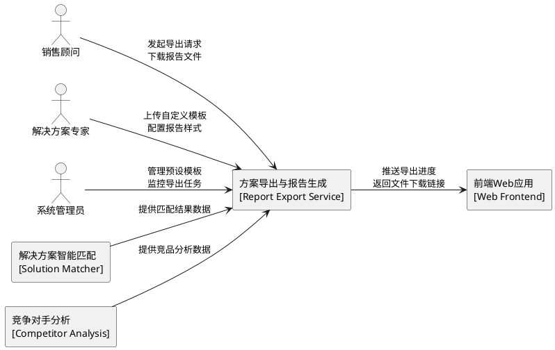
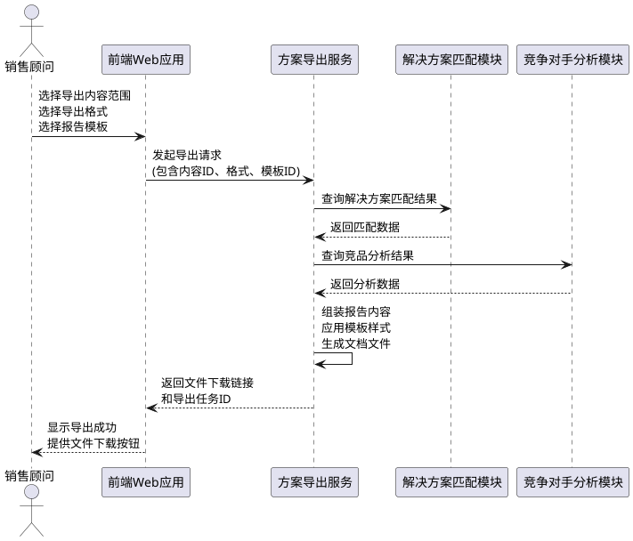
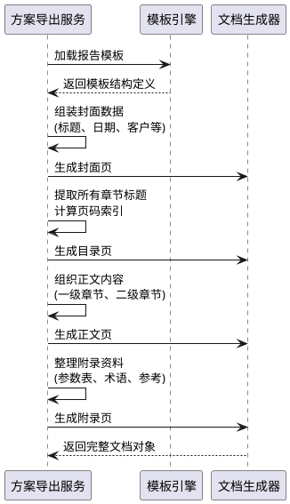
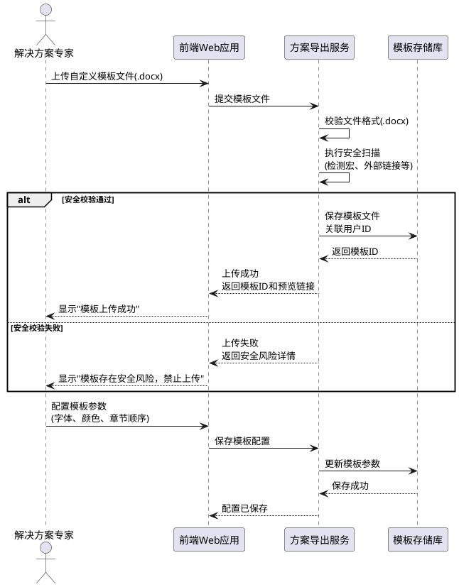
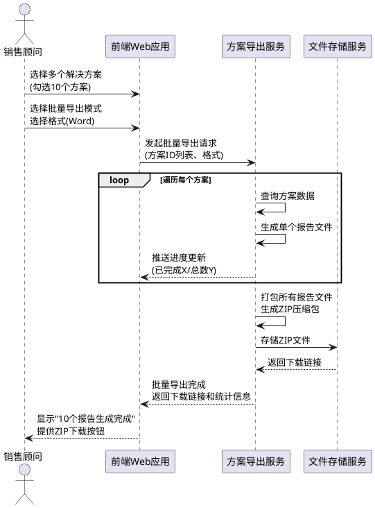

# **1. 组件定位**

## **1.1 核心职责**

本组件负责华为云解决方案报告的生成与导出，实现将解决方案匹配结果、竞争对手分析内容转化为专业化、可定制的Word和PDF格式报告文档。

## **1.2 核心输入**

1. **解决方案匹配结果**：来自解决方案智能匹配模块的匹配数据，包括匹配方案列表、推荐理由、技术参数等
2. **竞争对手分析结果**：来自竞品分析模块的分析内容，包括竞品对比数据、优劣势分析、销售话术等
3. **用户导出请求**：用户操作指令，包括导出格式选择、模板选择、内容范围选择等
4. **自定义模板文件**：用户上传的Word模板文件，用于个性化报告样式

## **1.3 核心输出**

1. **Word格式报告文件**：.docx格式的专业解决方案报告文档
2. **PDF格式报告文件**：.pdf格式的专业解决方案报告文档
3. **导出任务状态**：返回给前端界面的导出进度和结果状态
4. **批量导出压缩包**：包含多个报告文件的ZIP压缩包
5. **模板保存确认**：自定义模板保存成功的确认消息

## **1.4 职责边界**

本组件**不负责**以下事项：

1. **解决方案匹配算法**：由解决方案智能匹配模块负责
2. **竞争对手分析逻辑**：由竞品分析模块负责
3. **知识库文档管理**：由知识库管理模块负责
4. **报告内容的业务准确性验证**：假设输入数据的业务准确性已由上游模块保证
5. **文件传输与存储策略**：仅负责文件生成，不负责文件的持久化存储与分发

# **2. 领域术语**

**报告模板**
: 预定义的报告样式配置，包括封面样式、目录格式、章节标题样式、正文排版规则、页眉页脚设计等。
: 备注：支持系统预设模板和用户自定义模板。

**导出任务**
: 一次报告生成的完整操作单元，包含源数据、导出参数、格式配置、生成状态等信息。

**报告结构**
: 报告文档的逻辑组成，包括封面、目录、正文章节、附录四大部分，每部分包含特定的内容元素。

**批量导出**
: 一次生成多个解决方案报告的操作模式，适用于多方案对比或方案集合导出场景。

**样式配置**
: 控制报告视觉呈现的参数集合，包括字体、字号、颜色、间距、对齐方式、边框样式等。

# **3. 角色与边界**

## **3.1 核心角色**

**销售顾问**
: 负责根据客户需求生成解决方案报告，导出Word/PDF文件用于客户交付或内部存档。

**解决方案专家**
: 负责设计和管理报告模板，创建符合企业标准的报告样式配置。

**系统管理员**
: 负责维护系统预设模板，监控导出服务性能，处理批量导出任务。

## **3.2 外部系统**

**解决方案智能匹配模块**
: 上游系统，提供匹配结果数据作为报告生成的内容源。

**竞争对手分析模块**
: 上游系统，提供竞品分析数据和销售话术作为报告内容补充。

**前端Web应用**
: 下游系统，接收用户的导出请求并展示导出进度和结果。

**文件存储服务**
: 下游系统，接收生成的报告文件并提供下载服务（可选，视部署架构而定）。

## **3.3 交互上下文**

# **4. DFX约束**

## **4.1 性能**

1. **单报告生成时间**：Word格式报告生成时间不超过15秒，PDF格式报告生成时间不超过20秒（针对标准50页以内报告）
2. **批量导出性能**：批量导出10个报告的总时间不超过3分钟
3. **模板加载速度**：自定义模板加载与解析时间不超过3秒
4. **内存占用限制**：单个导出任务内存占用不超过500MB
5. **并发处理能力**：系统应支持至少5个并发导出任务同时执行

## **4.2 可靠性**

1. **导出成功率**：正常情况下导出任务成功率不低于99%
2. **任务重试机制**：导出失败时自动重试1次，重试间隔10秒
3. **数据完整性**：报告内容必须包含所有选定数据项，不得遗漏或截断
4. **格式一致性**：相同输入数据和模板必须生成格式一致的报告文件

## **4.3 安全性**

1. **文件访问控制**：生成的报告文件仅允许发起导出的用户访问
2. **敏感数据脱敏**：根据配置规则对报告中的敏感信息进行脱敏处理
3. **模板安全校验**：上传的自定义模板必须通过安全扫描，禁止包含恶意脚本
4. **操作审计日志**：记录所有导出操作的时间、用户、内容范围，日志保留至少90天

## **4.4 可维护性**

1. **导出任务日志**：每个导出任务记录详细的执行日志，包括步骤、耗时、错误信息
2. **模板版本管理**：系统预设模板支持版本标识，便于追溯问题
3. **错误码规范**：定义明确的错误码体系，便于问题定位和用户反馈
4. **性能监控指标**：接入导出任务数量、成功率、平均耗时等监控指标

## **4.5 兼容性**

1. **输入数据格式兼容**：必须兼容现有解决方案匹配模块和竞品分析模块的数据格式
2. **输出格式版本兼容**：生成的Word文档兼容Microsoft Word 2016及以上版本，PDF兼容PDF 1.4及以上规范
3. **模板格式兼容**：自定义模板必须为.docx格式，且符合Office Open XML标准
4. **接口向后兼容**：新增功能不影响现有导出接口的正常调用

## **4.6 文件大小限制**

1. **单报告文件大小**：Word格式报告文件不超过20MB，PDF格式报告文件不超过15MB
2. **批量导出压缩包大小**：批量导出ZIP文件不超过100MB
3. **自定义模板大小**：上传的模板文件不超过10MB
4. **图片资源限制**：报告中每张图片不超过5MB，总图片数量不超过50张

# **5. 核心能力**

## **5.1 报告生成与导出**

### **5.1.1 业务规则**

1. **格式选择规则**：系统必须支持Word(.docx)和PDF(.pdf)两种导出格式，用户可以任选其一或同时导出两种格式
   - 验收条件：[用户选择Word格式导出] → [系统生成.docx文件并提供下载链接]
   - 验收条件：[用户选择PDF格式导出] → [系统生成.pdf文件并提供下载链接]
   - 验收条件：[用户同时选择Word和PDF格式] → [系统生成两种格式文件并提供下载]

2. **报告结构规则**：生成的报告必须包含封面、目录、正文、附录四大部分，每部分的生成顺序和内容必须符合专业报告规范
   - 验收条件：[用户发起标准报告导出] → [系统按封面→目录→正文→附录顺序组装报告]
   - 验收条件：[报告生成完成] → [报告包含所有四大部分且页码连续]

3. **内容完整性规则**：报告正文必须包含用户选定的所有解决方案数据、竞品分析内容、技术参数等关键信息
   - 验收条件：[用户勾选5个解决方案导出] → [报告正文包含所有5个方案的详细描述]
   - 验收条件：[用户包含竞品分析内容] → [报告中存在竞品对比章节且内容完整]

4. **文件命名规则**：导出的报告文件必须按照规范命名，格式为"解决方案报告_客户名称_日期_时间.格式"
   - 验收条件：[用户为客户A导出Word报告] → [文件名为"解决方案报告_客户A_20260524_143000.docx"]

5. **禁止项**：禁止在报告中包含未授权的第三方版权素材、禁止泄露用户的敏感商业数据、禁止包含与选定内容无关的冗余信息
   - 验收条件：[报告生成完成] → [报告中不存在未授权素材]
   - 验收条件：[报告生成完成] → [报告中不包含用户未选定的数据项]

### **5.1.2 交互流程**

### **5.1.3 异常场景**

1. **上游数据缺失异常**
   - 触发条件：解决方案匹配结果或竞品分析数据不存在或已过期
   - 系统行为：终止导出流程，记录错误日志，清理临时资源
   - 用户感知：返回错误码"EXPORT_SOURCE_DATA_NOT_FOUND"，提示"源数据不存在或已过期，请重新执行匹配分析"

2. **模板加载失败异常**
   - 触发条件：指定的报告模板文件损坏或格式不符合标准
   - 系统行为：自动切换到系统默认模板，记录警告日志
   - 用户感知：返回提示"指定模板加载失败，已使用默认模板生成报告"

3. **文件生成超时异常**
   - 触发条件：报告生成时间超过最大时限（Word 30秒，PDF 45秒）
   - 系统行为：终止生成任务，释放占用资源，记录性能告警
   - 用户感知：返回错误码"EXPORT_TIMEOUT"，提示"报告生成超时，请尝试减少导出内容或稍后重试"

4. **存储空间不足异常**
   - 触发条件：目标存储空间不足以容纳生成的报告文件
   - 系统行为：取消文件写入，清理临时文件，发送运维告警
   - 用户感知：返回错误码"EXPORT_STORAGE_FULL"，提示"存储空间不足，请联系管理员"

5. **并发限制异常**
   - 触发条件：当前并发导出任务数已达上限（5个）
   - 系统行为：将新任务加入等待队列或拒绝处理
   - 用户感知：返回提示"当前导出任务较多，您的任务已排队，请稍后查看结果"或"导出服务繁忙，请稍后重试"

## **5.2 报告结构管理**

### **5.2.1 业务规则**

1. **封面生成规则**：报告封面必须包含报告标题、生成日期、客户名称、密级标识（如有）、编制人信息，且布局居中对称
   - 验收条件：[生成标准报告] → [封面包含所有必需元素且居中对称显示]

2. **目录生成规则**：目录必须自动提取所有章节标题，包含准确的页码索引，且支持点击跳转（PDF格式）
   - 验收条件：[报告包含10个章节] → [目录显示所有10个章节标题和对应页码]
   - 验收条件：[用户在PDF中点击目录条目] → [跳转到对应章节起始页]

3. **正文结构规则**：正文必须按逻辑层次组织，一级章节用于方案概述、技术架构、竞品分析、实施方案等大类，二级章节用于细分主题
   - 验收条件：[报告包含解决方案详情] → [正文存在"解决方案详情"一级章节]
   - 验收条件：[存在多个解决方案] → [每个方案作为独立的二级章节]

4. **附录生成规则**：附录必须包含技术参数表、术语解释、参考资料等辅助内容，且按字母顺序或逻辑顺序排列
   - 验收条件：[报告包含专业术语] → [附录存在术语解释章节且按字母排序]

5. **页眉页脚规则**：所有页面必须包含页眉（报告标题简称）和页脚（页码、总页数），封面除外
   - 验收条件：[打开报告正文页] → [页眉显示报告标题简称，页脚显示"第X页/共Y页"]

### **5.2.2 交互流程**

### **5.2.3 异常场景**

1. **目录页码计算错误**
   - 触发条件：章节内容动态变化导致预计算的页码与实际不符
   - 系统行为：在文档生成完成后重新计算并更新目录页码
   - 用户感知：无感知，系统自动修正

2. **章节内容为空**
   - 触发条件：某章节对应的数据源为空（如未选择竞品分析）
   - 系统行为：跳过该章节生成，不在目录中显示该章节
   - 用户感知：报告中不包含空白章节，目录中无对应条目

## **5.3 模板定制功能**

### **5.3.1 业务规则**

1. **模板上传规则**：用户可以上传自定义Word模板文件，系统必须校验模板格式为.docx且符合Office Open XML标准
   - 验收条件：[用户上传合规的.docx模板] → [模板上传成功并保存到用户模板库]
   - 验收条件：[用户上传非法格式文件] → [系统拒绝并提示"模板格式不支持，请上传.docx文件"]

2. **模板安全校验规则**：上传的模板必须通过安全扫描，禁止包含宏脚本、外部链接引用、嵌入式可执行代码
   - 验收条件：[模板包含恶意宏脚本] → [系统拒绝并提示"模板存在安全风险，禁止上传"]
   - 验收条件：[模板通过安全扫描] → [模板保存成功并标记为安全]

3. **模板应用规则**：用户在导出时可以选择使用系统预设模板或自定义模板，系统必须按选定模板的样式配置生成报告
   - 验收条件：[用户选择自定义模板A] → [生成的报告应用模板A的所有样式配置]
   - 验收条件：[用户未选择模板] → [系统使用默认预设模板生成报告]

4. **模板管理规则**：系统必须提供至少3套预设模板（标准商务风格、技术报告风格、营销展示风格），用户可以查看、预览但不可修改预设模板
   - 验收条件：[用户请求预设模板列表] → [返回至少3套预设模板供选择]
   - 验收条件：[用户尝试修改预设模板] → [系统提示"预设模板不可修改，请复制后自定义"]

5. **模板参数化规则**：模板必须支持参数化配置，包括封面字段、章节顺序、样式参数（字体、颜色、间距）的可配置性
   - 验收条件：[用户配置模板字体为宋体] → [应用该模板生成的报告使用宋体字体]
   - 验收条件：[用户配置章节顺序为"方案概述-技术架构-实施方案"] → [报告按该顺序组织章节]

### **5.3.2 交互流程**

### **5.3.3 异常场景**

1. **模板文件损坏异常**
   - 触发条件：上传的.docx文件内部结构损坏，无法正常解析
   - 系统行为：拒绝上传，记录异常日志
   - 用户感知：返回错误码"TEMPLATE_FILE_CORRUPTED"，提示"模板文件损坏，请重新制作或选择其他文件"

2. **模板大小超限异常**
   - 触发条件：上传的模板文件大小超过10MB限制
   - 系统行为：拒绝上传，提示文件大小限制
   - 用户感知：返回提示"模板文件大小超过10MB限制，请精简模板内容"

3. **模板格式不兼容异常**
   - 触发条件：模板使用了不支持的功能（如复杂SmartArt、特定插件对象）
   - 系统行为：部分功能降级处理，记录兼容性警告
   - 用户感知：返回提示"模板部分功能不支持，已降级处理，可能影响显示效果"

## **5.4 批量导出支持**

### **5.4.1 业务规则**

1. **批量选择规则**：用户可以一次性选择多个解决方案或多个客户场景进行批量导出，系统必须支持至少一次导出50个报告
   - 验收条件：[用户选择10个解决方案批量导出] → [系统生成10个独立的报告文件]
   - 验收条件：[用户选择50个场景批量导出] → [系统成功处理所有50个报告]

2. **批量压缩规则**：批量导出时系统必须将所有生成的报告文件打包为一个ZIP压缩文件，压缩包内保留清晰的文件命名和目录结构
   - 验收条件：[批量导出10个Word报告] → [生成一个ZIP文件包含10个.docx文件]
   - 验收条件：[打开批量导出ZIP文件] → [文件按命名规范清晰排列]

3. **批量进度反馈规则**：批量导出过程中系统必须实时反馈总体进度（已完成数/总数）和当前正在处理的报告名称
   - 验收条件：[批量导出进行中] → [前端显示"正在生成第3个报告/共10个，当前：客户A方案"]
   - 验收条件：[批量导出完成] → [前端显示"全部10个报告生成完成，点击下载"]

4. **批量容错规则**：批量导出中个别报告生成失败时，系统应继续处理其他报告，最终返回成功清单和失败清单
   - 验收条件：[批量导出10个报告，第3个失败] → [最终返回9个成功报告和1个失败记录]
   - 验收条件：[批量导出包含失败项] → [提供失败项的错误原因和重试建议]

5. **禁止项**：禁止批量导出时跳过任何选定项而不告知用户、禁止在ZIP包中包含与导出无关的文件、禁止压缩包设置密码导致用户无法打开
   - 验收条件：[批量导出完成] → [ZIP包仅包含选定的报告文件，无额外内容]
   - 验收条件：[用户下载批量导出ZIP] → [无需密码即可解压查看]

### **5.4.2 交互流程**

### **5.4.3 异常场景**

1. **批量数量超限异常**
   - 触发条件：用户选择的导出数量超过系统上限（50个）
   - 系统行为：拒绝处理，提示数量限制
   - 用户感知：返回提示"批量导出数量超过上限（50个），请分批次导出"

2. **批量导出部分失败**
   - 触发条件：批量导出过程中部分报告因数据缺失或生成错误失败
   - 系统行为：记录失败项，继续处理其他项，最终汇总成功和失败清单
   - 用户感知：返回"批量导出完成：成功8个，失败2个，查看失败原因"，并提供失败项重试选项

3. **压缩包生成失败**
   - 触发条件：ZIP打包过程中存储空间不足或权限错误
   - 系统行为：提供单独下载成功报告的链接，记录错误
   - 用户感知：返回提示"压缩包生成失败，已改为单独下载模式，点击逐个下载报告"

4. **批量导出长时间占用资源**
   - 触发条件：批量导出任务执行时间超过5分钟
   - 系统行为：降低任务优先级，发送性能告警，建议用户减少批量数量
   - 用户感知：返回提示"导出任务耗时较长，建议减少批量数量以提升速度"

# **6. 数据约束**

## **6.1 导出任务**

1. **任务ID**：全局唯一标识符，格式为UUID v4，必须且不可修改
2. **用户ID**：发起导出的用户标识，必须存在且有效
3. **导出格式**：取值为["WORD", "PDF", "BOTH"]，必须且默认为"WORD"
4. **内容范围**：包含解决方案ID列表和竞品分析ID列表的JSON对象，至少包含一项
5. **模板ID**：使用的模板标识，可选，默认使用系统预设模板
6. **任务状态**：取值为["PENDING", "PROCESSING", "COMPLETED", "FAILED"]，必须且初始为"PENDING"
7. **创建时间**：任务创建的时间戳，必须且不可修改
8. **完成时间**：任务完成的时间戳，仅在状态为"COMPLETED"或"FAILED"时存在
9. **文件路径**：生成文件的存储路径，仅在状态为"COMPLETED"时存在
10. **错误信息**：失败时的错误描述和错误码，仅在状态为"FAILED"时存在

## **6.2 报告模板**

1. **模板ID**：全局唯一标识符，格式为UUID v4，必须且不可修改
2. **模板名称**：模板的显示名称，长度1-50字符，必须
3. **模板类型**：取值为["PRESET", "CUSTOM"]，必须，预设模板不可修改
4. **模板文件路径**：模板文件的存储路径，必须存在且为.docx格式
5. **创建者ID**：创建模板的用户ID，预设模板为系统ID，自定义模板为用户ID
6. **创建时间**：模板创建的时间戳，必须且不可修改
7. **更新时间**：模板最后更新的时间戳，必须且创建时等于创建时间
8. **样式配置**：包含字体、颜色、间距等样式参数的JSON对象，可选
9. **章节顺序配置**：定义报告章节排列顺序的JSON数组，可选，默认使用标准顺序
10. **状态**：取值为["ACTIVE", "DEPRECATED"]，必须且默认为"ACTIVE"

## **6.3 报告内容项**

1. **内容项ID**：全局唯一标识符，格式为UUID v4，必须
2. **内容类型**：取值为["SOLUTION", "COMPETITOR_ANALYSIS", "TECHNICAL_PARAM", "TERMINOLOGY"]，必须
3. **源数据ID**：对应的上游数据对象ID，必须存在且有效
4. **章节归属**：内容项所属的报告章节，如"解决方案概述"、"竞品分析"等，必须
5. **排序权重**：在所属章节中的显示顺序，数值型，必须且唯一
6. **是否包含**：是否包含在最终报告中，布尔值，默认为true

## **6.4 导出结果**

1. **结果ID**：全局唯一标识符，格式为UUID v4，必须
2. **任务ID**：关联的导出任务ID，必须存在
3. **文件名称**：生成的报告文件名，必须符合命名规范
4. **文件格式**：取值为["WORD", "PDF", "ZIP"]，必须
5. **文件大小**：文件字节数，必须大于0且不超过相应格式的大小限制
6. **文件路径**：文件的存储路径，必须存在
7. **下载链接**：文件的下载URL，必须且有效期为至少24小时
8. **生成耗时**：文件生成的毫秒数，必须大于0
9. **页数**：报告的总页数，必须大于0
10. **校验码**：文件的MD5或SHA256校验码，用于完整性验证，可选
