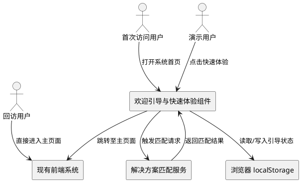
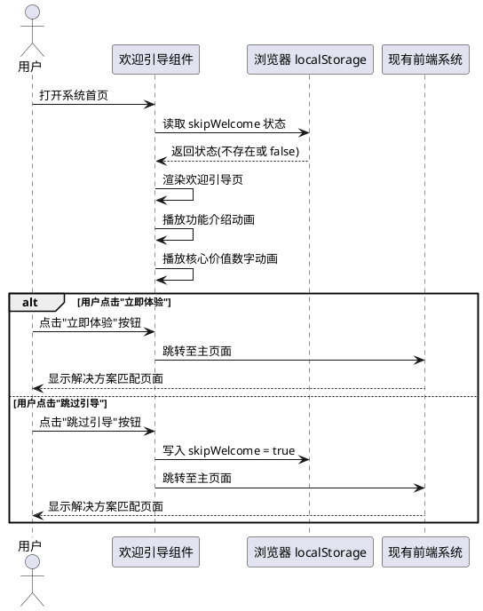
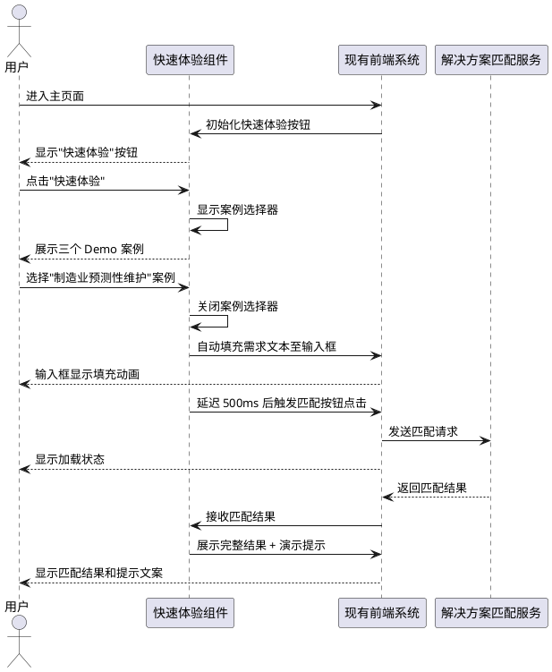
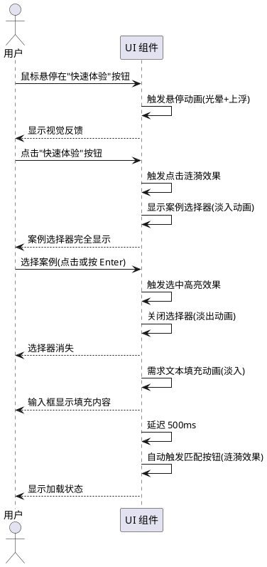
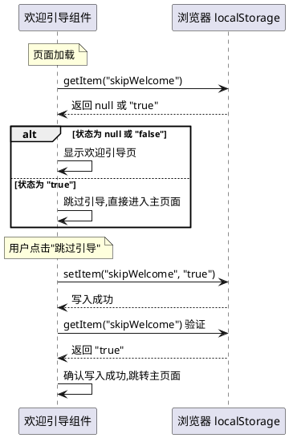
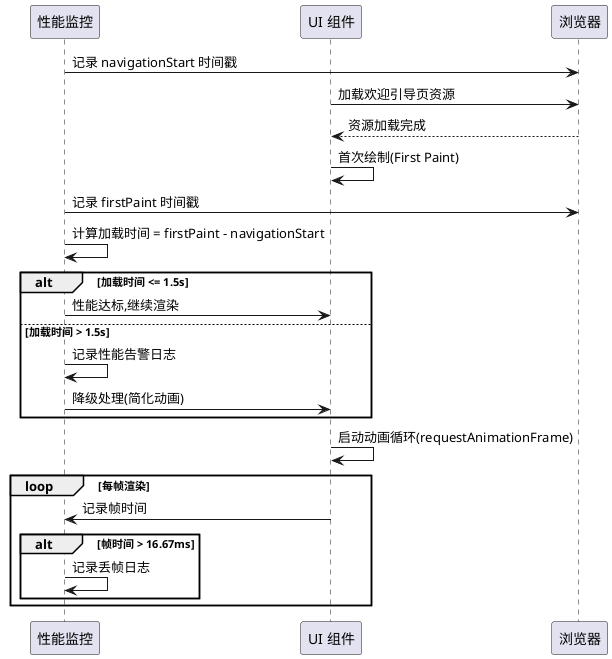

# **1. 组件定位**

## **1.1 核心职责**

本组件负责华为云解决方案匹配系统的欢迎引导和快速体验功能,实现首次访问用户的专业引导展示和一键体验核心能力的价值。

## **1.2 核心输入**

1. **用户首次访问请求**: 用户打开系统首页时触发的初始加载请求,包含浏览器 localStorage 状态
2. **快速体验选择请求**: 用户点击"快速体验"按钮并选择 Demo 案例的操作指令
3. **Demo 案例切换请求**: 用户在快速体验模式下切换不同 Demo 案例的操作指令
4. **跳过引导请求**: 用户点击"跳过引导"按钮的跳过操作指令

## **1.3 核心输出**

1. **欢迎引导页渲染**: 返回包含系统介绍、核心价值、功能展示的完整引导页面
2. **Demo 需求自动填充**: 自动将选中的 Demo 案例需求填充至匹配输入框
3. **匹配过程自动触发**: 自动触发解决方案匹配流程并展示结果
4. **引导状态持久化**: 将用户的引导跳过状态写入浏览器 localStorage
5. **主系统页面跳转**: 完成引导后跳转至解决方案匹配主页面

## **1.4 职责边界**

本组件不负责以下事项:

1. **解决方案匹配的核心计算逻辑**: 仅触发匹配流程,不执行匹配算法
2. **知识库数据管理**: 不负责知识库的构建、更新和删除操作
3. **用户认证与权限管理**: 不涉及用户登录、鉴权等安全功能
4. **后端 API 的具体实现**: 仅调用现有后端接口,不修改后端逻辑

# **2. 领域术语**

**欢迎引导页**
: 系统首次访问时展示的专业引导界面,包含系统介绍、功能展示、核心价值说明和快速开始入口。

**快速体验 Demo**
: 一键体验核心功能的演示模式,通过预设的典型需求案例,自动触发匹配流程并展示结果。

**Demo 案例**
: 预设的典型客户需求描述文本,用于快速演示系统的解决方案匹配能力,包含制造业、农业、园区等多个行业场景。

**引导跳过状态**
: 记录用户选择跳过欢迎引导的布尔状态,存储在浏览器 localStorage 中,用于控制后续访问是否显示引导页。

**案例选择器**
: 快速体验模式下的 Demo 案例选择界面,允许用户在不同行业案例之间切换。

**自动匹配流程**
: 快速体验模式下,自动完成需求填充、匹配触发、结果展示的完整交互流程。

# **3. 角色与边界**

## **3.1 核心角色**

**首次访问用户**: 第一次打开系统的用户,需要通过欢迎引导页了解系统能力和价值。

**演示用户**: 需要向客户快速展示系统核心功能的销售人员或产品经理,通过快速体验 Demo 进行系统演示。

**回访用户**: 之前已访问过系统并跳过引导的用户,直接进入主系统页面。

## **3.2 外部系统**

**解决方案匹配服务**: 后端 FastAPI 服务,接收客户需求并返回匹配的华为云解决方案。

**浏览器 localStorage**: 浏览器本地存储,用于持久化用户的引导跳过状态和偏好设置。

**现有前端系统**: 已完成的解决方案匹配前端界面(index.html、style.css、script.js),本组件需与其集成。

## **3.3 交互上下文**

# **4. DFX约束**

## **4.1 性能**

1. **引导页加载时间**: 欢迎引导页首次渲染完成时间不得超过 1.5 秒(包含所有动画资源加载)
2. **动画帧率**: 所有页面过渡动画和交互动画必须保持 60fps 的流畅度,不得出现卡顿
3. **Demo 自动填充延迟**: 从用户点击"快速体验"到需求文本填充完成的延迟不得超过 200 毫秒
4. **自动匹配触发延迟**: 需求填充完成后到自动触发匹配的延迟应控制在 500 毫秒,给用户视觉缓冲时间
5. **localStorage 读写性能**: 引导状态的读取和写入操作必须在 10 毫秒内完成

## **4.2 可靠性**

1. **引导状态持久化**: 用户的引导跳过状态必须可靠存储在 localStorage 中,浏览器关闭后状态不得丢失
2. **Demo 案例完整性**: 所有预设的 Demo 案例数据必须完整且格式正确,不得出现乱码或截断
3. **降级处理**: 当 localStorage 不可用时,系统应默认每次都显示欢迎引导页,不得影响主功能使用
4. **异常恢复**: 若自动匹配流程失败,应显示友好的错误提示并提供手动重试入口

## **4.3 安全性**

1. **localStorage 数据安全**: 仅存储用户偏好状态,不得存储任何敏感信息或业务数据
2. **XSS 防护**: Demo 案例文本在填充到输入框前必须进行 XSS 过滤,防止注入攻击
3. **内容安全策略**: 所有内联脚本和样式必须符合 CSP 规范,避免安全警告

## **4.4 可维护性**

1. **代码分离**: 欢迎引导页和快速体验功能的代码必须与现有前端代码清晰分离,便于独立维护
2. **配置化管理**: Demo 案例数据应集中定义在配置对象中,便于后续扩展和修改
3. **动画可配置**: 动画时长、延迟时间等参数应定义为常量,便于统一调整
4. **日志记录**: 关键用户行为(引导跳过、Demo 选择、匹配触发)应输出至控制台日志,便于问题排查

## **4.5 兼容性**

1. **浏览器兼容**: 必须支持 Chrome 90+、Firefox 88+、Safari 14+、Edge 90+ 等现代浏览器
2. **响应式设计**: 欢迎引导页必须在桌面端(1920px、1440px、1024px)和移动端(768px、375px)均正常显示
3. **localStorage 兼容**: 对于不支持 localStorage 的浏览器环境,应提供降级方案
4. **现有功能无影响**: 集成本组件后,现有解决方案匹配、竞争分析、知识库管理功能不得受任何影响

# **5. 核心能力**

## **5.1 欢迎引导页展示**

### **5.1.1 业务规则**

1. **首次访问判断规则**: 系统必须在页面加载时检查 localStorage 中的引导跳过状态,若不存在或为 false,则显示欢迎引导页
   - 验收条件: [用户首次访问且 localStorage 无记录] → [显示欢迎引导页]
   - 验收条件: [localStorage 中 skipWelcome 为 true] → [跳过引导直接进入主页面]

2. **引导页内容完整性规则**: 欢迎引导页必须包含系统标题、副标题、功能介绍、核心价值展示、快速开始按钮和跳过选项
   - 验收条件: [欢迎引导页加载完成] → [页面包含"华为云解决方案智能匹配系统"标题]
   - 验收条件: [欢迎引导页加载完成] → [页面包含"让销售方案准备时间从2小时缩短至1分钟"副标题]
   - 验收条件: [欢迎引导页加载完成] → [页面展示智能匹配、竞争分析、知识库管理三大功能介绍]

3. **核心价值展示规则**: 欢迎引导页必须以动画形式展示匹配准确率(87%)和效率提升(95%)等核心价值指标
   - 验收条件: [欢迎引导页加载完成] → [准确率和效率指标以数字动画形式从 0 递增至目标值]
   - 验收条件: [动画展示完成后] → [指标数值准确显示为 87% 和 95%]

4. **跳过引导规则**: 用户点击"跳过引导"后,系统必须在 localStorage 中设置 skipWelcome 为 true,并跳转至主页面
   - 验收条件: [用户点击"跳过引导"按钮] → [localStorage.skipWelcome 设置为 true]
   - 验收条件: [用户点击"跳过引导"按钮] → [页面跳转至解决方案匹配主页面]
   - 验收条件: [用户再次访问系统] → [直接进入主页面,不显示引导页]

5. **禁止项**: 欢迎引导页不得阻塞用户访问主系统功能超过 10 秒,必须提供明显的跳过入口
   - 验收条件: [引导页显示超过 10 秒] → [跳过按钮必须始终可见且可点击]

### **5.1.2 交互流程**

### **5.1.3 异常场景**

1. **localStorage 不可用异常**
   - 触发条件: [浏览器禁用 localStorage 或处于无痕模式]
   - 系统行为: [捕获异常并记录日志,默认显示欢迎引导页,但不持久化跳过状态]
   - 用户感知: [每次访问均显示欢迎引导页,但不影响正常使用]

2. **动画资源加载失败异常**
   - 触发条件: [网络异常导致动画资源或字体加载失败]
   - 系统行为: [降级为无动画的静态展示,保证内容完整性]
   - 用户感知: [欢迎引导页正常显示,仅动画效果缺失]

## **5.2 快速体验 Demo**

### **5.2.1 业务规则**

1. **快速体验入口规则**: 主页面必须在醒目位置提供"快速体验"按钮,按钮样式应与主要操作按钮有明显区分
   - 验收条件: [用户进入解决方案匹配主页面] → [页面顶部或侧边栏显示"快速体验"按钮]
   - 验收条件: [快速体验按钮点击] → [触发 Demo 案例选择或直接开始演示]

2. **Demo 案例管理规则**: 系统必须预设至少 3 个不同行业的 Demo 案例,案例内容应真实、典型、有代表性
   - 验收条件: [Demo 案例配置对象] → [包含制造业预测性维护、智慧农业植物方舱、智慧园区管理三个案例]
   - 验收条件: [每个 Demo 案例] → [包含案例名称、行业类型、需求描述文本三个属性]
   - 验收条件: [每个案例需求描述长度] → [在 100-300 字符之间,内容完整且通顺]

3. **案例选择器规则**: 点击"快速体验"后,应展示案例选择器界面,允许用户选择不同 Demo 案例
   - 验收条件: [用户点击"快速体验"] → [显示案例选择器,展示所有可选 Demo 案例]
   - 验收条件: [案例选择器展示] → [每个案例显示名称和简要描述,支持点击选择]
   - 验收条件: [用户选择某个案例] → [案例选择器关闭,进入自动匹配流程]

4. **自动填充规则**: 用户选择 Demo 案例后,系统必须自动将案例需求文本填充到解决方案匹配的输入框中
   - 验收条件: [用户选择"制造业预测性维护"案例] → [输入框自动填充对应需求文本]
   - 验收条件: [需求文本填充完成] → [输入框字符计数器同步更新]
   - 验收条件: [填充过程] → [显示淡入动画效果,给用户视觉反馈]

5. **自动匹配触发规则**: 需求文本填充完成后,系统应自动触发"开始匹配"操作,无需用户手动点击
   - 验收条件: [需求文本填充完成 500ms 后] → [自动触发匹配按钮点击事件]
   - 验收条件: [匹配按钮触发] → [按钮显示加载状态,禁用重复点击]
   - 验收条件: [匹配过程] → [显示匹配进度动画或加载提示]

6. **结果展示规则**: 匹配完成后,必须展示完整的匹配结果,并提供"这是演示结果"的提示
   - 验收条件: [匹配结果返回] → [完整展示推荐的华为云解决方案、优势分析、实施建议]
   - 验收条件: [结果展示区域] → [显示提示文案"以上为演示结果,您可以输入自己的需求进行匹配"]
   - 验收条件: [结果展示] → [保留快速体验按钮,允许用户再次体验其他案例]

7. **禁止项**: 快速体验 Demo 不得修改现有匹配逻辑,仅通过模拟用户操作实现自动流程
   - 验收条件: [快速体验流程] → [复用现有的匹配按钮和匹配服务,不得创建独立的匹配接口]

### **5.2.2 交互流程**

### **5.2.3 异常场景**

1. **匹配服务调用失败异常**
   - 触发条件: [后端匹配服务不可用或返回错误]
   - 系统行为: [显示错误提示"演示匹配失败,请稍后重试",保留输入框中的需求文本]
   - 用户感知: [看到错误提示,可手动点击"开始匹配"重试]

2. **Demo 案例数据缺失异常**
   - 触发条件: [Demo 案例配置对象为空或格式错误]
   - 系统行为: [禁用快速体验按钮,记录错误日志]
   - 用户感知: [快速体验按钮显示为禁用状态或隐藏,不影响手动输入匹配]

3. **案例选择器取消异常**
   - 触发条件: [用户打开案例选择器后点击取消或点击遮罩层]
   - 系统行为: [关闭案例选择器,不执行任何自动填充操作]
   - 用户感知: [返回主页面,可重新点击快速体验或手动输入需求]

## **5.3 UI/UX 设计与交互**

### **5.3.1 业务规则**

1. **科技感视觉设计规则**: 欢迎引导页必须采用现代科技风格,使用渐变、光效、动画等元素
   - 验收条件: [欢迎引导页背景] → [使用深色渐变背景,配合粒子或光效动画]
   - 验收条件: [功能卡片] → [使用玻璃拟态(glassmorphism)效果,半透明背景加模糊]
   - 验收条件: [按钮样式] → [使用渐变背景、光晕效果和悬停动画]

2. **响应式布局规则**: 所有新增界面必须在桌面端和移动端均能正常显示和交互
   - 验收条件: [屏幕宽度 >= 1024px] → [欢迎引导页使用多列布局,内容水平排列]
   - 验收条件: [屏幕宽度 < 768px] → [欢迎引导页使用单列布局,内容垂直堆叠]
   - 验收条件: [案例选择器在移动端] → [使用底部弹出式面板,而非居中模态框]

3. **动画性能规则**: 所有动画必须使用 CSS transform 和 opacity 实现,避免触发重排重绘
   - 验收条件: [页面过渡动画] → [使用 transform: translate 和 opacity 实现淡入淡出]
   - 验收条件: [数字递增动画] → [使用 requestAnimationFrame 实现,保证 60fps]
   - 验收条件: [悬停效果] → [仅改变 transform 和 opacity,避免改变 width/height]

4. **交互反馈规则**: 所有用户操作必须提供即时的视觉反馈
   - 验收条件: [按钮悬停] → [显示光晕效果或轻微上浮动画]
   - 验收条件: [按钮点击] → [显示涟漪效果或按压状态]
   - 验收条件: [需求文本填充] → [输入框高亮或闪烁提示]
   - 验收条件: [案例选择器打开/关闭] → [显示淡入淡出或滑动动画]

5. **无障碍设计规则**: 所有交互元素必须支持键盘操作和屏幕阅读器
   - 验收条件: [所有按钮] → [支持 Tab 键聚焦和 Enter 键触发]
   - 验收条件: [案例选择器] → [支持 Esc 键关闭]
   - 验收条件: [交互元素] → [包含合适的 aria-label 和 role 属性]

6. **禁止项**: 禁止使用影响性能的动画技术,禁止破坏现有系统的视觉一致性
   - 验收条件: [动画实现] → [不得使用 JavaScript 直接操作 DOM 样式实现动画,应优先使用 CSS]
   - 验收条件: [颜色方案] → [复用现有系统的 CSS 变量,不得引入冲突的颜色定义]

### **5.3.2 交互流程**

### **5.3.3 异常场景**

1. **动画性能降级异常**
   - 触发条件: [检测到用户设备性能不足或开启"减少动画"系统设置]
   - 系统行为: [禁用所有非必要动画,仅保留基础过渡效果]
   - 用户感知: [界面正常显示,动画效果简化或禁用]

2. **响应式布局异常**
   - 触发条件: [检测到非常规屏幕尺寸或方向变化]
   - 系统行为: [使用弹性布局自适应调整,保证内容不溢出或重叠]
   - 用户感知: [界面元素自动调整布局,保持可读性和可操作性]

## **5.4 数据存储与状态管理**

### **5.4.1 业务规则**

1. **localStorage 存储规则**: 系统必须使用 localStorage 存储用户的引导跳过状态,存储键名为 "skipWelcome"
   - 验收条件: [用户点击"跳过引导"] → [localStorage.setItem("skipWelcome", "true")]
   - 验收条件: [页面加载时检查] → [localStorage.getItem("skipWelcome") 返回 "true" 或 null]
   - 验收条件: [存储值格式] → [必须为字符串 "true" 或 "false",不得存储布尔值]

2. **状态读取规则**: 页面加载时必须读取 localStorage 中的引导状态,若读取失败则默认显示引导页
   - 验收条件: [localStorage.getItem("skipWelcome") 返回 null] → [显示欢迎引导页]
   - 验收条件: [localStorage.getItem("skipWelcome") 返回 "true"] → [跳过引导页]
   - 验收条件: [localStorage.getItem("skipWelcome") 返回 "false"] → [显示欢迎引导页]

3. **状态更新规则**: 用户执行跳过操作后,必须立即更新 localStorage 中的状态,并验证写入成功
   - 验收条件: [执行 localStorage.setItem 后] → [立即读取验证写入是否成功]
   - 验收条件: [写入失败] → [记录错误日志,但不影响用户继续使用]

4. **Demo 案例存储规则**: Demo 案例数据应定义为 JavaScript 常量对象,不得存储在 localStorage 中
   - 验收条件: [Demo 案例配置] → [定义在 JavaScript 文件顶部的 const 对象中]
   - 验收条件: [案例数据结构] → [每个案例包含 id、name、industry、description 四个字段]

5. **内存状态管理规则**: 案例选择器的显示状态应使用 JavaScript 变量管理,不需要持久化
   - 验收条件: [案例选择器打开] → [设置 isSelectorOpen 变量为 true]
   - 验收条件: [案例选择器关闭] → [设置 isSelectorOpen 变量为 false]

6. **禁止项**: 禁止在 localStorage 中存储任何敏感信息或大体积数据
   - 验收条件: [localStorage 存储内容] → [仅限用户偏好状态,不得存储业务数据或个人隐私]

### **5.4.2 交互流程**

### **5.4.3 异常场景**

1. **localStorage 写入失败异常**
   - 触发条件: [localStorage 存储空间已满或浏览器限制]
   - 系统行为: [捕获 QuotaExceededError 异常,记录日志,继续执行跳转操作]
   - 用户感知: [正常跳转至主页面,下次访问可能仍显示引导页]

2. **localStorage 读取异常异常**
   - 触发条件: [浏览器禁用 localStorage 或安全策略限制]
   - 系统行为: [捕获 SecurityError 异常,默认显示欢迎引导页]
   - 用户感知: [每次访问均显示引导页,但主功能正常使用]

3. **数据格式异常异常**
   - 触发条件: [localStorage 中的数据被外部修改为非法格式]
   - 系统行为: [验证数据格式,若非 "true" 或 "false",则清除并重新初始化]
   - 用户感知: [显示欢迎引导页,无异常提示]

## **5.5 性能与兼容性保障**

### **5.5.1 业务规则**

1. **首屏加载性能规则**: 欢迎引导页的首屏渲染时间(从导航开始到首次绘制)不得超过 1.5 秒
   - 验收条件: [使用 Performance API 测量] → [domContentLoadedEventEnd - navigationStart <= 1500ms]
   - 验收条件: [资源加载] → [关键 CSS 和 JavaScript 应内联或使用 preload]

2. **动画帧率保障规则**: 所有动画必须保持 60fps,单帧渲染时间不得超过 16.67ms
   - 验收条件: [使用 requestAnimationFrame 实现] → [每帧时间 <= 16.67ms]
   - 验收条件: [复杂动画] → [使用 will-change 提示浏览器优化,或启用 GPU 加速]

3. **代码分离与懒加载规则**: 欢迎引导和快速体验的代码应与主系统代码分离,支持按需加载
   - 验收条件: [主页面加载] → [不加载欢迎引导页的资源,除非需要显示]
   - 验收条件: [欢迎引导页代码] → [可独立打包为单独文件,支持动态 import]

4. **浏览器兼容性规则**: 必须支持主流现代浏览器,并提供降级方案
   - 验收条件: [Chrome/Firefox/Safari/Edge 最新版] → [完整功能支持]
   - 验收条件: [不支持 backdrop-filter 的浏览器] → [降级为纯色背景,不使用玻璃拟态]
   - 验收条件: [不支持 ES6 的浏览器] → [使用 Babel 转译或提供 ES5 版本]

5. **内存管理规则**: 动画和事件监听器必须在组件销毁时正确清理,避免内存泄漏
   - 验收条件: [页面跳转离开欢迎引导页] → [清除所有定时器、事件监听器、requestAnimationFrame]
   - 验收条件: [案例选择器关闭] → [移除事件监听器和 DOM 引用]

6. **禁止项**: 禁止引入大型第三方库,禁止使用实验性 CSS 特性,禁止阻塞主线程
   - 验收条件: [依赖库大小] → [新增 JavaScript 代码总量不得超过 50KB(gzip 后)]
   - 验收条件: [CSS 特性使用] → [仅使用浏览器兼容性 >= 95% 的 CSS 属性]

### **5.5.2 交互流程**

### **5.5.3 异常场景**

1. **性能检测异常异常**
   - 触发条件: [Performance API 不可用或返回异常数据]
   - 系统行为: [跳过性能检测,继续正常渲染]
   - 用户感知: [界面正常显示,无性能统计]

2. **浏览器特性不支持异常**
   - 触发条件: [检测到浏览器不支持关键特性(如 CSS Grid、ES6)]
   - 系统行为: [显示浏览器升级提示或降级为基础功能]
   - 用户感知: [看到提示信息或使用简化版界面]

3. **内存不足异常**
   - 触发条件: [长时间运行导致内存占用过高]
   - 系统行为: [自动清理不必要的缓存和引用,重置动画状态]
   - 用户感知: [界面可能短暂闪烁,但功能正常]

# **6. 数据约束**

## **6.1 引导状态数据**

1. **skipWelcome**: 用户跳过欢迎引导的状态标识,取值为字符串 "true" 或 "false",存储在 localStorage 中,键名为 "skipWelcome"

## **6.2 Demo 案例数据**

1. **id**: Demo 案例的唯一标识符,格式为 "demo_1"、"demo_2"、"demo_3",必须全局唯一

2. **name**: Demo 案例的显示名称,长度不超过 20 个字符,格式为"行业 + 场景",如"制造业预测性维护"

3. **industry**: Demo 案例所属行业,取值范围为["制造业", "智慧农业", "智慧园区", "工业互联网", "智慧城市"],必须与现有系统行业分类一致

4. **description**: Demo 案例的需求描述文本,长度在 100-300 字符之间,必须为完整的业务需求描述,包含背景、痛点、期望

## **6.3 用户交互状态数据**

1. **isSelectorOpen**: 案例选择器的显示状态,取值为布尔值 true 或 false,存储在 JavaScript 内存中,不需要持久化

2. **selectedDemoId**: 当前选中的 Demo 案例 ID,取值为有效的案例 id 字符串,在快速体验流程期间有效

3. **isAutoMatching**: 自动匹配流程的进行状态,取值为布尔值 true 或 false,用于防止重复触发

## **6.4 性能指标数据**

1. **loadTime**: 欢迎引导页的加载时间,单位为毫秒,必须 <= 1500ms

2. **animationFPS**: 动画的平均帧率,单位为 fps,必须 >= 60fps

3. **renderTime**: 单帧渲染时间,单位为毫秒,必须 <= 16.67ms
